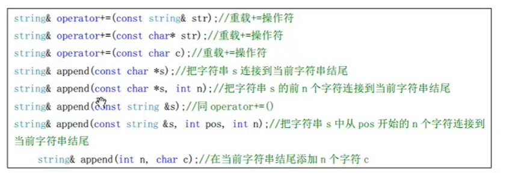
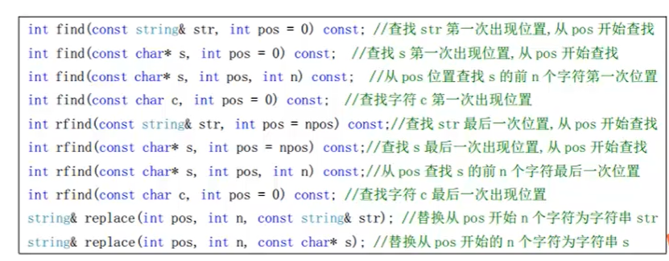
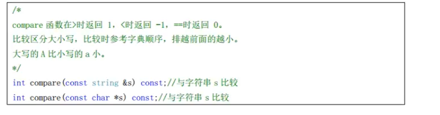
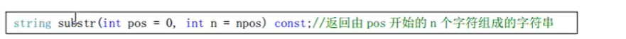
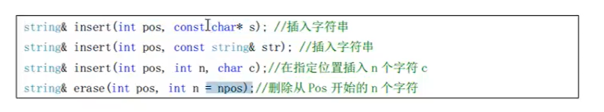

## 1.string容器


### 1.1string的特性

- char*是一个指针，string是一个类

  string封装了char* , 管理这个字符串，是一个char*型的容器

- String封装了很多的成员方法

  find  copy  delete  replace  insert

- 不用考虑内存释放和越界

  string 管理 char* 所分配的内存，每一次string的复制，取值都有 string 类负责维护，不用担心越界。


### 1.2string常用API


使用前导入头文件 

`#include <string>`


#### 初始化

```c++
// 1.初始化 
void test()
{
	cout << "---test 开始---" << endl;
	string s1; // 调用无参构造
	string s2(10 , 'a');
	string s3("abcdefg");
	string s4(s3); // 拷贝构造 
	
	cout << s1 << endl;
	cout << s2 << endl;
	cout << s3 << endl;
	cout << s4 << endl;
	cout << "---test 结束---" << endl;
}
```


#### 赋值

```c++
// 2.赋值 
void test2()
{
	cout << "---test2 开始---" << endl;
	string s1;
	s1 = "aaabbbccc";
	cout << s1 << endl;
	
	// 成员方法进行赋值 
	s1.assign("jkl");
	cout << s1 << endl ;
	cout << "---test2 结束---" << endl;
}
```


#### 访问

```c++
void test3()
{
	cout << "---test3 开始---" << endl;
	string s1 = "abcdefg";
	
	// 重载了[]操作符，所以可以通过s1[0]进行访问
	for(int i = s1.size() - 1 ; i >= 0 ; i--)
	{
		cout << s1[i] << ' ';
	}	
	cout << endl;
	
	// at 成员函数
	for(int i = 0 ; i < s1.size() ; i++)
	{
		cout << s1.at(i) << ' ';
	} 
	cout << endl;
	
	// 区别：[]方式 ， 如果访问越界，直接挂了
	//       at方式 ， 如果访问越界，抛异常 out_of_range
	
	try{
		cout << s1[200] << endl; // 不会抛出异常 
		cout << s1.at(100) << endl; // 会抛出异常 
	} catch(...){
		cout << "越界" << endl;
	}
	cout << "---test3 结束---" << endl;
} 
```


#### string拼接操作



```c++
void test4()
{
	string s1 = "a";
	s1 += 'b';
	cout << s1 << endl;
	s1 += "c";
	cout << s1 << endl;
	s1.append("d");
	cout << s1 << endl;
	
} 
```


#### string查找和替换




find从前向后找 rfind从后向前找

```c++
void test5()
{
	string s = "abcdefghijkl";
	
	// 查找第一次出现的位置 
	int pos = s.find("f");
	
	// 从下标为8开始查找 
	int pos2 = s.find("f" , 8);
	
	// 查找最后一次出现的位置 
	int pos3 = s.rfind("f");
	
	cout << pos << endl;
	cout << pos2 << endl;
	cout << pos3 << endl;
	
	// 替换 
	
	string s1 = "123456789";
	// 从下标0开始，替换两个字符为 字符串"a" 
	s1.replace(0 , 2 , "a");
	cout << "替换后的字符串：" << s1 << endl;
} 
```


#### string比较




```c++
void test6()
{
	string s1 = "abcd";
	string s2 = "abce";
	
	if(s1.compare(s2) == 0){
		cout << "字符串相等" << endl;
	}else {
		cout << "字符串不相等" << endl; 
	}
} 
```


#### strign字串




```c++
void test7()
{
	string s = "abcdefg";
    // 从0开始截取3个字符
	cout << s.substr(0 , 3) << endl;	
} 
```


#### string插入和删除




```c++
void test8()
{
	string s = "abcdefg";
	// 在第 0 个位置插入 
	s.insert(0 , "111");
	cout << s << endl;
	
	// 删除前两个元素 
	s.erase(0,2);
	cout << s << endl; 
} 
```


## 完整测试代码

```c++
#include <iostream>
#include <algorithm>
#include <string>
using namespace std;

// 1.初始化 
void test()
{
	cout << "---test 开始---" << endl;
	string s1; // 调用无参构造
	string s2(10 , 'a');
	string s3("abcdefg");
	string s4(s3); // 拷贝构造 
	
	cout << s1 << endl;
	cout << s2 << endl;
	cout << s3 << endl;
	cout << s4 << endl;
	cout << "---test 结束---" << endl;
}

// 2.赋值 
void test2()
{
	cout << "---test2 开始---" << endl;
	string s1;
	s1 = "aaabbbccc";
	cout << s1 << endl;
	
	// 成员方法进行赋值 
	s1.assign("jkl");
	cout << s1 << endl ;
	cout << "---test2 结束---" << endl;
}

// 3.访问
void test3()
{
	cout << "---test3 开始---" << endl;
	string s1 = "abcdefg";
	
	// 重载了[]操作符，所以可以通过s1[0]进行访问
	for(int i = s1.size() - 1 ; i >= 0 ; i--)
	{
		cout << s1[i] << ' ';
	}	
	cout << endl;
	
	// at 成员函数
	for(int i = 0 ; i < s1.size() ; i++)
	{
		cout << s1.at(i) << ' ';
	} 
	cout << endl;
	
	// 区别：[]方式 ， 如果访问越界，直接挂了
	//       at方式 ， 如果访问越界，抛异常 out_of_range
	
	try{
		cout << s1[200] << endl; // 不会抛出异常 
		cout << s1.at(100) << endl; // 会抛出异常 
	} catch(...){
		cout << "越界" << endl;
	}
	cout << "---test3 结束---" << endl;
} 

// 4.合并 
void test4()
{
	string s1 = "a";
	s1 += 'b';
	cout << s1 << endl;
	s1 += "c";
	cout << s1 << endl;
	s1.append("d");
	cout << s1 << endl;
}

// 5.查找和替换
void test5()
{
	string s = "abcdefghijkl";
	
	// 查找第一次出现的位置 
	int pos = s.find("f");
	
	// 从下标为8开始查找 
	int pos2 = s.find("f" , 8);
	
	// 查找最后一次出现的位置 
	int pos3 = s.rfind("f");
	
	cout << pos << endl;
	cout << pos2 << endl;
	cout << pos3 << endl;
	
	// 替换 
	
	string s1 = "123456789";
	// 从下标0开始，替换两个字符为 字符串"a" 
	s1.replace(0 , 2 , "a");
	cout << "替换后的字符串：" << s1 << endl;
} 

// 6.string比较
void test6()
{
	string s1 = "abcd";
	string s2 = "abce";
	
	if(s1.compare(s2) == 0){
		cout << "字符串相等" << endl;
	}else {
		cout << "字符串不相等" << endl; 
	}
} 

// 7.string字串
void test7()
{
	string s = "abcdefg";
	cout << s.substr(0 , 3) << endl;	
} 

// 8.插入和删除
void test8()
{
	string s = "abcdefg";
	// 在第 0 个位置插入 
	s.insert(1 , "111");
	cout << s << endl;
	
	// 删除前两个元素 
	s.erase(0,2);
	cout << s << endl; 
} 
int main()
{
	test8();
	return 0;
}
```

