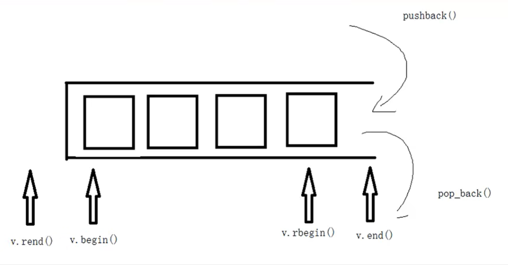
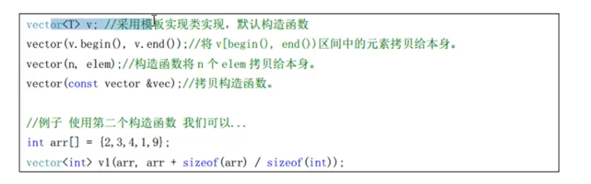
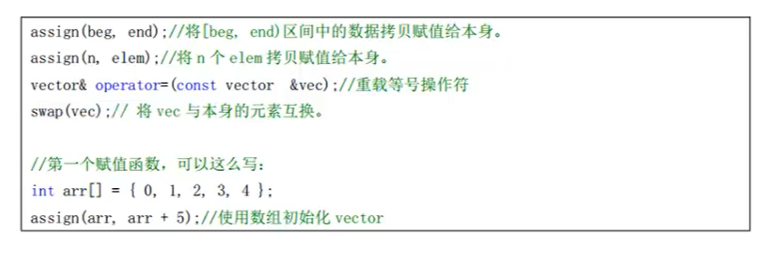
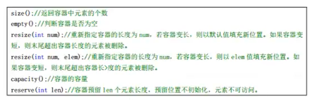
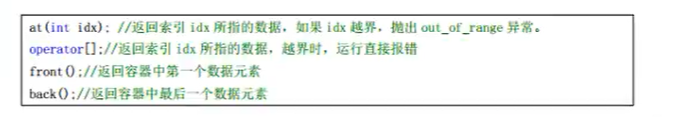
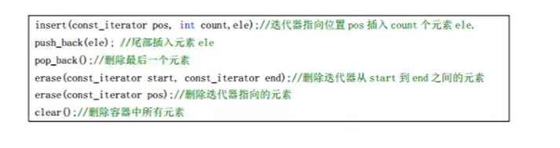
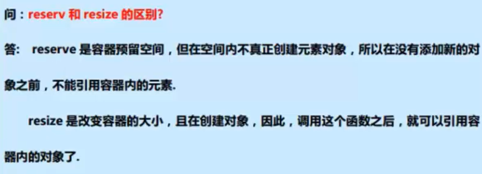

### 1.vector容器

（vector：动态数组，可变数组）

**vector容器是单口容器**


**vector还提供了两个反向迭代器（v.rbegin() v.rend()）**




### 2.vector容器API

引入头文件 

`#incude<vector>`

#### vector构造函数




#### 初始化

通过构造函数初始化vector

```c++
#include <iostream>
#include <vector>

using namespace std;


// 定义一个打印的方法，方便打印 
void printVector(vector<int>& v)
{
	for(vector<int>::iterator it = v.begin() ; it != v.end() ; it++)
	{
		cout << *it << ' ';
	}
	cout << endl;
}

// 通过构造函数初始化vector 
void test()
{
	vector<int> v1;
	int arr[] = {1 , 2 , 3 , 4 , 5};
	
	// 将地址在  arr ~ arr + (sizeof(arr) / sizeof(int)) 之内的数据赋值给 v2 
	vector<int> v2(arr , arr + (sizeof(arr) / sizeof(int)));
	
	vector<int> v3(v2.begin() , v2.end());
	
	vector<int> v4(v3);
	
	printVector(v2); 
	printVector(v3); 
	printVector(v4); 
}

int main()
{
	test();
	return 0;
}
```


#### vector常用赋值操作




```c++
#include <iostream>
#include <vector>

using namespace std;

void PrintVector(vector<int> v)
{
	for(vector<int>::iterator it = v.begin() ; it != v.end() ; it ++)
	{
		cout << *it << ' ';
	}
}

void test()
{
	int arr1[] = {10 ,20 ,30 ,40 ,50};
	// 根据区间对 v1 进行赋值 
	vector<int> v1(arr1 , arr1 + sizeof(arr1) / sizeof(int));
	
	vector<int> v2 = v1;
	
	int arr2[] = {100 ,200 ,300 ,400 ,500};
	vector<int> v3(arr2 , arr2 + sizeof(arr2) / sizeof(int));
	
	// 交换v2和v3的值 
	v2.swap(v3);
	
	PrintVector(v1);
	cout << endl;
	PrintVector(v2);
	cout << endl;
	PrintVector(v3);
}

int main()
{
	test();
	return 0;
}
```


#### vector大小操作




#### vector数据存取操作




#### vector插入和删除操作




#### 巧用swap缩减空间

`vector<int>(v).swap(v); `

当使用 resize 调整大小之后，只有size改变，capacity仍然很大 ，所以要使用swap来收缩空间

```c++
void test()
{
	vector<int> v;
	for(int i = 0 ; i < 10000 ; i ++)
	{
		v.push_back(i);
	}
	
	cout << "size : " << v.size() << endl;
	cout << "capacity : " << v.capacity() << endl; 
	
	v.resize(10);
	// 当使用 resize 调整大小之后，只有size改变，capacity仍然很大 
	cout << "size : " << v.size() << endl;
	cout << "capacity : " << v.capacity() << endl; 
	
	vector<int>(v).swap(v); 
	// 使用 swap 来收缩空间  
	cout << "size : " << v.size() << endl;
	cout << "capacity : " << v.capacity() << endl; 
}
```


#### reserve和resize的区别




如果不使用reserve预留空间，当数组很大的时候，申请更大的内存空间时，将旧数组的值copy到新数组很耗时，所以如果大概知道数组占用的空间，可以使用reserve预留空间

```c++
#include <iostream>
#include <vector>

using namespace std;

void test()
{
	vector<int> v;
	int num = 0;
	int* address = NULL;
	
	for(int i = 0 ; i < 10000 ; i++)
	{
		v.push_back(i);
		// 判断 vector 首地址是否变化，若变化，说明申请了一次空间。 
		if(address != &(v[0]))
		{
			num ++;
			address = &(v[0]);
		}
	}
	
	cout << "没有使用reserve，内存申请了 ： " << num << "次" << endl;
	
	vector<int> v2;
	int num2 = 0;
	int* address2 = NULL;
	
	// 如果大概已经知道了数组要使用的空间，可以使用 reserve 预先保留空间，提高效率 
	v2.reserve(10000);
	
	for(int i = 0 ; i < 10000 ; i++)
	{
		v2.push_back(i);
		if(address2 != &(v2[0]))
		{
			num2 ++;
			address2 = &(v2[0]);
		}
	}
	
	cout << "使用了reserve，内存申请了 ： " << num2 << "次" << endl;
}

int main()
{
	test();
	return 0;
}

*****输出*****
没有使用reserve，内存申请了 ： 15次
使用了reserve，内存申请了 ： 1次
```

