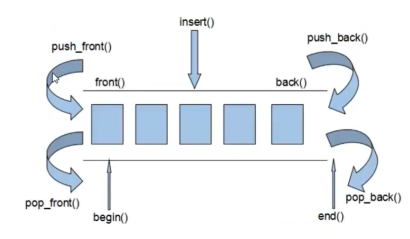
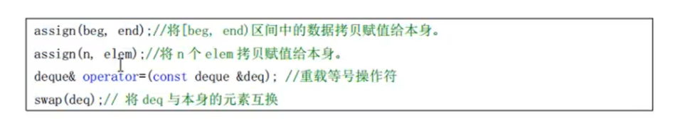
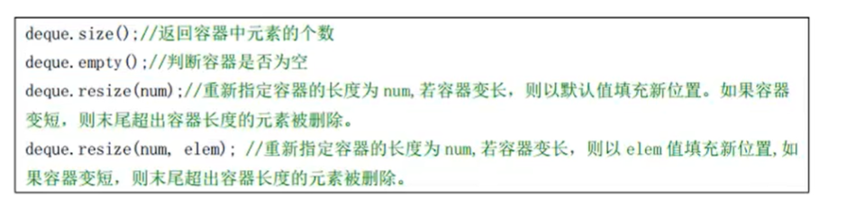
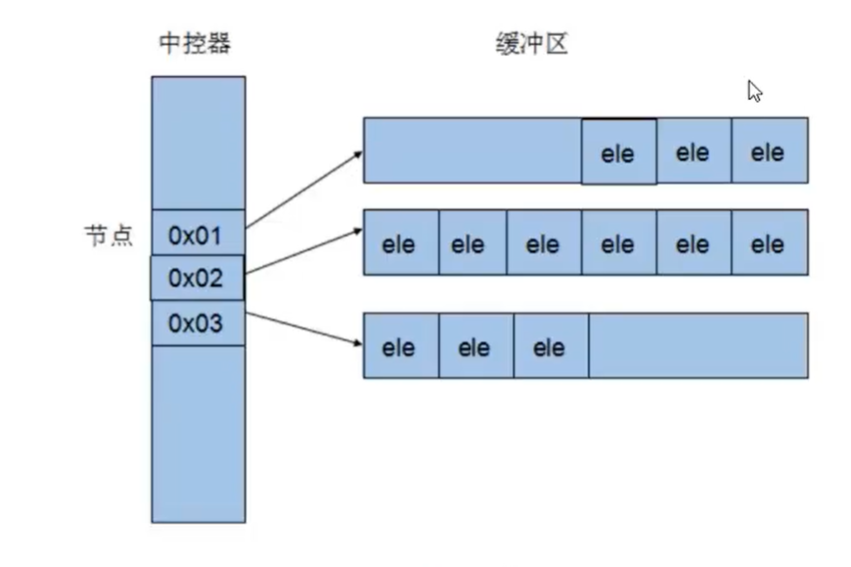
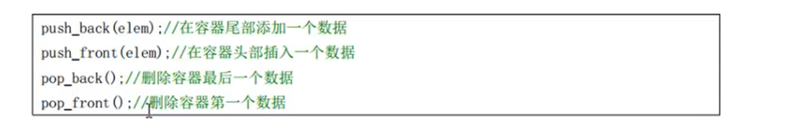
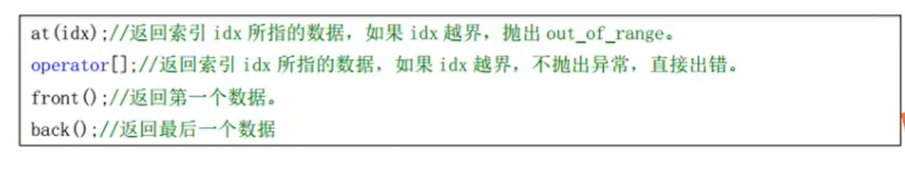

### 1.deque容器


deque容器是一个双口容器，可以在两端插入和删除效率都非常高！




end() 指针并不是指向最后一个元素，而是指向最后一个元素的后一个位置。


### 2.deque容器API


#### 赋值操作




#### 大小操作




#### deque原理示意图




分段连续内存。所以需要中继器来保存内存地址。


#### deque双端插入和删除操作




#### deque数据存取操作




#### algorithm的sort()排序


sort()传入三个参数

前两个参数为迭代器，第三个参数为排序规则

第三个参数是一个函数，返回值为bool


```c++
#include <iostream>
#include <deque>
#include <vector>
#include <algorithm>

using namespace std;

bool myCom(int a , int b)
{
	// 排序为 a > b 的样子 
	return a > b;
}

int main()
{
	vector<int> v;
	deque<int> d;
	
	for(int i = 0 ; i < 10 ; i ++)
	{
		int num = rand() % 41 + 60;
		v.push_back(num);
		d.push_back(num);
	}
	
	// 第三个参数 ： 排序规则 
	sort(v.begin() , v.end() , myCom);
	sort(d.begin() , d.end() , myCom);
	
	// 使用迭代器输出 
	for(vector<int>::iterator it = v.begin() ; it != v.end() ; it++)
	{
		cout << *it << ' ';	
	}	
	cout << endl;
	
	return 0;
}
```

