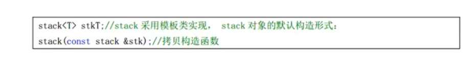
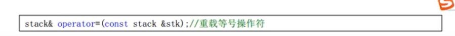

### stack容器


stack是一个栈容器。

（先进入的后出来）


引入头文件

`#incude <stack>`

### stack容器API


#### stack构造函数




#### stack赋值




## list容器的排序

**sort算法只支持可随机访问的容器，list不是，所以 list 容器自己提供了 sort 方法**

```c++
list<int> l;
l.sort();
// 默认从小到大排序，也可以传入排序规则函数

bool myCom(int a, int b){
  return a > b;
}
l.sort(myCom); // 从大到小排序
```


