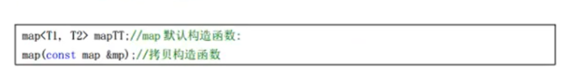
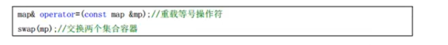
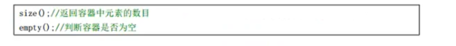

### map容器API


#### map构造函数




#### map赋值操作




#### map大小操作




#### map插入操作


```c++
void test()
{
	map<int,int> m;
	
	// 插入方式 1 
	m.insert(pair<int,int>(10,20));
	
	// 插入方式 2
	m.insert(make_pair(20,30));
	
	// 插入方式 3 
	m.insert(map<int,int>::value_type(30,40));
	
	// 插入方式 4 ***
	m[40] = 50;
	
	for(map<int,int>::iterator it = m.begin() ; it != m.end() ; it++)
	{
		// 第一种打印方式 
		cout << "1: " << it -> first << ' ' << it -> second << endl;
		// 第二种打印方式	
		cout << "2: " << (*it).first << ' ' << (*it).second << endl;
	} 
}
```


该P71