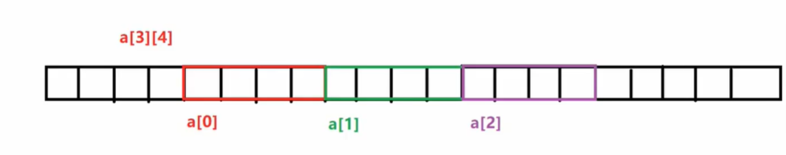

学C语言，学的是内存。


比如说

```c
int a; //就是在内存中开辟一个4个字节的空间，并且命名为a
```


1.内存四区

​	a)	代码区（代码）

​	b)	全局区（全局的常量 字符串常量   static const变量）

​	c)	栈区（系统自动开辟，系统自动释放，不是很大）

​	d)	堆区 （动态开辟的内存，手动开辟，手动释放，很大）


2.地址：把内存以单个字节为单位，分开。对每一个字节编号，这个编号就是地址

​	a)	编号是连续的

​	b)	唯一的

```c
int a; //a  一个内存
&a; // 取地址运算符 & 单目运算符 优先级只比()[]低 
```


3.首地址：一段内存空间中第一个存储单元的地址


4.指针变量：1.用来存放地址的变量    2.内存大小4B

​	地址是一些编号，也算是一种数据。

​	整数	int a;

​	字符	char c;

​	浮点数	float b;

​	地址	指针变量


指针变量的定义：

```c
数据类型 *变量名：
int *p; //定义一个指针变量，存的是地址
	    //int 指明指针指向的数据类型
	    //* 指明p这个变量是一个指针变量
```


指针变量的赋值：

```c
int a = 5;
int *p = &a;
cout << "a=" << a << endl;
cout << "*p=" << *p << endl;
cout << "p=" << p << endl;
******输出*******
a=5
*p=5
p=0x6ffe04
```


指针变量的引用：

​	访问 a 这个int变量

​		1.使用变量名

​		2.指针访问： `*指针变量` *取值运算符（返回某一个地址中的值）

​		注意了：在定义指针变量的时候 ， `int *p`： * 只是表明 p 是一个指针变量

​			        非定义，*p  ， 取值 p 指向的内存值


野指针：不能明确指向的指针变量

```c++
int *p; //野指针
// p里面保存的地址不确定的，p的指向也是不确定的
// p有可能指向非常重要的数据，可能会导致重要的数据被意外修改。 
```

​	野指针的解决方法：

```c
int *p = NULL;
cout << p << endl;
```


空指针：int*   float*   char*

​	void*  是空指针 ， 不确定内存中存放的是什么东西

​	当可以明确的时候， void* 可以转换为其他的数据类型


指针变量的运算：

```
+  
-
++
--
指针的偏移，去访问地址旁边的一些内存。
指针变量的加减，以指针所指向的类型的空间单位进行偏移。
char *p; //char类型  1B  p+1  偏移1B
int *p1; //int类型   4B  p1+1 偏移4B
double *p2; /double类型  p2+1 偏移8B
```


一维数组与指针：

​	1.定义一个一维数组，数组名是这个数组的《首地址》。

```c
int a[5];
a 指向 a[0]  , a[0] int的元素 ， a的类型就是 int*
a 这个地址指向a[0] int元素  a的类型 int*        4B
&a 这个地址指向整个数组     &a的类型 int(*)[5]  20B
```

我们可以根据下边的代码及输出结果来理解一下上边的话：

​	使用 a 来初始化了一个长度大小为5的数组

​	对比地址：

​		1）a+1 的地址比 a 的地址多了4

​		2）&a+1 的地址比 &a 的地址多了20

​	所以也就可以得出==a 这个地址指向a[0] int元素  int*  4B  &a 这个地址指向整个数组  int(*)[5]== 的结论


```c
int a[5];

printf("a   = %d\n" , a);
printf("a+1 = %d\n" , a+1);

printf("&a   = %d\n" , &a);
printf("&a+1 = %d\n" , &a+1); 
*****输出*****
a   = 7339520
a+1 = 7339524
&a   = 7339520
&a+1 = 7339540
```


​	2.使用指针访问数组中的元素

```c
int a[] = {1 , 2 , 3 , 4 , 5};

int *p = a; //p指向a[0]   *p = a[0] *(p+1)=a[1] 

for(int i = 0 ; i < 5 ; i++)
{
    printf("%d " , *p++);
  //printf("%d" , *(p+i));
  //printf("%d" , *(a+i)); // 不能*a++ 因为数组名a不可以改变
}
```


二维数组与指针：




**数组名a是二维数组的首地址。（也就是说，a是二维数组中第一个存储单元：一维数组 ， 所以a+1代表的是第二行）**

**&a+1则会跳过该二维数组**

a 是指向 a[0] 这个一维数组。 a的类型是什么 ？ int(*) [4]  ; （a指向第一行 ； a+1指向第二行） 16B

a[0] 是指向 `a[0][0]`  这个元素。 a[0] 的类型是什么？ int *   a[0]						    4B


```C
// C语言中的二维数组按行排列，所以可以这样对二维数组进行赋值 
int a[2][3] = {1, 2, 3 , 4, 5 , 6};

cout << "a = " << a << endl;
cout << "a+1 = " << a+1 << endl;

cout << "a[0] = " << a[0] << endl;
cout << "a[0]+1 = " << a[0]+1 << endl;	

cout << "&a = " << &a << endl;
cout << "&a+1 = " << &a+1 << endl;

*****输出*****
a = 0x6ffe00  
a+1 = 0x6ffe0c
a[0] = 0x6ffe00
a[0]+1 = 0x6ffe04
&a = 0x6ffe00
&a+1 = 0x6ffe18
  
可以发现 a+1的地址比a的地址多了c也就是十六进制中的12，也就是多了一行
a[0]+1的地址比a[0]的地址多了4，也就是多了4，也就是多了一个元素
&a+1比&a多了整个二维数组的大小，也就是24字节
```

