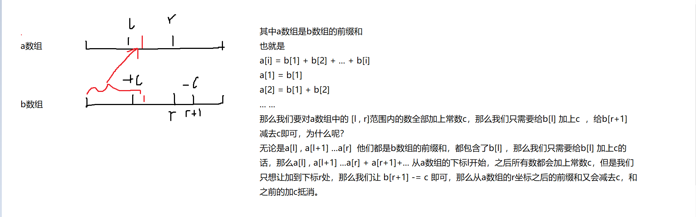
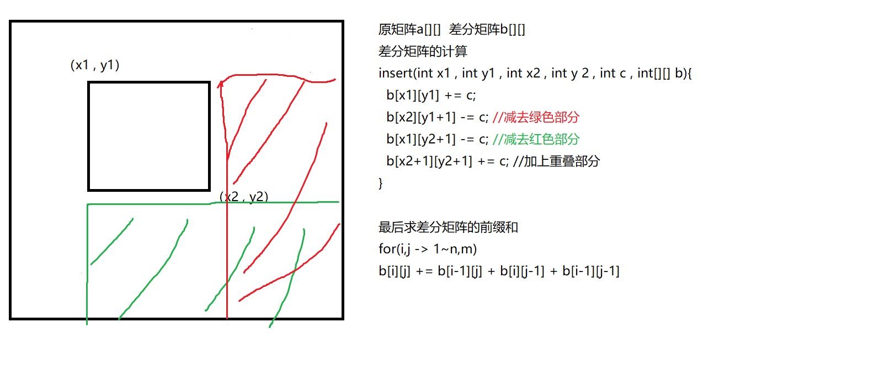

### 795. 前缀和            


输入一个长度为n的整数序列。

接下来再输入m个询问，每个询问输入一对l, r。

对于每个询问，输出原序列中从第l个数到第r个数的和。

**输入格式**

第一行包含两个整数n和m。

第二行包含n个整数，表示整数数列。

接下来m行，每行包含两个整数l和r，表示一个询问的区间范围。

**输出格式**

共m行，每行输出一个询问的结果。

**数据范围**

1≤l≤r≤n1≤l≤r≤n,
1≤n,m≤1000001≤n,m≤100000,
−1000≤数列中元素的值≤1000−1000≤数列中元素的值≤1000

**输入样例：**

```
5 3
2 1 3 6 4
1 2
1 3
2 4

```

**输出样例：**

```
3
6
10
```


[ 1 , 2 , 3 , 4 , 5]

计算前缀和我们需要给数组多声明一个长度，从数组下标1开始，将数组的第0个位置设置为0。

[ 0 , 1 , 2 , 3 , 4 , 5 ]

我们如果需要计算第 l 到第 r 个数的字段和：q[l] + q[l+1] + q[l+2] +... + q[r] === q[r] - q[l-1]

那么我们是如何计算前缀和呢？

q[] 为前缀和数组  num[]为输入的数列

q[i] = q[i-1] + num[i]  如果我们从下标为0开始计算前缀和，也就是i=0，i-1=-1，数组就会发生越界，所以我们从下标1开始计算前缀和  


```java
import java.util.*;
public class Main{
    public static void main(String[] args){
        Scanner sc = new Scanner(System.in);
        int n = sc.nextInt();
        int m = sc.nextInt();
        int[] q = new int[n+1];
        int[] s = new int[n+1];
        for(int i = 1 ; i <= n ; i++)
        {
            q[i] = sc.nextInt();
        }
        for(int i = 1 ; i <= n ; i++)
        {
            s[i] = s[i-1] + q[i];
        }
        while(m-- > 0)
        {
            int l = sc.nextInt();
            int r = sc.nextInt();
            System.out.println(s[r] - s[l-1]);
        }
    }
}
```


### 797. 差分                     

输入一个长度为n的整数序列。

接下来输入m个操作，每个操作包含三个整数l, r, c，表示将序列中[l, r]之间的每个数加上c。

请你输出进行完所有操作后的序列。

**输入格式**

第一行包含两个整数n和m。

第二行包含n个整数，表示整数序列。

接下来m行，每行包含三个整数l，r，c，表示一个操作。

**输出格式**

共一行，包含n个整数，表示最终序列。

**数据范围**

1≤n,m≤1000001≤n,m≤100000,
1≤l≤r≤n1≤l≤r≤n,
−1000≤c≤1000−1000≤c≤1000,
−1000≤整数序列中元素的值≤1000−1000≤整数序列中元素的值≤1000

**输入样例：**

```
6 3
1 2 2 1 2 1
1 3 1
3 5 1
1 6 1

```

**输出样例：**

```
3 4 5 3 4 2
```





我们定义了一个insert方法，用来计算b这个差分数组。


```java
import java.util.*;
public class Main{
    public static void main(String[] args){
        Scanner sc = new Scanner(System.in);
        final int N = 100010;
        int n = sc.nextInt();
        int m = sc.nextInt();
        int[] a = new int[N];
        int[] b = new int[N];
        for(int i = 1 ; i <= n ; i++)
        {
            a[i] = sc.nextInt();
        }
        for(int i = 1 ; i <= n ; i++)
        {
            insert(i , i , a[i] , b);
        }
        while(m-- > 0)
        {
            int l = sc.nextInt();
            int r = sc.nextInt();
            int c = sc.nextInt();
            insert(l , r , c , b);
        }
        for(int i = 1; i <= n ; i++)
        {
            b[i] += b[i-1];
            System.out.print(b[i] + " ");
        }
    }
    public static void insert(int l , int r , int c , int[] b){
        b[l] += c;
        b[r+1] -= c;
    }
}
```


### 798. 差分矩阵                       

输入一个n行m列的整数矩阵，再输入q个操作，每个操作包含五个整数x1, y1, x2, y2, c，其中(x1, y1)和(x2, y2)表示一个子矩阵的左上角坐标和右下角坐标。

每个操作都要将选中的子矩阵中的每个元素的值加上c。

请你将进行完所有操作后的矩阵输出。

**输入格式**

第一行包含整数n,m,q。

接下来n行，每行包含m个整数，表示整数矩阵。

接下来q行，每行包含5个整数x1, y1, x2, y2, c，表示一个操作。

**输出格式**

共 n 行，每行 m 个整数，表示所有操作进行完毕后的最终矩阵。

**数据范围**

1≤n,m≤10001≤n,m≤1000,
1≤q≤1000001≤q≤100000,
1≤x1≤x2≤n1≤x1≤x2≤n,
1≤y1≤y2≤m1≤y1≤y2≤m,
−1000≤c≤1000−1000≤c≤1000,
−1000≤矩阵内元素的值≤1000−1000≤矩阵内元素的值≤1000

**输入样例：**

```
3 4 3
1 2 2 1
3 2 2 1
1 1 1 1
1 1 2 2 1
1 3 2 3 2
3 1 3 4 1

```

**输出样例：**

```
2 3 4 1
4 3 4 1
2 2 2 2
```




```java
import java.util.*;
import java.io.*;
public class Main{
    public static void main(String[] args) throws IOException{
        final int N = 1010;
        BufferedReader bf = new BufferedReader(new InputStreamReader(System.in));
        BufferedWriter bw = new BufferedWriter(new OutputStreamWriter(System.out)); 
        String[] str1 = bf.readLine().split(" ");
        
        int n = Integer.parseInt(str1[0]);
        int m = Integer.parseInt(str1[1]);
        int q = Integer.parseInt(str1[2]);
        int[][] a = new int[N][N];
        int[][] b = new int[N][N];
        for(int i = 1 ; i <= n ; i++)
        {
            String[] str2 = bf.readLine().split(" ");
            for(int j = 1 ; j <= m ; j++)
            {
                a[i][j] = Integer.parseInt(str2[j-1]);
            }
        }
        for(int i = 1 ; i <= n ; i++)
        {
            for(int j = 1 ; j <= m ; j++)
            {
                insert(i , j , i , j , a[i][j] , b);
            }
        }
        while(q-- > 0)
        {
            String[] str3 = bf.readLine().split(" ");
            int x1 = Integer.parseInt(str3[0]);
            int y1 = Integer.parseInt(str3[1]);
            int x2 = Integer.parseInt(str3[2]);
            int y2 = Integer.parseInt(str3[3]);
            int c = Integer.parseInt(str3[4]);
            insert(x1 , y1 , x2 , y2 , c , b );
        }
        // 求b数组的前缀和
        for(int i = 1 ; i <= n ; i++)
        {
            for(int j = 1; j <= m ; j++)
            {
                b[i][j] = b[i][j-1] + b[i-1][j] - b[i-1][j-1] + b[i][j];
                bw.write(b[i][j] + " ");
            }
            bw.write("\n");
        }
        bf.close();
        //所有write下的内容，会先存在writers中，当启用flush以后，会输出存在其中的内容。如果没有调用flush，则不会将writer中的内容进行输出。
        bw.flush();
        bw.close();
    }   
    public static void insert(int x1 , int y1 , int x2 , int y2 ,  int c , int[][] b){
        b[x1][y1] += c;
        b[x1][y2+1] -= c;
        b[x2+1][y1] -= c;
        b[x2+1][y2+1] += c;
    }
}

```

