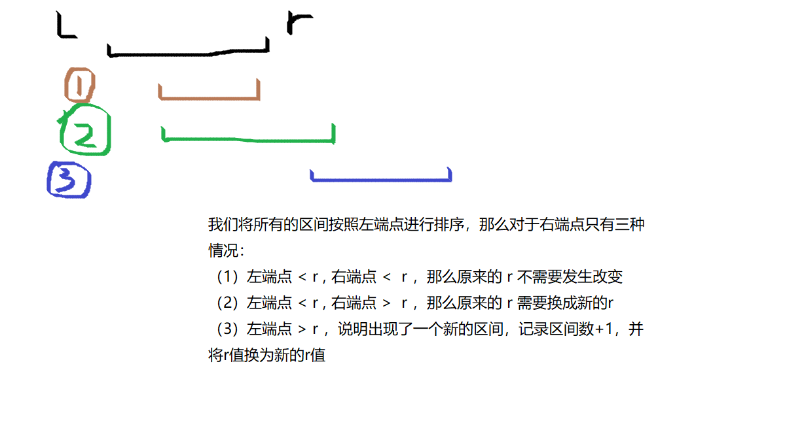

### 802. 区间和                   

假定有一个无限长的数轴，数轴上每个坐标上的数都是0。

现在，我们首先进行 n 次操作，每次操作将某一位置x上的数加c。

接下来，进行 m 次询问，每个询问包含两个整数l和r，你需要求出在区间[l, r]之间的所有数的和。

**输入格式**

第一行包含两个整数n和m。

接下来 n 行，每行包含两个整数x和c。

再接下里 m 行，每行包含两个整数l和r。

**输出格式**

共m行，每行输出一个询问中所求的区间内数字和。

**数据范围**

−109≤x≤109−109≤x≤109,
1≤n,m≤1051≤n,m≤105,
−109≤l≤r≤109−109≤l≤r≤109,
−10000≤c≤10000−10000≤c≤10000

**输入样例：**

```
3 3
1 2
3 6
7 5
1 3
4 6
7 8

```

**输出样例：**

```
8
0
5
```


```java
import java.util.*;
public class Main{
    public static void main(String[] args){
        Scanner sc = new Scanner(System.in);
        int n = sc.nextInt(); //n次添加
        int m = sc.nextInt(); //m次询问
        final int N = 300010; 
        int[] a = new int[N]; //存放离散化后的数的数值,可能有n+2m个下标,所以数组大小开为 300000
        int[] s = new int[N]; //前缀和
        List<Integer> all = new ArrayList<>(); //存储所有出现的下标,也就是查询操作的坐标和插入操作的坐标
        List<Pairs> add = new ArrayList<>(); //存储add操作的 x,c
        List<Pairs> query = new ArrayList<>(); //存储所有查询操作的坐标
        // 将所有添加操作放在add集合中,将添加操作的坐标放在all集合中
        for(int i = 0 ; i < n ; i++)
        {
            int x = sc.nextInt();
            int c = sc.nextInt();
            add.add(new Pairs(x, c));
            all.add(x);
        }
        // 将所有的查询操作放在query集合中,将查询操作的坐标放在all集合中
        for(int i = 0 ; i < m ; i++)
        {
            int l = sc.nextInt();
            int r = sc.nextInt();
            query.add(new Pairs(l, r));
            all.add(l);
            all.add(r);
        }
        // 对all集合中的坐标进行排序,之后再去重,并且删除重复部分
        Collections.sort(all);
        // 找到最后一个不重复的下标的后一位
        int unique = unique(all);
        all = all.subList(0, unique);
        
        // 对a数组进行add操作
        for(Pairs item : add)
        {
            int index = find(item.first, all);
            a[index] += item.second;
        }
        
        // 求a数组的前缀和
        for(int i = 1 ; i <= all.size() ; i++)
        {
            s[i] = s[i-1] + a[i];
        }
        
        // 对查询集合遍历,输出结果
        for(Pairs item : query)
        {
            int l = find(item.first, all);
            int r = find(item.second, all);
            
            System.out.println(s[r] - s[l-1]);
        }
    }
    // 去重方法
    public static int unique(List<Integer> list){
        int j = 0;
        for(int i = 0 ; i < list.size() ; i++)
        {
            if(i == 0 || list.get(i) != list.get(i-1))
            {
                list.set(j++, list.get(i));
            }
        }
        return j;
    }
    // 查询离散化后的坐标
    public static int find(int index, List<Integer> list){
        int l = 0 , r = list.size() - 1;
        while(l < r)
        {
            int mid = l + r >> 1;
            if(list.get(mid) >= index) r = mid;
            else l = mid + 1;
        }
        return l + 1; //加上1用于求前缀和
    }
}
class Pairs{
    public int first;
    public int second;
    public Pairs(int first, int second){
        this.first = first;
        this.second = second;
    }
}
```


### 803. 区间合并            

给定 nn 个区间 [li,ri][li,ri]，要求合并所有有交集的区间。

注意如果在端点处相交，也算有交集。

输出合并完成后的区间个数。

例如：[1,3]和[2,6]可以合并为一个区间[1,6]。

**输入格式**

第一行包含整数n。

接下来n行，每行包含两个整数 l 和 r。

**输出格式**

共一行，包含一个整数，表示合并区间完成后的区间个数。

**数据范围**

1≤n≤1000001≤n≤100000,
−109≤li≤ri≤109−109≤li≤ri≤109

**输入样例：**

```
5
1 2
2 4
5 6
7 8
7 9

```

**输出样例：**

```
3
```




```java
import java.util.*;
public class Main{
    public static void main(String[] args){
        Scanner sc = new Scanner(System.in);
        int n = sc.nextInt();
        int[][] a = new int[n][2];
        for(int i = 0 ; i < n ; i++)
        {
            a[i][0] = sc.nextInt();
            a[i][1] = sc.nextInt();
        }
        // 先对数组按照左端点进行排序
        Arrays.sort(a, new Comparator<int[]>(){
            public int compare(int[] a1, int[] a2){
                return a1[0] - a2[0];
            }
        });
        
        int end = Integer.MIN_VALUE;
        int res = 0;
        // 使用end记录上个点的末尾值,与当前遍历到的左端点进行比较
        for(int i = 0 ; i < n ; i++)
        {
            // 如果大于上个点的末尾值,说明又出现了一个区间
            if(a[i][0] > end)
            {
                res++;
                // 更新末尾值到当前点
                end = a[i][1];
            }else
            {
                // 说明两个区间处于交集,将end更新为较大的值
                end = Math.max(end, a[i][1]);
            }
        }
        System.out.println(res);
    }
}
```


