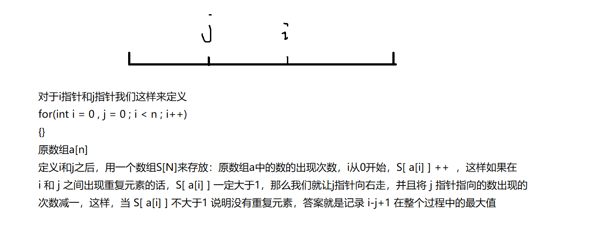

双指针一般是由暴力做法简化而来：


暴力做法（朴素做法）

```java
for(int i = 0 ; i < n ; i++)
{
  for(int j = 0 ; j <= i ; j++)
  {
	if(check(j,i)) 
    {
      res = max(res , i-j+1);
    }
  }
}
```

双指针做法

```java
for(int i = 0 , j = 0 ; i < n ; i++)
{
  while(j <= i && check(j,i)) j++;
  
  res = max(res , i-j+1);
}
```


### 799. 最长连续不重复子序列            

给定一个长度为n的整数序列，请找出最长的不包含重复数字的连续区间，输出它的长度。

**输入格式**

第一行包含整数n。

第二行包含n个整数（均在0~100000范围内），表示整数序列。

**输出格式**

共一行，包含一个整数，表示最长的不包含重复数字的连续子序列的长度。

**数据范围**

1≤n≤1000001≤n≤100000

**输入样例：**


```
5
1 2 2 3 5

```

**输出样例：**

```
3
```



```java
import java.util.*;
import java.math.*;
public class Main{
    public static void main(String[] args){
        Scanner sc = new Scanner(System.in);
        int n = sc.nextInt();
        final int N = 100010;
        int[] q = new int[n];
        int[] s = new int[N];
        int ans = 0;
        for(int i = 0 ; i < n ; i ++)
        {
            q[i] = sc.nextInt();
        }
        for(int i = 0 , j = 0 ; i < n ; i++)
        {
            s[q[i]]++;
            while(s[q[i]] > 1)
            {
                s[q[j]]--;
                j++;
            }
            ans = Math.max(ans , i-j+1);
        }
        System.out.println(ans);
    }
}
```

