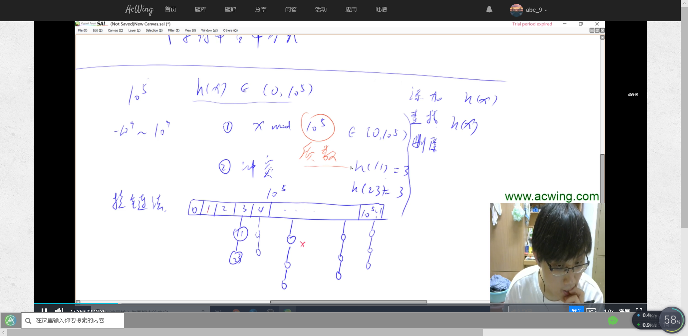
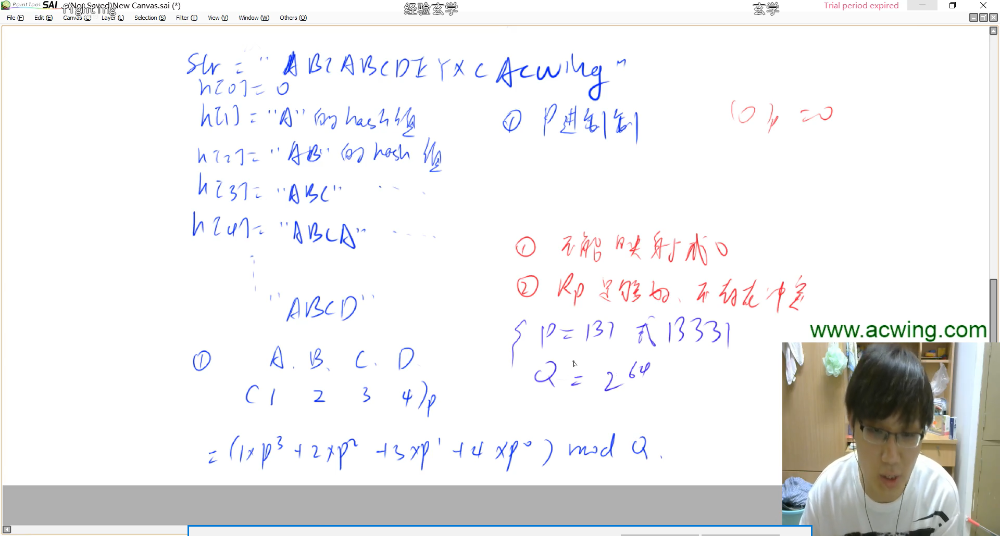
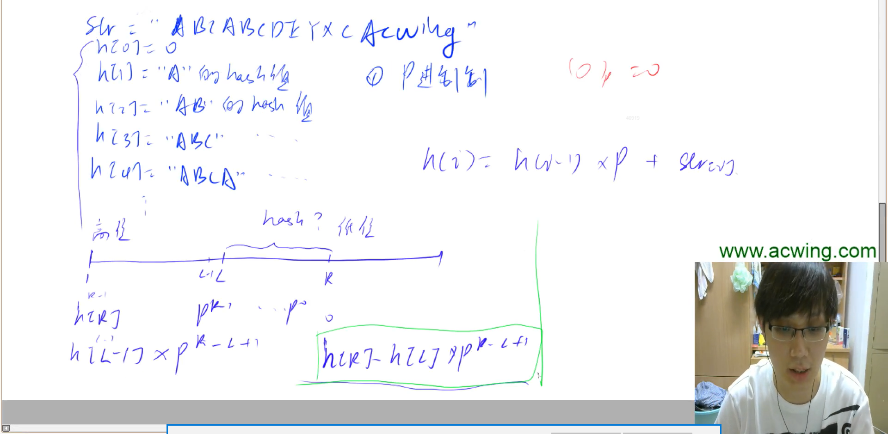
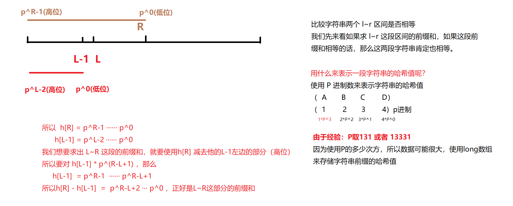

// hash的时候%N,N取质数的时候碰撞几率小


求出200000以上的最小的质数

```java
for(int i = 200000 ; ; i++)
{
    boolean flag = true;
    for(int j = 2 ; j*j <= i ; j++)
    {
        if(i % j == 0) 
        {
            flag = false;
            break;
        }
    }
    if(flag)
    {
        System.out.print(i);
        break;
    }
}
```


### 840. 模拟散列表               

维护一个集合，支持如下几种操作：

1. “I x”，插入一个数x；
2. “Q x”，询问数x是否在集合中出现过；

现在要进行N次操作，对于每个询问操作输出对应的结果。

**输入格式**

第一行包含整数N，表示操作数量。

接下来N行，每行包含一个操作指令，操作指令为”I x”，”Q x”中的一种。

**输出格式**

对于每个询问指令“Q x”，输出一个询问结果，如果x在集合中出现过，则输出“Yes”，否则输出“No”。

每个结果占一行。

**数据范围**

1≤N≤1051≤N≤105
−109≤x≤109−109≤x≤109

**输入样例：**

```
5
I 1
I 2
I 3
Q 2
Q 5

```

**输出样例：**

```
Yes
No
```


开放寻址法的话：

一：

数据个数只有10^5个，使用开放寻址法，数组长度一般取数据个数的两倍长度以上的第一个质数，也就是大于200000的第一个质数，所以`N = 200003`，因为取质数的话，发生冲突的概率会变小。

二：

存储一个数x的话，我们就需要获取x这个数的hash值，如何获取hash值呢?

`int k = ((x % N) + N) % N;` ： 这里解释一下为什么先模N又加N又模N。

题目中的数据范围是 −10^9 < x < 10^9 ，假如给我们一个特别小的负数，一般来说（负数%N = 正数）也就是说 （-2 % 3 = 1） ，但是在我们程序中， （-2 % 3 = -2），还是一个负数，但是我们要求的hash值是存储在数组中的下标值，不可以为负数，所以我们就必须先将 （x % N）之后，让他再加上N，最后再（%N） 即可。

`那么还有一个问题：为什么要先%N再加N呢？怎么不先加N再%N：`

这是因为，我们的N的指数级别只有10^5，但是数据范围最小有 -10^9 ，所以有可能加上N还是一个负数。


三：

我们定义的`nul = 0x3f3f3f3f` ，转换为十进制也就是（1061109567），比数据范围10^9大，并且乘以2也不会移除，所以这个数用来表示，在数组中的某个位置上为空值。

我们一开始，将数组中所有的数初始化为 0x3f3f3f3f


**使用开放寻址法来模拟哈希表**

```java
import java.util.*;
public class Main{
    
    public static final int N = 200003;
    public static int[] h = new int[N]; // 用于存储数据
    public static int nul = 0x3f3f3f3f; // 用于判断该位置是否已经存储了数据
    
    public static void fill(int[] q , int n){
        for(int i = 0 ; i < q.length ; i++)
        {
            q[i] = n;
        }
    }
    
    // 用于获取x需要插入的坐标或者x已经存在的坐标
    public static int get(int x){
        int k = ((x % N) + N) % N;
        while(h[k] != nul && h[k] != x)
        {
            k++;
            if(k == N) k = 0;//
        }
        return k;
    }
    
    public static void main(String[] args){
        Scanner sc = new Scanner(System.in);
        int n = sc.nextInt();
        fill(h , 0x3f3f3f3f);
        sc.nextLine();
        while(n-- > 0)
        {
            String[] str = sc.nextLine().split(" ");
            int x = Integer.parseInt(str[1]);
            if(str[0].equals("I")) 
            {
                int k = get(x);
                h[k] = x;
            }else
            {
                if(h[get(x)] != nul) System.out.println("Yes");
                else System.out.println("No");
            }
        }
    }
}
```







字符串哈希：

用于比较一个字符串的两个区域之间是否相等，kmp算法是远远比不上的。


- 进行字符串哈希大致的思路是：

  假如有一个字符串"ABCACWING"

  使用h[]数组来存储这个字符串的所有前缀和

  **计算哈希值的话，我们注意不能让哈希值为0就行，可以是其他的任何值。**

  **如果A的哈希值是0，那么AA的哈希值也是0，AAA的哈希值也是0，但是A和AA和AAA并不相等，就会出错。**

  ```
  h[0]  --> 0
  h[1]  --> A的哈希值  
  h[2]  --> AB的哈希值
  h[3]  --> ABC的哈希值
  h[4]  --> ABCA的哈希值
  h[5]  --> ABCAC的哈希值
  h[6]  --> ABCACW的哈希值
  h[7]  --> ABCACWI的哈希值
  ......
  ```

  ​

  ​

  


### 841. 字符串哈希                            

给定一个长度为n的字符串，再给定m个询问，每个询问包含四个整数l1,r1,l2,r2l1,r1,l2,r2，请你判断[l1,r1l1,r1]和[l2,r2l2,r2]这两个区间所包含的字符串子串是否完全相同。

字符串中只包含大小写英文字母和数字。

**输入格式**

第一行包含整数n和m，表示字符串长度和询问次数。

第二行包含一个长度为n的字符串，字符串中只包含大小写英文字母和数字。

接下来m行，每行包含四个整数l1,r1,l2,r2l1,r1,l2,r2，表示一次询问所涉及的两个区间。

注意，字符串的位置从1开始编号。

**输出格式**

对于每个询问输出一个结果，如果两个字符串子串完全相同则输出“Yes”，否则输出“No”。

每个结果占一行。

**数据范围**

1≤n,m≤1051≤n,m≤105

**输入样例：**

```
8 3
aabbaabb
1 3 5 7
1 3 6 8
1 2 1 2

```

**输出样例：**

```
Yes
No
Yes
```


```java
import java.util.*;
public class Main{
    
    public static final int N = 100010;
    public static long[] h = new long[N]; // 存储字符串的hash值
    public static long[] p = new long[N]; // 存储p的几次方
    public static final int P = 131;
    
    public static long find(int l , int r){
        return h[r] - h[l-1] * p[r-l+1];
    }
    
    public static void main(String[] args){
        Scanner sc = new Scanner(System.in);
        int n = sc.nextInt();
        int m = sc.nextInt();
        sc.nextLine();
        // 因为读取字符串的时候从下标1读取，所以在读取的字符串前加上一个空格
        char[] str = (" " + sc.nextLine()).toCharArray();
        
        p[0] = 1;
        // 初始化h和p数组
        for(int i = 1 ; i <= n ; i++)
        {
            p[i] = p[i-1] * P;
            h[i] = h[i-1] * P + str[i];
        }
        
        while(m-- > 0)
        {
            int l1 = sc.nextInt();
            int r1 = sc.nextInt();
            int l2 = sc.nextInt();
            int r2 = sc.nextInt();
            if(find(l1,r1) == find(l2,r2)) System.out.println("Yes");
            else System.out.println("No");
        }
        
    }
}
```

