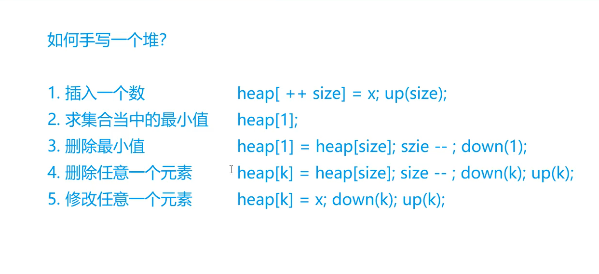
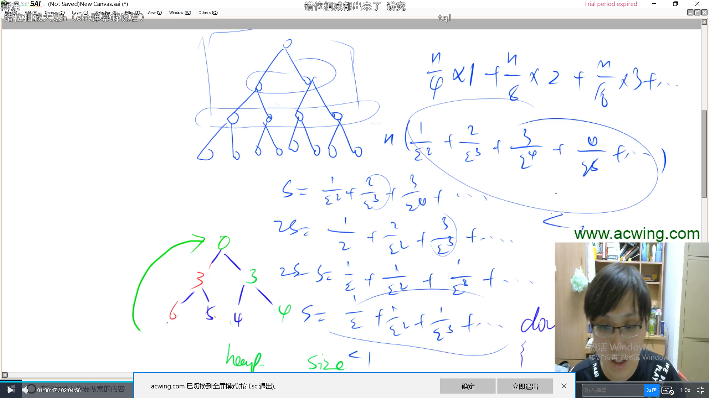

如何手写一个堆？


（1）插入一个数

（2）求集合中的最小值

（3）删除最小值

（4）删除任意一个元素

（5）修改任意一个元素







如上图：下沉操作，也就是 down() 操作的时间复杂度是  O(n)

下沉我们从 `i = n/2` 的位置开始下沉 （也就是倒数第二行） ，每次 `i--` 即可。


**堆其实就是完全二叉树的数组对象**

存储的规则是：

`h[]`数组来存储

`h[i]` 存储根节点  `h[2 * i]` 存储左节点   `h[2 * i + 1]` 存储右节点

所以既然规则是这样的话，那么我们 `h数组` 的下标就必须从 1  开始 ，如果从0开始的话， 2*0 还是0。


 


### 839. 模拟堆                      

维护一个集合，初始时集合为空，支持如下几种操作：

1. “I x”，插入一个数x；
2. “PM”，输出当前集合中的最小值；
3. “DM”，删除当前集合中的最小值（数据保证此时的最小值唯一）；
4. “D k”，删除第k个插入的数；
5. “C k x”，修改第k个插入的数，将其变为x；

现在要进行N次操作，对于所有第2个操作，输出当前集合的最小值。

**输入格式**

第一行包含整数N。

接下来N行，每行包含一个操作指令，操作指令为”I x”，”PM”，”DM”，”D k”或”C k x”中的一种。

**输出格式**

对于每个输出指令“PM”，输出一个结果，表示当前集合中的最小值。

每个结果占一行。

**数据范围**

1≤N≤1051≤N≤105
−109≤x≤109−109≤x≤109
数据保证合法。

**输入样例：**

```
8
I -10
PM
I -10
D 1
C 2 8
I 6
PM
DM

```

**输出样例：**

```
-10
6
```


```java
import java.util.*;
public class Main{
    
    public static final int N = 100010;
    //使用h数组来存储堆,存储规则: i是根节点  2*i是左节点 2*i+1是右节点
    public static int[] h = new int[N];
    public static int[] ph = new int[N];//ph[k] 表示第k个插入的数在堆中的下标
    public static int[] hp = new int[N];//hp[k] 表示堆中下标为k的数是第几个插入的
    public static int size = 0;// 堆中的数的个数
    public static int m = 0;// 插入的数的个数
    
    // 这里需要将数组也传进来,否则会修改不成功
    public static void swap(int[] q , int a , int b){
        int t = q[a];
        q[a] = q[b];
        q[b] = t;
    }
    
    // 更新ph,hp,h数组
    public static void heapSwap(int a , int b){
        swap(ph , hp[a] , hp[b]);
        swap(hp , a , b);
        swap(h , a , b);
    }
    
    // 将数向上浮动,到合适的位置
    public static void up(int u){
        while(u/2 > 0 && h[u/2] > h[u]) 
        {
            heapSwap(u , u/2);
            u >>= 1;
        }
    }
    
    // 向下沉,找到合适的位置
    public static void down(int u){
        int t = u;
        // i是根节点  2*i是左节点 2*i+1是右节点
        if( 2*u <= size && h[2*u] < h[t] ) t = 2*u;
        if( 2*u+1 <= size && h[2*u+1] < h[t] ) t= 2*u+1;
        if(t != u)
        {
            heapSwap(u , t);
            down(t);
        }
    }
    
    public static void main(String[] args){
        Scanner sc = new Scanner(System.in);
        int n = sc.nextInt();
        sc.nextLine();
        while(n-- > 0)
        {
            String[] str = sc.nextLine().split(" ");
            String op = str[0];
            if(op.equals("I"))
            {
                //插入一个数
                int x = Integer.parseInt(str[1]);
                // 插入的数的个数+1
                m++;
                // 数组中元素个数下标+1
                h[++size] = x;
                // 更新ph,hp数组
                ph[m] = size;
                hp[size] = m;
                // 向上浮动,找到合适的位置
                up(size);
            }else if(op.equals("PM"))
            {
                //输出当前集合最小值
                System.out.println(h[1]);
            }else if(op.equals("DM"))
            {
                //删除集合最小值
                heapSwap(1 , size);
                // 删除第一个元素,将最后一个元素和第一个元素交换位置,size--再删除最后一个元素
                size--;
                // 将第一个元素下沉找到合适的位置
                down(1);
            }else if(op.equals("D"))
            {
                // 删除第k个插入的数
                int k = Integer.parseInt(str[1]);
                // 获取第k个插入的数的下标
                int index = ph[k];
                // 交换插入的第k个数和最后一个数
                heapSwap(index , size);
                // 删除最后一个数
                size--;
                // 我们可以判断当前数和之前的数的大小,来决定上浮或者下沉
                // 也可以直接两个都写上,反正只可能执行一个
                down(index);
                up(index);
            }else 
            {
                //修改第k个插入的数，将其变为x
                int k = Integer.parseInt(str[1]);
                int x = Integer.parseInt(str[2]);
                h[ph[k]] = x;
                down(ph[k]);
                up(ph[k]);
            }
        }
        sc.close();
    }
}
```

