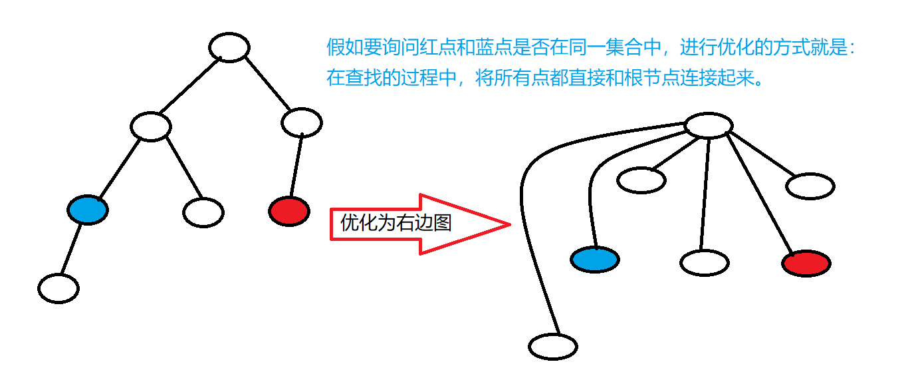

并查集的作用：

（1）将两个集合合并

（2）询问两个元素是否在一个集合中

可以在近乎 O(1) 的时间复杂度内完成。


基本原理：每个集合用一棵树来表示。树根的编号就是整个集合的编号。每个节点存储它的父节点，p[x] 表示 x 的父节点。


问题1 ： 如何判断树根： if(p[x] == x)

问题2：  如何求 x 的集合编号： while(p[x] != x) x = p[x]

问题3：   如何合并两个集合，px是x的集合编号，py是y的集合编号，p[x] = y


询问两个节点是否在同一个集合中，我们可以进行优化，也就是进行路径压缩。




### 837. 连通块中点的数量                         

给定一个包含n个点（编号为1~n）的无向图，初始时图中没有边。

现在要进行m个操作，操作共有三种：

1. “C a b”，在点a和点b之间连一条边，a和b可能相等；
2. “Q1 a b”，询问点a和点b是否在同一个连通块中，a和b可能相等；
3. “Q2 a”，询问点a所在连通块中点的数量；

**输入格式**

第一行输入整数n和m。

接下来m行，每行包含一个操作指令，指令为“C a b”，“Q1 a b”或“Q2 a”中的一种。

**输出格式**

对于每个询问指令”Q1 a b”，如果a和b在同一个连通块中，则输出“Yes”，否则输出“No”。

对于每个询问指令“Q2 a”，输出一个整数表示点a所在连通块中点的数量

每个结果占一行。

**数据范围**

1≤n,m≤1051≤n,m≤105

**输入样例：**

```
5 5
C 1 2
Q1 1 2
Q2 1
C 2 5
Q2 5

```

**输出样例：**

```
Yes
2
3
```


**这里有一个注意点：**

我们在连接连通点的时候，必须先维护 size 数组 ，再进行合并。

执行完`p[find(b)] = find(a)`之后，此时，已经是`a`和`b`已经在一个集合中了，再执行`size[find(a)] += size[find(b)]`的话，就是两个a集合的数量相加，而不是a集合和b集合的数量相加。


```java
import java.util.*;
public class Main{ 
    public static final int N = 100010;
    public static int[] p = new int[N];
    public static int[] size = new int[N];
    public static int find(int u){
        // 查找父节点+路径压缩
        if(u != p[u]) p[u] = find(p[u]);
        return p[u];
    }
    
    public static void main(String[] args){
        Scanner sc = new Scanner(System.in);
        int n = sc.nextInt();
        int m = sc.nextInt();
        sc.nextLine();
        for(int i = 1 ; i <= n ; i++)
        {
            p[i] = i;
            size[i] = 1;
        }
        
        while(m-- > 0)
        {
            String[] str = sc.nextLine().split(" ");
            if(str[0].equals("Q1"))
            {
                int a = Integer.parseInt(str[1]);
                int b = Integer.parseInt(str[2]);
                 if(find(a) == find(b)) System.out.println("Yes");
             else System.out.println("No");
            }else if(str[0].equals("Q2"))
            {
                int a = Integer.parseInt(str[1]);
                System.out.println(size[find(a)]);
            }else
            {
                // 连接两个联通点
                int a = Integer.parseInt(str[1]);
                int b = Integer.parseInt(str[2]);
                // 如果
                // if(find(a) == find(b)) continue;
                if(find(a) != find(b))
                {
                    // 必须先维护size数组,再进行find()
                    // 先find()的话,会导致并查集数据改变
                    size[find(b)] += size[find(a)];
                    p[find(a)] = find(b);
                }
            }
        }
        
    }
}
```


