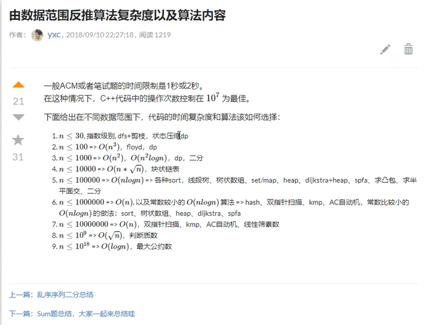

**C++ 1s可以计算10^7 ~ 10^8**

一般 ACM 或者笔试题的时间限制是 1 秒或 2 秒。
在这种情况下，C++ 代码中的操作次数控制在 107107 为最佳。
下面给出在不同数据范围下，代码的时间复杂度和算法该如何选择：

-n≤30n≤30, 指数级别, 

dfs + 剪枝，数字排列， n皇后问题， 八数码问题
状态压缩 dp，蒙德里安的梦想， 最短Hamilton路径

-n≤100n≤100 => O(n3)O(n3)，
floyd，
dp，

-n≤1000n≤1000 => O(n2)O(n2)，O(n2logn)O(n2logn)，
dp，
二分，
朴素版 Dijkstra、朴素版 Prim、Bellman-Ford

n≤10000n≤10000 => O(n∗n√)O(n∗n)，
块状链表、分块、莫队

n≤100000n≤100000 => O(nlogn)O(nlogn)
各种 sort，线段树、树状数组、set/map、heap、dijkstra+heap、prim+heap、spfa、求凸包、求半平面交、二分

n≤1000000n≤1000000 => O(n)O(n), 以及常数较小的 O(nlogn)O(nlogn) 算法 
hash、双指针扫描、并查集，kmp、AC 自动机，
常数比较小的 O(nlogn)O(nlogn) 的做法：sort、树状数组、heap、dijkstra、spfa

n≤10000000n≤10000000 => O(n)O(n)，
双指针扫描、kmp、AC 自动机、线性筛素数

n≤109n≤109 => O(n√)O(n)，
判断质数

n≤1018n≤1018 => O(logn)O(logn)，
最大公约数，快速幂

n≤101000n≤101000 => O((logn)2)O((logn)2)，
高精度加减乘除

n≤10100000n≤10100000 => O(logn×loglogn)O(logn×loglogn)，
高精度加减、FFT/NTT

算法时间复杂度分析实例：
一般来说，k重循环，算法时间复杂度就是nknk 

基础算法

快速排序  归并排序 二分
O(nlogn)

双指针 数组元素目标和
O(n)

数据结构

单链表 栈 (插入 删除操作)
O(1)

单调栈 单调队列
O(n)

KMP
O(n)

Trie字符串统计
O(n)

并查集 (路径压缩)
O(nlogn)

堆排序
O(nlogn)

模拟散列表
O(1)

搜索与图论

排列数字（全排列）
O(n*n!)

dfs bfs
O(n+m)

Dijkstra
O(mlogm)

Bellman_ford
O(nm)

spfa
O(nm)

Floyd
O(n^3)

Prim
O(n^2)

Kruskal
O(mlogm)

染色法判定二分图
O(mlogm)

匈牙利算法
O(nm)

spfa算法， 匈牙利算法， 最大流算法时间复杂度理论值很大，但是实际运行速度很快 

数学知识

试除法判定质数 分解质因数
sqrt(n)

筛质数
nlogn

最大公约数
logn

快速幂
logn

动态规划问题的计算量=状态数量*状态转移的计算量

动态规划

背包问题
k重循环，算法时间复杂度就是nknk

最长上升子序列 II
nlogn

蒙德里安的梦想
2^

没有上司的舞会
nm

空间复杂度分析
64M

1 Byte = 8 bit

1 KB= 1024 Byte

1 MB=1024*1024 Byte

1 GB=1024 * 1024 * 1024 Byte

int  4 Byte

char 1 Byte

double, long long   6Byte

bool 1 Byte

C++: 为什么bool类型是1 Byte(8 bits)长？
为什么bool类型所需存储空间不是 1 bit, 1 bit就可以覆盖bool类型的值域范围 。
Cpp的数据类型必须就可以通过地址得到的（addressable）。
我们无法通过一位创建一个指针，但是我们可以通过一个自己创建一个指针。
所以， 在Cpp中，Bool类型的大小是一个字节。
64MB=2^26Byte

2^26Byte /4 =2^24 int

=1.6*10^7 int

注意
递归也是需要空间的，递归调用了系统栈，快速排序使用了递归，所以空间复杂度是O(logn)

