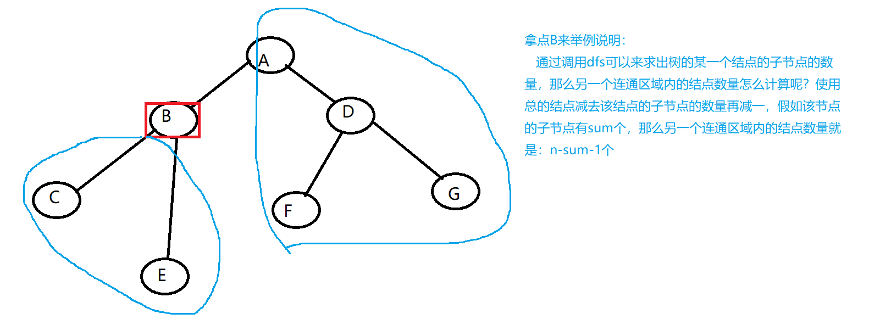
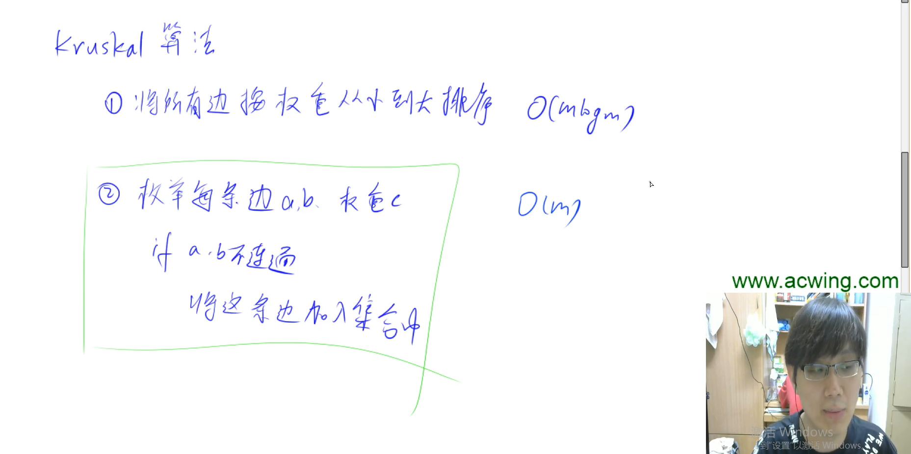

## 846. 树的重心                            

给定一颗树，树中包含n个结点（编号1~n）和n-1条无向边。

请你找到树的重心，并输出将重心删除后，剩余各个连通块中点数的最大值。

重心定义：重心是指树中的一个结点，如果将这个点删除后，剩余各个连通块中点数的最大值最小，那么这个节点被称为树的重心。

**输入格式**

第一行包含整数n，表示树的结点数。

接下来n-1行，每行包含两个整数a和b，表示点a和点b之间存在一条边。

**输出格式**

输出一个整数m，表示重心的所有的子树中最大的子树的结点数目。

**数据范围**

1≤n≤1051≤n≤105

**输入样例**

```
9
1 2
1 7
1 4
2 8
2 5
4 3
3 9
4 6

```

**输出样例：**

```
4
```




## DijkstraⅠ求最短路

思路：

稠密图使用邻接矩阵来存储 ： `g[i][j]`

稀疏图使用邻接表来存储：`e[n] ne[n] h[n]`

使用`g[i][j]` 来表示 i 点 和 j 点 之间的距离

使用`dist[i]` 表示 1 这个点到 i 这个点的距离

使用`feasible[i]` 表示 i 这个点是否已经加入到了最短路

初始化`g[i][j]`数组都为max = 0x3f3f3f3f , 0x3f3f3f3f大小为10^9多一点，使用它的好处是乘以二不会溢出

在dijkstra算法中循环 `n-1` 次，来找出距离1这个点最小的点，且没有被加入到最短路的集合中去

然后拿到这个距离1 最近的点去更新所有的点。

最后判断n这个点到1这个点的距离是否是 max ，如果是的话，说明1点无法到达n点。

### **849.Dijkstra求最短路 I            ** 

给定一个n个点m条边的有向图，图中可能存在重边和自环，所有边权均为正值。

请你求出1号点到n号点的最短距离，如果无法从1号点走到n号点，则输出-1。

**输入格式**

第一行包含整数n和m。

接下来m行每行包含三个整数x，y，z，表示存在一条从点x到点y的有向边，边长为z。

**输出格式**

输出一个整数，表示1号点到n号点的最短距离。

如果路径不存在，则输出-1。

**数据范围**

1≤n≤5001≤n≤500,
1≤m≤1051≤m≤105,
图中涉及边长均不超过10000。

**输入样例：**

```
3 3
1 2 2
2 3 1
1 3 4

```

**输出样例：**

```
3
```


```java
import java.util.*;
public class Main{
    public static final int N = 510 , max = 0x3f3f3f3f;
    public static int[][] g = new int[N][N];
    public static boolean[] feasible = new boolean[N];
    public static int[] dist = new int[N];
    public static int n , m;
    
    public static int dijkstra(){
        Arrays.fill(dist , max);
        dist[1] = 0;
        // 这里循环的次数可以是n也可以是n-1，循环n-1次之后，最短路就已经可以确定了
        // 在这个集合中找到dist数组中最小的数，也就是距离1的距离最短的数，并且没有被feasible数组标记过的
        for(int i = 0 ; i < n ; i ++)
        {
            int t = -1;
            for(int j = 1 ; j <= n ; j++)
            {
                if(!feasible[j] && (t == -1 || dist[t] > dist[j]))
                {
                    t = j;
                }
            }
            // 找到之后，标记为true，代表已经加入到了最短路的这个集合中
            feasible[t] = true;
            // 使用已经找到的距离1最短的数来更新所有的点到1这个点的距离
            for(int j = 1 ; j <= n ; j++)
            {
                dist[j] = Math.min(dist[j] , dist[t] + g[t][j]);
            }
        }
        // 如果dist[n] 的距离还是max的话，说明没有点可以到达n这个点，返回-1
        if(dist[n] == max) return -1;
        return dist[n];
    }
    
    public static void main(String[] args){
        Scanner sc = new Scanner(System.in);
        n = sc.nextInt();
        m = sc.nextInt();
        // 初始化 g 数组
        for(int i = 1 ; i <= n ; i++)
        {
            for(int j =1 ; j <= n ; j++)
            {
                g[i][j] = max;
            }
        }
        while(m-- > 0)
        {
            int a = sc.nextInt();
            int b = sc.nextInt();
            int c = sc.nextInt();
            // 这里不直接使用 g[a][b] = c 是因为要防止出现了重边，如果出现重边的话，Math.min()可以选择最小的重边
            g[a][b] = Math.min(g[a][b] , c);
        }
        int t = dijkstra();
        System.out.println(t);
    }
}
```


思路：

稠密图使用邻接矩阵来存储 ： `g[i][j]`

稀疏图使用邻接表来存储：`e[n] ne[n] h[n]` 使用这三个数组来模拟一个链表

使用`feasible[i]` 表示 i 这个点是否已经加入到了最短路

在没有优化过的dijkstra算法中，先循环 n-1 次，在这个循环内找到最小的点，时间复杂度是O（n），所以我们可以在这里进行优化，使用`Java中的优先队列：PriorityQueue`来做，在优先队列中可以保证，队头永远都是距离1这个点最小的点，那么在所有的点中找到距离1最小的点的时间复杂度就是O（1）


### 850. Dijkstra求最短路 II                    

给定一个n个点m条边的有向图，图中可能存在重边和自环，所有边权均为非负值。

请你求出1号点到n号点的最短距离，如果无法从1号点走到n号点，则输出-1。

**输入格式**

第一行包含整数n和m。

接下来m行每行包含三个整数x，y，z，表示存在一条从点x到点y的有向边，边长为z。

**输出格式**

输出一个整数，表示1号点到n号点的最短距离。

如果路径不存在，则输出-1。

**数据范围**

1≤n,m≤1.5×1051≤n,m≤1.5×105,
图中涉及边长均不小于0，且不超过10000。

**输入样例：**

```
3 3
1 2 2
2 3 1
1 3 4

```

**输出样例：**

```
3
```


```java
import java.util.*;
class Pair{
    int a;
    int b;
    public Pair(int a , int b){
        this.a = a;
        this.b = b;
    }
}
public class Main{
    public static final int N = 200010 , max = 0x3f3f3f3f;
    public static int[] e = new int[N];
    public static int[] ne = new int[N];
    public static int[] h = new int[N];
    public static int[] w = new int[N]; // 存储边长
    public static int[] dist = new int[N];
    public static boolean[] feasible = new boolean[N];
    public static int n , m , idx = 0;
    
    public static void add(int a , int b , int c){
        e[idx] = b;
        ne[idx] = h[a];
        w[idx] = c;
        h[a] = idx++;
    }
    
    public static int dijkstra(){
        Arrays.fill(dist , max);
        dist[1] = 0;
        // 初始化优先队列，实现Comparator接口，按照 Pair.a 来从小到大排序
        PriorityQueue<Pair> q = new PriorityQueue<>((p1 , p2) -> {return p1.a - p2.a;});
        // 将 0 1 这个点加入优先队列
        q.offer(new Pair(0 , 1));
        while(q.size() != 0)
        {
            Pair t = q.poll();
            int distance = t.a;
            int num = t.b;
            // 判断是否已经加入到最短路径
            if(feasible[num]) continue;
            // 如果没有加入，就将他加入
            feasible[num] = true;
            // 取出最小的点的指向的点的坐标，遍历这个链表
            for(int i = h[num] ; i != -1 ; i = ne[i])
            { 
                // 根据坐标取出点
                int j = e[i];
                // 判断距离是否变小，逐个点进行更新
                if(dist[j] > dist[num] + w[i])
                {
                    dist[j] = dist[num] + w[i];
                    if(!feasible[j])
                    {
                        q.offer(new Pair(dist[j] , j));
                    }
                }
            }
        }
        return dist[n] == max ? -1 : dist[n];
    }
    
    public static void main(String[] args){
        Scanner sc = new Scanner(System.in);
        n = sc.nextInt();
        m = sc.nextInt();
        // 初始化头节点的数组 为 -1
        Arrays.fill(h , -1);
        while(m-- > 0)
        {
            int a = sc.nextInt();
            int b = sc.nextInt();
            int c = sc.nextInt();
            add(a , b , c);
        }
        int t = dijkstra();
        System.out.println(t);
    }
}
```


## BellmanFord 求最短路


思路：

使用Node(a,b,c) 来存储 点a  到 点b 的边长为 c

BellmanFord 是很暴力的，使用edge数组来存储所有的边

然后来遍历所有的边，更新所有的点到1这个点的距离。

因为有负权边，所以有可能dist[n] 会比 我们定义的max小，因为有可能出现负环，每经过一次负环，`dist[n]`就会减小一次，但是因为有只能经过k条边的限制，`dist[n]`不会无限制的减小，所以我们可以根据`dist[n] >= max / 2`  来判断 n 这个点是否可达。


### 853. 有边数限制的最短路        

给定一个n个点m条边的有向图，图中可能存在重边和自环， **边权可能为负数**。

请你求出从1号点到n号点的最多经过k条边的最短距离，如果无法从1号点走到n号点，输出impossible。

注意：图中可能 **存在负权回路** 。

**输入格式**

第一行包含三个整数n，m，k。

接下来m行，每行包含三个整数x，y，z，表示存在一条从点x到点y的有向边，边长为z。

**输出格式**

输出一个整数，表示从1号点到n号点的最多经过k条边的最短距离。

如果不存在满足条件的路径，则输出“impossible”。

**数据范围**

1≤n,k≤5001≤n,k≤500,
1≤m≤100001≤m≤10000,
任意边长的绝对值不超过10000。

**输入样例：**

```
3 3 1
1 2 1
2 3 1
1 3 3
```

**输出样例：**

```
3
```


```java
import java.util.*;
class Node{
    int a;
    int b;
    int c;
    public Node(int a, int b, int c)
    {
        this.a = a;
        this.b = b;
        this.c = c;
    }
}
public class Main{
    public static final int N = 10010 , max = 0x3f3f3f3f;
    public static int[] dist = new int[N];
    public static Node[] edge = new Node[N];
    public static int n , m , k;
    
    public static void bellmanFord(){
        Arrays.fill(dist , max);
        dist[1] = 0;
        for(int i = 0 ; i < k ; i++)
        {
            // 我们需要将上次更新过的dist数组备份到copy数组
            int[] copy = Arrays.copyOf(dist , N);
            for(int j = 1 ; j <= m ; j ++)
            {
                int a = edge[j].a;
                int b = edge[j].b;
                int c = edge[j].c;
                // 更新的时候，我们要使用备份的数组，而不能直接使用dist数组，否则可能会发生串联，也就是这次更新了dist[j] ，然后这个已经更新过的dist[j]又有可能被应用到下一次的更新中去，造成了串联更新。
                if(dist[b] > copy[a] + c)
                {
                    dist[b] = copy[a] + c;
                }
            }
        }
    }
    
    public static void main(String[] args){
        Scanner sc = new Scanner(System.in);
        n = sc.nextInt();
        m = sc.nextInt();
        k = sc.nextInt();
        for(int i = 1 ; i <= m ; i++)
        {
            int a = sc.nextInt();
            int b = sc.nextInt();
            int c = sc.nextInt();
            edge[i] = new Node(a , b , c);
        }
        bellmanFord();
        if(dist[n] >= max / 2) System.out.println("impossible");
        else System.out.println(dist[n]);
    }
}
```


## Spfa算法

spfa算法是对BellmanFord算法的优化

BellmanFord算法暴力的去更新了所有的边

Spfa算法使用Queue队列，来只更新到点1距离变小的点，然后将这个点的可以到的点都加入到队列中去

使用`feasible`数组来表示点是否已经被加入到队列中去，也可以不使用feasible数组，但是效率会降低。

最后根据`dist[n]`是否等于`max`来判断是否 n 点 是否可达

这里为什么不根据`dist[n] >= max / 2`来判断 n 点 是否可达呢？

spfa算法只会更新 1这个点 可以到达的点，如果1这个点无法到达n点，就不会去更新n点，所以 `dist[n]` 还是 max

**但是如果出现负权环的话，会导致spfa算法陷入死循环**

所以使用cnt数组来记录边数，如果`cnt[n] >= n` 的话，那么根据抽屉原理，证明出现了死循环，直接结束循环即可。

为什么`cnt[n] >= n `证明有负权换呢？ 

根据抽屉原理：n+1个苹果放到n个抽屉中，一定有2个苹果在一个抽屉里

### 851. spfa求最短路                         

给定一个n个点m条边的有向图，图中可能存在重边和自环， **边权可能为负数**。

请你求出1号点到n号点的最短距离，如果无法从1号点走到n号点，则输出impossible。

数据保证不存在负权回路。

**输入格式** 

第一行包含整数n和m。

接下来m行每行包含三个整数x，y，z，表示存在一条从点x到点y的有向边，边长为z。

**输出格式**

输出一个整数，表示1号点到n号点的最短距离。

如果路径不存在，则输出”impossible”。

**数据范围**

1≤n,m≤1051≤n,m≤105,
图中涉及边长绝对值均不超过10000。

**输入样例：**

```
3 3
1 2 5
2 3 -3
1 3 4
```

**输出样例：**

```
2
```


```java
import java.util.*;
public class Main{
    public static final int N = 100010 , max = 0x3f3f3f3f;
    public static int[] h = new int[N];
    public static int[] e = new int[N];
    public static int[] ne = new int[N];
    public static int[] w = new int[N];
    public static int[] dist = new int[N];
    public static boolean[] feasible = new boolean[N];
    public static int n , m , idx = 0;
    
    public static void add(int a ,int b ,int c){
        e[idx] = b;
        ne[idx] = h[a];
        w[idx] = c;
        h[a]= idx ++;
    }
    
    public static int spfa(){
        Queue<Integer> q = new LinkedList<>();
        Arrays.fill(dist , max);
        dist[1] = 0;
        q.offer(1);
        feasible[1] = true;
        while(q.size() != 0)
        {
            int t = q.poll();
            feasible[t] = false;
            for(int i = h[t] ; i != -1 ; i = ne[i])
            {
                int j = e[i];
                if(dist[j] > dist[t] + w[i])
                {
                    dist[j] = dist[t] + w[i];
                    if(!feasible[j])
                    {
                        feasible[j] = true;
                        q.offer(j);
                    }
                }
            }
        }
        return dist[n];
    }
    
    public static void main(String[] args){
        Scanner sc = new Scanner(System.in);
        n = sc.nextInt();
        m = sc.nextInt();
        Arrays.fill(h , -1);
        while(m-- > 0)
        {
            int a = sc.nextInt();
            int b = sc.nextInt();
            int c = sc.nextInt();
            add(a , b ,c);
        }
        int t = spfa();
        // 这里为什么不使用 t >= max / 2来判断呢？
        // spfa算法只会更新可以从1点走到的点，如果走不到n点，就不会更新n点
        if(t == max) System.out.println("impossible");
        else System.out.println(t);
    }
}
```


Spfa算法也可以用来判断负环，使用cnt数组来记录边数

注意，我们初始化的时候，要将所有的点都加入到Queue队列中，因为我们是找图中是否存在环，而不是找从1出发是否存在环。

### 852. spfa判断负环            

给定一个n个点m条边的有向图，图中可能存在重边和自环， **边权可能为负数**。

请你判断图中是否存在负权回路。

**输入格式**

第一行包含整数n和m。

接下来m行每行包含三个整数x，y，z，表示存在一条从点x到点y的有向边，边长为z。

**输出格式**

如果图中**存在**负权回路，则输出“Yes”，否则输出“No”。

**数据范围**

1≤n≤20001≤n≤2000,
1≤m≤100001≤m≤10000,
图中涉及边长绝对值均不超过10000。

**输入样例：**

```
3 3
1 2 -1
2 3 4
3 1 -4

```

**输出样例：**

```
Yes
```


```java
import java.util.*;
public class Main{
    public static final int N = 100010;
    public static int[] h = new int[N];
    public static int[] e = new int[N];
    public static int[] ne = new int[N];
    public static int[] w = new int[N];
    public static int[] dist = new int[N];
    public static int[] cnt = new int[N];
    public static boolean[] feasible = new boolean[N];
    public static int n , m , idx = 0;
    
    public static void add(int a ,int b ,int c){
        e[idx] = b;
        ne[idx] = h[a];
        w[idx] = c;
        h[a]= idx ++;
    }
    
    public static boolean spfa(){
        Queue<Integer> q = new LinkedList<>();
        for(int i = 1 ; i <= n ; i++)
        {
            q.offer(i);
            feasible[i] = true;
        }
        while(q.size() != 0)
        {
            int t = q.poll();
            if(cnt[t] >= n) return true;
            feasible[t] = false;
            for(int i = h[t] ; i != -1 ; i = ne[i])
            {
                int j = e[i];
                if(dist[j] > dist[t] + w[i])
                {
                    cnt[j] = cnt[t] + 1;
                    dist[j] = dist[t] + w[i];
                    if(!feasible[j])
                    {
                        feasible[j] = true;
                        q.offer(j);
                    }
                }
            }
        }
        return false;
    }
    
    public static void main(String[] args){
        Scanner sc = new Scanner(System.in);
        n = sc.nextInt();
        m = sc.nextInt();
        Arrays.fill(h , -1);
        while(m-- > 0)
        {
            int a = sc.nextInt();
            int b = sc.nextInt();
            int c = sc.nextInt();
            add(a , b ,c);
        }
        if(spfa()) System.out.println("Yes");
        else System.out.println("No");
    }
}
```


## 最小生成树算法


**Prim算法思路:**

和 dijkstra 算法的思路大致相同 , 在图中的所有的点中找到距离集合里的所有点距离最近的点 , 然后使用这个点来更新图中的其他点,最后将这个点加入到集合中来


### 858. Prim算法求最小生成树                        

给定一个n个点m条边的无向图，图中可能存在重边和自环，边权可能为负数。

求最小生成树的树边权重之和，如果最小生成树不存在则输出impossible。

给定一张边带权的无向图G=(V, E)，其中V表示图中点的集合，E表示图中边的集合，n=|V|，m=|E|。

由V中的全部n个顶点和E中n-1条边构成的无向连通子图被称为G的一棵生成树，其中边的权值之和最小的生成树被称为无向图G的最小生成树。

**输入格式**

第一行包含两个整数n和m。

接下来m行，每行包含三个整数u，v，w，表示点u和点v之间存在一条权值为w的边。

**输出格式**

共一行，若存在最小生成树，则输出一个整数，表示最小生成树的树边权重之和，如果最小生成树不存在则输出impossible。

**数据范围**

1≤n≤5001≤n≤500,
1≤m≤1051≤m≤105,
图中涉及边的边权的绝对值均不超过10000。

**输入样例：**

```
4 5
1 2 1
1 3 2
1 4 3
2 3 2
3 4 4

```

**输出样例：**

```
6
```


```java
import java.util.*;
public class Main{
    public static final int N = 510 , max = 0x3f3f3f3f;
    public static int[][] g = new int[N][N]; // 存储图
    public static int[] dist = new int[N]; //dist[i] 表示 i 点到集合里的点的最短的距离
    public static boolean[] feasible = new boolean[N]; // feasible[i] 表示 i 点是否已经被加入到集合中
    public static int n , m;
    
    public static int prim(){
        Arrays.fill(dist , max);
        
        int res = 0; // 存储最小生成树的权重和
        for(int i = 0 ; i < n ; i++)
        {
            int t = -1;
            // 更新t的坐标,找到距离集合距离最小的点
            for(int j = 1 ; j <= n ; j++)
                if(!feasible[j] && (t == -1 || dist[t] > dist[j]))
                    t = j;
            // 如果不是第一个点，并且该点到集合的距离为max，说明该点到不了集合，所以直接返回max
            if(i > 0 && dist[t] == max) return max;
            // 使用res存储最小权重
            if(i > 0) res += dist[t];
            // 使用我们找到的距离集合最近的边，来更新所有的边
            for(int j = 1 ; j <= n ; j++)
            {
                dist[j] = Math.min(dist[j] , g[t][j]);
            }
            // 将该点加入到集合中去
            feasible[t] = true;
        }
        return res;
    }
    
    public static void main(String[] args){
        Scanner sc = new Scanner(System.in);
        n = sc.nextInt();
        m = sc.nextInt();
        // 初始化图
        for(int i = 1 ; i <= n ; i ++)
            for(int j = 1 ; j <= n ; j++)
                g[i][j] = max;
        while(m-- > 0)
        {
            int a = sc.nextInt();
            int b = sc.nextInt();
            int c = sc.nextInt();
            // 无向图，所以加入a->b  b->a
            g[a][b] = g[b][a] = Math.min(g[a][b] , c);
        }
        
        int t = prim();
        
        if(t == max) System.out.println("impossible");
        else System.out.println(t);
    }
}
```


**kruskal算法思路:**

定义一个类Edge , 定义一个数组Edge[] edges 来存放所有的边 , 使用Arrays.sort() 对这个数组进行定制化排序 , 按照权重来排序 , 然后枚举每一条边 , 判断 a点 和 b点 是否已经连通 `(使用并查集来做)` , 如果已经连通 , 就不添加这条边 , 如果没有连通 , 就将这两个点进行连通 , res 记录权重和

概括地来说 : kruskal算法求最小生成树的思路是每一次选取权值最小的边，如果选择的边所对应的两个顶点已经在一个连通块中，就不加这条边，最后判断加边的数量等不等于顶点数减1，如果不等，说明这张图不能生成最小生成树。



### 859. Kruskal算法求最小生成树                          

给定一个n个点m条边的无向图，图中可能存在重边和自环，边权可能为负数。

求最小生成树的树边权重之和，如果最小生成树不存在则输出impossible。

给定一张边带权的无向图G=(V, E)，其中V表示图中点的集合，E表示图中边的集合，n=|V|，m=|E|。

由V中的全部n个顶点和E中n-1条边构成的无向连通子图被称为G的一棵生成树，其中边的权值之和最小的生成树被称为无向图G的最小生成树。

**输入格式**

第一行包含两个整数n和m。

接下来m行，每行包含三个整数u，v，w，表示点u和点v之间存在一条权值为w的边。

**输出格式**

共一行，若存在最小生成树，则输出一个整数，表示最小生成树的树边权重之和，如果最小生成树不存在则输出impossible。

**数据范围**

1≤n≤1051≤n≤105,
1≤m≤2∗1051≤m≤2∗105,
图中涉及边的边权的绝对值均不超过1000。

**输入样例：**

```
4 5
1 2 1
1 3 2
1 4 3
2 3 2
3 4 4

```

**输出样例：**

```
6
```


```java
import java.util.*;
class Edge{
    int a;
    int b;
    int c;
    public Edge(int a , int b , int c){
        this.a = a;
        this.b = b;
        this.c = c;
    }
}
public class Main{
    public static int N = 100010 , max = 0x3f3f3f3f;
    public static int[] p = new int[N];
    public static Edge[] edges;
    public static int n , m;
    
    public static int find(int x){
        if(x != p[x]) p[x] = find(p[x]);
        return p[x];
    }
    
    public static int kruskal(){
        for(int i = 1 ; i <= n ; i++)
            p[i] = i;
        
        int res = 0 , cnt = 0;
        for(int i = 0 ; i < m ; i++)
        {
            int a = edges[i].a;
            int b = edges[i].b;
            int c = edges[i].c;
            a = find(a);
            b = find(b);
            if(a != b)
            {
                p[a] = b;
                cnt++;
                res += c;
            }
        }
        if(cnt == n-1) return res;
        else return max;
    }
    
    public static void main(String[] args){
        Scanner sc = new Scanner(System.in);
        n = sc.nextInt();
        m = sc.nextInt();
        // 注意这里 edges 的数组大小必须声明为m,不能让edges中有空位置,否则会报错NullPointer
        // 本来设置了static M = 200010 , 把edges数组大小设置为M,就在Arrays.sort()中使用Comparator进行比较的时候报错NullPointer
        edges = new Edge[m];
        for(int i = 0 ; i < m ; i++)
        {
            int a = sc.nextInt();
            int b = sc.nextInt();
            int c = sc.nextInt();
            edges[i] = new Edge(a , b , c);
        }
        Arrays.sort(edges , (e1 , e2) -> {return e1.c - e2.c;});
        int t = kruskal();
        if(t == max) System.out.println("impossible");
        else System.out.println(t);
    }
}
```

