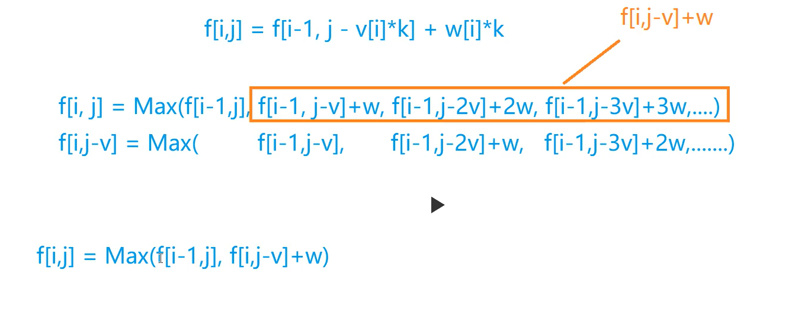
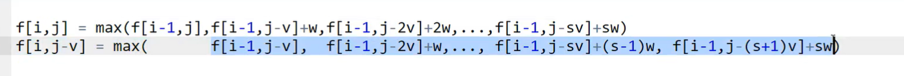
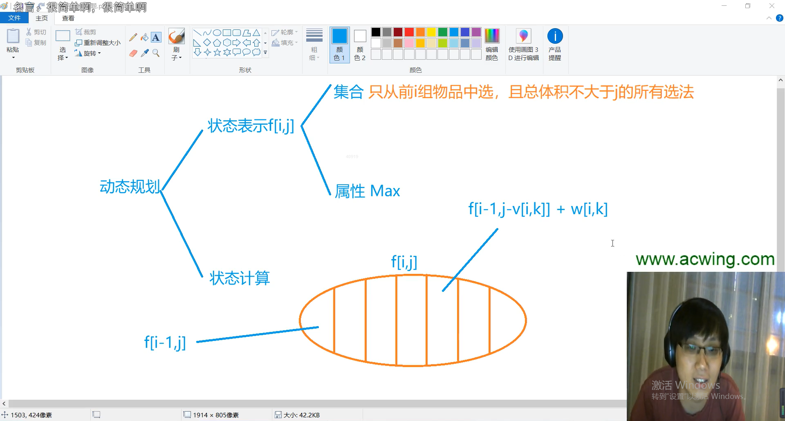

### 0-1背包问题


**二维求解** 

```
import java.util.*;
public class Main{
    public static final int N = 1010;
    public static int[][] f = new int[N][N];
    public static int[] w = new int[N];
    public static int[] v = new int[N];
    public static int n , m;
    public static void main(String[] args){
        Scanner sc = new Scanner(System.in);
        n = sc.nextInt();
        m = sc.nextInt();
        for(int i = 1 ; i <= n ; i ++)
        {
            int a = sc.nextInt();
            int b = sc.nextInt();
            v[i] = a;
            w[i] = b;
        }
        
        for(int i = 1 ; i <= n ; i++)
        {
            for(int j = 0 ; j <= m ; j ++)
            {
                f[i][j] = f[i-1][j];
                if(j >= v[i]) f[i][j] = Math.max(f[i][j] , f[i-1][j-v[i]] + w[i]);
            }
        }
        System.out.println(f[n][m]);
    }
}
```


使用二维数组来存储，还可以再进一步的进行优化，我们发现每次`f[i][j]` 的更新只与`f[i-1][j-v[i]]` 有关 ， 所以我们可以直接去掉一维，这样状态转移方程就变为了 `f[j] = max(f[j] , f[j-v[i]] + w[i])` ，这时候遍历 `j` 需要从大到小进行遍历，否则取到的 `f[j - v[i]] ` 会是已经被修改过的，相当于二维中的 `f[i][j-v[i]]` ，所以对 `j `从大到小进行遍历就不会出现这样的问题了。


**一维求解** 

```
import java.util.*;
public class Main{
    public static final int N = 1010;
    public static int[] f = new int[N];
    public static int[] v = new int[N];
    public static int[] w=  new int[N];
    public static int n , m;
    public static void main(String[] args){
        Scanner sc = new Scanner(System.in);
        n = sc.nextInt();
        m = sc.nextInt();
        for(int i = 1 ; i <= n ; i++)
        {
            v[i] = sc.nextInt();
            w[i] = sc.nextInt();
        }
        
        // for(int i = 1 ; i <= n ; i++)
        // {
        //     for(int j = v[i] ; j <= m ; j ++)
        //     {
        //         // 如果 j 从v[i] ~ m 进行遍历的话,f[j-v[i]]是严格小于f[j]的,所以如果从小向上遍历的话,f[j-v[i]]相当于f[i][j-v[i]]
        //         // 但是我们需要的是f[i-1][j-v[i]] , 所以对于变量j从m~v[i],也就是从大到小遍历,算到f[j]的时候,f[j-v[i]]是小于
        //         // f[j] 的 , 这时候f[j-v[i]] 还没有被更新到,保留的还是f[i-1][j-v[i]] 的值,所以对于变量j需要从大到小进行遍历.
        //         f[j] = Math.max(f[j] , f[j-v[i]] + w[i]);
        //     }
        // }
        for(int i = 1 ; i <= n ; i++)
        {
            for(int j = m ; j >= v[i] ; j --)
            {
                f[j] = Math.max(f[j] , f[j-v[i]] + w[i]);
            }
        }        
        System.out.println(f[m]);
    }    
    
}
```


### 完全背包问题





完全背包问题的朴素解法

```c
#include <iostream>

using namespace std;

const int N = 1010;
int n , m;
int v[N] , w[N] , dp[N][N];

int main()
{
    scanf("%d%d" , &n , &m);
    for(int i = 1 ; i <= n ; i++)
    {
        scanf("%d%d" , &v[i] , &w[i]);
    }
    
    for(int i = 1 ; i <= n ; i++)
    {
        for(int j = 0 ; j <= m ; j++)
        {
            for(int k = 0 ; k * v[i] <= j ; k++)
            {
                dp[i][j] = max(dp[i][j] , dp[i-1][j-k*v[i]] + w[i] * k);
            }
        }
    }
    cout << dp[n][m] << endl;
    return 0;
}
```

朴素解法的话，由于是三重循环，所以时间复杂度比较高，会超时。

那么我们就需要对三重循环进行一个优化。

```
dp[i][j] = max( dp[i-1][j] , dp[i-1][j-v] + w , dp[i-1][j-2v] + 2w , dp[i-1][j-3v] + 3w ...);

//但我们发现  dp[i][j-v] 和 dp[i][j] 的max括号里的从第二项开始只差一个w
dp[i][j-v] = max(            dp[i-1][j-v]     , dp[i-1][j-2v] + w  , dp[i-1][j-3v] + 2w ... )

//那么我们的dp[i][j] 就可以进行优化了
dp[i][j] = max(dp[i-1][j] , dp[i][j-v] + w)
//这样我们就不需要进行第三层循环k的遍历了
```


完全背包问题优化后的二维数组的解法

```c
#include <iostream>

using namespace std;

const int N = 1010;
int n , m;
int v[N] , w[N] , dp[N][N];

int main()
{
    scanf("%d%d" , &n , &m);
    for(int i = 1 ; i <= n ; i++)
    {
        scanf("%d%d" , &v[i] , &w[i]);
    }
    
    for(int i = 1 ; i <= n ; i++)
    {
        for(int j = 0 ; j <= m ; j++)
        {
            dp[i][j] = dp[i-1][j];
            if(j >= v[i])
            {
                dp[i][j] = max(dp[i][j] , dp[i][j-v[i]] + w[i]);
            }
        }
    }
    cout << dp[n][m] << endl;
    return 0;
}
```


> 那么我们可以从二维数组继续向一维数组进行优化，这里和01背包问题不同的是，这里的  j  可以从小到大进行遍历，因为这里 `dp[j-v]` 表示的是 `dp[i][j-v]` ，所以从小到大更新的话，更新到 `dp[j]` 那么 `dp[j-v]` 一定是第 `i`  层的而不是第 `i-1` 层的。

完全背包问题的一维数组的解法

```c
#include <iostream>

using namespace std;

const int N = 1010;
int n , m;
int v[N] , w[N] , dp[N];

int main()
{
    scanf("%d%d" , &n , &m);
    for(int i = 1 ; i <= n ; i++)
    {
        scanf("%d%d" , &v[i] , &w[i]);
    }
    
    for(int i = 1 ; i <= n ; i++)
    {
        for(int j = v[i] ; j <= m ; j++)
        {
            dp[j] = max(dp[j] , dp[j-v[i]] + w[i]);
        }
    }
    cout << dp[m] << endl;
    return 0;
}
```


### 多重背包问题Ⅰ


每个物品可挑选的个数为 0 ~ s[i] 个


#### 4. 多重背包问题 I            

有 NN 种物品和一个容量是 VV 的背包。

第 ii 种物品最多有 sisi 件，每件体积是 vivi，价值是 wiwi。

求解将哪些物品装入背包，可使物品体积总和不超过背包容量，且价值总和最大。
输出最大价值。

**输入格式**

第一行两个整数，N，VN，V，用空格隔开，分别表示物品种数和背包容积。

接下来有 NN 行，每行三个整数 vi,wi,sivi,wi,si，用空格隔开，分别表示第 ii 种物品的体积、价值和数量。

**输出格式**

输出一个整数，表示最大价值。

**数据范围**

0<N,V≤1000<N,V≤100
0<vi,wi,si≤1000<vi,wi,si≤100

**输入样例**

```
4 5
1 2 3
2 4 1
3 4 3
4 5 2

```

**输出样例：**

```
10
```


```c
#include <iostream>

using namespace std;

const int N = 110;
int n , m;
int v[N] , w[N] , s[N];
int f[N][N];
int main()
{
    scanf("%d%d" , &n , &m);
    for(int i = 1 ; i <= n ; i++) scanf("%d%d%d" , &v[i] , &w[i] , &s[i]);
    
    for(int i = 1 ; i <= n ; i++)
    {
        for(int j = 0 ; j <= m ; j++)
        {
            // k 必须小于s[i] 个 ， 并且k个物品i的体积必须小于分配的体积j
            for(int k = 0 ; k <=s[i] && k * v[i] <= j ; k++)
            {
                f[i][j] = max(f[i][j] , f[i-1][j-v[i] * k] + w[i] * k);
            }
        }
    }
    cout << f[n][m] << endl;
    return 0;
}
```


> 三重循环是非常影响程序的效率的，那么我们可不可以像完全背包那样来将第三重循环优化掉呢？




如果所示，`f[i,j-v]` 的蓝色部分的最后一项是 `f[i,j]` 所没有的，那么我们就无法使用`f[i,j-v]`来优化掉第三重循环。


> 多重背包问题Ⅰ中数据量较小，所以三重循环是不会超时的，但是像下边这道题多重背包问题Ⅱ，如果数据量过大的话，也就是
>
> 0<N≤10000<N≤1000
>
> 0<V≤20000<V≤2000
>
> 0<vi,wi,si≤2000
>
> 这样的数据量，那么 1000 * 2000 * 2000 的话，三重循环的话，达到了40亿，C++一秒大概可以计算1亿的数据量，所以必然会超时。
>
> 那么我们就需要对我们存储物品的方式进行一个优化，不能一个一个进行存储，这里可以使用二进制进行优化。


> 二进制优化：
>
> 假如说我们有 200 个物品， 那么我们可以使利用二进制来存储。
>
> 存储方式如： `[1]   [2]    [4]    [8]     [16]     [32]     [64]     [73]`
>
> 下面就来解释一下上面存储方式的含义是什么：
>
> 利用二进制来存储也就是， 2^0 , 2^1 , 2^2 ... 一次来进行存储，如果我们一个一个存储的话，存储200个物品需要存储200个位置，但是如果使用二进制来存储，那么就只需要 log200（向上取整） 也就是8个存储位置，从 200 优化到了 8 ， 那么速度就快了很多了。
>
> 那么我们为什么可以使用二进制来存储呢？
>
> 第一组存储的是1 ， 那么就可以取到 0~1 个物品
>
> 第二组存储的是2 ， 那么第一组和第二组就可以取到 0 ~ 3 个物品
>
> 第三组存储的是4 ， 那么前三组就可以取到 0 ~ 7 个物品
>
> 第四组存储的是8  ， 那么前四组就可以取到 0 ~ 15个物品
>
> ... ...
>
> 第七组存储的是64 ， 那么前七组就可以取到0 ~ 127个物品
>
> 但是第八组不能存储 128 ， 因为只有 200 个物品， 如果第八组存储的是128的话，128+127 = 255，我们可以取到的物品为255 大于我们拥有的物品。
>
> 所以， 第八组存储的应该是 200 - 127 = 73 ， 前八组可以取到 0 ~ 200 个物品


然后该多重背包问题就被转换为了 01背包问题

`[1]   [2]   [4]   [8]    [16]     [32]     [64]    [73]`

我们只需要套用01背包问题的模板即可，也就是到`i`组的时候，只需要考虑取还是不取。


下面来看一下题目和代码是如何写的。


#### 5. 多重背包问题 II             

有 NN 种物品和一个容量是 VV 的背包。

第 ii 种物品最多有 sisi 件，每件体积是 vivi，价值是 wiwi。

求解将哪些物品装入背包，可使物品体积总和不超过背包容量，且价值总和最大。
输出最大价值。

**输入格式**

第一行两个整数，N，VN，V，用空格隔开，分别表示物品种数和背包容积。

接下来有 NN 行，每行三个整数 vi,wi,sivi,wi,si，用空格隔开，分别表示第 ii 种物品的体积、价值和数量。

**输出格式**

输出一个整数，表示最大价值。

**数据范围**

0<N≤10000<N≤1000
0<V≤20000<V≤2000
0<vi,wi,si≤20000<vi,wi,si≤2000

**提示：**

本题考查多重背包的二进制优化方法。

**输入样例**

```
4 5
1 2 3
2 4 1
3 4 3
4 5 2

```

**输出样例：**

```
10
```


```c
#include <iostream>

using namespace std;

//数据量只有 2000 * log2000 = 12000 
const int N = 12010 , M = 2010;
int n , m , v[N] , w[N] , s[N];
int f[M];

int main()
{
    scanf("%d%d" , &n , &m);
    
    // 使用cnt来记录组数的下标
    int cnt = 0;
  
    // 这个for循环是用来求出对于每一个物品来说，求出他的 1 2 4 ...的种类，这样对于这个物品来说，就可以从线性优化为log
    for(int i = 1 ; i <= n ; i++)
    {
        int a , b , s;
        cin >> a >> b >> s;
        
        // 使用 k 来记录 2 的几次幂
        int k = 1;
        // 开始分组
        while(k <= s)
        {
            cnt++;
            // 第i个物品的体积a*k个
            v[cnt] = a * k;
            // 第i个物品的价值w*k个
            w[cnt] = b * k;
            // 个数减去当前使用的个数
            s -= k;
            // 当前使用的物品个数 *2
            k *= 2;
        }
        if(s > 0)
        {
            cnt ++;
            v[cnt] = a * s;
            w[cnt] = b * s;
        }
    }
    
    n = cnt;
    
    for(int i = 1 ; i <= n ; i++)
    {
        for(int j = m ; j >= v[i] ; j--)
        {
            f[j] = max(f[j] , f[j-v[i]] + w[i]);
        }
    }
    cout << f[m] << endl;
    return 0;
}
```


### 分组背包问题


分组背包问题就比较简单了，和上边基本类似，只是体积数组和价值数组使用二位表示即可。


**分组背包问题中第三层for循环的含义：**

    k这一层循环放在最里层的含义:
       对于第i组分配了j的空间 , 在这里组中之能使用j的空间大小,在j的空间限制内,找到第i
       组中哪个物品的价值是最大的,最后当第三层k的循环结束之后,f[j]保存的就是给第i组分
       配了j的空间,存放哪个物品的价值最大.





#### 9. 分组背包问题             

有 NN 组物品和一个容量是 VV 的背包。

每组物品有若干个，同一组内的物品最多只能选一个。
每件物品的体积是 vijvij
，价值是 wijwij
，其中 ii
 是组号，jj
 是组内编号。

求解将哪些物品装入背包，可使物品总体积不超过背包容量，且总价值最大。

输出最大价值。

**输入格式**

第一行有两个整数 N，VN，V，用空格隔开，分别表示物品组数和背包容量。

接下来有 NN 组数据：

- 每组数据第一行有一个整数 SiSi，表示第 ii 个物品组的物品数量；
- 每组数据接下来有 SiSi 行，每行有两个整数 vij,wijvij,wij，用空格隔开，分别表示第 ii 个物品组的第 jj 个物品的体积和价值；

**输出格式**

输出一个整数，表示最大价值。

**数据范围**

0<N,V≤1000<N,V≤100
0<Si≤1000<Si≤100
0<vij,wij≤1000<vij,wij≤100

**输入样例**

```
3 5
2
1 2
2 4
1
3 4
1
4 5

```

**输出样例：**

```
8
```


```c
#include <iostream>

using namespace std;

const int N = 110;
int n , m;
int v[N][N] , w[N][N] , s[N];
int f[N];

int main()
{
    cin >> n >> m;
    for(int i = 1 ; i <= n ; i ++)
    {
        cin >> s[i];
        for(int j = 0 ; j < s[i] ; j ++)
        {
            cin >> v[i][j] >> w[i][j];
        }
    }
    
	// 这里注意 k 不能放在中间，第i层的状态只能由第i-1转移过来，如果k放中间的话，那么第i层的状态就可能用到第i层本身的状态了。
    for(int i = 1 ; i <= n ; i++)
    {
        for(int j = m ; j >= 0 ; j--)
        {
            for(int k = 0 ; k < s[i] ; k++)
            {
                if(v[i][k] <= j)
                {
                    f[j] = max(f[j] , f[j-v[i][k]] + w[i][k]);
                }
            }
        }
    }
    cout << f[m] << endl;
    return 0;
}
```

