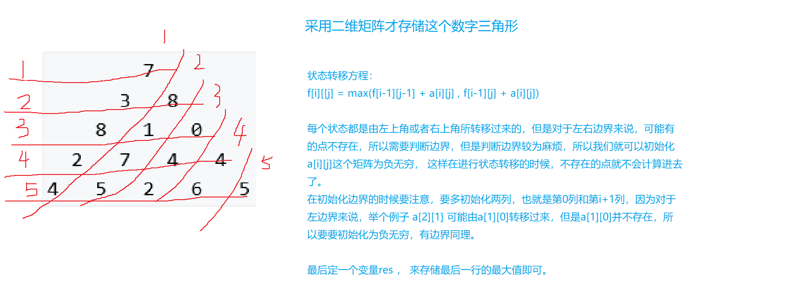
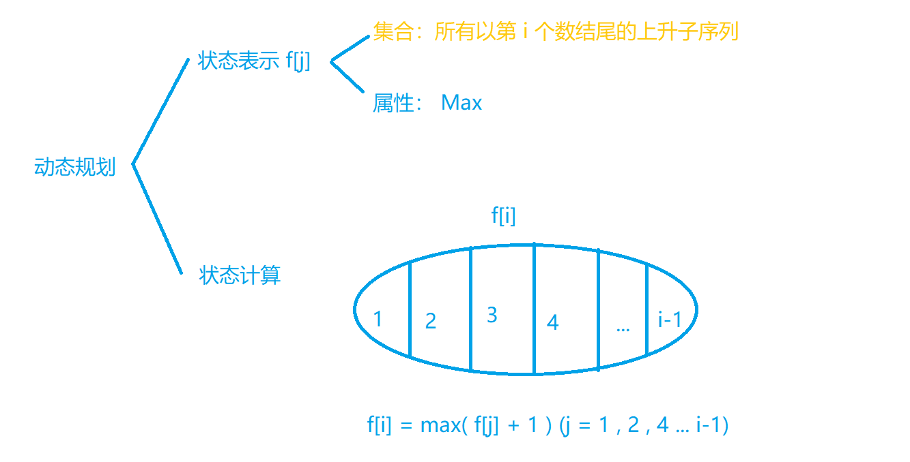
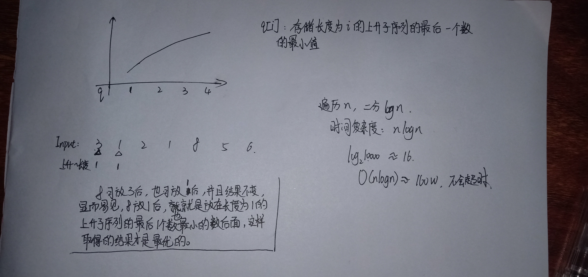
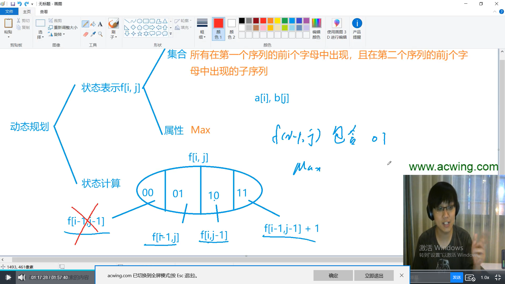
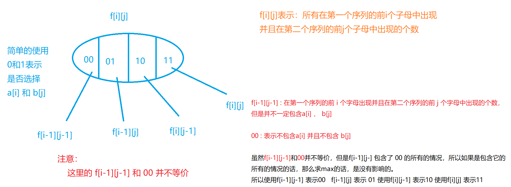
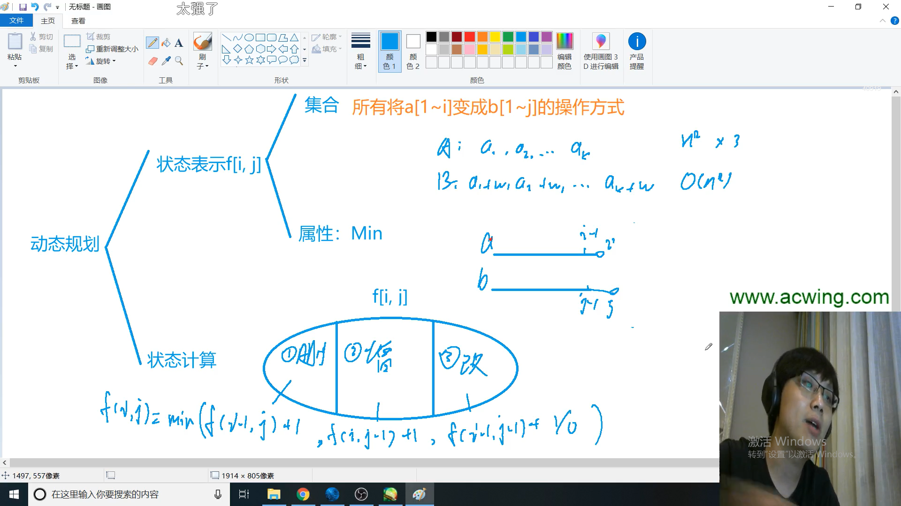
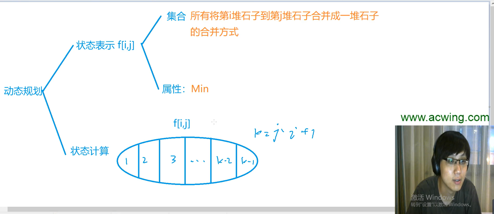
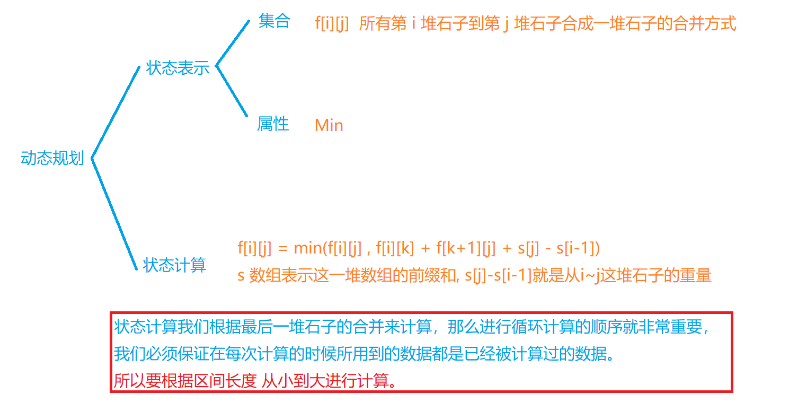

### 线性DP


#### 898. 数字三角形                 

给定一个如下图所示的数字三角形，从顶部出发，在每一结点可以选择移动至其左下方的结点或移动至其右下方的结点，一直走到底层，要求找出一条路径，使路径上的数字的和最大。

```
        7
      3   8
    8   1   0
  2   7   4   4
4   5   2   6   5

```

**输入格式**

第一行包含整数n，表示数字三角形的层数。

接下来n行，每行包含若干整数，其中第 i 行表示数字三角形第 i 层包含的整数。

**输出格式**

输出一个整数，表示最大的路径数字和。

**数据范围**

1≤n≤5001≤n≤500,
−10000≤三角形中的整数≤10000−10000≤三角形中的整数≤10000

**输入样例：**

```
5
7
3 8
8 1 0 
2 7 4 4
4 5 2 6 5

```

**输出样例：**

```
30
```


题解：




```c
#include <iostream>
#include <algorithm>

using namespace std;

const int N = 510 , INF = 1e9;
int n , m , a[N][N];
int f[N][N];
int main()
{
    cin >> n;
    for(int i = 1 ; i <= n ; i++)
        for(int j = 1 ; j <= i ; j++)
            scanf("%d" , &a[i][j]);
            
    // 为了可以不去处理边界问题,把f数组全部初始化为负无穷,那么如果计算不存在的点的话,因为他比较小
    // max就不会将不存在的点算入进去,这里初始化f数组的时候要多初始化一列,可以保证左右边界的点也被初始化
    for(int i = 1 ; i <= n + 1 ; i++)
        for(int j = 0 ; j <= i + 1 ; j++)
            f[i][j] = -INF;
            
    f[1][1] = a[1][1];
    for(int i = 2 ; i <= n ; i++)
        for(int j = 1; j <= i ; j++)
            f[i][j] = max(f[i-1][j-1] + a[i][j] , f[i-1][j] + a[i][j]);
    
    int res = -INF;
    for(int i = 1 ; i <= n ; i++) res = max(res , f[n][i]);
    cout << res << endl;
    return 0;
}
```


#### 895. 最长上升子序列            

给定一个长度为N的数列，求数值严格单调递增的子序列的长度最长是多少。

**输入格式**

第一行包含整数N。

第二行包含N个整数，表示完整序列。

**输出格式**

输出一个整数，表示最大长度。

**数据范围**

1≤N≤10001≤N≤1000，
−109≤数列中的数≤109−109≤数列中的数≤109

**输入样例：**

```
7
3 1 2 1 8 5 6

```

**输出样例：**

```
4
```


题解：




也就是每个`f[i] ` 都是由 `f[j]` 转移过来的，并且满足条件`a[i] > a[j]` 才可以进行转移。


```c
#include <iostream>

using namespace std;

const int N = 1010;
int n , a[N] , f[N];

int main()
{
    scanf("%d" , &n);
    for(int i = 1 ; i <= n ; i++) scanf("%d" , &a[i]);
    
    for(int i = 1 ; i <= n ; i++)
    {
        f[i] = 1; //以i结尾的最长上升子序列最少为1
        for(int j = 1 ; j < i ; j++)
            if(a[i] > a[j])
                f[i] = max(f[i] , f[j] + 1);
    }
    
    int res = 0;
    for(int i = 1 ; i <= n ; i++) res = max(res , f[i]);
    cout << res << endl;
    return 0;
}
```


> 题目还是上边的题目， 如果我们想要知道最大长度的上升子序列，那么我们该如何去求呢？

```c
#include <iostream>

using namespace std;

const int N = 1010;
// f[i]:记录以i结尾的上升子序列的个数  g[i]:记录f[i]是由谁转移给过来,用于打印转移路径
int n , a[N] , f[N] , g[N]; 

int main()
{
    cin >> n;
    for(int i = 1 ; i <= n ; i++) cin >> a[i];
    
    // 进行状态转移
    for(int i = 1 ; i <= n ; i++)
    {
        // 初始化每个f[i] 都是1,因为他自己就是一个长度为1的上升子序列
        f[i] = 1;
        for(int j = 1 ; j < i ; j++)
        {
            // 当a[i] > a[j] 的时候才可以进行状态转移
            if(a[i] > a[j])
            {
                // 由于我们要记录f[i]是由谁转移过来的,所以这里要加上一个判断条件
                if(f[i] < f[j] + 1)
                {
                    f[i] = f[j] + 1;
                    g[i] = j;
                }                
            }            
        }
    }
    
    int k = 1;
    // 找到f[i]最大的下标
    for(int i = 1 ; i <= n ; i++) 
        if(f[i] > f[k]) k = i;
        
    // 输出最大的上升子序列的长度
    cout << f[k] << endl;
    
    // 输出最大上升子序列
    for(int i = 0 , len = f[k] ; i < len ; i++)
    {
        cout << a[k] << ' ';
        k = g[k];
    }    
    return 0;
}
```


#### 896. 最长上升子序列 II            

给定一个长度为N的数列，求数值严格单调递增的子序列的长度最长是多少。

**输入格式**

第一行包含整数N。

第二行包含N个整数，表示完整序列。

**输出格式**

输出一个整数，表示最大长度。

**数据范围**

1≤N≤1000001≤N≤100000，
−109≤数列中的数≤109−109≤数列中的数≤109

**输入样例：**

```
7
3 1 2 1 8 5 6

```

**输出样例：**

```
4
```


题解：

这道题的数据范围有10w,如果像 895题一样的话，时间复杂度是O(n) 就会超时，所以需要进行优化。




打印出执行过程：

```c
#include <iostream>

using namespace std;

const int N = 100010;
int a[N] , q[N];
int n;

int main()
{
    cin >> n;
    for(int i = 0; i < n; i++) cin >> a[i];
    
    int len = 0;
    for(int i = 0; i < n; i++)
    {
        int l = 0 , r = len;
        while(l < r)
        {
            int mid = l + rx + 1 >> 1;
            if(q[mid] < a[i]) l = mid; // 找到小于a[i]的最大的数
            else r = mid - 1;
        }
        cout << "遍历到了：a[" << i << "] = " << a[i] << endl; 
        printf("此时小于a[i]的最大的数是: q[%d] = %d\n" , r , q[r]);
        q[r+1] = a[i];
        printf("此时q[%d] = %d\n" , r+1 , q[r+1]);
        len = max(len , r + 1);
        printf("此时len值为：%d\n" , len);
    }
    for(int i = 0; i < n; i++) cout << q[i] << ' ';
    cout << endl;
    cout << len << endl;
    
    return 0;
}
```


```c
#include <iostream>

using namespace std;

const int N = 1e5 + 10;

int n , a[N] , q[N];
// q[i] 表示长度为 i 的上升子序列的最后一个数的最小值

int main()
{
    cin >> n;
    for(int i = 0; i < n; i++) cin >> a[i];
    
    int len = 0;
    for(int i = 0; i < n; i++)
    {
        int l = 0 , r = len;
        // 二分查找
        // 在数组 q 中查找小于 a[i] 的最大的数
        while(l < r)
        {
            int mid = l + r + 1 >> 1;
            if(q[mid] < a[i]) l = mid;
            else r = mid - 1;
        }
        // 最后q[r] 就是小于a[i]的最大的数
        len = max(len , r + 1);
        // 将 a[i] 存储到q[r+1]的位置上,也就是存储到q的新位置上
        // 在q数组的 0 ~ r 的位置上查找小于a[i]的最大的数,最后将a[i]存储到q[r+1]
        q[r+1] = a[i];
    }
    
    cout << len << endl;
    
    return 0;
}
```


#### 897. 最长公共子序列                           

给定两个长度分别为N和M的字符串A和B，求既是A的子序列又是B的子序列的字符串长度最长是多少。

**输入格式**

第一行包含两个整数N和M。

第二行包含一个长度为N的字符串，表示字符串A。

第三行包含一个长度为M的字符串，表示字符串B。

字符串均由小写字母构成。

**输出格式**

输出一个整数，表示最大长度。

**数据范围**

1≤N,M≤10001≤N,M≤1000

**输入样例：**

```
4 5
acbd
abedc

```

**输出样例：**

```
3
```


题解：








```c
#include <iostream>

using namespace std;

const int N = 1010;
int n , m;
char a[N] , b[N];
int f[N][N];

int main()
{
    scanf("%d%d" , &n , &m);
    // 从下标为 1 开始读取
    scanf("%s%s" , a + 1 , b + 1);
    
    for(int i = 1 ; i <= n ; i++)
    {
        for(int j = 1 ; j <= m ; j++)
        {
            f[i][j] = max(f[i-1][j] , f[i][j-1]);
            // 必须要a[i] == b[j] 的时候,才可以有f[i][j]这种情况
            if(a[i] == b[j])
            {
                f[i][j] = max(f[i][j] , f[i-1][j-1] + 1);
            }
        }
    }
    cout << f[n][m] << endl;
    return 0;
}
```


#### 编辑最短距离




> 解题思路：
>
> 首先明确`f[i][j]`代表：a的前`i`个字符可以转化为b的前`i`个字符所需要转换的最小次数。
>
> 对于该问题，我们只需要考虑最后一步是由哪些步骤转化而来的：
>
> （1）删除
>
> 需要保证 a 的前`i`个字符和b的前`j-1`个字符匹配，转换式为：`f[i][j] = f[i][j-1] + 1`（加1代表的是进行了1次删除操作）
>
> （2）增加
>
> 需要保证 a 的前 `i-1` 个字符和b的前 `j` 个字符相等，转换式为：`f[i][j] = f[i-1][j] + 1`
>
> （3）修改
>
> 有两种情况：
>
> ​	1)   a的第`i`个字符 == b的第`j`个字符，那么转换式为：`f[i][j] = f[i-1][j-1]`
>
> ​	2） a的第`i`个字符 != b的第`j`个字符，那么转换式为：`f[i][j] = f[i-1][j-1] + 1`（加1代表对a的第`i`个字符进行了修改）


### 区间DP





#### 282. 石子合并                            

设有N堆石子排成一排，其编号为1，2，3，…，N。

每堆石子有一定的质量，可以用一个整数来描述，现在要将这N堆石子合并成为一堆。

每次只能合并相邻的两堆，合并的代价为这两堆石子的质量之和，合并后与这两堆石子相邻的石子将和新堆相邻，合并时由于选择的顺序不同，合并的总代价也不相同。

例如有4堆石子分别为 1  3  5  2， 我们可以先合并1、2堆，代价为4，得到4 5 2， 又合并 1，2堆，代价为9，得到9 2 ，再合并得到11，总代价为4+9+11=24；

如果第二步是先合并2，3堆，则代价为7，得到4 7，最后一次合并代价为11，总代价为4+7+11=22。

问题是：找出一种合理的方法，使总的代价最小，输出最小代价。

**输入格式**

第一行一个数N表示石子的堆数N。

第二行N个数，表示每堆石子的质量(均不超过1000)。

**输出格式**

输出一个整数，表示最小代价。

**数据范围**

1≤N≤3001≤N≤300

**输入样例：**

```
4
1 3 5 2

```

**输出样例：**

```
22
```


题解：




```c
#include <iostream>

using namespace std;

const int N = 310;
int n;
int s[N] , f[N][N];

int main()
{
    cin >> n;
    for(int i = 1 ; i <= n ; i++) cin >> s[i];
    
    for(int i = 1 ; i <= n ; i++) s[i] += s[i-1];
    
    for(int len = 2 ; len <= n ; len++)
    {
        for(int i = 1 ; i + len -1 <= n ; i++)
        {
            int l = i , r = i + len - 1;
            // 将f[l][r]初始化为很大的数,只能初始当前的f[l][r]
            // 不能在刚开始的时候就初始化所有的f数组
            // 否则f[l][k] f[k+1][r]有可能加起来非常大
            f[l][r] = 1e8;
            // 以k作为两堆的分界线,从l到r逐次分
            for(int k = l ; k <= r ; k++)
            {
                // 以k为分界线分开,l~k    +    k+1~r    +   r~l的石子重量
                f[l][r] = min(f[l][r] , f[l][k] + f[k+1][r] + s[r] - s[l-1]);
            }
        }
    }
    
    cout << f[1][n] << endl;
    
    return 0;
}
```


