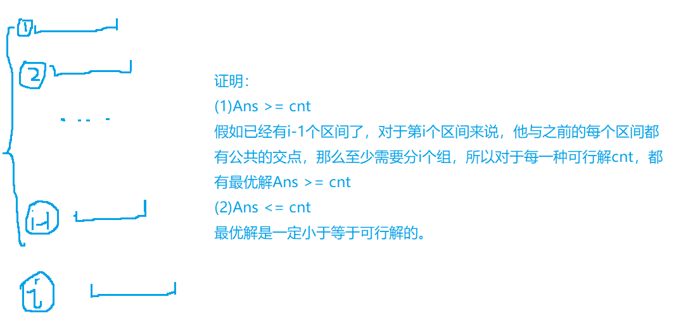
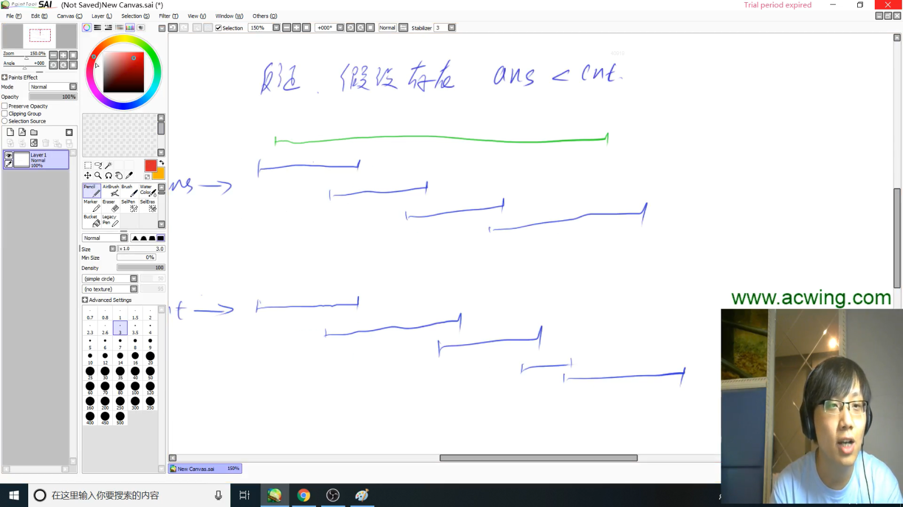

贪心需要用于单峰的，也就是只有一个最大值，如果是多峰的话，就没办法使用贪心。


贪心的难点在于如何去证明我们当前的这个做法是正确的。


### 905. 区间选点            

给定N个闭区间[ai,biai,bi]，请你在数轴上选择尽量少的点，使得每个区间内至少包含一个选出的点。

输出选择的点的最小数量。

位于区间端点上的点也算作区间内。

**输入格式**

第一行包含整数N，表示区间数。

接下来N行，每行包含两个整数ai,biai,bi，表示一个区间的两个端点。

**输出格式**

输出一个整数，表示所需的点的最小数量。

**数据范围**

1≤N≤1051≤N≤105,
−109≤ai≤bi≤109−109≤ai≤bi≤109

**输入样例：**

```
3
-1 1
2 4
3 5

```

**输出样例：**

```
2
```


```c
#include <iostream>
#include <algorithm>

using namespace std;

const int N = 100010;

int n;
struct Range
{
    int l , r;
    bool operator< (const Range &W)const
    {
        return r < W.r;
    }
}range[N];

int main()
{
    scanf("%d" , &n);
    for(int i = 0 ; i < n ; i++)
    {
        int l , r;
        scanf("%d%d" , &l , &r);
        range[i] = {l , r};
    }
    
    sort(range , range + n);
    
    int res = 0 , end = -2e9;
    for(int i = 0 ; i < n ; i++)
    {
        if(range[i].l > end)
        {
            res ++;
            end = range[i].r;
        }
    }
    
    printf("%d\n" , res);
    
    return 0;
}
```


**根据右端点排序的解法**

```
#include <iostream>
#include <algorithm>

using namespace std;

const int N = 100010;

int n;

struct Range
{
    int l , r;
    bool operator< (const Range &W)
    {
        return l < W.l;
    }
}range[N];

int main()
{
    cin >> n;
    for(int i = 0 ; i < n ; i++) scanf("%d%d" , &range[i].l , &range[i].r);
    
    sort(range , range + n);
    
    int res = 0 , ed = -2e9;
    for(int i = 0 ; i < n ; i++)
    {
        if(range[i].l > ed)
        {
            res ++;
            ed = range[i].r;
        }
    }
    cout << res << endl;
    
     for(int i = 0 ; i < n ; i++)
    {
        cout << i << " : " << range[i].l << ' ' << range[i].r << endl;
    }
    return 0;
}
```


**根据左端点排序的解法**


```c
#include <iostream>
#include <algorithm>

using namespace std;

const int N = 100010;

int n;

struct Range
{
    int l , r;
    bool operator< (const Range &W)
    {
      // 根据左端点排序
        return l < W.l;
    }
}range[N];

int main()
{
    cin >> n;
    for(int i = 0 ; i < n ; i++) scanf("%d%d" , &range[i].l , &range[i].r);
    
    sort(range , range + n);
    
    int res = 0 , ed = -2e9;
    for(int i = 0 ; i < n ; i++)
    {
        if(range[i].l > ed)
        {
            res ++;
            // 让 ed 为右端点
            ed = range[i].r;
        }else
        {
            // 遍历区间，ed必须等于该点上的右端点最小的区间
            ed = min(ed , range[i].r);
        }
    }
    cout << res << endl;
    
    return 0;
}
```


### 最大不相交区间数量


题解：


### 906. 区间分组                       

给定N个闭区间[ai,biai,bi]，请你将这些区间分成若干组，使得每组内部的区间两两之间（包括端点）没有交集，并使得组数尽可能小。

输出最小组数。

**输入格式**

第一行包含整数N，表示区间数。

接下来N行，每行包含两个整数ai,biai,bi，表示一个区间的两个端点。

**输出格式**

输出一个整数，表示最小组数。

**数据范围**

1≤N≤1051≤N≤105,
−109≤ai≤bi≤109−109≤ai≤bi≤109

**输入样例：**

```
3
-1 1
2 4
3 5

```

**输出样例：**

```
2
```


题解：





千祎的题解：


```c
#include <iostream>
#include <queue>
#include <algorithm>

using namespace std;

const int N = 100010;

struct Range
{
    int l , r;
    bool operator< (const Range &W) const 
    {
        return l < W.l;
    }
}range[N];

int main()
{
    int n;
    scanf("%d" , &n);
    for(int i = 0 ; i < n ; i++)
    {
        int l , r;
        scanf("%d%d" , &l , &r);
        range[i] = {l , r};
    }
    
    sort(range , range + n);

    // 定义小根堆
    priority_queue<int , vector<int> , greater<int>> heap;    
    for(int i = 0 ; i < n ; i++)
    {
        auto t = range[i];
        if(heap.empty() || heap.top() >= t.l) heap.push(t.r);
        else
        {
            heap.pop();
            heap.push(t.r);
        }
    }
    
    cout << heap.size() << endl;
    
    return 0;
}
```


### 907. 区间覆盖                    

给定N个闭区间[ai,biai,bi]以及一个线段区间[s,ts,t]，请你选择尽量少的区间，将指定线段区间完全覆盖。

输出最少区间数，如果无法完全覆盖则输出-1。

**输入格式**

第一行包含两个整数s和t，表示给定线段区间的两个端点。

第二行包含整数N，表示给定区间数。

接下来N行，每行包含两个整数ai,biai,bi，表示一个区间的两个端点。

**输出格式**

输出一个整数，表示所需最少区间数。

如果无解，则输出-1。

**数据范围**

1≤N≤1051≤N≤105,
−109≤ai≤bi≤109−109≤ai≤bi≤109,
−109≤s≤t≤109−109≤s≤t≤109

**输入样例：**

```
1 5
3
-1 3
2 4
3 5

```

**输出样例：**

```
2
```


题解：





任何一个最优解都可以转换为我们算法算出来的解。


```c
#include <iostream>
#include <algorithm>

using namespace std;

const int N = 100010;

struct Range
{
    int l , r;
    bool operator< (const Range &W) const
    {
        return l < W.l;
    }
}range[N];

int main()
{
    int st , ed;
    scanf("%d%d" , &st , &ed);
    
    int n;
    scanf("%d" , &n);
    
    for(int i = 0 ; i < n ; i++)
    {
        scanf("%d%d" , &range[i].l , &range[i].r);
    }
    
    sort(range , range + n);
    
    int res = 0;
    bool succ = false;
    for(int i = 0 ; i < n ; i++)
    {
        int r = -2e9 , j = i;
        // 找出l在st左边,并且右边长度最长的区间
        while(j < n && range[j].l <= st)
        {
            r = max(r , range[j].r);
            j++;
        }

        // 如果区间右端点小于st,说明两个区间有缝隙,没有结果
        if(r < st)
        {
            res = -1;
            break;
        }
        res ++;
        
        // 如果已经覆盖完整个区间,将succ置为true,break
        if(r >= ed)
        {
            succ = true;
            break;
        }
        
        i = j-1;
        // 将st置为当前区间的右端点
        st = r;
    }
    
    if(!succ) res = -1;
    cout << res << endl;
    
    return 0;
    
}
```


### 148. 合并果子                      

在一个果园里，达达已经将所有的果子打了下来，而且按果子的不同种类分成了不同的堆。

达达决定把所有的果子合成一堆。 

每一次合并，达达可以把两堆果子合并到一起，消耗的体力等于两堆果子的重量之和。

可以看出，所有的果子经过n-1次合并之后，就只剩下一堆了。

达达在合并果子时总共消耗的体力等于每次合并所耗体力之和。 

因为还要花大力气把这些果子搬回家，所以达达在合并果子时要尽可能地节省体力。

假定每个果子重量都为1，并且已知果子的种类数和每种果子的数目，你的任务是设计出合并的次序方案，使达达耗费的体力最少，并输出这个最小的体力耗费值。 

例如有3种果子，数目依次为1，2，9。

可以先将1、2堆合并，新堆数目为3，耗费体力为3。

接着，将新堆与原先的第三堆合并，又得到新的堆，数目为12，耗费体力为12。

所以达达总共耗费体力=3+12=15。

可以证明15为最小的体力耗费值。 

**输入格式**

输入包括两行，第一行是一个整数n，表示果子的种类数。

第二行包含n个整数，用空格分隔，第i个整数aiai是第i种果子的数目。 

**输出格式**

输出包括一行，这一行只包含一个整数，也就是最小的体力耗费值。

输入数据保证这个值小于231231。 

**数据范围**

1≤n≤100001≤n≤10000,
1≤ai≤200001≤ai≤20000

**输入样例：**

```
3 
1 2 9 

```

**输出样例：**

```
15
```


题解：


```c
#include <iostream>
#include <queue>
#include <algorithm>

using namespace std;

int main()
{
    int n;
    scanf("%d" , &n);
    // 使用小根堆
    priority_queue<int , vector<int> , greater<int>> heap;
    for(int i = 0 ; i < n ; i++)
    {
        int s;
        scanf("%d" , &s);
        heap.push(s);
    }
    int res = 0;
    while(heap.size() > 1)
    {
        // 取出最小的两个数相加
        int a = heap.top(); heap.pop();
        int b = heap.top(); heap.pop();
        res += a + b;
        heap.push(a+b);
    }
    
    cout << res << endl;
    
    return 0;
}
```


### 913. 排队打水                        

有 nn 个人排队到 1 个水龙头处打水，第 ii 个人装满水桶所需的时间是 titi，请问如何安排他们的打水顺序才能使所有人的等待时间之和最小？

**输入格式**

第一行包含整数 nn。

第二行包含 nn 个整数，其中第 ii 个整数表示第 ii 个人装满水桶所花费的时间 titi。

**输出格式**

输出一个整数，表示最小的等待时间之和。

**数据范围**

1≤n≤1051≤n≤105,
1≤ti≤1041≤ti≤104

**输入样例：**

```
7
3 6 1 4 2 5 7

```

**输出样例：**

```
56
```


 


```c
#include <iostream>
#include <algorithm>

using namespace std;
const int N = 100010;
typedef long long LL;
int t[N];
int n;

int main()
{
    cin >> n;
    for(int i = 0; i < n; i++) cin >> t[i];
    
    sort(t , t + n);

    // 1 ~ 100000 相加,那么最大的等待时间就是 500000,再乘上 t[i] 也就是10000那么最大就是50亿
    // int 最大也就20亿,所以会爆int ,要使用long long
    LL res = 0;
    for(int i = 0; i < n; i++) 
    {
        res += t[i] * (n - i - 1);
    }
    
    cout << res << endl;
    
    return 0;
}
```


### 125. 耍杂技的牛            

农民约翰的N头奶牛（编号为1..N）计划逃跑并加入马戏团，为此它们决定练习表演杂技。

奶牛们不是非常有创意，只提出了一个杂技表演：

叠罗汉，表演时，奶牛们站在彼此的身上，形成一个高高的垂直堆叠。

奶牛们正在试图找到自己在这个堆叠中应该所处的位置顺序。

这N头奶牛中的每一头都有着自己的重量WiWi以及自己的强壮程度SiSi。

一头牛支撑不住的可能性取决于它头上所有牛的总重量（不包括它自己）减去它的身体强壮程度的值，现在称该数值为风险值，风险值越大，这只牛撑不住的可能性越高。

您的任务是确定奶牛的排序，使得所有奶牛的风险值中的最大值尽可能的小。

**输入格式**

第一行输入整数N，表示奶牛数量。

接下来N行，每行输入两个整数，表示牛的重量和强壮程度，第i行表示第i头牛的重量WiWi以及它的强壮程度SiSi。

**输出格式**

输出一个整数，表示最大风险值的最小可能值。

**数据范围**

1≤N≤500001≤N≤50000,
1≤Wi≤10,0001≤Wi≤10,000,
1≤Si≤1,000,000,0001≤Si≤1,000,000,000

**输入样例：**

```
3
10 3
2 5
3 3

```

**输出样例：**

```
2
```


