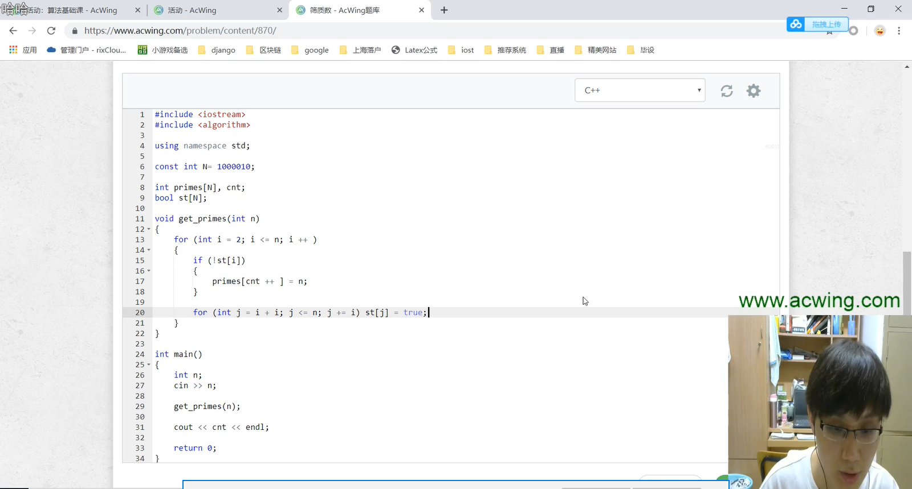
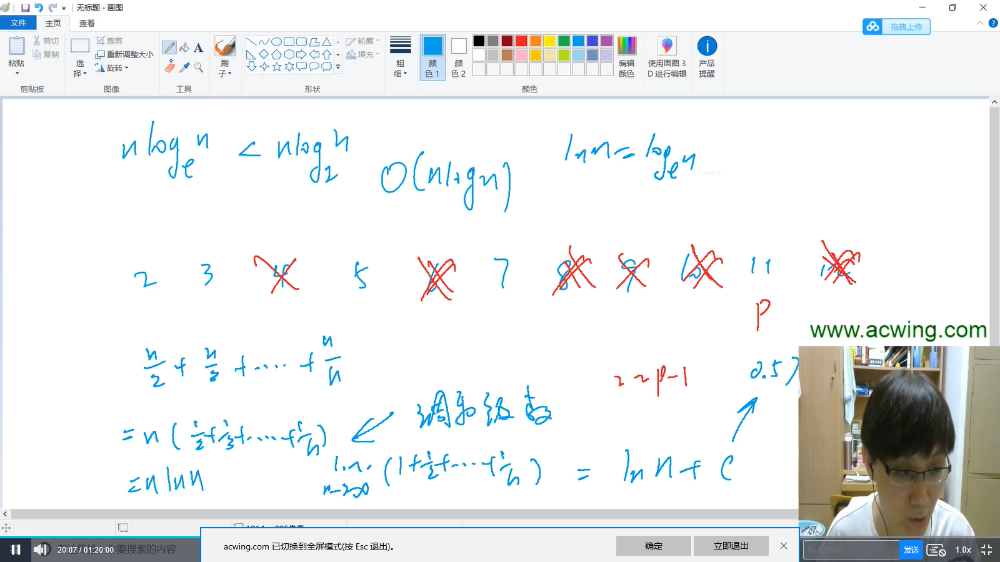
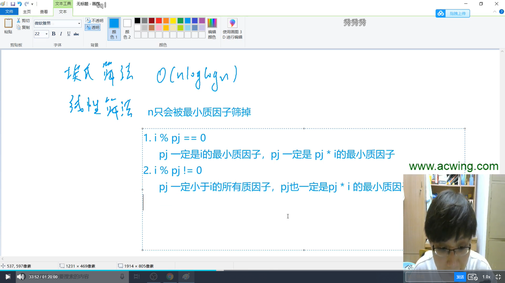

### 1、数论

#### 1.1 质数的判定

在大于1的整数中，如果只包含1和该数本身这两个约束，则该数未质数，或者叫素数。

（1）质数的判定——试除法（时间复杂度：`O(sqrt(N))`）

```c
#include <iostream>

using namespace std;

bool is_prime(int n){
    if(n < 2) return false;
    
    // 这里的判断条件只能写为 i <= n/i
    // 写为 i <= sqrt(n) 的话,sqrt是很慢的,所以不这么写
    // 写为 i * i <= n 的话, i * i 是有可能会溢出,所以不这么写
    for(int i = 2; i <= n/i; i++)
        if(n % i == 0)
            return false;
    return true;
}

int main()
{
    int n;
    cin >> n;
    while(n--)
    {
        int a;
        cin >> a;
        if(is_prime(a)) cout << "Yes" << endl;
        else cout << "No" << endl;
    }
    
    return 0;
}
```


#### 1.2分解质因数

（1）分解质因数——试除法

##### 867. 分解质因数                       

给定n个正整数aiai，将每个数分解质因数，并按照质因数从小到大的顺序输出每个质因数的底数和指数。

**输入格式**

第一行包含整数n。

接下来n行，每行包含一个正整数aiai。

**输出格式**

对于每个正整数aiai,按照从小到大的顺序输出其分解质因数后，每个质因数的底数和指数，每个底数和指数占一行。

每个正整数的质因数全部输出完毕后，输出一个空行。

**数据范围**

1≤n≤1001≤n≤100,
1≤ai≤2∗1091≤ai≤2∗109

**输入样例：**

```
2
6
8

```

**输出样例：**

```
2 1
3 1

2 3

```


> 为什么在divide函数中的if条件中，当 `x%i == 0`的时候，`i`就一定是质数呢？
>
> 当循环进行到 `i`的时候，从 `2~i-1` 之间一定没有`x`的质因数，`x=i*i`，所以在`2~i-1`之间也一定没有i的质因数，所以`i`一定是质数。


```c
#include <iostream>

using namespace std;

void divide(int x){
    
    // 只遍历到 sqrt(x) , 因为在 sqrt(x) ~ x之间只会有一个质因子.
    // 可以使用反证法证明:  假如在 sqrt(x) ~ x之间有一个质因子t ,t*t > x所以不可能有两个.
    for(int i = 2; i <= x/i; i++)
        // 这里i一定是质数,详情看题解
        if(x % i == 0)
        {
            // s记录指数
            int s = 0;
            while(x % i == 0)
            {
                x /= i;
                s++;
            }
            printf("%d %d\n" , i , s);
        }
    
    // 在这里,如果x不为1的话,x就是最后一个质因数
    if(x > 1) printf("%d %d\n" , x , 1);
    printf("\n");
}

int main()
{
    int n;
    cin >> n;
    while(n--)
    {
        int x;
        cin >> x;
        divide(x);
    }
    return 0;
}
```


#### 1.3筛质数



 


##### 868. 筛质数                    

给定一个正整数n，请你求出1~n中质数的个数。

**输入格式**

共一行，包含整数n。

**输出格式**

共一行，包含一个整数，表示1~n中质数的个数。

**数据范围**

1≤n≤1061≤n≤106

**输入样例：**

```
8

```

**输出样例：**

```
4
```


- 朴素筛法 （时间复杂度 O(n loglogn)）

> 思路：对于给定数n，遍历 2 ~ n ， 删除 i 的所有的倍数，那么剩余的都是质数。

```c
#include <iostream>

using namespace std;

const int N = 1e6 + 10;
int primes[N] , cnt;
bool st[N];

void get_primes(int x){
    for(int i = 2; i <= x; i++)
    {
        if(!st[i])
        {
            primes[cnt++] = i;
            // 这里只对质数的倍数进行删除，因为和数的倍数都是质数的倍数。
            for(int j = i + i; j <= x; j += i)
                st[j] = true;
        }
    }
    cout << cnt << endl;
}

int main(){
    int x;
    scanf("%d" , &x);
    get_primes(x);
    return 0;
}
```





- 线性筛法（时间复杂度：O（N））

> 思路是： n只会被最小质因子筛掉，只会被筛一次，所以时间复杂度是O（N）

```c
#include <iostream>

using namespace std;

const int N = 1e6 + 10;
int cnt , primes[N];
bool st[N];

void get_primes(int n){
    for(int i = 2; i <= n; i++)
    {
        if(!st[i]) primes[cnt++] = i;
        // for循环条件: primes[j] * i <= n 防止最小质因子超过n
        for(int j = 0; primes[j] <= n/i; j++)
        {
            /*
            i % primes[j] == 0  因为i是从小到大遍历,所以p[j]一定是i的最小质因子,p[j]一定是p[j]*i的最小质因子
            i % primes[j] == 0  因为i是从小到大遍历,所以p[j]一定小于i的所有质因子,所以p[j]一定是p[j]*i的最小质因子
            */
            st[primes[j] * i] = true;
            if(i % primes[j] == 0) break;
        }
    }
}

int main()
{
    int n;
    cin >> n;
    get_primes(n);
    cout << cnt << endl;
    
    return 0;
}
```


### 2、组合计数


### 3、高斯消元


### 4、简单博弈论