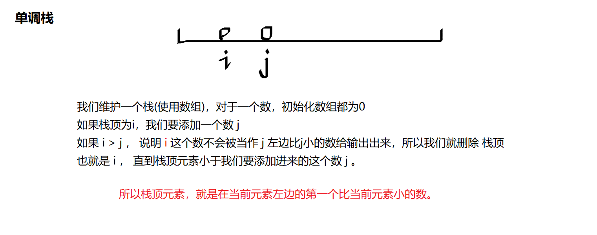

链表的实现在 **面试** 的时候，常常使用类来去实现，但是在 **笔试** 中，数据量非常大，如果用类去实现的话，需要去new出很多节点，会超时，所以这里会说明如何使用数组来去实现链表。


单链表：邻接表（存储树、图）

双链表：


我们先来看一下如何使用数组来实现栈

使用  tt  来记录栈顶的位置，使用数组stk记录。

### 828. 模拟栈                     

实现一个栈，栈初始为空，支持四种操作：

(1) “push x” – 向栈顶插入一个数x； 

(2) “pop” – 从栈顶弹出一个数； 

(3) “empty” – 判断栈是否为空； 

(4) “query” – 查询栈顶元素。

现在要对栈进行M个操作，其中的每个操作3和操作4都要输出相应的结果。

**输入格式**

第一行包含整数M，表示操作次数。

接下来M行，每行包含一个操作命令，操作命令为”push x”，”pop”，”empty”，”query”中的一种。

**输出格式**

对于每个”empty”和”query”操作都要输出一个查询结果，每个结果占一行。

其中，”empty”操作的查询结果为“YES”或“NO”，”query”操作的查询结果为一个整数，表示栈顶元素的值。

**数据范围**

1≤M≤1000001≤M≤100000,
1≤x≤1091≤x≤109
所有操作保证合法。

**输入样例：**

```
10
push 5
query
push 6
pop
query
pop
empty
push 4
query
empty

```

**输出样例：**

```
5
5
YES
4
NO
```


```java
import java.util.*;
public class Main{
    public static final int N = 100010;
    public static int[] stk = new int[N];
    public static int tt = 0;
    public static void push(int x){
        stk[tt++] = x;
    }
    public static int query(){
        return stk[tt - 1];
    }
    public static void pop(){
        --tt;
    }
    public static boolean empty(){
        return tt > 0;
    }
    public static void main(String[] args){
        Scanner sc = new Scanner(System.in);
        int n = sc.nextInt();
        sc.nextLine();
        while(n-- > 0)
        {
            String[] str = sc.nextLine().split(" ");
            if(str[0].equals("push"))
            {
                int x = Integer.parseInt(str[1]);
                push(x);
            }else if(str[0].equals("pop"))
            {
                pop();
            }else if(str[0].equals("query"))
            {
                System.out.println(query());
            }else if(str[0].equals("empty"))
            {
                if(empty()) System.out.println("NO");
                else System.out.println("YES");
            }
        }
    }
}
```


接下来看一下如何使用数组来模拟队列

### 829. 模拟队列                        

实现一个队列，队列初始为空，支持四种操作：

(1) “push x” – 向队尾插入一个数x； 

(2) “pop” – 从队头弹出一个数； 

(3) “empty” – 判断队列是否为空； 

(4) “query” – 查询队头元素。

现在要对队列进行M个操作，其中的每个操作3和操作4都要输出相应的结果。

**输入格式**

第一行包含整数M，表示操作次数。

接下来M行，每行包含一个操作命令，操作命令为”push x”，”pop”，”empty”，”query”中的一种。

**输出格式**

对于每个”empty”和”query”操作都要输出一个查询结果，每个结果占一行。

其中，”empty”操作的查询结果为“YES”或“NO”，”query”操作的查询结果为一个整数，表示队头元素的值。

**数据范围**

1≤M≤1000001≤M≤100000,
1≤x≤1091≤x≤109,
所有操作保证合法。

**输入样例：**

```
10
push 6
empty
query
pop
empty
push 3
push 4
pop
query
push 6

```

**输出样例：**

```
NO
6
YES
4
```


定义 hh  和  tt  来表示队列头和尾 （h:head  t:tail）

在队头删除 队尾插入

```java
import java.util.*;
public class Main{
    public static final int N = 100010;
    public static int[] q = new int[N];
    public static int hh = 0; // 队列头
    public static int tt = -1; // 队列尾
    public static void push(int x){
        q[++tt] = x;
    }
    public static void pop(){
        hh++;
    }
    public static boolean empty(){
        return tt < hh;
    }
    public static int query(){
        return q[hh];
    }
    public static void main(String[] args){
        Scanner sc = new Scanner(System.in);
        int n = sc.nextInt();
        sc.nextLine();
        while(n-- > 0)
        {
            String[] str = sc.nextLine().split(" ");
            if(str[0].equals("push")) push(Integer.parseInt(str[1]));
            else if(str[0].equals("pop")) pop();
            else if(str[0].equals("query")) System.out.println(query());
            else if(str[0].equals("empty")) System.out.println(empty() ? "YES":"NO");
        }
    }
}
```


### 830. 单调栈               

给定一个长度为N的整数数列，输出每个数左边第一个比它小的数，如果不存在则输出-1。

**输入格式**

第一行包含整数N，表示数列长度。

第二行包含N个整数，表示整数数列。

**输出格式**

共一行，包含N个整数，其中第i个数表示第i个数的左边第一个比它小的数，如果不存在则输出-1。

**数据范围**

1≤N≤1051≤N≤105
1≤数列中元素≤1091≤数列中元素≤109

**输入样例：**

```
5
3 4 2 7 5

```

**输出样例：**

```
-1 3 -1 2 2
```




```java

```


### 827. 双链表                        

实现一个双链表，双链表初始为空，支持5种操作：

(1) 在最左侧插入一个数；

(2) 在最右侧插入一个数；

(3) 将第k个插入的数删除；

(4) 在第k个插入的数左侧插入一个数；

(5) 在第k个插入的数右侧插入一个数

现在要对该链表进行M次操作，进行完所有操作后，从左到右输出整个链表。

**注意**:题目中第k个插入的数并不是指当前链表的第k个数。例如操作过程中一共插入了n个数，则按照插入的时间顺序，这n个数依次为：第1个插入的数，第2个插入的数，…第n个插入的数。

**输入格式**

第一行包含整数M，表示操作次数。

接下来M行，每行包含一个操作命令，操作命令可能为以下几种：

(1) “L x”，表示在链表的最左端插入数x。

(2) “R x”，表示在链表的最右端插入数x。

(3) “D k”，表示将第k个插入的数删除。

(4) “IL k x”，表示在第k个插入的数左侧插入一个数。

(5) “IR k x”，表示在第k个插入的数右侧插入一个数。

**输出格式**

共一行，将整个链表从左到右输出。

**数据范围**

1≤M≤1000001≤M≤100000
所有操作保证合法。

**输入样例：**

```
10
R 7
D 1
L 3
IL 2 10
D 3
IL 2 7
L 8
R 9
IL 4 7
IR 2 2

```

**输出样例：**

```
8 7 7 3 2 9
```


这里注意我们的idx是从2开始，所以对于接收的下标，要加上1.


```java
import java.util.*;
public class Main{
    public static final int N = 100010;
    public static int[] l = new int[N];
    public static int[] r = new int[N];
    public static int[] e = new int[N];
    public static int idx;
    
    public static void init(){
        r[0] = 1;
        l[1] = 0;
        idx = 2;
    }
    
    // 在第k个数的右端点插入
    public static void add(int k, int x){
        e[idx] = x;
        l[idx] = k;
        r[idx] = r[k];
        l[r[k]] = idx;
        r[k] = idx;
        idx ++;
    }
    
    public static void remove(int k){
        r[l[k]] = r[k];
        l[r[k]] = l[k];
    }
    
    public static void main(String[] args){
        Scanner sc = new Scanner(System.in);
        int m = sc.nextInt();
        sc.nextLine();
        init();
        while(m-- > 0)
        {
            String[] str = sc.nextLine().split(" ");
            // 在左端点插入
            if(str[0].equals("L"))
            {
                int x = Integer.parseInt(str[1]);
                add(0, x);
            }else if(str[0].equals("R"))
            {
                // 在右端点插入
                int x = Integer.parseInt(str[1]);
                add(l[1], x);
            }else if(str[0].equals("D"))
            {
                // 将第k个插入的数删除
                int k = Integer.parseInt(str[1]);
                remove(k+1);
            }else if(str[0].equals("IL"))
            {
                // 表示在第k个插入的数左侧插入一个数
                int k = Integer.parseInt(str[1]);
                int x = Integer.parseInt(str[2]);
                add(l[k+1], x);
            }else
            {
                // 表示在第k个插入的数右侧插入一个数
                int k = Integer.parseInt(str[1]);
                int x = Integer.parseInt(str[2]);
                add(k+1,x);
            }
        }
        for(int i=0;r[i]!=1;i=r[i]) 
            System.out.print(e[r[i]]+" ");
    }
}
```

