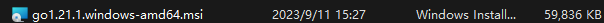
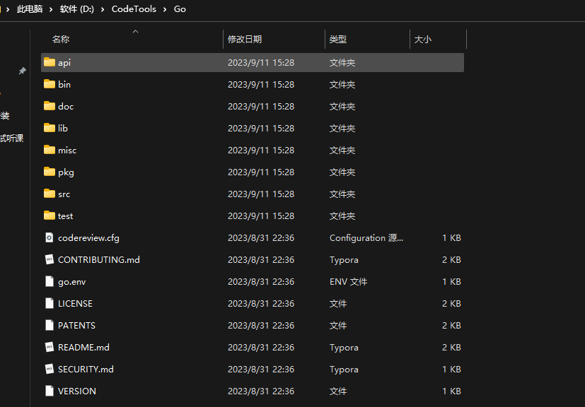
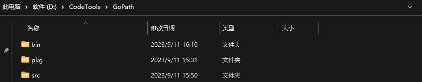
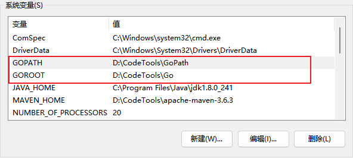
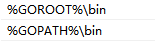

# 1、Beego 框架


## 安装


### 下载安装Bee

https://blog.csdn.net/zhoupenghui168/article/details/131446012

如果go的版本大于go1.16,在命令行执行如下命令:
`go install github.com/beego/bee/v2@latest` 
如果go的版本是小于go1.16，使用如下命令安装:"
`go get -u github.com/beego/bee/v2` 


### 创建项目

`bee new pro01`


### 管理项目依赖

`go mod tidy`


### 运行项目

`bee run`


# 2、Go安装

在https://golang.google.cn/dl/下载，并且进行安装




下载之后配置环境变量，我本地安装到 D:/CodeTools/Go 目录下，如下：



再新创建一个文件夹 GoPath，并且在里边创建3个目录，bin、pkg、src，如下：




对应环境变量如下：




在 Path 环境变量中添加下边两条：




设置 go 环境，打开命令行执行下面两条命令

```bash
go env -w GOPROXY=https://goproxy.cn,direct
go env -w GO111MODULE=on
```


