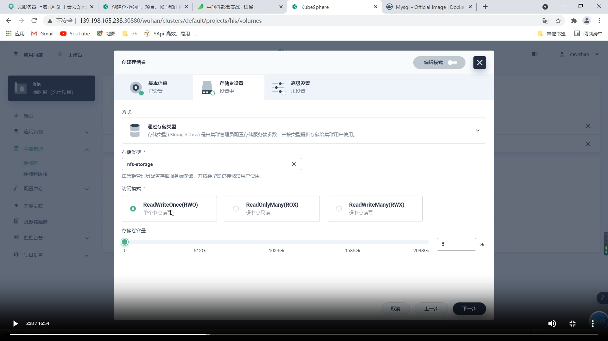
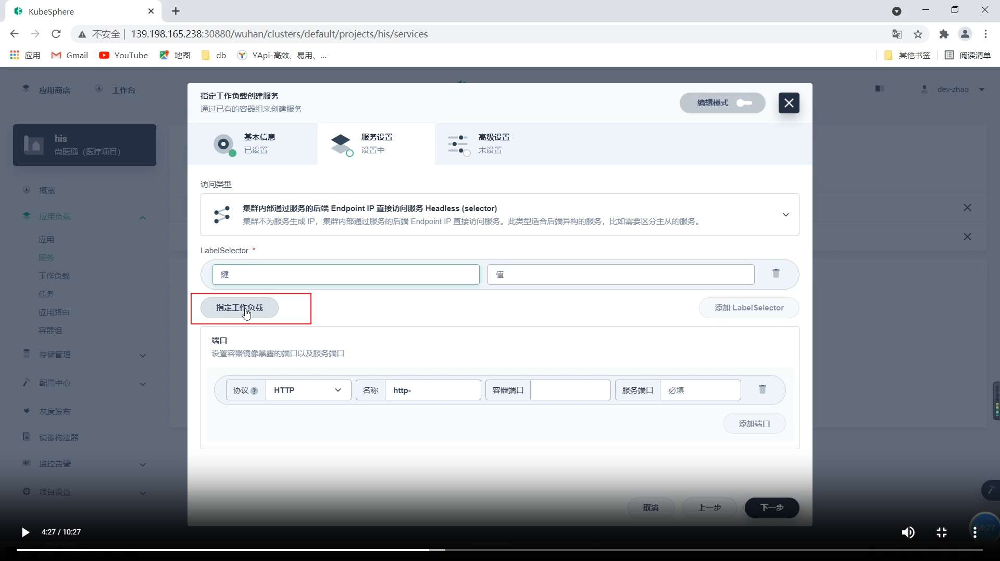
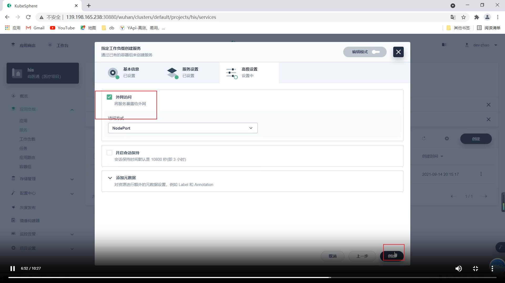
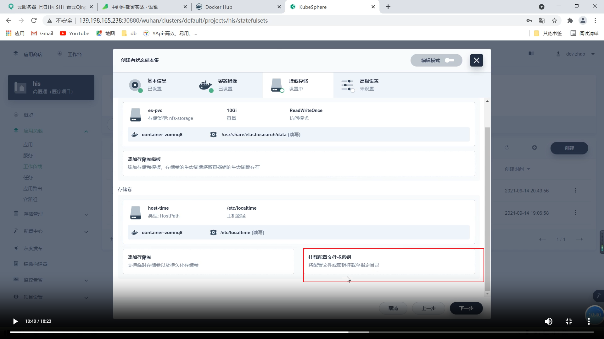
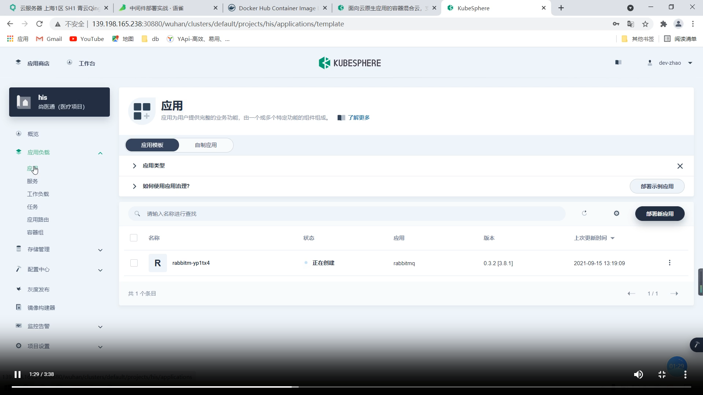
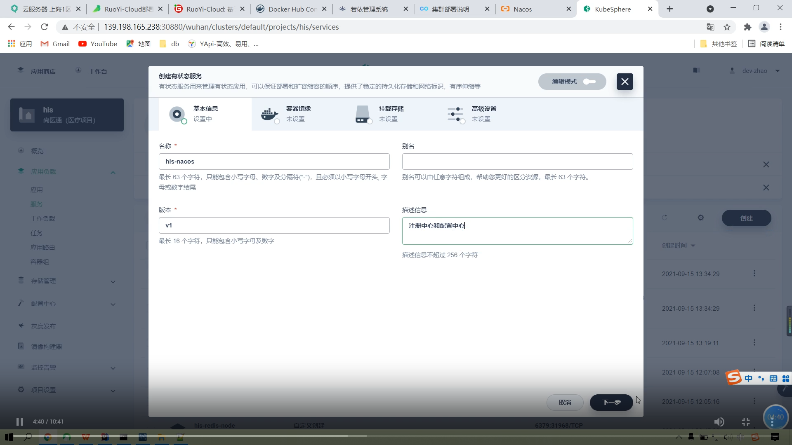

听课记录：

- 2023-10-12：Kubernetes 核心实战-网络模型总结

# Kubernetes基础

> 私有网络 VPC 实战

每个服务器都有两个 IP 地址：公网 ip、内网 ip

搭建服务器集群，集群之间使用内网 ip 进行通信，一是不需要走公网流量，不花钱；二是比走公网更快

VPC：专有网络

k8s 希望通过域名来区分访问的服务，当访问域名 `order.atguigu.com` 时，会访问 `service a` 下的三个 pod，当访问域名 `user.atguigu.com` 时，会访问 `service b` 下的三个pod。

k8s 的存储卷挂载，通过 nfs 进行挂载，启动一个 nfs-server，让所有 pod 需要挂载的数据都存储在 nfs-server 中。

- `ConfigMap` 可以给 pod 挂在上配置文件

- `Secrets` 可以挂载上密钥信息，例如去 dockerhub 拉取镜像，我们就可以在这里配置上用户名和密码

- `Ingress` 流量入口，可以根据域名进行负载均衡、限流等操作
- `PVM` 挂载存储声明，当挂载存储卷时，提交一个 PVM，会自动给 Pod 分一个对应大小的存储卷

# 	Kubesphere

开放服务器端口： `30000 - 32767`，因为 nodeport 暴露端口在这个范围内

## 应用部署

应用都部署在工作负载中，工作负载中又分为三个部分：部署、有状态副本集、守护进程集

- 微服务可以部署在 `工作负载(部署)` 中进行部署
- 中间件（MySQL、Redis）可以部署在 `有状态副本集` 中，这样在中间件挂掉之后，重启在另一个pod启动，数据还会存在
- 日志收集器可以部署在 `守护进程集` 中

### MySQL部署

#### 创建配置

先创建 MySQL 配置

在 mysql 的 conf.d 目录下，所有 .cnf 结尾的文件都会被 MySQL 当作配置文件

那么我们直接将 key 作为文件名，将 value 作为文件的内容

#### 创建 PVC（卷挂载）

对于 mysql 的挂载，可以参考 docker 的启动命令，来创建对应的存储卷和配置集

#### 部署 MySQL 服务

创建有状态副本集

对于 MySQL 的资源可以不进行预留，但是可以做一下限制，如果对每个 pod 都预留资源可能导致系统资源不足

部署之后，在集群内部都可以根据域名访问到这个 mysql 服务

可以通过 `mysql -uroot -h域名 -p` 来测试

这个域名是他默认给的，只能在集群内部访问，我们可以把默认的给删除掉，重新创建一个集群外也可以访问的。

`删除时，不要把有状态副本集也给删除掉` 

##### 1、创建内网可以访问的工作负载

##### 2、创建外网可以访问的工作负载

可以使用 `集群ip:port` 来进行访问 

在生产环境中，可以把外网访问的负载均衡给删除掉，只能集群内布的应用可以访问到，这样可以保证 mysql 的安全性。

### 部署Redis服务

#### docker启动redis命令

根据启动命令中的挂在数据目录来指定存储卷

部署 redis 还有一点不一样，因为redis需要特殊的启动命令`redis-server /etc/redis/redis.conf`

#### 创建redis配置

#### 创建redis

这里之前没创建过存储卷，因此创建一个新的

配置文件之前创建过了，这里直接挂载

启动redis之后，会默认创建一个redis服务，只有集群内部能够访问

我们直接删除默认的，自己新创建一个

#### 创建redis负载（集群内访问）

#### 创建redis负载（集群外访问）

**后续强制在启动容器时，都新创建一个新的存储卷，不提前创建存储卷，否则多个容器都会去连接同一个存储卷**

### 部署ES服务

#### docker运行es

对于es来说，在 `/usr/share/elasticsearch/config` 目录下有很多文件，但是我们需要挂载的只有两个文件`elasticsearch.yml、jvm.options`

那么如果我们直接挂载 config 目录的话，该目录下的所有文件都要被覆盖掉，那么我们就可以先将这两个文件的配置做出来

#### 创建配置

key是文件名，value是内容

#### 创建es

es数据挂载

配置文件挂载

之前说了，我们只需要挂载这两个配置文件，而且挂载时，不能让其他文件消失，因此这里路径我们要指定子路径`/usr/share/elasticsearch/config.elasticsearch.yml`

并且还要添加子路径为`elasticsearch.yml`

并且要选择特定的键和路径

下边挂载jvm.options文件

 

#### 创建服务

先删除默认负载服务

#### 创建服务（集群外访问）

集群外只暴露9200端口

## 应用商店

### 应用商店部署rabbitmq

应用商店中有一些常见的应用的部署

之后在应用中可以进行查看

设置外网访问

## 应用仓库

应用商店中应用较少，如果需要部署大量应用，需要去应用仓库中

helm 是 k8s 的一个包管理工具

### 使用应用仓库

#### 添加仓库地址

需要使用有企业空间管理权限的用户，为企业空间添加应用仓库

#### 使用应用仓库部署应用

可以在工作负载中查看

## 项目部署实战-ruoyi微服务

### 项目上云注意事项：

- 中间件（数据挂载、配置）
- 制作镜像（中间件有现成的镜像，而我们的应用需要自己制作镜像）
- 网络（访问地址）
- 配置（生产配置分离，本地调试使用外网地址，上云之后使用内网地址，内网速度更快，安全性也高）

### 中间件部署

之前已经部署过mysql、redis

#### nacos部署测试

直接从服务中来创建有状态服务

**nacos的固定访问域名为：`his-nacos.his`**

那么随便进入一个nacos 的 pod 控制台，`ping his-nacos.his`，可以发现nacos集群内部每个nacos的域名都是固定的

因此在nacos集群的配置文件中，我们不填写nacos每个节点的ip，而填写域名，因为如果pod挂了，ip可能会改变，但是域名固定

#### nacos部署上云

##### 配置文件

需要挂载两个配置文件`application.properties、cluster.conf.example`

`cluster.conf` 文件内容

##### 创建nacos

**以子路径方式挂载两个配置文件**

##### 创建一个集群外访问负载均衡

**在nacos配置文件`application.properties`中，也要将mysql的ip给设置为云上的域名**

**重启nacos：先将副本数量降成0，再添加成3个副本**

在若依中，每一个微服务模块端口都是8080，并不会端口冲突，因为在k8s上，每一个微服务都是一个pod，防止启动多个微服务，需要记住多个端口，增加复杂性

在dockerfile中，不管项目中配置文件中端口是多少，在启动容器时，端口优先级是最高的，因此在 dockerfile 中指定 8080 端口

在开发环境中激活的是dev，而我们在dockerfile指定激活prod环境，如果激活dev，nacos会去寻找ruoyi-auth-dev.yaml的配置文件，如果激活prod，nacos会去寻找ruoyi-auth-prod.yaml的配置文件

因此我们要在nacos中创建生产环境的命名空间，并且将开发环境的配置文件给复制一份

