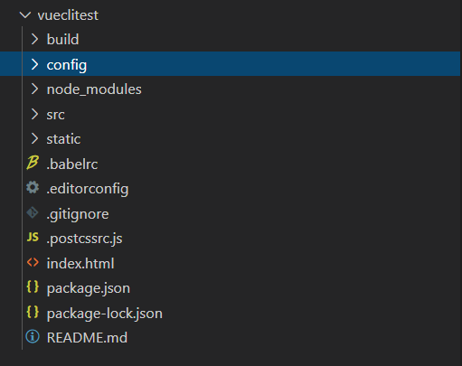
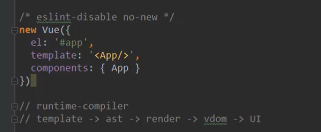
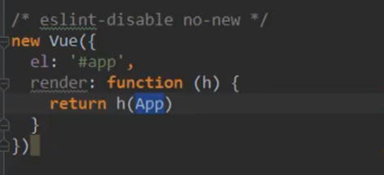
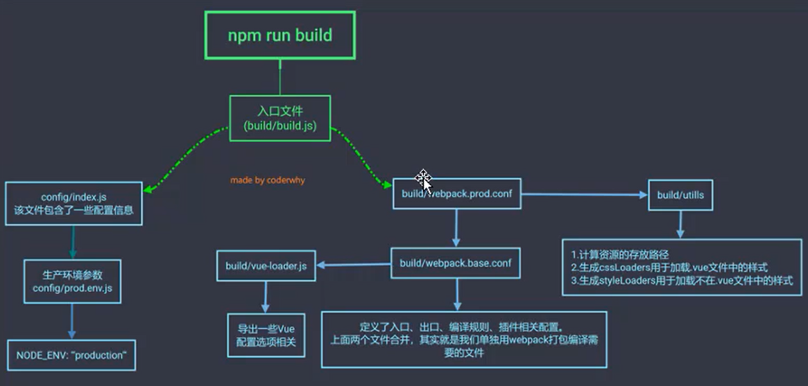
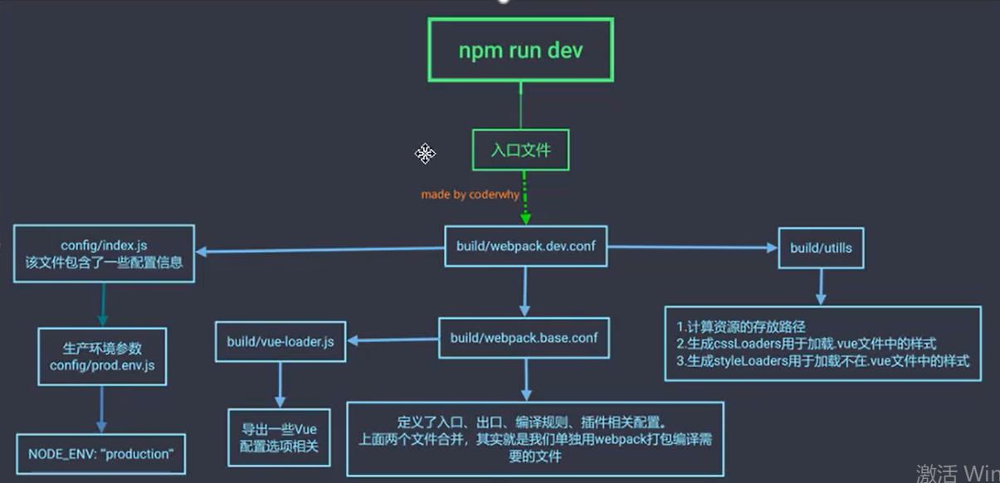

# 1、Vue CLI介绍

- 如果你在开发大型项目，就必然使用到Vue CLI
  - 使用Vue.js开发大型应用时，我们需要考虑代码目录结构、项目结构和部署、热加载、代码单元测试等事情。
  - 如果每个项目都要手动完成这些工作，那无疑效率比较低，所以通常我们会使用一些脚手架工具来帮忙完成这些事情。
- CLI是什么意思？
  - CLI是Command-Line Interface，翻译为命令行界面，但是俗称==脚手架==
  - Vue CLI是一个官方发布的vue.js项目脚手架
  - 使用vue-cli可以快速搭建Vue开发环境以及对应的webpack配置

# 2、Vue CLI使用前提 -Node

- 安装NodeJS

  - 官网直接下载安装
  - 网址： http://nodejs.cn/download/

- 检测安装的版本

  - 默认情况下自动安装Node和Npm

  - Node环境要求8.9以上

    命令行 node -v

- 什么是Npm呢？

  - npm的全程是Node Package Manager
  - 是一个NodeJS包管理和分发工具，已经成为了非官方的发布Node模块（包）的标准
  - 后续会经常使用Npm来安装一些开发过程中依赖包


> 如果npm安装过慢的话

- 使用cnpm安装

  - 由于国内直接使用npm的官方镜像是非常慢的，这里推荐淘宝的npm镜像

  - 你可以使用淘宝定制的 cnpm（gzip压缩支持）命令行工具代替默认的npm：

    `npm install -g cnpm --registry=https://registry.npm.taobao.org`

  - 这样就可以使用cnpm命令来安装模块了

    `cnpm intall [name]`


# 3、Vue CLI使用前提 -Webpack

- Vue.js官方脚手架工具就使用了webpack模板

  - 对所有的资源会压缩等优化操作
  - 它在开发过程中提供了一套完整的功能，能够使得我们开发过程中变得高效

- Webpack的全局安装

  `npm install webpack -g`

# 4、Vue CLI的使用

### 1、安装脚手架2和脚手架3

- 安装Vue脚手架3(-g 全局安装) global

  如果失败的话，用管理员身份打开命令行试一下。

  `npm install -g @vue/cli`

- vue --version查看版本


- 后边还需要用到脚手架2，所以再拉取VueCli脚手架2

  `npm install @vue/cli-init -g`


### 2、Vue CLI2初始化项目

`vue init webpack my-project`

因为需要翻墙，所以可能初始化项目失败，需要下载webpack，到用户目录下的.vue-templates中，再执行命令进行离线下载：`vue init webpack my-project --offline`

--offline表示离线下载

具体参考博客：https://blog.csdn.net/feinifi/article/details/104578546

project name: 回车

project description :回车

author：回车

vue build：选择第一个回车 （runtime+compiler）

install vue-router：n  （不安装路由）

use ESlint： n  (eslint是编码规范，不使用)

set up unit test: n (不用单元测试)

setup e2e test: n (e2e是端到端测试)

最后一个选择npm来管理。

### 3、Vue CLI3初始化项目

`vue create my-project`


# 5、Vue CLI2初始化项目过程


初始化项目参考上方。

### Vue CLI2目录结构解析

目录如下：




### package.json文件解析

```json
{
  "name": "vueclitest",
  "version": "1.0.0",
  "description": "A Vue.js project",
  "author": "zqy <1020325258@qq.com>",
  "private": true,
  "scripts": {
    "dev": "webpack-dev-server --inline --progress --config build/webpack.dev.conf.js",
    "start": "npm run dev",
    "build": "node build/build.js"
  },
  "dependencies": {
    "vue": "^2.5.2"
  },
  "devDependencies": {
    "autoprefixer": "^7.1.2",
    "babel-core": "^6.22.1",
    "babel-helper-vue-jsx-merge-props": "^2.0.3",
    "babel-loader": "^7.1.1",
    "babel-plugin-syntax-jsx": "^6.18.0",
    "babel-plugin-transform-runtime": "^6.22.0",
    "babel-plugin-transform-vue-jsx": "^3.5.0",
    "babel-preset-env": "^1.3.2",
    "babel-preset-stage-2": "^6.22.0",
    "chalk": "^2.0.1",
    "copy-webpack-plugin": "^4.0.1",
    "css-loader": "^0.28.0",
    "extract-text-webpack-plugin": "^3.0.0",
    "file-loader": "^1.1.4",
    "friendly-errors-webpack-plugin": "^1.6.1",
    "html-webpack-plugin": "^2.30.1",
    "node-notifier": "^5.1.2",
    "optimize-css-assets-webpack-plugin": "^3.2.0",
    "ora": "^1.2.0",
    "portfinder": "^1.0.13",
    "postcss-import": "^11.0.0",
    "postcss-loader": "^2.0.8",
    "postcss-url": "^7.2.1",
    "rimraf": "^2.6.0",
    "semver": "^5.3.0",
    "shelljs": "^0.7.6",
    "uglifyjs-webpack-plugin": "^1.1.1",
    "url-loader": "^0.5.8",
    "vue-loader": "^13.3.0",
    "vue-style-loader": "^3.0.1",
    "vue-template-compiler": "^2.5.2",
    "webpack": "^3.6.0",
    "webpack-bundle-analyzer": "^2.9.0",
    "webpack-dev-server": "^2.9.1",
    "webpack-merge": "^4.1.0"
  },
  "engines": {
    "node": ">= 6.0.0",
    "npm": ">= 3.0.0"
  },
  "browserslist": [
    "> 1%",
    "last 2 versions",
    "not ie <= 8"
  ]
}
```

#### 1、scripts: build:

`"build": "node build/build.js"`

node提供了js的运行环境，通过node命令可以直接执行js文件。

所以node build.js的意思是运行build.js文件

### .editorconfig

写了一些编码的规范，utf-8，tab缩进个数等等。

insert_final_newline = true：在文件最后插入新的一行

trim_trailing_whitespace = true：清除代码后边多余的空格

### .gitignore

向服务器上传文件时，需要忽略的文件

```
.DS_Store
node_modules/
/dist/
npm-debug.log*
yarn-debug.log*
yarn-error.log*

# Editor directories and files
.idea
.vscode
*.suo
*.ntvs*
*.njsproj
*.sln

```


### package.json

在package.json文件中的版本号前边有一个符号：`^`

'~'（波浪符号）:他会更新到当前minor version（也就是中间的那位数字）中最新的版本。放到我们的例子中就是："exif-js": "~2.3.0"，这个库会去匹配更新到2.3.x的最新版本，如果出了一个新的版本为2.4.0，则不会自动升级。波浪符号是曾经npm安装时候的默认符号，现在已经变为了插入符号。

'^'（插入符号）: 这个符号就显得非常的灵活了，他将会把当前库的版本更新到当前major version（也就是第一位数字）中最新的版本。放到我们的例子中就是："vue": "^2.2.2", 这个库会去匹配2.x.x中最新的版本，但是他不会自动更新到3.0.0。


### package-lock.json

上边的package.json文件指定了大概需要安装的版本，但是并不具体，所以package-lock.json文件就映射了node_modules文件中安装的具体的版本。

# 6、ESLint编码规范

如果我们在项目中安装了ESLint编码规范，但是又不想使用了，想要关闭它，在哪里关闭呢？

在config/index.js中找到userEslint，把后边的true改为false即可。


# 7、runtime-compiler和runtime-only


> vue程序运行过程

template --->(解析为)  ast（abstract syntax tree抽象语法树）  ---> 编译为 render函数 --->vdom(virtual dom虚拟dom) --->UI(真实dom)


在使用脚手架创建项目时需要选择runtime-compiler和runtime-only，那么他们两个有什么区别呢？

区别只有在main.js文件中有/

runtime-compiler的main.js文件

（有template）

vue程序运行：template->ast->render->vdom->UI




runtime-only的main.js文件

（直接就是render函数）

vue程序运行：render->vdom->UI 




下来说一下区别：

- runtime-only直接从render到虚拟dom到ui，所以**性能更高**。
- runtime-only的代码量更少
- runtime-only中的template被`vue-template-compiler（开发时依赖）`解析为render函数。


### 执行npm run build



### 执行npm run dev



# 8、Vue CLI3

- vue-cli 3 和 2版本有很大区别
  - vue-cli3 是基于 webpack4 打造，vue-cli2 还是webpack3
  - vue-cli3 的设计原则是“0配置”，移除的配置文件根目录下的build和config目录
  - vue-cli3 提供了 vue ui 命令，提供了可视化配置，更加人性化
  - 移除了static文件夹，新增了public文件夹，并且index.html已到了public文件夹中


### 1、创建cli3的项目

`vue create [projectname]`

下边选择配置

- default(默认)/Manually(手动)？选择Manually

(会看到许多配置，按空格可以选择或者取消)

选择Babel和Vuex

- where placing config 在哪里放配置文件 

dedicated config files(独立的配置文件)/package.json? 选择单独的配置文件

- save this as a preset for future projcets?  y

写名字，选择npm（这个选项的意思是，下次创建项目的时候，在第一步的时候，可以选择我们这个项目的配置作为默认配置）

想要删除的话在用户目录中找到.vuerc删除里边的配置


.browserslistrc文件解析：

```
> 1% //浏览器在市场份额大于1%，也就是小于1%的不进行适配
last 2 versions //对最后两个版本适配
not dead 
```

.gitignore文件解析：

指明哪些文件不需要使用git提交

.package-lock.json:
真实安装的版本


main.js文件解析：

```javascript
import Vue from 'vue'
import App from './App.vue'
import store from './store'

Vue.config.productionTip = false //产品的提示信息

/*
	$mount('#app'):挂载id为app的标签
	render函数： h=>h(App)相当于
    render: function(h){
      return h(App)
    }
*/

new Vue({
  store,
  render: h => h(App)
}).$mount('#app')

```

### 2、Vue CLI3配置文件的查看和修改


#### 1、UI方面的配置

启动配置服务器： vue ui

配置文件都隐藏在了node_modules/@vue里边


# 9、补充：箭头函数

箭头函数和this指向

定义函数的方式：

```javascript
方式一：
const a = function(){}
方式二：
const obj = {
  b(){
    
  }
}
方式三： ES6中的箭头函数
const c = (参数列表) => {
  
}
const sum = (num1,num2) => {
  return num1 + num2
}
如果代码块中只有一行代码
const mul = (num1,num2) => num1 * num2
```


### 箭头函数中的this的使用

在将箭头函数作为参数传递的时候使用的较多。

问题：箭头函数中的this是如何查找的了？

答案：向外层作用域中，一层层向外查找this，直到有this的定义

```javascript
const obj = {
  aaa(){
    setTimeout(function(){
      console.log(this);//打印的window
    })
    //箭头函数向外查找的时候在这里找了this，所以this在箭头函数中是obj对象
    setTimeout(() => {
      console.log(this);//打印的aaa()，也就是obj对象
    })
  }
}
```

