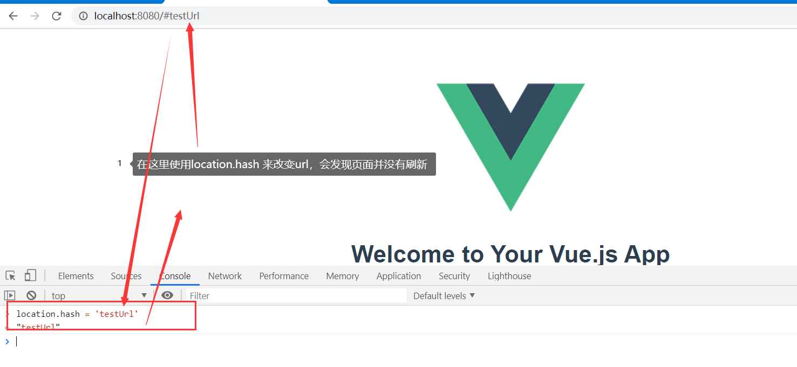
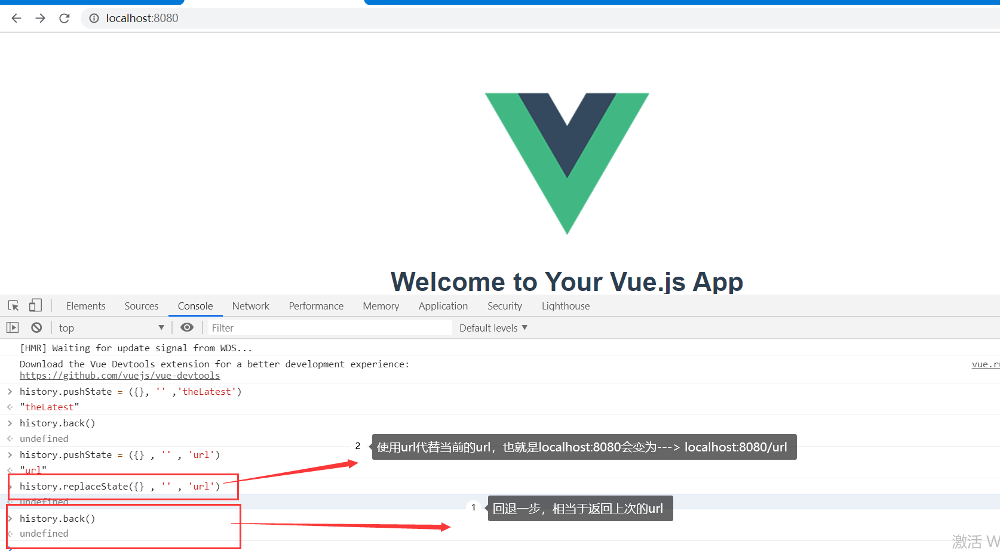
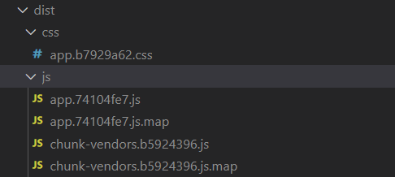

# 1、url的hash和html的history

在页面中改变url会导致刷新，如果想要改变url并且页面不刷新，就用到了url的hash和html的history

`改变location.hash 可以改变url并不会刷新页面`




history.replaceState()和history.pushState()和history.back()方法

pushState和back相当于对一个栈结构进行操作。

而replaceState是直接对当前url进行替换

replaceState()不能back




history.go()和history.forward()和history.back()

history.back()等价于history.go(-1)

history.forward()等价于history.go(1)

这三个接口相当于浏览器界面的前进和后退


# 2、vue-router安装和配置


### 搭建vue-router的步骤：


步骤一：安装vue-router

`npm install vue-router --save`

步骤二：在模块化工程使用它（因为是一个插件，所以要通过Vue.use()来安装路由功能）

第一步：导入路由对象，并且调用 Vue.use(VueRouter)

第二步：创建路由实例，并且传入路由映射配置

第三步：在Vue实例中挂载创建的路由实例

vue-router的配置在：`src/router/index.js`中

`index.js`

```javascript
// src/router/index.js文件
import VueRouter from 'vue-router'
import Vue from 'vue'

//1、Vue.use()安装插件功能
Vue.use(VueRouter)

//2、创建VueRouter对象
const routes = [
  
]
const router = new VueRouter({
  // 配置路由和组件的应用关系
  routes
})
//3、将router对象传入到Vue实例
export default router
```

`main.js`

```javascript
import Vue from 'vue'
import App from './App.vue'
import store from './store'
//如果router是文件夹，会自动到router文件夹中找index.js文件，所以后边的index.js可以省略
import router from './router' 

Vue.config.productionTip = false

new Vue({
  store,
  router, //将router添加到vue实例
  render: h => h(App)
}).$mount('#app')

```

至此，路由框架已经搭建完毕！

### 使用vue-router的步骤：

第一步：创建路由组件

在`src/components`目录下创建两个组件，Home.vue和About.vue

Home.vue

```vue
<template>
  <div >
    <h2>我是首页</h2>
    <p>我是内容，哈哈哈</p>
  </div>
</template>

<script>
export default {
  name: 'Home',
  data() { 
    return {
    }
  }
 }
</script>
<style lang="" scoped>
</style>
```

About.vue

```vue
<template>
  <div class="">
    <h2>我是关于</h2>
    <p>我是关于的内容，哈哈哈</p>
  </div>
</template>

<script>
export default {
  name: 'About',
  data() { 
    return {

    }
  }
 }
</script>
<style lang="" scoped>
</style>
```


第二步：配置路由映射：组件和路径映射关系

在`src/router/index.js`中，配置路由映射

```javascript
// src/router/index.js文件
import VueRouter from 'vue-router'
import Vue from 'vue'
import Home from '../components/Home'
import About from '../components/About'

//1、Vue.use()安装插件功能
Vue.use(VueRouter)

//2、创建VueRouter对象
// 在这里配置路由映射，一个映射就是一个对象
const routes = [
  {
    path: '/home',
    component: Home
  },
  {
    path: '/about',
    component: About
  }
]
const router = new VueRouter({
  // 配置路由和组件的应用关系
  routes
})
//3、将router对象传入到Vue实例
export default router
```


第三步：使用路由：通过`<router-link>和<router-view>`

`<router-link to="">`：该标签是一个vue-router中已经内置的插件，它会被渲染成一个`<a>`标签

`<router-view>`：该标签会根据当前的路径，动态渲染出不同的组件，在路由切换时，切换的是`<router-view>`挂载的组件，其他内容不会发生改变

修改App.vue文件

```vue
<template>
  <div id="app">
    <router-link to="/home">首页</router-link>
    <router-link to="/about">关于我</router-link>
    <router-view/>
  </div>
</template>

<script>

export default {
  name: 'App',
  components: {
  }
}
</script>

<style>

</style>

```


# 3、路由的默认值

### 路由的默认路径跳转

在进入首页的话，需要直接跳转到我们的首页，所以需要配置路由的默认路径

- 如何可以让路径默认跳转到`首页`，并且`<router-view>`渲染首页组件呢？

  - 非常简单，我们只需要多配置一个映射就可以了

    在`src/router/index.js`中

    ```javascript
    const routes = [
      {
        path: '/',
        redirect: '/home'
      }
    ]
    ```

- 配置解析：

  - 我们在routes中又配置了一个映射
  - path配置的是根路径： /
  - redirect是重定向，也就是我们将路径重定向到/home的路径下，这样就可以得到我们想要的结果了


### 修改hash模式到history模式

上边修改的路径一直修改的是hash值

**默认就是hash模式，而不是history模式**

也就是说`localhost:8080/#/home`，路径后边会有一个#号，不太好看

我们想使用HTML的history： `localhost:8080/home`不带#号

怎么来修改呢？？？

在`src/router/index.js`文件中，定义路由的时候，添加一个属性mode即可

```javascript
const router = new VueRouter({
  // 配置路由和组件的应用关系
  routes,
  mode: 'history' //添加mode属性为history
})
```


### router-link标签其他属性补充

- 在前面指是使用到了一个属性:`to`，用于指定跳转的路径

- `<router-link>`还有其他一些属性：

  - tag: tag可以指定`<router-link>`之后渲染成什么组件，默认是渲染为a标签，下边代码中，`<router-link>`会被渲染为button组件

    ```javascript
    <router-link to="/home" tag="button"></router-link>
    ```

  - replace: replace不会留下history记录，所以指定replace的情况下，后退键不能返回到上一个页面

    ```javascript
    <router-link to="/home" replace></router-link>
    ```

  - active-calss:当`<router-link>`对应的路由匹配成功时，会给当前元素设置一个`router-link-active`的class，设置active-class可以修改默认的名称

    什么时候可以用到active-class呢？需求：点击链接的时候，需要链接的样式有所改变，就可以直接修改router-link-active样式

    ```javascript
    <style>
      .router-link-active{
        color: #f00
      }
    </style>
    ```


# 4、通过代码进行路由跳转

**通过`$router`可以进行路由跳转**

`$router.push`和`$router.replace`的区别：

push的话，在浏览器上点击回退键可以返回上一个页面

replace的话，不会

```html
<button @click="homeClick">首页</button>
<button @click="aboutClick">关于我</button>
<router-view/>

//通过$router可以进行路由跳转
methods: {
  homeClick(){
    // this.$router.push("/home")
    this.$router.replace("/home")
  },
  aboutClick(){
    // this.$router.push("/about")
    this.$router.replace("/about")
  }
}
```


# 5、vue-router动态路由的使用


### `$router和$route的区别`

`$router`拿到的是`src/router/index.js`文件中创建的全局的router的对象

`$route`拿到的是路径被激活的路由的对象。


### 动态路由的使用：

需求：

需要路由跳转带上参数（userId），并且在跳转后的组件中可以接收到参数。

步骤一：编写路由的跳转

修改App.vue

```vue
<template>
  <div id="app">
    // 这里使用v-bind来在to属性中动态获取变量(userId)，字符串用单引号引起来
    <router-link :to="'/user/'+userId">用户</router-link>
    <router-view />
  </div>
</template>

<script>
export default {
  name: "App",
  components: {},
  data() {
    return {
      userId: "zhangsan"
    };
  }
};
</script>
<style>
</style>
```

步骤二：编写路由跳转的映射

更改`src/router/index.js`文件，增加一个路由映射

```javascript
// src/router/index.js文件
import VueRouter from 'vue-router'
import Vue from 'vue'
import User from '../components/User'

//1、Vue.use()安装插件功能
Vue.use(VueRouter)

//2、创建VueRouter对象
const routes = [
  {
    //参数使用:连接
    path: '/user/:userId',
    component: User
  }
]
const router = new VueRouter({
  // 配置路由和组件的应用关系
  routes,
  mode: 'history' //定义路由跳转为history模式而不是hash模式，也就是url中没有#号
})
//3、将router对象传入到Vue实例
export default router
```

步骤三：编写需要跳转的组件

编写组件User.vue

```vue
<template>
  <div class="">
    <h2>我是用户{{userId}}</h2>
    <p>我是用户{{userId}}的内容，哈哈哈哈哈</p>
  </div>
</template>

<script>
export default {
  name: 'User',
  data() { 
    return {
      //在组件中，通过$route拿到当前路由对象，取出参数
      //参数名对应的是index.js文件中对应的path后边的后缀名
      userId: this.$route.params.userId
    }
  }
 }
</script>
```


# 6、vue-router打包文件的解析




打包后的dist目录如上图所示：

- css文件

  css文件是项目要用到的css文件,当你做webpack打包的时候，会把所有的css样式打包到这里

-  js文件夹

  `app.js`放的是项目中各个页面的逻辑代码，将格式进行了压缩。

  ​

  `chunk-vendors.js`:放的是通过import包导入的第三方依赖包。防止该文件体积过大，可以使用webpack的externals配置。凡是声明在externals中的第三方依赖包，都不会被打包。同时需要在index.html文件的头部，添加CDN资源引用。

  ​

  `.js.map`依然是一个Source map文件，Source map就是一个信息文件，里面储存着位置信息，转换后的代码的每一个位置，所对应的转换前的位置。 项目打包后，代码都是经过压缩加密的，如果运行时报错，输出的错误信息无法准确得知是哪里的代码报错。有了map就可以像未加密的代码一样，准确的输出是哪一行哪一列有错，方便我们开发的时候做调试使用。


# 7、路由的懒加载

- 当打包构建应用时，Javascript包会变得非常大，影响页面的加载速度
- 如果我们能把不同路由对应的组件分割成不同的代码块，然后当路由被访问的时候才加载对应组件，这样就更加高效了。


> 路由懒加载做了什么？

路由懒加载主要的作用就是将路由对应的组件打包成一个个的js代码块

只有在这个路由被访问到的时候，才加载对应的组件

```html
/************路由懒加载之前**************/
const routes = [
  {
     path: '/home',
     component: () => import('../components/Home')
  },
  {
     path: '/about',
     component: () => import('../components/About')
  }
]


/************路由懒加载之前**************/
```

懒加载方式：

- 方式一：（最早期，又臭又长的代码）现在已经不用

  ​

  ```javascript
  const Home = resolve => {
    require.ensure(['../components/Home'],()=>{
      resolve(require('../components/Home.vue'))
    })
  }
  ```

- 方式二：AMD写法(若依前后端分离项目用到)

  ```html
  const About = resolve => require(['../components/About.vue'],resolve)
  ```

- 方式三：在ES6中，我们可以又更加简单的写法来组织Vue异步组件和Webpack的代码分割

  ```html
  const Home = () => import('../components/Home')
  ```

  ​

  # 8、路由的嵌套使用

- 嵌套路由是一个很常见的功能

  - 比如在home页面中，我们希望通过`/home/news`和`/home/message`访问一些内容
  - 一个路径映射一个组件，访问这两个路径也会分别渲染两个组件

> 实现嵌套路由有两个步骤

- 创建对应的子组件，并且在路由映射中配置对应的路由
- 在组件内部使用`<router-view>`标签


需求：在home组件中添加两个嵌套组件news和message

步骤一：编写两个组件

HomeNews.vue

```html
<template>
  <div class="">
    <ul>
      <li>新闻1</li>
      <li>新闻2</li>
      <li>新闻3</li>
      <li>新闻4</li>
    </ul>
  </div>
</template>
<script>
export default {
  name: 'HomeNews'
 }
</script>
```

HomeMessage.vue

```html
<template>
  <div class="">
    <ul>
      <li>消息1</li>
      <li>消息2</li>
      <li>消息3</li>
      <li>消息4</li>
    </ul>
  </div>
</template>
<script>
export default {
  name: 'HomeMessage'
 }
</script>
```

步骤二：编写Home.vue

```html
<template>
  <div >
    <h2>我是首页</h2>
    <p>我是内容，哈哈哈</p>
    <router-link to="/home/news">新闻</router-link>
    <router-link to="/home/message">消息</router-link>
    <router-view></router-view>
  </div>
</template>

<script>
export default {
  name: 'Home'
 }
</script>
```

步骤三：编写`src/router/index.js`文件

```javascript
// src/router/index.js文件
import VueRouter from 'vue-router'
import Vue from 'vue'

//1、Vue.use()安装插件功能
Vue.use(VueRouter)
 
//使用到了组件的懒加载
const Home = () => import("../components/Home")
const News = () => import("../components/HomeNews")
const Message = () => import("../components/HomeMessage")
//2、创建VueRouter对象
const routes = [
  {
    path: '',//默认跳转/home组件
    redirect: '/home'
  },
  {
    path: '/home',
    component: Home,
    children: [
      {
        path: '',
        redirect: 'news'//默认跳转到新闻，子组件路径前不需要加 /
      },
      {
        path: 'news',
        component: News
      },
      {
        path: 'message',
        component: Message
      }
    ]
  }
]
const router = new VueRouter({
  // 配置路由和组件的应用关系
  routes,
  mode: 'history'
})
//3、将router对象传入到Vue实例
export default router
```


# 8、vue-router参数传递

- 传递参数主要有两种类型：params和query

- ### params的类型

  - 配置路由格式： /router/:id
  - 传递的方式：在path后面跟上对应的值
  - 传递后形成的路径：/router/123，/router/abc

  使用`$route.params.abc`来取出params的参数

- ### query的类型：(url后边就是query)

  - 配置路由格式：/router，也就是普通配置
  - 传递的方式：对象中使用query的key作为传递的方式
  - 传递后形成的路径：/router?id=123，/router?id=abc

  `url: 协议名://服务器:端口号/路径?查询（query）`

  `url: http://localhost:8080/home?id=3&name=zhangsan`

  query的使用：(使用query对象来传递query类型的参数)

  ```vue
  //App.vue
  <router-link :to="{path:'/profile',query: {name: 'zhangsan',height: '1.88'}}">档案</router-link>
  ```

  点击路由跳转后的url变为了：`<http://localhost:8080/profile?name=zhangsan&height=1.88>`

  可以使用`$route`来取出传递的参数

  ```
  {{$route.query}}
  {{$route.query.name}}
  {{$route.query.height}}
  ```


- 还可以通过方法来传递参数：（**在方法中使用$router来传递**）

  ```html
  userClick(){
    //这里的$router是全局的router对象
    this.$router.push('/user/'+this.userId)
  },
  profileClick(){
    //这里push进去一个对象，对象包含path和query，query中写传递的参数
    this.$router.push({
      path: '/profile',
      query: {
        name: 'zhangsan',
        height: '1.88'
      }
    })
  }
  ```
  # 


# 9、`$router和$route`

`$router`：拿到的是全局的路由对象，不管在任何地方拿到的`$router`都是一样的

`$route`：拿到的是当前被激活的路由的对象

为什么在每个组件中都可以拿到`$router`和`$route`呢？

**因为所有的组件都继承自Vue类的原型**

怎么来理解上边这句话，我们可以在main.js文件中写入下边的代码：

```javascript
//在vue的原型中加入test方法
Vue.prototype.test = function(){
  console.log("test")
}

//在所有的组件中都可以使用this.test()
this.test()//即可调用vue的原型的test方法
```


### Object.defineProperty()方法

这个方法是vue响应式的核心，可以用于对一个对象进行赋值

在vue的源码有多次使用

```html
const obj = {
  name: 'why'
}
Object.defineProperty(obj,age,18)//给obj对象添加一个age属性，值为18
```


# 10、vue-router全局导航守卫


router.beforeEach((to,from,next) => {next()})：这个函数是前置守卫（跳转路由器前回调）

router.afterEach((to,from) => {})：这个函数是后置钩子，路由跳转后回调。

beforeEach需要主动调用next()函数

后置钩子也就是afterEach，不需要主动调用next()函数。


三个生命周期函数：

- created(){} 在组件创建之后回调
- mounter(){}在组件挂载到DOM上之后回调
- updated(){}在组件发生更新的时候回调

需求：当切换组件的时候，同时需要去切换网页的标题（title）

使用created()生命周期函数即可

```html
created(){
  document.title = '指定的标题'
}
```

但是如果像上边这样做的话，需要在每个组件中都加入一个created方法，很麻烦。

所以，需要使用全局导航守卫

步骤一：

在index.js文件中调用router对象的beforeEach方法，参数（to,from,next）

从from路由跳转到to路由，取出来to的meta对象中的title赋值给标题。

`to就是将要跳转到的路由的对象`

```javascript
// src/router/index.js文件
router.beforeEach((to, from, next) => {
  // 从from跳转到to ，to就是跳转的路由对象
  // to.meta.title用于取出路由的title
  //如果有嵌套路由的话，title会去取子组件，而子组件未定义的话为显示undefined
  //有嵌套路由使用这个：document.title = to.matched[0].meta.title
  document.title = to.meta.title
  // 这个next()是固定写法，用于跳转下个路由，不写next的话，路由会失效
  next()
})
```

步骤二：

meta:元数据（描述数据的数据）

在路由中定义meta对象的title属性：

```javascript
const routes = [
  {
    //默认跳转home首页
    path: '',
    redirect: '/home'
  },
  {
    path: '/about',
    //定义一个meta对象的title属性
    meta: {
      title: '关于我'
    },
    component: About
  },
  {
    path: '/profile',
    //定义一个meta对象的title属性
    meta: {
      title: 'profile'
    },
    component: Profile
  }
]
```


完整的index.js文件

```javascript
// src/router/index.js文件
import VueRouter from 'vue-router'
import Vue from 'vue'

//1、Vue.use()安装插件功能
Vue.use(VueRouter)

const Home = () => import("../components/Home")
const About = () => import("../components/About")
const Profile = () => import("../components/Profile")

//2、创建VueRouter对象
const routes = [
  {
    //默认跳转home首页
    path: '',
    redirect: '/home'
  },
  {
    path: '/home',
    component: Home
  },
  {
    path: '/about',
    //定义一个meta对象的title属性
    meta: {
      title: '关于我'
    },
    component: About
  },
  {
    path: '/profile',
    //定义一个meta对象的title属性
    meta: {
      title: 'profile'
    },
    component: Profile
  }
]
const router = new VueRouter({
  // 配置路由和组件的应用关系
  routes,
  mode: 'history'
})

router.beforeEach((to, from, next) => {
  // 从from跳转到to ，to就是跳转的路由对象
  document.title = to.meta.title
  next()
})
//3、将router对象传入到Vue实例
export default router
```


# 11、vue-router-keep-alive


组件切换的时候，需要创建组件的销毁组件，很消耗性能，keep-alive可以将组件缓存起来。

- keep-alive是Vue内置的一个组件，可以使被包含的组件保留状态，或避免重新渲染
- router-view也是一个组件（是vue-router的组件），如果直接被包在keep-alive里面，所有路径匹配到的视图组件都会被缓存

destroyed(){}：销毁的时候调用的生命周期函数


keep-alive的使用：

在App.vue中使用`<keep-alive>`包裹起来`<router-view>`即可

```javascript
<keep-alive>
  <router-view/>  
</keep-alive>
```

可以使用created和destroyed生命周期函数来进行测试

发现组件不会被销毁

```html
created() {
  console.log("created");
},
destroyed() {
  console.log("destroyed")
}
```


### actived和deactived

这两个函数只在使用`<keep-alive>`标签的时候，才有效。

activated：路由被激活的时候，回调

deactivated：路由不被激活的时候，回调

```html
<script>
export default {
  name: 'Home',
  data() { 
    return {

    }
  },
  created() {
    console.log("created");
  },
  destroyed() {
    console.log("destroyed")
  },
  activated(){
    console.log("actived");
  },
  deactivated(){
     console.log("deactive");
  }
 }
</script>

```


### keep-alive的其他属性

- keep-alive是Vue内置的一个组件，可以使被包含的组件保留状态，或避免重新渲染
  - 它有两个非常重要的属性
  - include - 字符串或正则表达式：只有匹配的组件会被缓存
  - exclude - 字符串或正则表达式：任何组件都不会被缓存
- router-view也是一个组件，如果直接被包在keep-alive中，所有路径匹配到的视图组件都会被缓存

这里的属性名写组件export default中的name属性即可

```html
<keep-alive exclude="Profile,User">
  <router-view />
</keep-alive>
```

