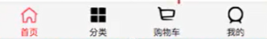
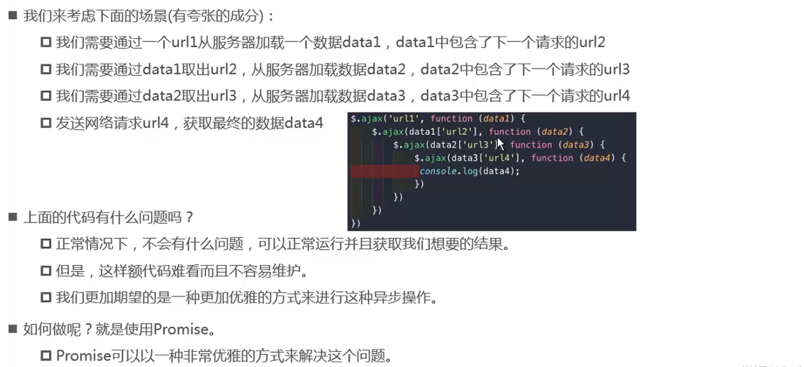
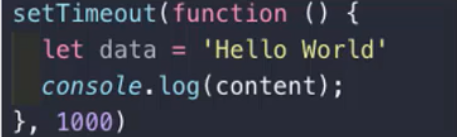
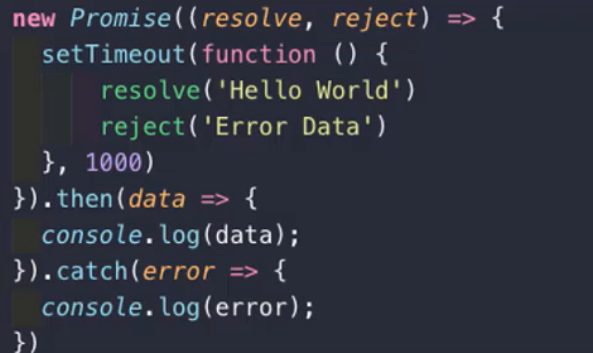
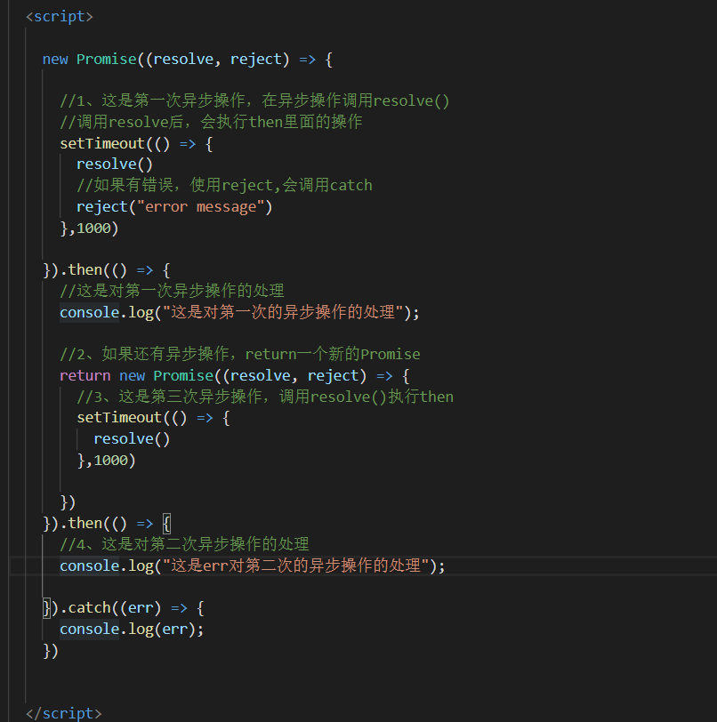

# 1、TabBar


### 图标下载地址

阿里矢量图标https://www.iconfont.cn/search/index?q=%E5%88%86%E7%B1%BB

### TabBar实现思路

- 1、如果在下方有一个单独的TabBar组件，你如何封装
  - 自定义TabBar组件，在App中使用
  - 让TabBar处于底部，并且设置相关的样式
- 2、TabBar中显示的内容由外界决定
  - 自定义插槽
  - flex布局评分TabBar
- 3、自定义TabBarItem，可以传入图片和文字
  - 定义TabBarItem，并且定义两个插槽：图片、文字
  - 给两个插槽外层包装div，用于设置样式
  - 填充插槽，实现底部TabBar的效果




### 小demo实现上面TabBar

步骤一：App.vue，在style标签中引入css文件

**注意：在style标签中使用@import来引入css文件**

```vue
//App.vue
<template>
  <div id="app">
    <div id="tab-bar">
      <div class="tab-bar-item">首页</div>
      <div class="tab-bar-item">分类</div>
      <div class="tab-bar-item">购物车</div>
      <div class="tab-bar-item">我的</div>
    </div>
  </div>
</template>
<script>
export default {
  name: 'App',
  components: {
  }
}
</script>
<style>
@import "./assets/css/base.css"
</style>

```

步骤二：编写css文件

css文件放在src/assets/css文件夹中

```css
//base.css
body{
  //清除边界
  padding: 0px;
  margin: 0px;
}

#tab-bar {
  /* 设置为水平分布 */
  display: flex;
  /* 导航栏背景颜色设置为f6f6f6 */
  background-color: #f6f6f6;

  /* 让导航栏位于底部 */
  position: fixed;
  left: 0;
  right: 0;
  bottom: 0;
  /* 让导航栏位于底部 */

  box-shadow: 0px -3px 1px rgba(100,100,100,0.08);
}

.tab-bar-item{
  /* 水平分布，给每个flex分一份 */
  flex: 1;
  text-align: center;
  /* 移动端，导航栏高度为49px */
  height: 49px;
}
```


### 对上边小demo进行组件化抽离

组件：App.vue  TabBar.vue   TabBarItem.vue

步骤一：App.vue 引入TabBar，并且向插槽传入数据

```vue
<template>
  <div id="app">
    <TabBar>
      <TabBarItem>
        
        
        <div slot="item-text">首页</div>
      </TabBarItem>
      <TabBarItem>
        
        
        <div slot="item-text">分类</div>
      </TabBarItem>
      <TabBarItem>
        
        
        <div slot="item-text">购物车</div>
      </TabBarItem>
      <TabBarItem>
        
        
        <div slot="item-text">我的</div>
      </TabBarItem>
    </TabBar>
  </div>
</template>

<script>
import TabBar from './components/tabbar/TabBar'
import TabBarItem from './components/tabbar/TabBarItem'
export default {
  name: "App",
  components: {
    TabBar,
    TabBarItem
  }
};
</script>

<style>
@import "./assets/css/base.css";


</style>

```

步骤二：TabBar.vue 定义插槽

```vue
<template>
  <div id="tab-bar">
    <slot></slot>
  </div>
</template>
<script>
export default {
  name: "TabBar",
  data() {
    return {};
  },
  components: {
  }
};
</script>
<style scoped>
#tab-bar {
  /* 设置为水平分布 */
  display: flex;
  /* 导航栏背景颜色设置为f6f6f6 */
  background-color: #f6f6f6;

  /* 让导航栏位于底部 */
  position: fixed;
  left: 0;
  right: 0;
  bottom: 0;
  /* 让导航栏位于底部 */
  box-shadow: 0px -3px 1px rgba(100, 100, 100, 0.08);
}
</style>
```

步骤三：TabBarItem.vue定义两个命名插槽

```vue
<template>
  <div class="tab-bar-item">
    <!-- 对插槽定义属性的话：需要在插槽外放一个div，在该div中定义 
         否则定义的属性会被替换掉不起效果
    -->
    <div v-if="!isActive">
      <slot name="item-icon"></slot>
    </div>
    <div v-else>
      <slot name="item-icon-active"></slot>
    </div>
    <div :class="{active: isActive}">
      <slot name="item-text"></slot>
    </div>
  </div>
</template>

<script>
export default {
  name: "TabBarItem",
  data() {
    return {
      isActive: true
    };
  }
};
</script>

<style scoped>
.tab-bar-item {
  /* 水平分布，给每个flex分一份 */
  flex: 1;
  text-align: center;
  /* 移动端，导航栏高度为49px */
  height: 49px;
  margin-top: 2px;

  font-size: 14px;
}
.tab-bar-item img {
  /* 图片大小设置为24px */
  height: 24px;
  width: 24px;

  /* 图片下方默认有px，使用这个属性消除 */
  vertical-align: middle;

  /* 让图片和文字间隔2px */
  margin-bottom: 2px;
}

.active {
  color: #f00;
}
</style>
```

### 对插槽定义属性注意点

对插槽定义属性的话：需要在插槽外放一个div，在该div中定义 

否则定义的属性会被替换掉不起效果

  ```html
<div v-if="!isActive">
  <slot name="item-icon"></slot>
</div>
  ```


### 对上面的小demo引入vue-router

一：`npm install vue-router --save`

二：写`src/router/index.js`文件

```javascript
import Vue from 'vue'
//1、引入插件
import VueRouter from 'vue-router'

//2、安装插件
Vue.use(VueRouter)

const routes = [

]

const router = new VueRouter({
  routes
})

//3、导出
export default router
```

三：在main.js中引入router，并添加到vue实例

```
//main.js
import Vue from 'vue'
import App from './App.vue'
import router from './router'
Vue.config.productionTip = false

new Vue({
  render: h => h(App),
  router
}).$mount('#app')

```


**使用路由的时候记得加上`<router-view>`，否则没有效果**


### 给上面的小demo添加需求：

使用这个tabbar组件的时候，可以向组件动态传入激活字体的颜色。

实现点击分类被点击的时候激活

使用到了：

`this.$route.path:`取出激活路由的路径

`indexOf:`找出下标

`TabBarItem.vue`

```vue
<template>
  <div class="tab-bar-item" @click="itemClick">
    <!-- 对插槽定义属性的话：需要在插槽外放一个div，在该div中定义 
         否则定义的属性会被替换掉不起效果
    -->
    <div v-if="!isActive">
      <slot name="item-icon"></slot>
    </div>
    <div v-else>
      <slot name="item-icon-active"></slot>
    </div>
    <div :class="{active: isActive}" :style="activeStyle">
      <slot name="item-text"></slot>
    </div>
  </div>
</template>

<script>
export default {
  name: "TabBarItem",
  data() {
    return {
    };
  },
  props: {
    path: String,
    activeColor: {
      type: String,
      default: 'red'
    }
  },
  computed: {
    isActive(){
      // 如果该路由的路径和传入的路径相等，返回true，为激活状态
      return this.$route.path.indexOf(this.path) !== -1
    },
    activeStyle(){
      // 如果是激活状态，设置字体颜色
      return this.isActive ? {color: this.activeColor} : {}
    }
  },
  methods: {
    itemClick(){
      // console.log("itemClick",this.path);
      this.$router.replace(this.path)
    }
  }
};
</script>

<style scoped>
.tab-bar-item {
  /* 水平分布，给每个flex分一份 */
  flex: 1;
  text-align: center;
  /* 移动端，导航栏高度为49px */
  height: 49px;
  margin-top: 2px;

  font-size: 14px;
}
.tab-bar-item img {
  /* 图片大小设置为24px */
  height: 24px;
  width: 24px;

  /* 图片下方默认有px，使用这个属性消除 */
  vertical-align: middle;

  /* 让图片和文字间隔2px */
  margin-bottom: 2px;
}

.active {
  color: #f00;
}
</style>
```


### 至此封装完毕

### 完整的TabBar代码：

`TabBar.vue/TabBarItem.vue/App.vue`

App.vue调用TabBar组件

```vue
//TabBar.vue
<template>
  <div id="tab-bar">
    <slot></slot>
  </div>
</template>
<script>
export default {
  name: "TabBar",
  data() {
    return {};
  },
  components: {
  }
};
</script>
<style scoped>
#tab-bar {
  /* 设置为水平分布 */
  display: flex;
  /* 导航栏背景颜色设置为f6f6f6 */
  background-color: #f6f6f6;

  /* 让导航栏位于底部 */
  position: fixed;
  left: 0;
  right: 0;
  bottom: 0;
  /* 让导航栏位于底部 */
  box-shadow: 0px -3px 1px rgba(100, 100, 100, 0.08);
}
</style>
```

```vue
//TabBarItem.vue
<template>
  <div class="tab-bar-item" @click="itemClick">
    <!-- 对插槽定义属性的话：需要在插槽外放一个div，在该div中定义 
         否则定义的属性会被替换掉不起效果
    -->
    <div v-if="!isActive">
      <slot name="item-icon"></slot>
    </div>
    <div v-else>
      <slot name="item-icon-active"></slot>
    </div>
    <div :class="{active: isActive}" :style="activeStyle">
      <slot name="item-text"></slot>
    </div>
  </div>
</template>

<script>
export default {
  name: "TabBarItem",
  data() {
    return {
    };
  },
  props: {
    path: String,
    activeColor: {
      type: String,
      default: 'red'
    }
  },
  computed: {
    isActive(){
      // 如果该路由的路径和传入的路径相等，返回true，为激活状态
      return this.$route.path.indexOf(this.path) !== -1
    },
    activeStyle(){
      // 如果是激活状态，设置字体颜色
      return this.isActive ? {color: this.activeColor} : {}
    }
  },
  methods: {
    itemClick(){
      // console.log("itemClick",this.path);
      this.$router.replace(this.path)
    }
  }
};
</script>

<style scoped>
.tab-bar-item {
  /* 水平分布，给每个flex分一份 */
  flex: 1;
  text-align: center;
  /* 移动端，导航栏高度为49px */
  height: 49px;
  margin-top: 2px;

  font-size: 14px;
}
.tab-bar-item img {
  /* 图片大小设置为24px */
  height: 24px;
  width: 24px;

  /* 图片下方默认有px，使用这个属性消除 */
  vertical-align: middle;

  /* 让图片和文字间隔2px */
  margin-bottom: 2px;
}

.active {
  color: #f00;
}
</style>
```

```vue
//App.vue
<template>
  <div id="app">
    <router-view></router-view>
    <TabBar>
      <TabBarItem path="/home" activeColor="blue">
        
        
        <div slot="item-text">首页</div>
      </TabBarItem>
      <TabBarItem path="/category" activeColor="blue">
        
        
        <div slot="item-text">分类</div>
      </TabBarItem>
      <TabBarItem path="cart" activeColor="blue">
        
        
        <div slot="item-text">购物车</div>
      </TabBarItem>
      <TabBarItem path="profile" activeColor="blue">
        
        
        <div slot="item-text">我的</div>
      </TabBarItem>
    </TabBar>
  </div>
</template>

<script>
import TabBar from './components/tabbar/TabBar'
import TabBarItem from './components/tabbar/TabBarItem'
export default {
  name: "App",
  components: {
    TabBar,
    TabBarItem
  }
};
</script>

<style>
@import "./assets/css/base.css";
</style>
```


### 对路径配置别名

有的路径长度很长，写起来麻烦，配置别名后清晰明了。

vue cli3的话，创建一个vue.config.js文件，文件名不能修改，创建到总目录下，和package.json文件一个目录下。

```javascript
//vue.config.js文件配置别名
const path = require('path')

function resolve(dir) {
    return path.join(__dirname, dir)
}
module.exports = {
    lintOnSave: true,
    chainWebpack: (config) => {
        config.resolve.alias
            .set('@', resolve('src'))
            .set('assets', resolve('src/assets'))
            .set('img',resolve('src/assets/img'))
    }
}

```


# 2、Promise的介绍和使用

- ES6中有一个非常重要和好用的特性就是Promise
- Promise到底是做什么的呢？
  - ==Promise是异步编程的一种解决方案==
- 那什么时候我们会来处理异步事件呢？
  - 一种很常见的场景应该就是网络请求了
  - 我们封装一个网络请求的函数，因为不能立即拿到结果，所以不能像简单的3+4=7一样将结果返回
  - 所以往往我们会传入另外一个函数，在数据请求成功时，将数据通过传入的函数回调回去
  - 如果只是一个简单的网络请求，那么这种方案不会给我们带来很大的麻烦
- 但是，当网络请求非常复杂时，就会出现回调地狱




### 定时器的异步事件

- 我们先来看看Promise的最基本语法

- 这里，我们用一个定时器来模拟异步事件：

  - 假设下面的data就是从网络上1秒后请求的数据
  - console.log就是我们的处理方式

  

- 这是我们过去的处理方式，我们将它换成Promise代码

- 这个例子会让我们感觉脱裤放屁，多此一举

  - 首先，下面的Promise代码明显比上面的代码看起来还要复杂
  - 其次，下面的Promise代码中包含的resolve、reject、then、catch都是些什么东西？

- 我们先不管第一个复杂度的问题，因为这样的一个屁大点的程序根本看不出Promise真正的作用。

  


Promise是链式编程，不是嵌套式的，所以看起来更加直观。

成功的时候调用resolve

失败的时候调用reject




### Promise的链式编程简写

**Promise的两个参数resolve和reject是可选的，可以不填**

需求：

对数据aaa进行处理，第二次拿到第一次的处理结果aaa在后边添加111，第三次拿到第二次的处理结果aaa111在后边添加222


#### 第一种写法：

```html
    new Promise((resolve,reject) => {
      resolve('aaa')
    }).then((res) => {
      console.log(res,'第一次对代码的处理');
      
      return new Promise((resolve) => {
        resolve(res+'111')
      })
    }).then((res) => {
      console.log(res,'第二次对代码的处理');
      
      return new Promise((resolve) => {
        resolve(res+'222')
      })
    }).then((res) => {
      console.log(res,'第三次对代码的处理');
      
    })
```

#### 第二种简写形式：

Promise提供了api  `Promise.resolve(data)<==> return new Promise(()=>{resolve()})`

```html
   new Promise((resolve,reject) => {
      resolve('aaa')
    }).then((res) => {
      console.log(res,'第一次对代码的处理');
      
      return Promise.resolve(res+'111')
    }).then((res) => {
      console.log(res,'第二次对代码的处理');
      
      return Promise.resolve(res+'222')
    }).then((res) => {
      console.log(res,'第三次对代码的处理');
      
    })
```

#### 第三种更简写形式：

直接将data返回，会到then中进行处理

```html
   new Promise((resolve,reject) => {
      resolve('aaa')
    }).then((res) => {
      console.log(res,'第一次对代码的处理');
      
      return res+'111'
    }).then((res) => {
      console.log(res,'第二次对代码的处理');
      
      return res+'222'
    }).then((res) => {
      console.log(res,'第三次对代码的处理');
      
    })
   
```


### Promise的all方法

需求：

我们有两个ajax请求，如果都返回成功的话，才可以进行下一步操作，怎么判断两个ajax请求都成功了呢？

可以使用

`Promise.all([])`传入数组，Promise

```html
Promise.all([
  new Promise((resolve, reject) => {
    $.ajax({
      url: 'url1',
      success: function(data){
        resolve(data)
      }
    })
  }),
  new Promise((resolve, reject) => {
    $.ajax({
      url: 'url2',
      success: function(data){
        resolve(data)
      }
    })
  })
]).then(results => {
  // results[0] 就是第一个Promise返回的结果
  // results[1] 就是第二个Promise返回的结果
  console.log(results);
})
```

