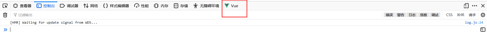
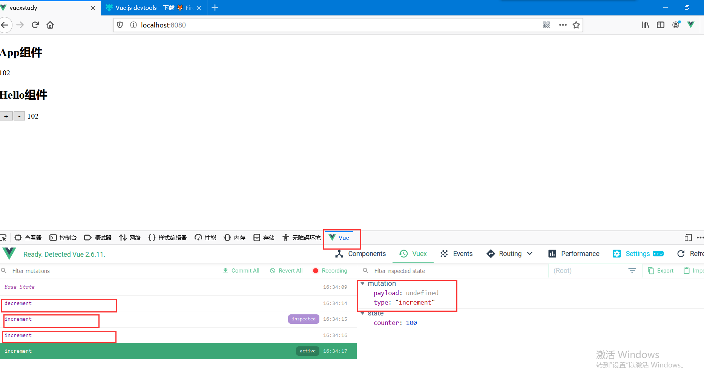
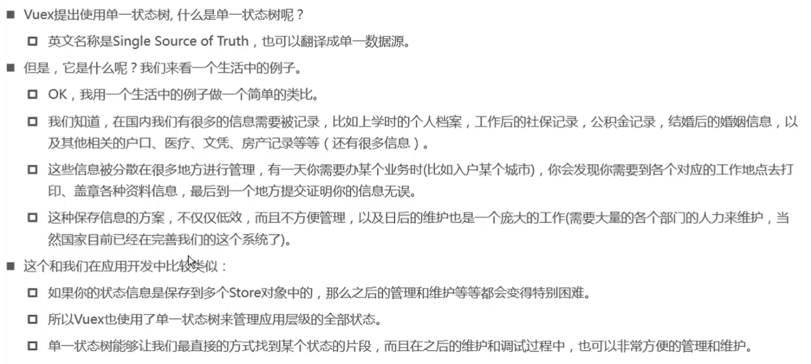
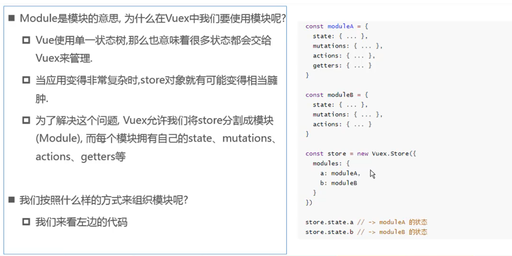
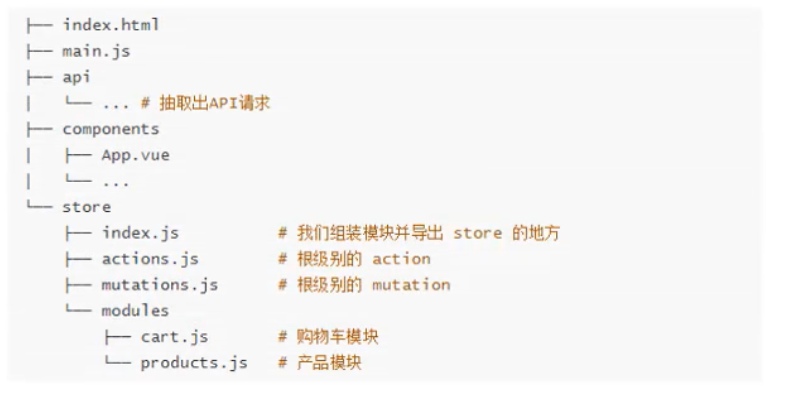

# 1、Vuex介绍


安装：

一：`npm install vuex --save`:安装

二：src/store/index.js （store仓库，vuex实际上就是仓库）

```javascript
//index.js
import Vue from 'vue'
import Vuex from 'vuex'

Vue.use(Vuex)

export default new Vuex.Store({
  state: {
  },
  mutations: {
  },
  actions: {
  },
  modules: {
  }
})

```

三：main.js引入vuex并挂载

```javascript
//main.js
import Vue from 'vue'
import App from './App.vue'
import store from './store' //vuex

Vue.config.productionTip = false

new Vue({
  store,//挂载
  render: h => h(App)
}).$mount('#app')

```

也可以使用脚手架安装，直接安装vuex

vue cli3：`vue create [porject]`

- 官方解释： Vuex是一个专为 Vue.js 应用程序开发的**状态管理模式**
  - 它采用`集中式存储管理`应用的所有组件的状态，并以相应的规则保证状态以一种可预测的方式发生改变
  - Vuex也集成到Vue的官方调试工具`devtools extension`，提供了诸如零配置的 time-travel 调试、状态快照导入导出等高级调试功能。
- `状态管理`到底是什么？
  - 状态管理模式、集中式存储管理这些名词听起来就非常高大上，让人捉摸不透
  - 其实，你可以简单地将其看成把需要多个组件共享的变量全部存储在一个对象里面
  - 然后，将这个对象放在顶层的Vue实例中，让其他组件可以使用
  - 那么，多个组件是不是就可以共享这个对象中的所有变量属性了呢？


### 管理什么状态呢？

- 用户的登陆状态，头像、名称、地址。
- 商品的收藏，购物车的商品


Talk is cheap ， Show me the code。（来自Linus：Linux/Git作者）


### 多界面的状态管理


- 如何定义公共状态属性：

  在index.js中的state属性中定义：

  ```javascript
  import Vue from 'vue'
  import Vuex from 'vuex'

  Vue.use(Vuex)

  export default new Vuex.Store({
    state: {
      counter: 100
    },
    mutations: {
    },
    actions: {
    },
    modules: {
    }
  })

  ```

- 如何来取出公共状态：

  ```javascript
  {{$store.state.counter}}
  ```


### 对状态的修改

如果直接对状态修改，如果组件过多，不知道哪个组件进行的修改，我们希望跟踪修改过程，就要使用mutations来修改。

**对状态修改，要通过mutations**

#### 首先，下载vue的调试工具devtools

在火狐浏览器找到，web开发工具，搜索devtools

https://addons.mozilla.org/zh-CN/firefox/addon/vue-js-devtools/?src=search

安装之后，控制台会出现vue




### devtools和mutations的使用

一：在index.js中定义mutations

定义函数的时候，会传入一个参数state，通过state来修改状态

```javascript
import Vue from 'vue'
import Vuex from 'vuex'

Vue.use(Vuex)

export default new Vuex.Store({
  state: {
    counter: 100
  },
  mutations: {
    increment(state){
      state.counter++
    },
    decrement(state){
      state.counter--
    }
  },
  actions: {
  },
  modules: {
  }
})

```

二：调用mutations

调用mutations的时候，必须使用commit方法，带上函数的名称

`this.$store.commit('increment')`

```javascript
methods: {
  addition(){
    this.$store.commit('increment')
  },
  substraction(){
    this.$store.commit('decrement')
  }
}
```


之后，在浏览器中可以通过devtools工具来查看每一次状态的改变！




# 2、Vuex属性

### 1、State单一状态树




简单来说，也就是只创建一个store对象，而不是多个。

### 2、Vuex-getters

getters就相当于计算属性computed

getters中的函数有两个参数：fun(state,getters) 

第一个参数为state 第二个为getters

**使用三个函数来说明getters的使用** 

more20stu：返回20岁以上的学生

more20stuLength：返回more20stu的长度

moreAgeStu：传入一个参数age，返回年龄大于age的学生

用到了filter过滤，students.filter(s => s.age > 20 )取出students数组中的每一个student，作为s，返回布尔类型的值。

```javascript
//index.js
import Vue from 'vue'
import Vuex from 'vuex'

Vue.use(Vuex)

export default new Vuex.Store({
  state: {
    students: [
      {id:100, name: 'why1',age: 18},
      {id:101, name: 'why2',age: 24},
      {id:102, name: 'why3',age: 35},
      {id:103, name: 'why4',age: 56}
    ]
  },
  mutations: {
  },
  getters: {
    more20stu(state){
      return state.students.filter(s => s.age > 20)
    },
    more20stuLength(state,getters){
      return getters.more20stu.length
    },
    moreAgeStu(state){
      //注意这里的参数不能在moreAgeStu中传入
      //要传入参数，需要返回一个函数，在这个函数中传入
       return function(age){
        return state.students.filter(s => s.age > age)
      }
      //箭头函数：return age => {state.students.filter(s => s.age > age)}
    }
  },
  actions: {
  },
  modules: {
  }
})

```

getters的调用：

```javas
<p>{{$store.getters.more20stu}}</p>
<p>{{$store.getters.more20stuLength}}</p>
<p>{{$store.getters.moreAgeStu(49)}}</p>
```


### 3、Mustations状态更新

- Vuex的store状态的更新唯一方式：**提交mutation**

- mutation的定义方式

  ```javascript
  mutations: {
    increment(state){
      state.counter++
    }
  }
  ```

- 通过mutation更新

  ```javascript
  increment: function(){
    this.$store.commit('increment')
  }
  ```

#### mutation同步函数

mutation:(形式或结构的) 转变，改变;

mutation中不能使用setTimeout()等异步函数

**如果确实需要异步操作，就是用actions，actions类似于mutations，就是用来代替mutations进行异步操作**

- 通常情况下，Vuex要求我们Mutation中的方法必须是同步方法
  - 主要的原因是当我们使用devtool的时候，devtools可以帮助我们捕捉mutation的快照
  - 但是如果是异步操作，那么devtools将不能很好的追踪这个操作什么时候会被完成

#### mutation的参数传递问题


- 首先，mutations定义接收参数，需要接收的参数，直接写在state后边即可

  ```javascript
  mutations: {
    incrementCount(state,count){
    state.counter += count
    },
    addStu(state,stu){
    state.students.push(stu)
    }
  }
  ```

  ​

- 调用mutations的时候，向mutations传递参数

  需要传递的参数，写在调用的mutations名称的后边。

  参数可以是变量也可以是对象

  ```javascript
  <button @click="five(5)">+5</button>
  <button @click="ten(10)">+10</button>
  <button @click="stu">添加学生</button>
    methods: {
      stu(){
        const stu = {id: 106,name: 'new Stu',age: 199}
        this.$store.commit('addStu',stu)
      },
      five(count){
        this.$store.commit('incrementCount',count)
      },
      ten(count){
        this.$store.commit('incrementCount',count)
      }
    }
  ```


#### mutation的提交风格

两种：

- `this.$store.commit('increment',count)`：是普通的提交方式

- ```javascript
  this.$sotre.commit({
    type: 'increment',
    count
  })

  ```

  这是第二种提交方式

> 两种提交方式，提交的参数是不同的，加入我们定义count = 5
>
> 那么第一种提交方式的话，接收的是一个变量
>
> ```
> mutataions: {
>   increment(state,count){
>     console.log(count)//打印的是5
>   }
> }
> ```
>
> 第二种提交方式的话，接收的是一个对象
>
> **payload(有效载荷)**就是对于接收者**有用**的数据
>
> ```
> mutations: {
>   increment(state,payload){
>     console.log(payload)//接收的是一个对象，既然是对象，就不命名为count，命名为payload
>     console.log(payload.count)//打印该对象的count值  5
>   }
> }
> ```


#### 

### 4、Vuex-actions

类似于mutations，用于代替mutations来作异步操作

如果mutations中必须进行异步操作，则放在actions中进行完成

Action的使用：

```javascript
state: {
  info: {
      name: 'why',
      age: 18
    }
},
mutations: {
  updateInfo(state){
    //Vue.set给info对象添加一个属性address值为北京
    Vue.set(state.info,'address','北京')
  }
},
actions: {
  //在actions中进行异步操作，调用updateInfo
  //两个参数：context:上下文（相当于$store）  payload：传入的参数
  aupdateInfo(context,payload){
    setTimeout(() => {
      context.commit('updateInfo')
      console.log(payload)
    },1000)
  }
}
```

使用actions:

使用`dispatch`而不是`commit`，dispatch是调用actions的

```javascript
methods: {
  updateClick(){
    this.$store.dispatch('aupdateInfo','携带过去的信息，payload')
  }
}

//上面是写法一，携带过去一个简单的字符串
//通常，执行成功之后，需要通知外界执行成功，所以携带的数据也可以是对象类型
methods: {
  updateClick(){
     this.$store.dispatch('aupdateInfo',{
        msg: '我是携带过去的信息payload',
        success(){
          console.log("success！");
        }
      })
  }
}
```


### 5、Vuex-modules

#### 认识modules




如果定义了模块a，取模块a的state中的name的话为

`$store.state.a.name`

在模块中context.commit调用的是自己的模块的mutations

```javascript
const moduleA = {
  state:{},
  mutations: {
    updateName(state, payload){
      state.name = payload
    }
  },
  actions: {
    aUpdateName(context){
      setTimeout(() => {
        context.commit('updateName','wangwu')
      },1000)
    }
  },
  getters: {
    //getters中三个参数，最后一个参数是store中的state
    fullname(state,getters,rootState)
  }
}
```

### 对象的解构ES6新语法

对象的解构在Actions中也有用到，例如下方

```
const obj = {
  name: 'why',
  age: 18,
  height: 1.88
}
//不用按照顺序，也会赋值
const {name,height,age} = obj
```


### Actions的写法

- actions可以接收一个context参数对象

  - 局部状态通过context.state暴露出来，根节点状态则为context.rootState

  ```
  const moduleA = {
    //...
    actions: {
      //这里用到了对象的解构，context相当于下边三个属性的和
      increment({state,commit,rootState}){
        
      }
    }
  }
  ```

- 如果getters中也需要使用全局的状态，可以接受更多的参数

  ```
  const moduleA = {
    //...
    getters: {
      increment(state,getters,rootState){
        
      }
    }
  }
  ```


# 3、Vuex的数据响应式原理

- Vuex的store中的state是响应式的

  **响应式：**也就是当数据发生改变时，Vue组件会自动更新

- 这就要求我们必须遵守一些Vue对应的规则才可以让数据为响应式的

  - 提前在store中初始化好所需的属性
  - 当给state中的对象添加新属性时，使用下面的方式
    - 方式一：使用`Vue.set(obj,'newProp',123)`
    - 方式二：用新对象给旧对象重新赋值


> state里面的属性都会被加入到响应式系统中，而响应式系统会监听属性的变化，当属性发生变化时，会通知所有界面中用到该属性的地方刷新


定义一个对象：

```
info: {
  name: 'why',
  age: 18
}
```

通过key或者数组下标来更改数组或对象的方法不是响应式的

js的delete方法也不是响应式的

```html
//store/index.js
mutations: {
  updateInfo(state){
  // Vue.set(state.info,'address','北京')
  // state.info['address'] = '北京' //这种方式给对象添加属性，不是响应式的，数据发生改变，页面不发生改变
  // delete state.info.age //这种方式删除对象中的属性，也不是响应式的
  Vue.delete(state.info,'age')
    }
}
```


# 4、Mutation常量类型

在使用Mutations的时候，写类型的时候，手写的话可能会出错，所以来定义常量减少出错的概率。

拿increment来举例

```
this.$store.commit('increment')

mutations: {
  increment(state){
    state.counter++
  }
}
```

我们将increment定义为常量：

### 一：创建mutations-types.js文件

在`src/store`中创建`mutations-types.js`文件

在该js文件中定义常量

```javascript
export const INCREMENT = 'increment'
```

### 二：导入js文件，使用常量

`src/store/index.js`

```javascript
//index.js
//因为导出的不是export default 所以导入时不能自己命名
//import INCREMENT from './mutations-types'这样是错误的
import {INCREMENT} from './mutations-types'
mutations: {
  [INCREMENT](state){
    state.counter++
  }
}
```

`App.vue`

```javascript
import {INCREMENT} from '../store/mutations-types'
this.$store.commit(INCREMENT)
```


# 5、Vuex-store文件夹的目录结构



>  也就是将store中的mutations抽出来为mutations.js文件，将actions抽出来为actions.js文件，将modules抽出来，创建一个文件夹modules，在modules中创建modulesA.js文件，将modules抽出来

