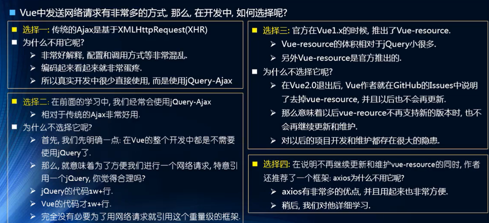

# 1、网络模块封装axios

对网络请求模块，都会自己进行封装，如果使用第三方的框架，不维护的话，更换框架很麻烦。




为什么选择axios？

- 功能特点
  - 在浏览器中发送 XMLHttpRequests 请求
  - 在 node.js 中发送 http 请求
  - 支持 Promise API
  - 拦截请求和响应
  - 转换请求和响应数据
  - 等等

# 2、axios请求方式

- 支持多种请求方式
  - axios(config)
  - axios.request(config)
  - axios.get(url[,config])
  - axios.delete(url[,config])
  - axios.head(url[,config])
  - axios.post(url[,data[,config]])
  - axios.put(url[,data[,config]])
  - axios.patch(url[,data[,config]])


# 3、axios的基本使用


### 安装axios

`npm install axios --save`

### 在main.js中配置使用

```javascript
import Vue from 'vue'
import App from './App.vue'
import axios from 'axios' //导入axios

Vue.config.productionTip = false

new Vue({
  render: h => h(App),
}).$mount('#app')


//使用axios
axios({
  url: 'http://httpbin.org/#/Dynamic_data',
  method: 'get'
}).then(res => {
  console.log(res);
})
```

# 4、axios发送并发请求

可以向下边这样发送并发请求

可以在axios中使用params携带参数

```javascript
axios.all([axios(),axios()]).then(results => {
  //第一个axios返回的结果
  console.log(results[0]);
  //第二个axios返回的结果
  console.log(results[1]);
})
```

具体代码：

> axios.spread((res1,res2)=>{}) 可以用res1和res2来分离

```javascript
axios.all([axios({
  url: 'http://httpbin.org/#/Dynamic_data'
}),axios({
  url: 'http://httpbin.org/#/Dynamic_data/get_bytes__n_',
  params: {

  }
})]).then(results => {
  //第一个axios返回的结果
  console.log(results[0]);
  //第二个axios返回的结果
  console.log(results[1]);
})
```


# 5、axios的配置信息相关


### 全局配置

- 在上面的示例中，我们的BaseURL是固定的

  - 事实上，在开发中可能很多参数都是固定的

  - 这个时候我们可以进行一些抽取，也可以利用axios的全局配置

    `axios.defaults.baseURL = 123.207.32.32:8080`

    `axios.defaults.headers.post['Content-Type'] = application/x-www-form-urlencoded`

```javascript
//main.js
axios.defaults.baseURL = 'http://httpbin.org/#/Dynamic_data'
axios.defaults.timeout = 5000

axios.all([axios({
  url: ''
}),axios({
  url: '/get_bytes__n_',
  params: {

  }
})]).then(results => {
  //第一个axios返回的结果
  console.log(results[0]);
  //第二个axios返回的结果
  console.log(results[1]);
})
```

### 常见配置选项

发送get请求传params

发送post请求传data

- 请求地址
  - url: '/user'
- 请求类型
  - method: 'get'
- 请求根路径
  - baseURL:'http://www.mt.com/api'
- 请求前的数据处理
  - transformRequest:[function(data){}]
- 请求后的数据处理
  - transformResponse:[function(data){}]
- 自定义的请求头：
  - headers:{'x-Requested-With':'XMLHttpRequest'}
- URL查询对象
  - params: {id:12}
- 查询对象序列化函数
  - paramsSerializer:function(params){}
- request body
  - data:{key:'aa'}
- 超时设置s
  - timeout: 1000
- 跨域是否带token
  - withCredentials:false
- 自定义请求处理
  - adapter:function(resolve,reject,config){}
- 身份验证信息
  - auth:{uname:"",pwd:"12"}
- 相应的数据格式 json/blob/document/
  - responseType:'json'


# 6、axios的实例和模块封装


需求：

多个模块，比如首页和菜单分类的数据的服务器并不是同一个ip，那么使用axios发送请求的话，就不能公用一个baseURL，所以要创建多个axios实例

`使用const instance = axios.create({baseURL: '',timeout: 5000})创建实例`

怎么使用实例呢：

```
//main.js
const instance = axios.create({
  baseURL: '',
  timeout: 5000
})

instance({
  url: '',
  method: ''
}).then(res => {
  console.log(res)
})
```


### 为什么要对axios进行封装？

> 在项目中，不能够对第三方框架依赖严重，如果某一天第三方框架突然不更新了，那么就需要在项目中所有用到该框架的地方进行修改，就会进行无意义的加班，所以一定要对使用到的第三方框架进行一个封装


#### 对axios的封装

> 在src目录下创建 network目录，在network目录中创建request.js文件进行

**在request.js文件中对axios进行封装**

封装的时候，直接返回axios的实例，其实返回的是一个Promise对象，那么在调用的时候，就可以使用then和catch来进行下一步处理或者对异常捕获

```javascript
//request.js文件
import axios from 'axios'

//要求传入config
export default function(config){
  //创建一个axios的实例
  const instance = axios.create({
    baseURL: '...'
  })
  //这里调用的话返回的就是Promise，所以可以直接返回
  return instance(config)
}

//在Hello.vue中调用我们封装的axios
//Hello.vue  直接写在created生命周期函数中
import request from '../network/reuqest'
created(){
  request({
    url: '...'
  }).then(res => {
    
  }).catch(err => {
    
  })
}
```

**上面的封装看不懂的话，看下边这个，返回一个Promise，但是其实没有必要，因为直接返回instan(config)也是一个Promise**

```javascript
//request.js
import axios from 'axios'

export default function(config){
  
  return new Promise((resolve,reject) => {
    //1、创建axios实例
    const instance = axios.create({
      baseURL: '...'
    })
    //2、发送真正的网络请求
    instance(config)
      .then(res => {
      resolve(res)
    }).catch(err => {
      reject(err)
    })
    
  })
  
}
```


# 7、axios的请求拦截


```javascript
//request.js
import axios from 'axios'

export default function(config){
  const instance = axios.create({
    baseURL: '...'
  })
  //1、axios的请求拦截
  instance.interceptors.request.use(config => {
	console.log(config)
    //拦截到请求进行一些处理
    //1.比如一些config中的信息不符合服务器的要求
    //2.比如每次发送网络请求时，都希望在界面显示一个加载的图标
    //3.某些网络请求（比如登录（要携带token）），必须携带一些特殊的信息
    
    //注意，这里拦截到了config之后，必须返回出去，否则请求无法完成
    return config
  },err => {
    console.log(err)
  })
  
  //2、响应拦截
  instance.interceptors.response.use(res => {
    console.log('res=',res);
    //拦截到结果后，要将结果返回
    //返回结果中的data数据即可，不需要返回整个res
    return res.data
  })
  
    return instance(config)
}
```


