Nuxt.js 通用 vue.js   SSR


SSR ：在服务端把vue文件渲染为html，返回给浏览器


# 环境安装

需要vue-cli

npm是node的打包工具。

安装vue-cli

```bash
npm install vue-cli -g #-g全局安装
```

安装成功之后，使用`vue -V`查看版本号


### 新建项目

`vue init nuxt/starter` 初始化项目


初始化项目后，使用`npm install` 下载package.json文件中的依赖。


安装错误的话，将node_modules包删除，重新`npm install`即可。（可能是网络环境造成的）


### 目录结构

.nuxt 里边放(执行num run dev)生成的页面

assets 里边放less sass js文件

components  放组件

layouts 用作布局

plugins 放插件

static  放图片 图标

store  Vuex文件夹，存放状态管理


.editorconfig 编辑规范

.selintrc.js  eslint的配置

.gitignore 不上传git的文件

package.json 依赖配置文件


### 项目端口和ip

如果需要改变项目启动的端口和ip地址，就在package.json中修改

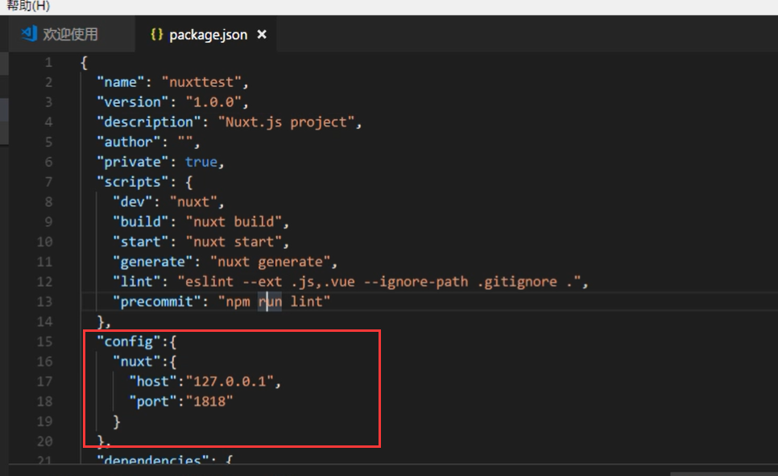


# 如何引入通用css

想要在所有文件中都引入基础css的话，在nuxt.config.js文件中进行引入

语法：  `css:[~assets/css/normalize.css]`

~的意思是直接定位到我们的assets文件，不需要再去进行../跳转层级

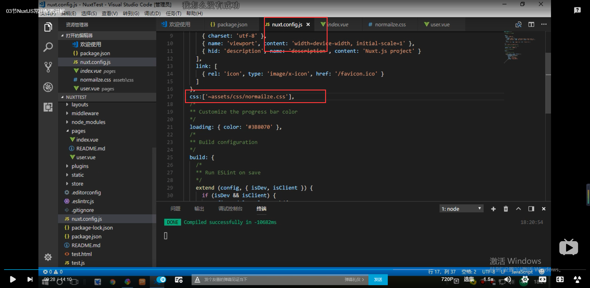


nuxt给我们自动配置好了路由


# 更改webpack配置

nuxt.config.js

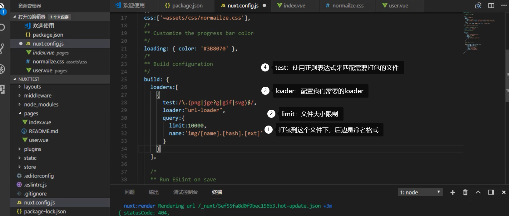


# 路由及参数传递


### 路由跳转

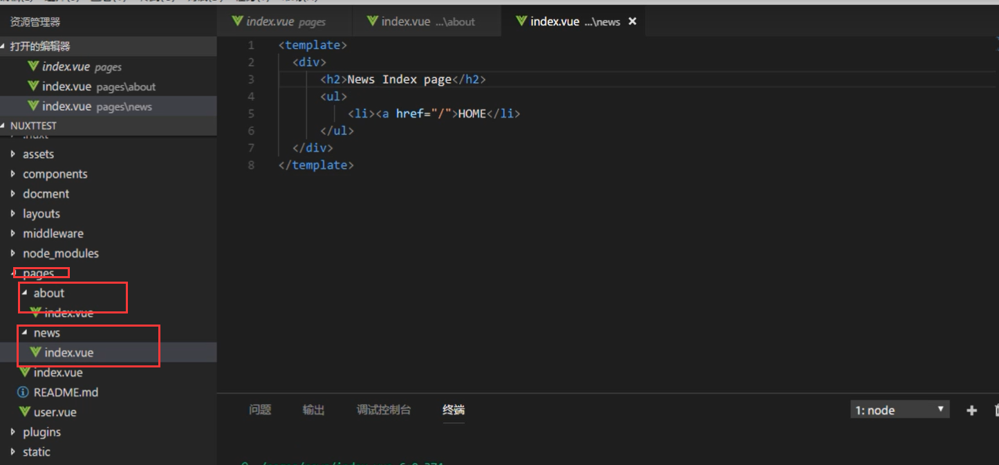


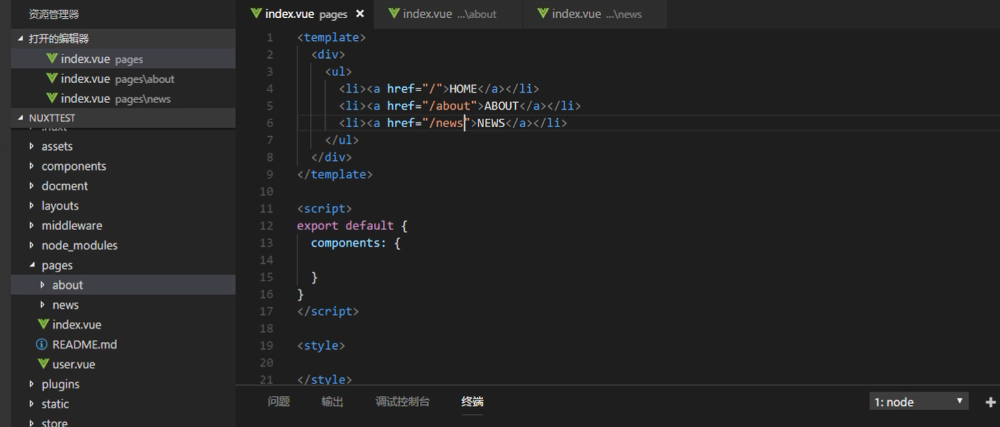


但是nutx并不推荐使用a标签，而推荐使用 nuxt-link

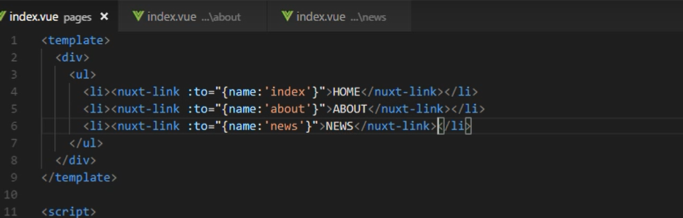


### 参数传递

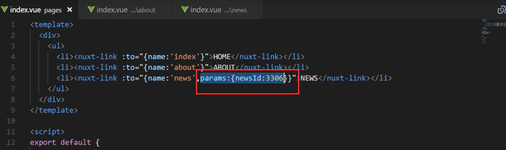

接收参数

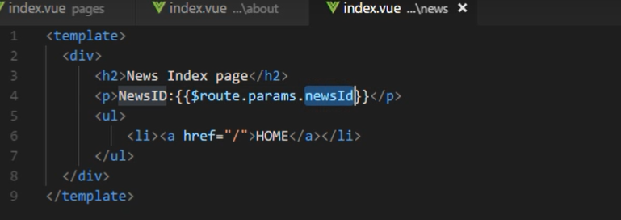


# 动态路由和参数校验


### 动态路由

动态路由写法 ： _id.vue  （以下划线开头）


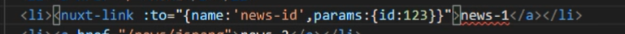


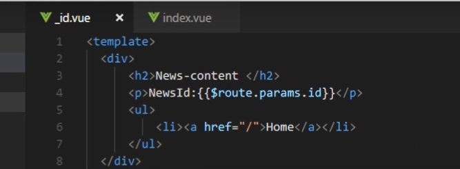


### 参数校验

如果校验成功就跳转路由，如果校验失败，返回nuxt给我们准备的404页面

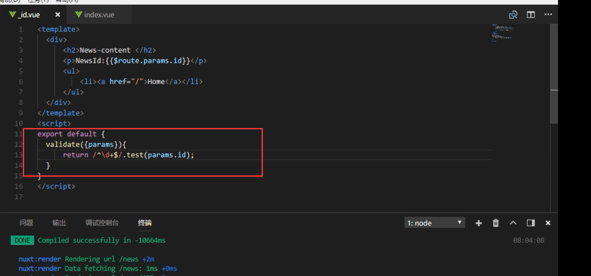

# 路由动画效果


在css中，这里卸载了基础css中

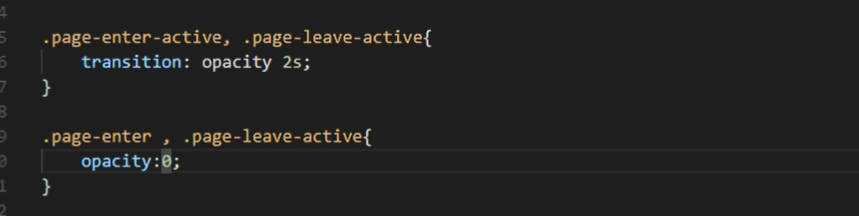


page是针对所有页面

若想针对某个页面进行路由动画效果：

在页面加上transition：'test'

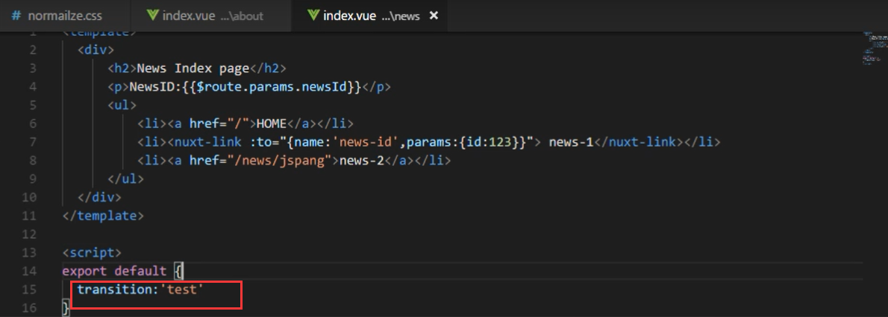

css效果前缀改为test即可

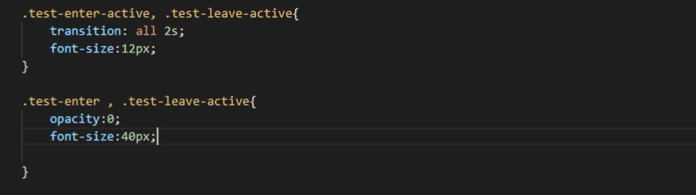


# 默认模板和默认布局


在根目录下创建app.html ，会默认这个为默认模板

`{{HEAD}}` ：使用大写，head里的内容不用写，nuxt.config.js中定义了head内容，直接获取。

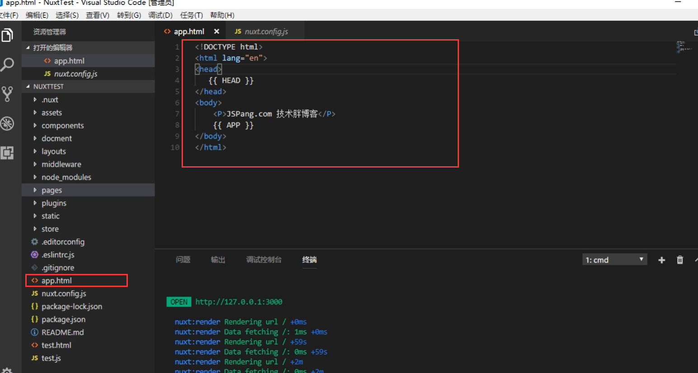


# nuxt错误页面

在layouts文件夹下，创建文件 error.vue  文件名必须为error

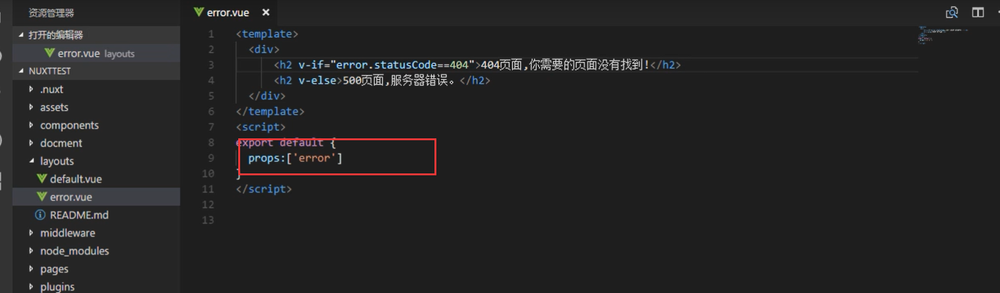

# 个性meta标签

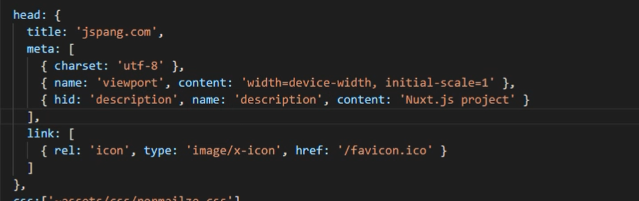


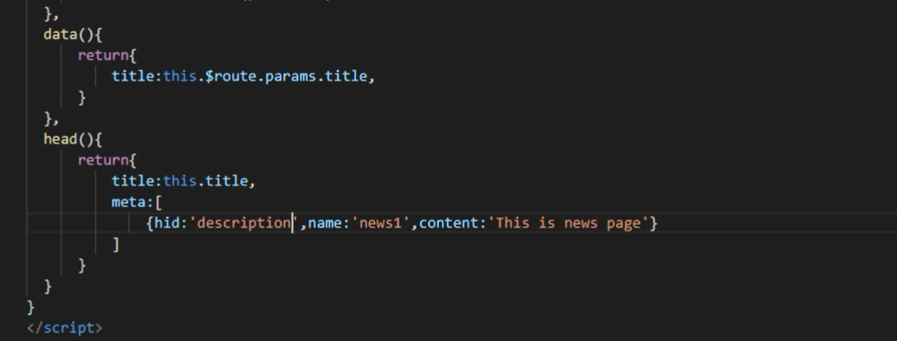


# Nuxt的asyncData方法

安装axios

`npm install axios --save`


使用axios发送请求之后，不能够使用this来进行赋值，因为请求是在页面渲染之前进行的，所以用this赋值不起效果

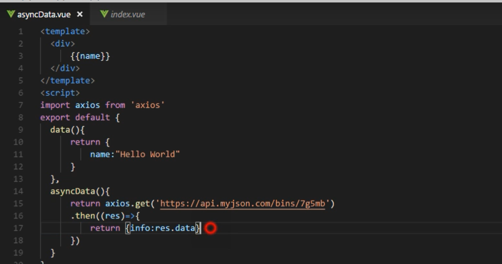


使用async 和 await（更优雅，使用这个）

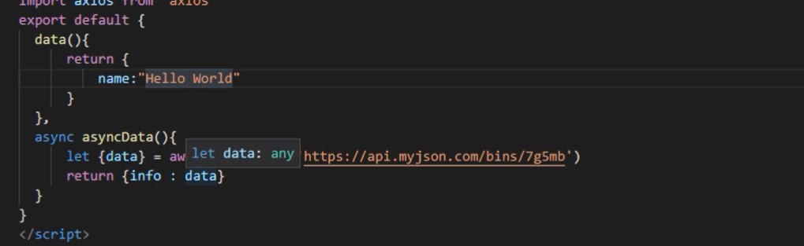


# 静态资源文件和生产静态html

使用npm run generate生成dist文件夹，里边就是生成的文件

打开dist文件夹 ，用vscode打开，发现静态资源失效，就需要安装服务

安装服务（如果不会node）

npm install -g live-server


live-server启动即可

