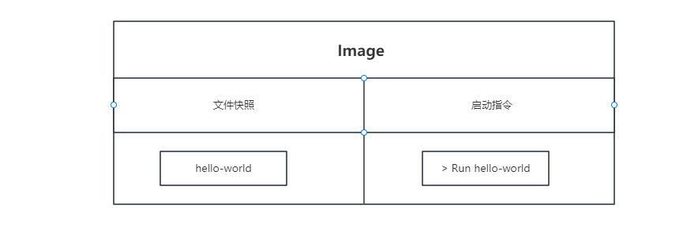
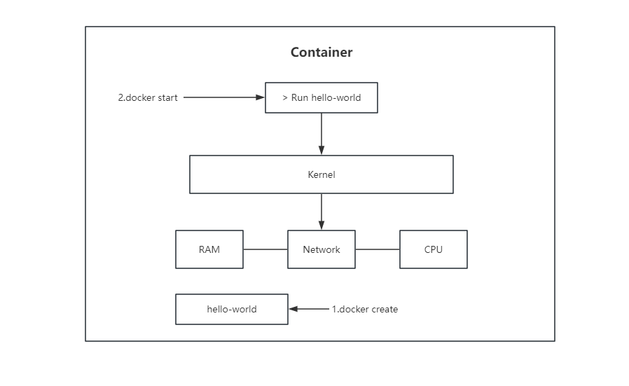
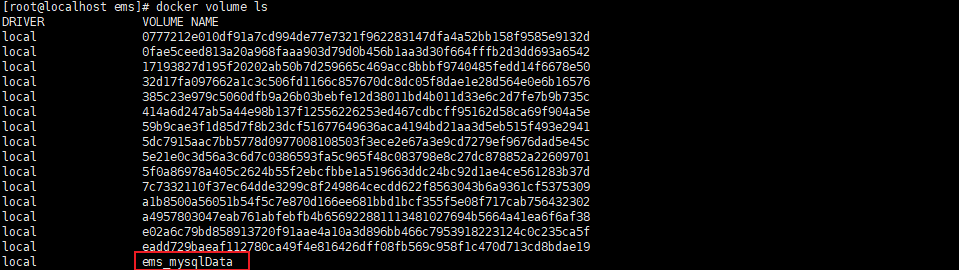
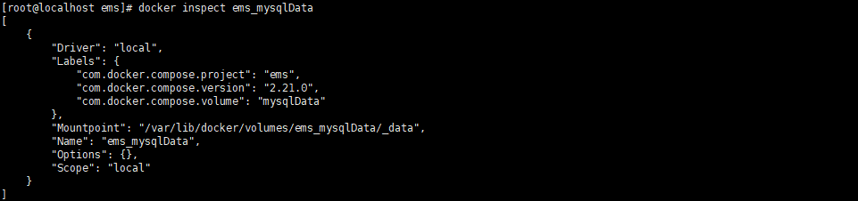
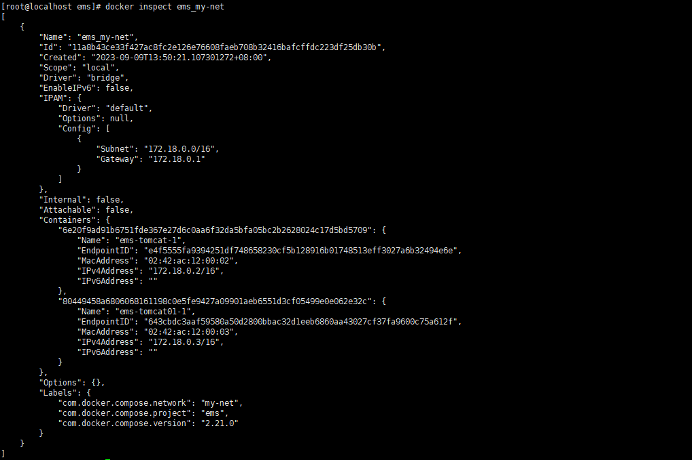

# 1、Docker


## 镜像和容器组成

docker run 命令 = docker create + docker start 







## Docker 常用指令


- 查看容器的文件系统快照（可以查看容器里的文件，如果不加 ls ，默认执行容器的启动指令 sh）

`docker run busybox ls` 

- 清除所有docker

`docker system prune`

- 获取docker日志（-f：实时刷新）

`docker logs -f ${container.id}`

- 获取启动日志（-a：attach）

`docker start -a ${container.id}` 

- 停止容器

kill 会强制退出

`docker stop ${container.id}`

`docker kill ${container.id}`

- docker 交互

-i：interactive 交互模式

-t：模拟 tty 功能，即 -t 会启动终端

`docker exec -it ${container.id} bash`

# 2、Docker-Compose学习

官方文档： https://www.docker.com/get-started

参考手册：https://yeasy.gitbook.io/docker_practice/（比较全）

## 安装

### 在线安装

- linux（在线安装）

```bash
curl -L https://github.com/docker/compose/releases/download/1.25.5/docker-compose-`uname -s`-`uname -m` > /usr/local/bin/docker-compose
chmod u+x /usr/local/bin/docker-compose
# 这种方式是直接将docker-compose的脚本文件下载到 /usr/local/bin 目录下
# 可以使用命令 echo $PATH 查看本地的环境变量
```


- linux（离线安装：这个速度比较快，可以挂上VPN下载好脚本，传到linux上）

1. 去 https://github.com/docker/compose/releases 下载 `docker-compose-linux-x86_64` 
2. 将 `docker-compose-linux-x86_64`  传入 linux，使用命令 `mv docker-compose-linux-x86_64 docker-compose` 改名，并使用命令 `mv docker-compose /usr/local/bin/` 移动到 /usr/local/bin/ 目录下
3. 赋予执行权限：`chmod u+x /usr/local/bin/docker-compose`


## 案例

### 案例1

1. 编写 docker-compose.yml 配置文件

```bash
cd /root
mkdir /ems	
cd /ems
touch docker-compose.yml
vim docker-compose.yml


# 代表使用 docker-compose 项目的版本号
version: "3.8"
services:
  tomcat:
   image: tomcat:8.0 # 使用的镜像
   ports:
    - 8004:8080 # 宿主机与容器端口映射  

  tomcat01:
   image: tomcat:8.0
   ports:
    - 8002:8080
    
  redis:    
   image: redis:latest
   ports:   
    - "6380:6379" # 端口映射生产环境建议写为 string

  mysql:      
   image: mysql 
   ports: 
    - "3307:3306"
   environment: # 代表给当前容器启动指定环境
    - "MYSQL_ROOT_PASSWORD=123456"
   volumes: # 给当前容器和宿主机指定容器卷，数据在mysql的哪个目录可以查看dockerhub中mysql容器的描述
    - /root/mysqldata:/var/lib/mysql
   privileged: true # 防止容器卷挂载权限不足
    

```


2. 启动

   `docker-compose up`

   需在 docker-compose.yml 文件目录下

   `docker-compose down` 会将服务器所有的缓存给清除掉，如果多次启动，以不正常方式退出，需要及时清除


## Docker-Compose.yml 模板命令


### volumes 指令

只需要使用 volumes 提前指定数据卷别名，并在 volumes 中使用即可

```bash
# 代表使用 docker-compose 项目的版本号
version: "3.8"
services:
  mysql:      
   image: mysql 
   ports: 
    - "3307:3306"
   environment: # 代表给当前容器启动指定环境
    - "MYSQL_ROOT_PASSWORD=123456"
   volumes: # 给当前容器和宿主机指定容器卷，数据在mysql的哪个目录可以查看dockerhub中mysql容器的描述
    - mysqlData:/var/lib/mysql
   privileged: true # 防止容器卷挂载权限不足

volumes:
  mysqlData: # 声明数据卷别名
```


使用 `docker-compose up` 启动之后，查看容器卷

使用 `docker volume ls` 查看容器卷，可以看到新创建的容器卷



使用 `docker inspect ems_mysqlData` 查看容器卷



根据 Mountpoint 可以看到挂载在 `/var/lib/docker/volumes/ems_mysqlData/_data` 目录下，可以查看该目录，存在了 mysql 的数据


### build 指令

通过 docker-compose 在启动容器之前先根据 Dockerfile 构建镜像，然后根据新构建的镜像启动容器

```bash
version: "3.8"
services:
  apps:
    build: ./ # 指定 Dockerfile 的上下文目录
    ports: 
     - "8081:8081"
```


- 自定义 DockerFile 上下文目录

  ```bash
  version: "3.8"
  services:
    apps:
      build: 
       context: ./dir # 指定目录
       dockerfile: Dockerfile-alternate # 指定 dockerfile 文件名
       args:
        buildno:1 # 指定环境变量
      ports: 
       - "8081:8081"
  ```


### command 指令

覆盖容器启动后默认执行的命令，即覆盖 Dockerfile 中 CMD 后边的命令


### depends_on 指令 *

通过 depends_on 指定容器依赖关系，被依赖的容器优先启动

```yaml
# 命令执行 docker-compose up -d
version: '3.9'
services:
  # MySQL 8.0.32 支持 AMD/ARM
  mysql:
    image: mysql:8.0.32
    container_name: mysql
    command: --default-authentication-plugin=mysql_native_password
    restart: always
    environment:
      TZ: Asia/Shanghai
#      MYSQL_ALLOW_EMPTY_PASSWORD: 'yes' # 可配置无密码，注意配置 SPRING_DATASOURCE_PASSWORD=
      MYSQL_ROOT_PASSWORD: 123456
      MYSQL_USER: xfg
      MYSQL_PASSWORD: 123456
    depends_on:
      - mysql-job-dbdata
    ports:
      - "13306:3306"
    volumes:
      - ./sql:/docker-entrypoint-initdb.d
    volumes_from:
      - mysql-job-dbdata

  # 自动加载数据
  mysql-job-dbdata:
    image: alpine:3.18.2
    container_name: mysql-job-dbdata
    volumes:
      - /var/lib/mysql

```


### env_file 指令

对于密码一些私密数据，直接写到 environment 中是不安全的，可以使用 env_file 指令

可以将 env_file 指定的文件以 . 开头，例如 `.env` ，因为以 . 开头的文件是隐藏文件


### network 指令  * 

配置一组容器在同一个网桥中，那么同一网桥中的不同容器，可以根据 ip 互相访问

```yaml
# 代表使用 docker-compose 项目的版本号
version: "3.8"
services:
  tomcat:
   image: tomcat:8.0 # 使用的镜像
   ports:
    - 8004:8080 # 宿主机与容器端口映射  
   networks:
    - my-net # 网桥
  tomcat01:
   image: tomcat:8.0
   ports:
    - 8002:8080
   networks:
    - my-net # 网桥

networks:
  my-net: # 声明使用的网桥
    
```


使用 `docker-compose up` 运行

使用 `docker network ls` 可以查看，docker 已经创建出了一个 `my-net` 网桥


使用 `docker inspect ems_my-net` 查看该网桥，可以看到该网桥下有 2 个容器



我们可以进入到 tomcat-1 容器内，即可通过 curl ip 访问 tomcat01-1 容器

```bash
[root@localhost ems]# docker ps
CONTAINER ID        IMAGE               COMMAND                  CREATED             STATUS              PORTS                                                  NAMES
6e20f9ad91b6        tomcat:8.0          "catalina.sh run"        2 minutes ago       Up 2 minutes        0.0.0.0:8004->8080/tcp                                 ems-tomcat-1
80449458a680        tomcat:8.0          "catalina.sh run"        2 minutes ago       Up 2 minutes        0.0.0.0:8002->8080/tcp                                 ems-tomcat01-1
8789c18d82d4        imooc-ebook:1.0     "/docker-entrypoin..."   2 days ago          Up 2 days           0.0.0.0:8080->80/tcp                                   imooc-ebook
dedfd877e055        zookeeper           "/docker-entrypoin..."   9 days ago          Up 3 days           2888/tcp, 3888/tcp, 0.0.0.0:2181->2181/tcp, 8080/tcp   zookeeper
5f2f835b25d1        nginx               "/docker-entrypoin..."   10 days ago         Up 8 days           0.0.0.0:8090->80/tcp                                   nginx-test
118528e5178a        redis               "docker-entrypoint..."   3 weeks ago         Up 10 days          0.0.0.0:6379->6379/tcp                                 redis
be9ff95db46d        mysql:5.7           "docker-entrypoint..."   4 weeks ago         Up 10 days          0.0.0.0:3306->3306/tcp, 33060/tcp                      api-gateway-mysql
[root@localhost ems]# docker exec -it ems-tomcat-1 bash
root@6e20f9ad91b6:/usr/local/tomcat# curl http://172.18.0.3:8080 
```


### restart 指令

`restart: always` 指定 docker 容器总是运行


## Docker-Compose 命令

```bash
docker-compose up #  启动所有 docker-compose 容器
docker-compose up [服务id] # 启动指定容器
docker-compose -f [docker-compose文件名] up # -f 指定文件名
docker-compose down # 关闭所有容器
```


### 