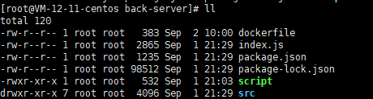

# 1、部署Nodejs项目

直接将nodejs项目传入服务器


## dockerfile

`vim dockerfile`

```bash
FROM node:16.14.2

RUN mkdir -p /home/node
WORKDIR /home/node

COPY . /home/node
run npm config set registry https://registry.npm.taobao.org
RUN npm install -g pnpm
RUN pnpm install

EXPOSE 3004

ENTRYPOINT ["node", "index.js"]
```


## script脚本

`vim script`

```bash
#!/bin/bash

#构建docker镜像
echo "========================================正在构建镜像================================="
docker build -t backend-server:1.0 .

# 停止并删除容器
echo "========================================正在删除容器================================="
docker stop backend-server
docker rm backend-server

# 运行容器
echo "========================================正在创建新容器================================="
docker run --name backend-server -d -p 3004:3004  backend-server:1.0

```


给脚本执行权限

`chmod u+x script`


最终目录结构



index.js、package.json、package-lock.json、src均为代码


## 启动容器

```bash
# 执行脚本
./script 
```


# 2、部署vue项目（nginx）


通过 `npm run build` 将项目打包为 dist 文件夹，将 dist 目录上传至服务器


## dockerfile

`vim dockerfile`

```bash
# 设置基础镜像，这里使用最新的nginx镜像，前面已经拉取过了
FROM nginx
#作者
MAINTAINER xuwangcheng 2631416434@qq.com
#执行命令，主要用来安装相关的软件

RUN rm /etc/nginx/conf.d/default.conf

ADD default.conf /etc/nginx/conf.d/

#添加文件
# 将dist文件中的内容复制到 /usr/share/nginx/html/ 这个目录下面
COPY dist/  /usr/share/nginx/html/
```


## script脚本

`vim script`

```bash
#!/bin/bash

#构建docker镜像
echo "========================================正在构建镜像================================="
docker build -t backend-front:1.0 .

# 停止并删除容器
echo "========================================正在删除容器================================="
docker stop backend-front
docker rm backend-front

# 运行容器
echo "========================================正在创建新容器================================="
docker run --name backend-front -d -p 9000:80  backend-front:1.0
```


给脚本执行权限

`chmod u+x script`


最终目录结构


## 启动容器

```bash
./script
```


# 3、部署beego项目

先将 beego 项目目录上传至服务器，在这里项目根目录为 `mbook`

## dockerfile

`vim dockerfile`

```bash
FROM golang:1.15.6

#正常这2句不需要，上网   逼得
RUN go env -w GO111MODULE=on
RUN go env -w GOPROXY=https://goproxy.cn,direct
# Install beego and the bee dev tool*
RUN go get github.com/astaxie/beego && go get github.com/beego/bee

WORKDIR /go/src/demo
# 以后命令都基于这个目录执行

# Expose the application on port 8080
EXPOSE 8880

# Set the entry point of the container to the bee command that runs the
# application and watches for changes
CMD ["bee", "run"]

```


## script脚本

`vim script.sh`

```bash
#!/bin/bash 

#构建docker镜像
echo "========================================正在构建镜像================================="
docker build -t beego:01 .

# 停止并删除容器
echo "========================================正在删除容器================================="
docker stop beego
docker rm beego

# 运行容器
echo "========================================正在创建新容器================================="
docker run --name beego -v /develop/work/beego-mbook/mbook:/go/src/demo -p 8880:8880 -d beego:01
```


给脚本执行权限

`chmod u+x script.sh`


最终目录结构为：


## 启动容器

```bash
./script.sh
```


# 4、部署springboot项目

maven 将项目打成 jar 包上传服务器

## dockerfile

`vim dockerfile`

```bash
#基础镜像
FROM openjdk:20-jdk-alpine
# FROM testamento/jdk20

#安装字体
RUN sed -i 's/dl-cdn.alpinelinux.org/mirrors.aliyun.com/g' /etc/apk/repositories && apk add --update ttf-dejavu fontconfig && rm -rf /var/cache/apk/* && mkfontscale && mkfontdir && fc-cache
RUN apk add --update ttf-dejavu fontconfig && rm -rf /var/cache/apk/*

#添加文件
ADD back-0.0.1-SNAPSHOT.jar /usr/local
RUN chmod u+x /usr/local/back-0.0.1-SNAPSHOT.jar
#挂载目录到容器
#VOLUME ["/data"]
#环境变量设置
#ENV #开放端口
EXPOSE 8088
#启动时执行的命令
CMD ["/bin/bash"]
#启动时执行的命令
ENTRYPOINT ["java","-jar","/usr/local/back-0.0.1-SNAPSHOT.jar"]
```


## script脚本

`vim script`

```bash
#!/bin/bash 

#构建docker镜像
echo "========================================正在构建镜像================================="
docker build -t back:01 .

# 停止并删除容器
echo "========================================正在删除容器================================="
docker stop back
docker rm back

# 运行容器
echo "========================================正在创建新容器================================="
docker run --name back -p 8088:8088 -d back:01

```


`chmod u+x script`


最终目录结构：（backup目录没用，只是存放一些备份的文件）


# 5、打包 jdk20 镜像

下载 jdk20 文件到服务器 ：jdk-20_linux-x64_bin.tar.gz


## dockerfile

`vim dokcerfile`

```bash
#1.指定基础镜像，并且必须是第一条指令
FROM docker.io/jeanblanchard/alpine-glibc

#2.指明该镜像的作者和其电子邮件
MAINTAINER hj

#3.在构建镜像时，指定镜像的工作目录，之后的命令都是基于此工作目录，如果不存在，则会创建目录
WORKDIR /usr/local/java

#4.一个复制命令，把jdk安装文件复制到镜像中，语法：ADD <src>... <dest>,注意：jdk*.tar.gz使用的是相对路径
ADD jdk-20_linux-x64_bin.tar.gz /usr/local/java/

#5.配置环境变量
ENV JAVA_HOME=/usr/local/java/jdk-20.0.2
ENV CLASSPATH=.:$JAVA_HOME/lib/dt.jar:$JAVA_HOME/lib/tools.jar
ENV PATH=$JAVA_HOME/bin:$PATH

#容器启动时需要执行的命令
CMD ["java","-version"]
#可以安装一些工具进入镜像,-y不需要交互自动安装很重要的参数，不然会卡住终止
#RUN ["yum","install","-y","gcc"]
```

