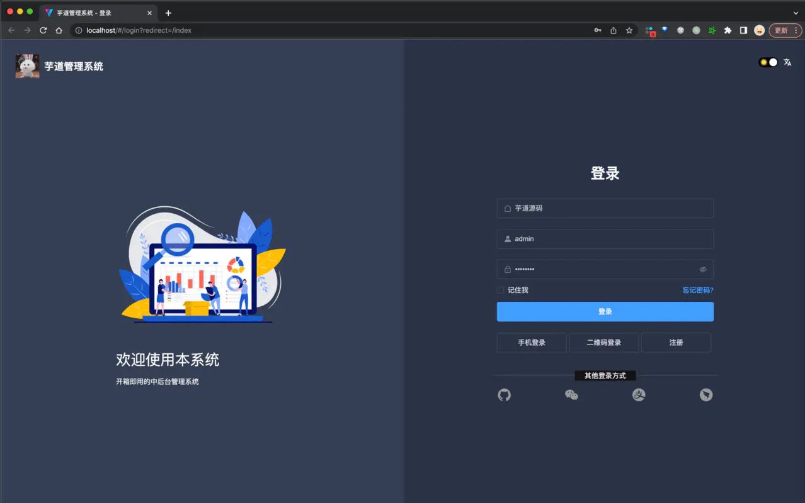

# 1、部署Nodejs项目

直接将nodejs项目传入服务器


## dockerfile

`vim dockerfile`

```bash
FROM node:16.14.2

RUN mkdir -p /home/node
WORKDIR /home/node

COPY . /home/node
run npm config set registry https://registry.npm.taobao.org
RUN npm install -g pnpm
RUN pnpm install

EXPOSE 3004

ENTRYPOINT ["node", "index.js"]
```


## default.conf

```conf
server {
    listen       80;
    listen  [::]:80;
    server_name  106.52.239.29;

    location / {
        root   /usr/share/nginx/html;
        index  index.html index.htm;
        try_files $uri $uri/ /index.html;
    }

    # 将 http://ip:port/api/back/{xxxx} 映射为 http://106.52.239.29:8088/{xxxx}
    location /api/back/ {
            proxy_pass   http://106.52.239.29:8088/;
     }

        location /api/base/ {
            proxy_pass   http://106.52.239.29:8089/;
     }

    error_page   500 502 503 504  /50x.html;
    location = /50x.html {
        root   /usr/share/nginx/html;
    }
}
```


## script脚本

`vim script`

```bash
#!/bin/bash

#构建docker镜像
echo "========================================正在构建镜像================================="
docker build -t backend-server:1.0 .

# 停止并删除容器
echo "========================================正在删除容器================================="
docker stop backend-server
docker rm backend-server

# 运行容器
echo "========================================正在创建新容器================================="
docker run --name backend-server -d -p 3004:3004  backend-server:1.0

```


给脚本执行权限

`chmod u+x script`


最终目录结构


index.js、package.json、package-lock.json、src均为代码


## 启动容器

```bash
# 执行脚本
./script 
```


# 2、部署vue项目（nginx）


通过 `npm run build` 将项目打包为 dist 文件夹，将 dist 目录上传至服务器


## dockerfile

`vim dockerfile`

```bash
# 设置基础镜像，这里使用最新的nginx镜像，前面已经拉取过了
FROM nginx
#作者
MAINTAINER xuwangcheng 2631416434@qq.com
#执行命令，主要用来安装相关的软件

RUN rm /etc/nginx/conf.d/default.conf

ADD default.conf /etc/nginx/conf.d/

#添加文件
# 将dist文件中的内容复制到 /usr/share/nginx/html/ 这个目录下面
COPY dist/  /usr/share/nginx/html/
```


## script脚本

`vim script`

```bash
#!/bin/bash

#构建docker镜像
echo "========================================正在构建镜像================================="
docker build -t backend-front:1.0 .

# 停止并删除容器
echo "========================================正在删除容器================================="
docker stop backend-front
docker rm backend-front

# 运行容器
echo "========================================正在创建新容器================================="
docker run --name backend-front -d -p 9000:80  backend-front:1.0
```


给脚本执行权限

`chmod u+x script`


最终目录结构


## 启动容器

```bash
./script
```


# 3、部署beego项目

先将 beego 项目目录上传至服务器，在这里项目根目录为 `mbook`

## dockerfile

`vim dockerfile`

```bash
FROM golang:1.15.6

#正常这2句不需要，上网   逼得
RUN go env -w GO111MODULE=on
RUN go env -w GOPROXY=https://goproxy.cn,direct
# Install beego and the bee dev tool*
RUN go get github.com/astaxie/beego && go get github.com/beego/bee

WORKDIR /go/src/demo
# 以后命令都基于这个目录执行

# Expose the application on port 8080
EXPOSE 8880

# Set the entry point of the container to the bee command that runs the
# application and watches for changes
CMD ["bee", "run"]

```


## script脚本

`vim script.sh`

```bash
#!/bin/bash 

#构建docker镜像
echo "========================================正在构建镜像================================="
docker build -t beego:01 .

# 停止并删除容器
echo "========================================正在删除容器================================="
docker stop beego
docker rm beego

# 运行容器
echo "========================================正在创建新容器================================="
docker run --name beego -v /develop/work/beego-mbook/mbook:/go/src/demo -p 8880:8880 -d beego:01
```


给脚本执行权限

`chmod u+x script.sh`


最终目录结构为：


## 启动容器

```bash
./script.sh
```


# 4、部署springboot项目

maven 将项目打成 jar 包上传服务器

## dockerfile

`vim dockerfile`

```bash
#基础镜像
FROM openjdk:20-jdk-alpine
# FROM testamento/jdk20

#安装字体
RUN sed -i 's/dl-cdn.alpinelinux.org/mirrors.aliyun.com/g' /etc/apk/repositories && apk add --update ttf-dejavu fontconfig && rm -rf /var/cache/apk/* && mkfontscale && mkfontdir && fc-cache
RUN apk add --update ttf-dejavu fontconfig && rm -rf /var/cache/apk/*

#添加文件
ADD back-0.0.1-SNAPSHOT.jar /usr/local
RUN chmod u+x /usr/local/back-0.0.1-SNAPSHOT.jar
#挂载目录到容器
#VOLUME ["/data"]
#环境变量设置
#ENV #开放端口
EXPOSE 8088
#启动时执行的命令
CMD ["/bin/bash"]
#启动时执行的命令
ENTRYPOINT ["java","-jar","/usr/local/back-0.0.1-SNAPSHOT.jar"]
```


## script脚本

`vim script`

```bash
#!/bin/bash 

#构建docker镜像
echo "========================================正在构建镜像================================="
docker build -t back:01 .

# 停止并删除容器
echo "========================================正在删除容器================================="
docker stop back
docker rm back

# 运行容器
echo "========================================正在创建新容器================================="
docker run --name back -p 8088:8088 -d back:01

```


`chmod u+x script`


最终目录结构：（backup目录没用，只是存放一些备份的文件）


# 5、打包 jdk20 镜像

下载 jdk20 文件到服务器 ：jdk-20_linux-x64_bin.tar.gz


## dockerfile

`vim dokcerfile`

```bash
#1.指定基础镜像，并且必须是第一条指令
FROM docker.io/jeanblanchard/alpine-glibc

#2.指明该镜像的作者和其电子邮件
MAINTAINER hj

#3.在构建镜像时，指定镜像的工作目录，之后的命令都是基于此工作目录，如果不存在，则会创建目录
WORKDIR /usr/local/java

#4.一个复制命令，把jdk安装文件复制到镜像中，语法：ADD <src>... <dest>,注意：jdk*.tar.gz使用的是相对路径
ADD jdk-20_linux-x64_bin.tar.gz /usr/local/java/

#5.配置环境变量
ENV JAVA_HOME=/usr/local/java/jdk-20.0.2
ENV CLASSPATH=.:$JAVA_HOME/lib/dt.jar:$JAVA_HOME/lib/tools.jar
ENV PATH=$JAVA_HOME/bin:$PATH

#容器启动时需要执行的命令
CMD ["java","-version"]
#可以安装一些工具进入镜像,-y不需要交互自动安装很重要的参数，不然会卡住终止
#RUN ["yum","install","-y","gcc"]
```


# 6、部署yudao-cloud项目

官方部署文档：https://cloud.iocoder.cn/quick-start/#_7-1-%E5%90%AF%E5%8A%A8-vue3-element-plus-%E7%AE%A1%E7%90%86%E5%90%8E%E5%8F%B0

## 基础设施

### mysql

项目使用 MySQL 存储数据，所以需要启动一个 MySQL 服务，建议使用 **5.7** 版本。

① 创建一个名字为 `ruoyi-vue-pro` 数据库，执行对应数据库类型的 [`sql` (opens new window)](https://github.com/YunaiV/yudao-cloud/tree/master/sql)目录下的 SQL 文件，进行初始化。


② 默认配置下，MySQL 需要启动在 3306 端口，并且账号是 root，密码是 123456。如果不一致，需要修改 `application-local.yaml` 配置文件。


### redis

项目使用 Redis 缓存数据，所以需要启动一个 Redis 服务。

一定要使用 **5.0** 以上的版本，项目使用 Redis Stream 作为消息队列。

默认配置下，Redis 启动在 6379 端口，不设置账号密码。如果不一致，需要修改 `application-local.yaml` 配置文件。


### nacos

项目使用 Nacos 作为**注册中心**和**配置中心**，安装单机即可。

安装完成之后，需要创建 `dev` **命名空间**，如下图所示：


## 部署后端项目

本地启动流程：按顺序启动以下三个模块即可。

部署流程：将三个模块打成jar包：yudao-gateway、yudao-module-system-biz、yudao-module-infra-biz

>  infra测试模块如果打包失败，使用以下命令跳过测试模块进行打包：
>
>  `mvn clean install package -Dmaven.test.skip=true` 
>
>  如果执行报 `Unknown lifecycle phase “.test.skip=true”` 错误，使用 `mvn clean install package -Dmaven.test.skip=true` 即可。


在部署后端项目时，记得修改配置的中间件的ip，需要修改的文件为三个模块下的：application.yaml、application-local.yaml、bootstrap.yaml、bootstrap-local.yaml （这四个文件中所有出现ip的地方都要进行修改）


### gateway模块

- 目录结构：


- Dockerfile内容

```dockerfile
## AdoptOpenJDK 停止发布 OpenJDK 二进制，而 Eclipse Temurin 是它的延伸，提供更好的稳定性
## 感谢复旦核博士的建议！灰子哥，牛皮！
#FROM eclipse-temurin:8-jre
FROM openjdk:8-jdk-alpine
## 创建目录，并使用它作为工作目录
RUN mkdir -p /yudao-gateway
WORKDIR /yudao-gateway
## 将后端项目的 Jar 文件，复制到镜像中
COPY yudao-gateway.jar app.jar

#安装字体
RUN sed -i 's/dl-cdn.alpinelinux.org/mirrors.aliyun.com/g' /etc/apk/repositories && apk add --update ttf-dejavu fontconfig && rm -rf /var/cache/apk/* && mkfontscale && mkfontdir && fc-cache
RUN apk add --update ttf-dejavu fontconfig && rm -rf /var/cache/apk/*


## 设置 TZ 时区
## 设置 JAVA_OPTS 环境变量，可通过 docker run -e "JAVA_OPTS=" 进行覆盖
ENV TZ=Asia/Shanghai JAVA_OPTS="-Xms512m -Xmx512m"
## 暴露后端项目的 48080 端口
EXPOSE 48080

## 启动后端项目
CMD java ${JAVA_OPTS} -Djava.security.egd=file:/dev/./urandom -jar app.jar
```


- build脚本内容

```bash
#!/bin/bash
docker build -t yudao-gateway .
```


- script脚本内容

```bash

#!/bin/bash

#构建docker镜像
echo "========================================正在构建镜像================================="
docker build -t yudao-gateway:01 .

# 停止并删除容器
echo "========================================正在删除容器================================="
docker stop yudao-gateway
docker rm yudao-gateway

# 运行容器
echo "========================================正在创建新容器================================="
docker run --name yudao-gateway -p 48080:48080 -d yudao-gateway:01
```


### system模块

- 目录结构


- Dockerfile

```dockerfile
## AdoptOpenJDK 停止发布 OpenJDK 二进制，而 Eclipse Temurin 是它的延伸，提供更好的稳定性
## 感谢复旦核博士的建议！灰子哥，牛皮！
#FROM eclipse-temurin:8-jre
FROM openjdk:8-jdk-alpine
## 创建目录，并使用它作为工作目录
RUN mkdir -p /yudao-module-system-biz
WORKDIR /yudao-module-system-biz
## 将后端项目的 Jar 文件，复制到镜像中
COPY yudao-module-system-biz.jar app.jar

#安装字体
RUN sed -i 's/dl-cdn.alpinelinux.org/mirrors.aliyun.com/g' /etc/apk/repositories && apk add --update ttf-dejavu fontconfig && rm -rf /var/cache/apk/* && mkfontscale && mkfontdir && fc-cache
RUN apk add --update ttf-dejavu fontconfig && rm -rf /var/cache/apk/*

## 设置 TZ 时区
## 设置 JAVA_OPTS 环境变量，可通过 docker run -e "JAVA_OPTS=" 进行覆盖
ENV TZ=Asia/Shanghai JAVA_OPTS="-Xms512m -Xmx512m"

## 暴露后端项目的 48080 端口
EXPOSE 48081

## 启动后端项目
CMD java ${JAVA_OPTS} -Djava.security.egd=file:/dev/./urandom -jar app.jar

```


- build

```bash
#!/bin/bash
docker build -t yudao-module-system-biz .
```


- script

```bash
#!/bin/bash

#构建docker镜像
echo "========================================正在构建镜像================================="
docker build -t yudao-module-system-biz:01 .

# 停止并删除容器
echo "========================================正在删除容器================================="
docker stop yudao-module-system-biz
docker rm yudao-module-system-biz

# 运行容器
echo "========================================正在创建新容器================================="
docker run --name yudao-module-system-biz -p 48081:48081 -d yudao-module-system-biz:01

```


### infra模块

- 目录结构


- Dockerfile：

```dockerfile
## AdoptOpenJDK 停止发布 OpenJDK 二进制，而 Eclipse Temurin 是它的延伸，提供更好的稳定性
## 感谢复旦核博士的建议！灰子哥，牛皮！
#FROM eclipse-temurin:8-jre
FROM openjdk:8-jdk-alpine
## 创建目录，并使用它作为工作目录
RUN mkdir -p /yudao-module-infra-biz
WORKDIR /yudao-module-infra-biz
## 将后端项目的 Jar 文件，复制到镜像中
COPY yudao-module-infra-biz.jar app.jar

#安装字体
RUN sed -i 's/dl-cdn.alpinelinux.org/mirrors.aliyun.com/g' /etc/apk/repositories && apk add --update ttf-dejavu fontconfig && rm -rf /var/cache/apk/* && mkfontscale && mkfontdir && fc-cache
RUN apk add --update ttf-dejavu fontconfig && rm -rf /var/cache/apk/*

## 设置 TZ 时区
## 设置 JAVA_OPTS 环境变量，可通过 docker run -e "JAVA_OPTS=" 进行覆盖
ENV TZ=Asia/Shanghai JAVA_OPTS="-Xms512m -Xmx512m"

## 暴露后端项目的 48080 端口
EXPOSE 48082

## 启动后端项目
CMD java ${JAVA_OPTS} -Djava.security.egd=file:/dev/./urandom -jar app.jar

```


- build

```bash
#!/bin/bash
docker build -t yudao-module-infra-biz .
```


- script:

```sh
#!/bin/bash

#构建docker镜像
echo "========================================正在构建镜像================================="
docker build -t yudao-module-infra-biz:01 .

# 停止并删除容器
echo "========================================正在删除容器================================="
docker stop yudao-module-infra-biz
docker rm yudao-module-infra-biz

# 运行容器
echo "========================================正在创建新容器================================="
docker run --name yudao-module-infra-biz -p 48082:48082 -d yudao-module-infra-biz:01

```


## 部署前端项目

### 本地启动

[`yudao-ui-admin-vue3` (opens new window)](https://github.com/yudaocode/yudao-ui-admin-vue3/)是前端 Vue3 + element-plus 管理后台项目。

① 克隆 [https://github.com/yudaocode/yudao-ui-admin-vue3.git (opens new window)](https://github.com/yudaocode/yudao-ui-admin-vue3.git)项目，并 Star 关注下该项目。

② 在根目录执行如下命令，进行启动：

```
# 安装 pnpm，提升依赖的安装速度
npm config set registry https://registry.npmjs.org
npm install -g pnpm
# 安装依赖
pnpm install
# 启动服务
npm run dev

```

③ 启动完成后，浏览器会自动打开 [http://localhost:80 (opens new window)](http://localhost/)地址，可以看到前端界面。



### docker部署

目录结构：


- Dokcerfile

```dockerfile
# 设置基础镜像，这里使用最新的nginx镜像，前面已经拉取过了
FROM nginx
#作者
MAINTAINER xuwangcheng 2631416434@qq.com
#执行命令，主要用来安装相关的软件

RUN rm /etc/nginx/conf.d/default.conf

ADD default.conf /etc/nginx/conf.d/

#添加文件
# 将dist文件中的内容复制到 /usr/share/nginx/html/ 这个目录下面
COPY dist/  /usr/share/nginx/html/
```


- default.conf

```bash
server {
    listen       80;
    listen  [::]:80;
    server_name  localhost;

    #access_log  /var/log/nginx/host.access.log  main;

    location / {
        root   /usr/share/nginx/html;
        index  index.html index.htm;
        try_files $uri $uri/ /index.html;
    }

    location /admin-api/ {
        proxy_pass   http://10.0.2.15:48080/;
    }

    error_page   500 502 503 504  /50x.html;
    location = /50x.html {
        root   /usr/share/nginx/html;
    }
}
```


- script

```bash
#!/bin/bash

#构建docker镜像
echo "========================================正在构建镜像================================="
docker build -t yudao-cloud-front:1.0 .

# 停止并删除容器
echo "========================================正在删除容器================================="
docker stop yudao-cloud-front
docker rm yudao-cloud-front

# 运行容器
echo "========================================正在创建新容器================================="
docker run --name yudao-cloud-front -d -p 8010:80  yudao-cloud-front:1.0
```


- build

```bash
#!/bin/bash
docker build -t yudao-cloud-front .
```


## docker-compose 脚本启动

先使用三个模块中以及前端模块下的 build 脚本进行打包，再启动 docker-compose 脚本，`docker-compose up` 启动

```yaml
version: '3'
services:
  yudao-gateway:
    image: yudao-gateway
    container_name: yudao-gateway
    environment:
      - TZ=Asia/Shanghai # 配置程序默认时区为上海（中国标准时间）
    ports:
      - 48080:48080
    restart: always
    networks:
      - my-net # 网桥
  yudao-system:
    image: yudao-module-system-biz
    container_name: yudao-system
    environment:
      - TZ=Asia/Shanghai # 配置程序默认时区为上海（中国标准时间）
    ports:
      - 48081:48081
    healthcheck:
      test: [ "CMD","curl","-f","http://10.0.2.15:48081" ]
      interval: 30s
      timeout: 10s
      retries: 5
      start_period: 60s
    restart: always
    networks:
      - my-net
  yudao-infra:
    image: yudao-module-infra-biz
    container_name: yudao-infra
    environment:
      - TZ=Asia/Shanghai # 配置程序默认时区为上海（中国标准时间）
    ports:
      - 48082:48082
    restart: always
    networks:
      - my-net
    healthcheck:
      test: [ "CMD","curl","-f","http://10.0.2.15:48082" ]
      interval: 30s
      timeout: 10s
      retries: 5
      start_period: 60s
    depends_on:
      - yudao-system
  yudao-cloud-front:
    image: yudao-cloud-front
    container_name: yudao-cloud-front
    ports:
      - 8010:80
    restart: always
    networks:
      - my-net
networks:
  my-net: # 声明使用的网桥
```


## 常见问题

- 启动前端项目之后，验证码不显示问题


使用docker查看system、infra模块日志，发现在 CaptchaController 类里的第 40 行，报错：


进一步查看空指针异常出现的位置：BlockPuzzleCaptchaServiceImpl 的第 65 行位置，发现在61、62行中设置了字体：


报错原因：在获取验证码时，去获取系统的字体了，而 alpine 中没有中文字体，导致设置字体时失败，因此需要在 docker 部署的时候，安装字体，在 Dockerfile 中加入以下两行即可：

```dockerfile
#安装字体
RUN sed -i 's/dl-cdn.alpinelinux.org/mirrors.aliyun.com/g' /etc/apk/repositories && apk add --update ttf-dejavu fontconfig && rm -rf /var/cache/apk/* && mkfontscale && mkfontdir && fc-cache
RUN apk add --update ttf-dejavu fontconfig && rm -rf /var/cache/apk/*
```

完整 Dockerfile 文件如下：

```dockerfile
FROM openjdk:8-jdk-alpine
## 创建目录，并使用它作为工作目录
RUN mkdir -p /yudao-gateway
WORKDIR /yudao-gateway
## 将后端项目的 Jar 文件，复制到镜像中
COPY yudao-gateway.jar app.jar

#安装字体
RUN sed -i 's/dl-cdn.alpinelinux.org/mirrors.aliyun.com/g' /etc/apk/repositories && apk add --update ttf-dejavu fontconfig && rm -rf /var/cache/apk/* && mkfontscale && mkfontdir && fc-cache
RUN apk add --update ttf-dejavu fontconfig && rm -rf /var/cache/apk/*


## 设置 TZ 时区
## 设置 JAVA_OPTS 环境变量，可通过 docker run -e "JAVA_OPTS=" 进行覆盖
ENV TZ=Asia/Shanghai JAVA_OPTS="-Xms512m -Xmx512m"
## 暴露后端项目的 48080 端口
EXPOSE 48080

## 启动后端项目
CMD java ${JAVA_OPTS} -Djava.security.egd=file:/dev/./urandom -jar app.jar
```


# 7、部署掉块项目

## mysql

```bash
docker run -id --name=oilwell_mysql -p 3306:3306 \
--restart=always \
-v /root/mysql/logs:/logs \
-v /root/mysql/data:/var/lib/mysql \
-v /root/mysql/conf:/etc/mysql/conf.d \
-e MYSQL_ROOT_PASSWORD=oilwell123456 mysql:5.7
```


## redis

```bash
docker run \
 -d \
 -p 6360:6379 \
 --privileged=true \
 --name oillwell_redis \
 --restart=always \
 -v /root/redis/data:/data \
 -v /root/redis/redis.conf:/etc/redis.conf \
 redis:6.2.6 redis-server /etc/redis.conf \
 --requirepass 'oilwell123456'
```


## 后端

### dockerfile

```bash
#基础镜像
FROM openjdk:8-jdk-alpine

#添加文件
ADD oilwell-stone-0.0.1-SNAPSHOT.jar /usr/local
RUN chmod u+x /usr/local/oilwell-stone-0.0.1-SNAPSHOT.jar
#挂载目录到容器
#VOLUME ["/data"]
#环境变量设置
#ENV #开放端口
EXPOSE 8082
#启动时执行的命令
CMD ["/bin/bash"]
#启动时执行的命令
ENTRYPOINT ["java","-jar","/usr/local/oilwell-stone-0.0.1-SNAPSHOT.jar"]
```


### script

```bash
#!/bin/bash

#构建docker镜像
echo "========================================正在构建镜像================================="
docker build -t oilwell:01 .

# 停止并删除容器
echo "========================================正在删除容器================================="
docker stop oilwell
docker rm oilwell

# 运行容器
echo "========================================正在创建新容器================================="
docker run --name oilwell -p 8082:8082 -v /usr/local/oilwell_stone/data/img_file:/usr/local/oilwell_stone/data/img_file -d oilwell:01
```


## 前端

### default.conf

```bash
server {
    listen       80;
    listen  [::]:80;
    server_name  218.95.37.160;

    location / {
        # 填写 docker0 网卡地址：通过 ip a 查看，不用再去公网绕一圈
        proxy_pass   http://172.17.0.1:8082/;
     }

    error_page   500 502 503 504  /50x.html;
    location = /50x.html {
        root   /usr/share/nginx/html;
    }
}
```


### dockerfile

```bash
# 设置基础镜像，这里使用最新的nginx镜像，前面已经拉取过了
FROM nginx
#执行命令，主要用来安装相关的软件

RUN rm /etc/nginx/conf.d/default.conf
 
ADD default.conf /etc/nginx/conf.d/

# 设置时区
RUN rm -f /etc/localtime \
&& ln -sv /usr/share/zoneinfo/Asia/Shanghai /etc/localtime \
&& echo "Asia/Shanghai" > /etc/timezone

#添加文件
# 将dist文件中的内容复制到 /usr/share/nginx/html/ 这个目录下面
COPY dist/  /usr/share/nginx/html/
```


### script

```bash
#!/bin/bash

#构建docker镜像
echo "========================================正在构建镜像================================="
docker build -t oilwell-front:1.0 .

# 停止并删除容器
echo "========================================正在删除容器================================="
docker stop oilwell-front
docker rm oilwell-front

# 运行容器
echo "========================================正在创建新容器================================="
docker run --name oilwell-front -d -p 8080:80  oilwell-front:1.0
```


# 8、education

## education-front


### default.conf

```bash
server {
    listen       80;
    listen  [::]:80;
    server_name  106.52.239.29;

    location / {
        root   /usr/share/nginx/html;
        index  index.html index.htm;
        try_files $uri $uri/ /index.html;
    }

    location /api/back/ {
            proxy_pass   http://106.52.239.29:8088/;
     }

        location /api/base/ {
            proxy_pass   http://106.52.239.29:8089/;
     }

    error_page   500 502 503 504  /50x.html;
    location = /50x.html {
        root   /usr/share/nginx/html;
    }
}
```

### Dockerfile

```bash
# 设置基础镜像，这里使用最新的nginx镜像，前面已经拉取过了
FROM nginx
#作者
MAINTAINER xuwangcheng 2631416434@qq.com
#执行命令，主要用来安装相关的软件

RUN rm /etc/nginx/conf.d/default.conf
 
ADD default.conf /etc/nginx/conf.d/

# 设置时区
RUN rm -f /etc/localtime \
&& ln -sv /usr/share/zoneinfo/Asia/Shanghai /etc/localtime \
&& echo "Asia/Shanghai" > /etc/timezone


#添加文件
# 将dist文件中的内容复制到 /usr/share/nginx/html/ 这个目录下面
COPY dist/  /usr/share/nginx/html/
```

### Script

```bash
#!/bin/bash

#构建docker镜像
echo "========================================正在构建镜像================================="
docker build -t education-front:1.0 .

# 停止并删除容器
echo "========================================正在删除容器================================="
docker stop front
docker rm front

# 运行容器
echo "========================================正在创建新容器================================="
docker run --name front -d -p 8080:80  education-front:1.0
```

### start.sh

```bash
#!/bin/bash
docker pull bubaiwantong/front:latest

docker tag docker.io/bubaiwantong/front:latest front:latest

docker stop front

docker rm front

docker run --name front -p 8080:80 --restart=always  -d front:latest

docker image prune -af
```

## education-back-server


### Dockerfile

```bash
#基础镜像
FROM openjdk:21-jdk-alpine
# FROM testamento/jdk20

#安装字体
RUN sed -i 's/dl-cdn.alpinelinux.org/mirrors.aliyun.com/g' /etc/apk/repositories && apk add --update ttf-dejavu fontconfig && rm -rf /var/cache/apk/* && mkfontscale && mkfontdir && fc-cache
RUN apk add --update ttf-dejavu fontconfig && rm -rf /var/cache/apk/*

#添加文件
ADD back-0.0.1-SNAPSHOT.jar /usr/local
RUN chmod u+x /usr/local/back-0.0.1-SNAPSHOT.jar

#设置时区
RUN rm -f /etc/localtime \
&& ln -sv /usr/share/zoneinfo/Asia/Shanghai /etc/localtime \
&& echo "Asia/Shanghai" > /etc/timezone

#挂载目录到容器
#VOLUME ["/data"]
#环境变量设置
#ENV #开放端口
EXPOSE 8088
#启动时执行的命令
CMD ["/bin/bash"]
#启动时执行的命令
ENTRYPOINT ["java","-jar","/usr/local/back-0.0.1-SNAPSHOT.jar"]
```

### script

```bash
#!/bin/bash 

#构建docker镜像
echo "========================================正在构建镜像================================="
docker build -t back:01 .

# 停止并删除容器
echo "========================================正在删除容器================================="
docker stop back
docker rm back

# 运行容器
echo "========================================正在创建新容器================================="
docker run --name back -p 8088:8088 -d back:01
```

### start.sh

```bash
#!/bin/bash
docker pull bubaiwantong/back:latest

docker tag docker.io/bubaiwantong/back:latest back:latest

docker stop back

docker rm back

docker run --name back -p 8088:8088 -d back:latest

docker image prune -af
```