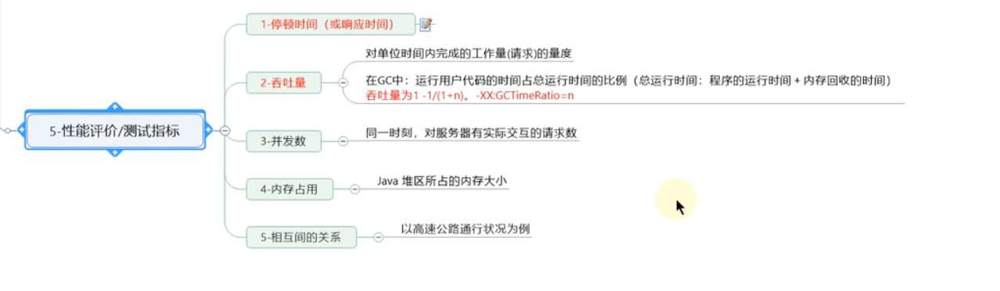
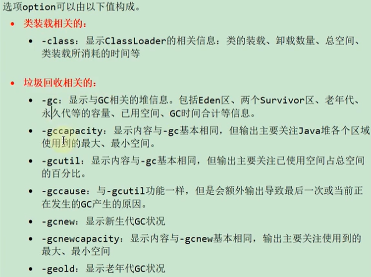
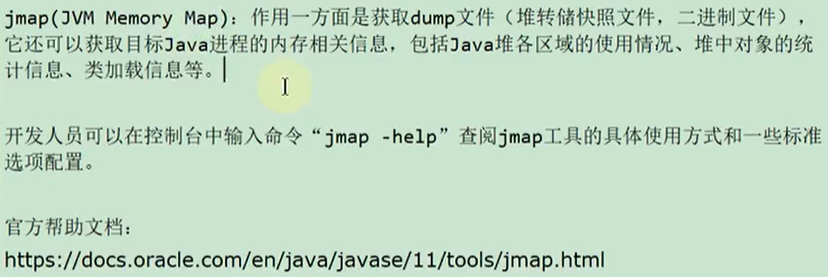
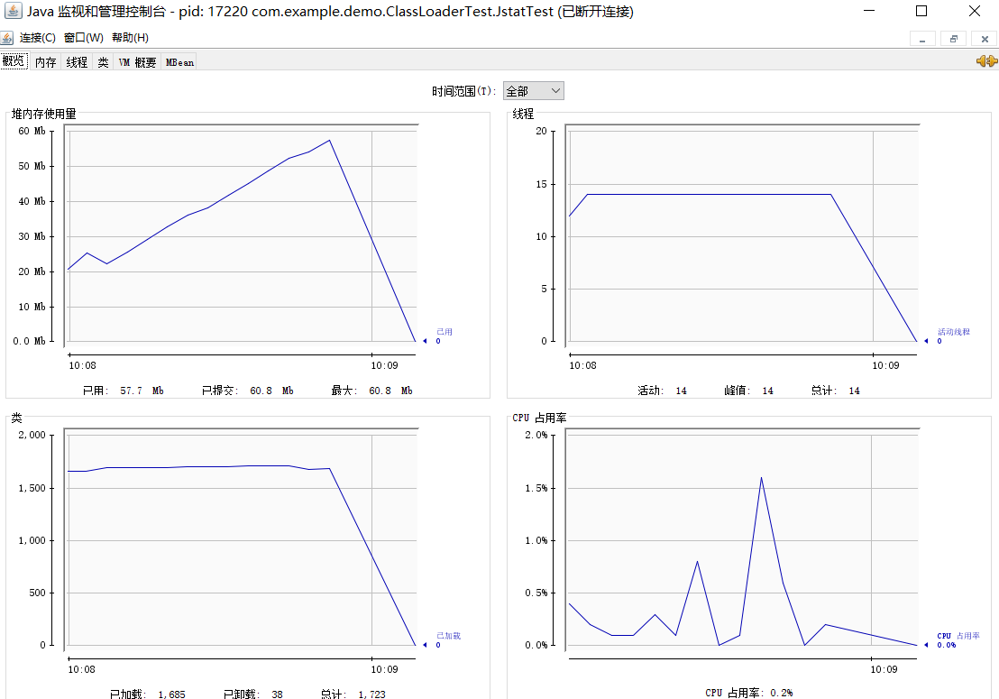
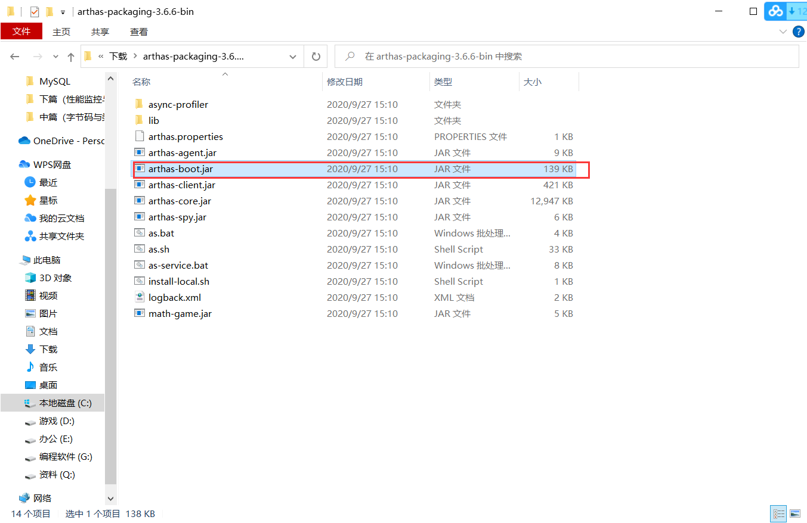

# 1、概述





# 2、JVM监控及诊断工具-命令行篇

以下使用的命令是jdk自带的。

**命令在bin目录下边**

**而命令对应的字节码文件，在lib目录下边的tools.jar里面，jar包存放的就是字节码文件，将tools.jar解压就可以查看命令对应的字节码文件**


## 1、jps：查看正在运行的java进程

jps（java process status）：可以查询正在运行的虚拟机进程，对于本地虚拟机进程来说，进程的本地虚拟机ID与操作系统的进程ID是一致的。

jps基本用法：`jps [options] [hostid]`


### option参数

可以使用命令`jps -v>a.txt`将打印的结果信息保存在文件里。


### hostid参数


## 2、jstat：查看JVM统计信息


命令示例：

- 示例1

```bash
# 程序进程id为18004 
# 统计数据的周期为：1000ms
jstat -class 18004 1000
```


- 示例2


```bash
# 程序进程id为3008
# 打印间隔为1000ms
# 打印5次
jstat -class 3008 1000 5
```


- 示例3


```bash
# -t加上timestamp
# -h2表示美两行数据打印一次表头
# 程序进程id为3008
# 打印间隔为1000ms
# 打印5次
jstat -class -t -h2 3008 1000 5
```


jstat的基本使用语法为：`jstat -<option> [-t] [-h<lines>] <vmid> [<interval>[count]]`

### options参数




#### -gc参数含义

```bash
C:\Users\10203\Desktop>jstat -gc 3008
 S0C    S1C    S0U    S1U      EC       EU        OC         OU       MC     MU    CCSC   CCSU   YGC     YGCT    FGC    FGCT     GCT
512.0  512.0   0.0    0.0   31232.0   4372.6   173568.0    1342.9   4864.0 3837.1 512.0  416.4     283    0.263   0      0.000    0.263
```

- S0C：第一个幸存者区的大小（B）
- S1C：第二个幸存者区的大小（B）
- S0U：第一个幸存者去已使用的大小（B）
- S1U：与上类似
- EC：Eden空间的大小（B）
- EU：Eden已使用的空间大小（B）
- OC、OU：老年代的大小、老年代已使用的大小
- MC、MU：方法区的大小、方法区已使用的大小
- CCSC、CCSU：压缩类空间的大小、压缩类空间已使用的大小
- YGC：从应用程序启动到采样时young gc次数
- YGCT：从应用程序启动到采样时 young gc消耗的时间
- FGC：full gc次数
- FGCT：full gc消耗的时间
- GCT：gc的总时间


### interval参数：用于指定输出统计数据的周期，单位为毫秒。即：查询间隔

### count参数：用于指定查询的次数

### -t参数：可以在输出信息前加上一个Timestamp列，显示程序的运行时间

### -h参数：可以在周期性数据输出时，输出多少行数据后输出一个表头信息


### 补充说明


## 3、jinfo：实时查看和修改JVM配置参数

### 说明


### 基本用法

通过options的选择不同，jinfo命令可以**查看**和**修改**对应的JVM参数。


### 拓展

1. `java -XX:+PrintFlagsInitial`：查看所有JVM参数启动的初始值
2. `java -XX:+PrintFlagsFinal`：查看所有JVM参数的最终值
3. `java -XX:PrintCommandLineFlags`：查看已经被用户或者JVM设置过的详细的XX参数的名称和值


## 4、jmap：导出内存映像文件&内存使用情况

### 说明




### 基本用法

 

1. -dump
   生成Java堆转储快照: dump文件
   特别的: -dump:live只保存堆中的存活对象

2. -heap


   输出整个堆空间的详细信息

3. -histo

   输出堆中对象的统计信息（只统计堆中的存活对象）

4. -permstat

   以ClassLoader为统计口径输出永久代的内存状态信息（仅linux/solaris平台有效）

5. -finalizerinfo

   显示在F-Queue中等待Finalizer线程执行finalize方法的对象（仅linux/solaris平台有效）

6. -F

   当虚拟机进程对-dump选项没有任何响应时，可使用此选项强制生成dump文件（仅linux/solaris平台有效）


### 使用1：导出内存映像文件

Heap Dump又叫堆存储文件，指一个Java进程在某个时间点的内存快照。

说明：

1. 通常在写Heap Dump文件前会触发一次Full GC，所以heap dump文件里保存的都是FullGC后留下的对象信息
2. 生成dump文件比较耗时。


- **手动生成（命令行生成）**

```bash
# format=b是为了让生成的dump文件和hprof文件格式对应起来
# 11696是进程id
jmap -dump:format=b,file=d\1.hprof 11696

# live只保存堆中的存活对象
jmap -dump:live,format=b,file=d\1.hprof 11696
```

说明：生成dump文件可能会太大，生成速度较慢，我们就可以加上live参数，只保存存活对象，这样可以更快生成dump文件

- **自动生成**

当程序发生OOM退出系统时，一些瞬时信息会随着程序的终止而消失，而重现OOM问题往往比较困难或者耗时。此时若能在OOM时，自动导出dump文件就显得非常迫切。

```bash
-XX:+HeapDumpOnOutOfMemoryError：在程序OOM时，导出应用程序的当前堆快照
-XX:HeapDumpPath=d:\5.hprof      可以指定堆快照的保存位置 
```


测试程序：

```java
/**
 * @author 千祎来了
 * @date 2022-09-03 19:41
 * 
 * -Xms60m -Xmx60m -XX:SurvivorRatio=8 -XX:+HeapDumpOnOutOfMemoryError -XX:HeapDumpPath=d:\5.hprof
 */
public class JstatTest {
    public static void main(String[] args) {
        List<byte[]> list = new ArrayList<>();

        for (int i = 0; i < 1000; i ++) {
            byte[] arr = new byte[1024 * 100];
            list.add(arr);
            try {
                Thread.sleep(120);
            } catch (InterruptedException e) {


            }
        }
    }
}
```


### 使用2：显示堆内存相关信息

`jmap -heap [进程id]>a.txt`


`jmap -histo [进程id]>b.txt`


### 使用3：其他作用

`jmap -permstat pid` 查看系统的classloader信息

`jmap -finalizerinfo`查看堆积在finalizer队列中的对象


### 小结


## 5、jhat：JDK自带堆分析工具（简单介绍）

### 说明


### 基本用法

`jhat [option] [dumpfile]`


## 6、jstack：打印JVM中线程快照


### 基本用法


可以通过`jstack`查看基本用法


## 7、jcmd：多功能命令行


可以使用`jcmd pid help`查看对应进程的可用命令


使用如下：

`jcmd pid VM.system_properties`

## 8、jstatd：远程主机信息收集


# 3、JVM监控及诊断工具-GUI篇

## 1、概述


## 2、jconsole

 


### 启动

在配置了jdk的环境变量后，在命令行输入`jconsole`即可启动窗口

此时选择需要监听的进程即可。




## 2、visual VM


### 插件安装


可以去官网下载，也可以直接在visual vm界面上点击`工具`进行下载。

通过命令行输入`jvisualvm`即可启动


#### 必备插件：visual GC


## 远程连接

远程连接步骤如下：

1. 确定远程服务器的ip地址
2. 添加JMX（通过JMX技术具体监控远端服务器哪个Java进程）
3. 修改`bin/catalina.sh`文件，连接远程的tomcat
4. 在`.../conf`中添加`jmxremote.access`和`jmxremote.password`文件
5. 将服务器地址改为公网ip地址
6. 设置阿里云安全策略和防火墙策略
7. 启动tomcat，查看tomcat启动日志和端口监听
8. JMX中输入端口号、用户名、密码登录


# P327~334先空起来


# 4、内存泄漏

## 内存泄露

内存泄漏：对象不再被程序用到了，但是GC又不能回收他们的情况。

实际中会有一些不好的实践导致对象的生命周期变得很长甚至导致OOM，也可以叫做宽泛意义上的“内存泄漏”。


## 内存溢出

申请内存时，没有足够的内存可以使用。


## Java中内存泄漏的8种情况

### 1、静态集合类

静态集合类，如HashMap、LinkedList等，如果这些容器为静态的，那么他们的生命周期和JVM程序一直，则容器中的对象在程序结束之前不能被释放，从而造成内存泄漏。

简而言之，长生命周期的集合持有短生命周期对象的引用，导致短生命周期对象不能被回收。


### 2、单例模式

与静态集合类导致内存泄漏的原因相似，因为单例的静态特性，它的生命周期和JVM的生命周期一样长，因此如果单例对象持有外部对象的引用，会导致外部对象不会被回收。


### 3、内部类持有外部类

如果一个外部类的实例对象的方法返回了一个内部类的实例对象。

这个内部类对象被长期饮用了，即使哪个外部类实例对象不再被引用，但是由于内部类持有外部类的实例对象，这个外部类对象将不会被垃圾回收，导致内存泄漏。


### 4、各种连接：数据库连接、网络连接和IO连接

对于这些连接，不使用的时候需要调用close方法来释放连接，释放连接后对象才会被回收，如果不关闭的话，将会造成大量的对象无法回收，从而造成内存泄露。


### 5、变量不合理的作用域

一个变量的定义的作用范围大于其适用范围，很有可能造成内存泄露。


### 6、改变哈希值

当一个对象被存储进HashSet集合中以后，就不能修改这个对象中的那些参与计算哈希值的字段了。

否则，对象修改后的哈希值与最初存入HashSet集合时的哈希值就不同了，这种情况下，即使在contains方法使用该对象的当前引用作为参数去HashSet集合中检索对象，也将返回找不到对象的结果，这也会导致HashSet集合中无法单独删除当前对象，造成内存泄漏


为什么改变哈希值之后找不到对象？因为根据存入时的哈希值去寻找放入的位置，而改变哈希值之后，再去查找就按照新的哈希值所对应的位置去查找，肯定找不到。


这也是 String 为什么被设置成了不可变类型，我们可以放心的把 String 存入 HashSet，或者把String当作 HashMap 的 key 值。


代码示例：

```java
public class ChangeHashCodeTest {
    public static void main(String[] args) {
        HashSet<Point> set = new HashSet<>();
        Point cc = new Point();
        cc.setX(10); // hashCode = 10
        set.add(cc);
        cc.setX(20); // hashCode = 20
        System.out.println("set remove = " + set.remove(cc));
        set.add(cc);
        System.out.println("set.size = " + set.size());

        /**
         * 输出：
         * set remove = false
         * set.size = 2
         */
    }
}

class Point {
    int x;

    public int getX() {
        return x;
    }

    public void setX(int x) {
        this.x = x;
    }

    @Override
    public boolean equals(Object o) {
        if (this == o) return true;
        if (o == null || getClass() != o.getClass()) return false;
        Point point = (Point) o;
        return x == point.x;
    }

    @Override 
    public int hashCode() {
        return x;
    }
}
```


### 7、缓存泄露

一旦把对象引用放入到缓存中，他就很容易遗忘。比如：之前项目在一次上线的时候，应用启动奇慢，就是因为代码会加载一个表的数据到缓存中，测试环境只有几百条数据，而生产环境有几百万的数据。

对于这个问题，可以使用WeakHashMap代表缓存，此Map的特点是：当初了自身有key的引用外，此key没有其他引用，那么此map会自动丢弃此值。


### 8、监听器和回调

如果客户端在你实现的API中注册回调，却没有显式的取消，那么就会堆积。

需要确保回调立即被当做垃圾回收的最佳方法是只保存它的弱引用，例如将他们保存为WeakHashMap中的键。


# 5、JProfiler工具


341~349先空 JProfiler的学习


# 6、Arthas-阿里巴巴开源的性能分析神器（阿尔萨斯）


## 安装和下载

1. 直接进入官网，点击进行下载。

`https://arthas.aliyun.com/doc/install-detail.html`


2. 将下载的压缩包解压之后，把`arthas-boot.jar`传到linux服务器上。




3. 启动jar包（输入`exit`可以退出）

启动有两种方式：

方式1：`java -jar arthas-boot.jar`

方式2：`java -jar arthas-boot.jar [PID]` 运行时选择 Java 进程 PID（可通过JPS查看java进程）


# 7、JVM运行时参数


## 1、JVM参数选项类型


- 类型一：标准参数选项

特点：比较稳定，后续版本基本不会变化，以`-`开头

运行`java`或者`java -help`可以查看所有的标准项

- 类型二：`-X`参数选项

特点：非标准化参数

运行`java -X`命令可以看到所有的X选项

> JVM的JIT编译模式相关的选项
>
> -Xint：禁用JIT，所有字节码都被解释执行，这个模式的速度最慢的
>
> -Xcomp：所有字节码第一次使用就都被编译成本地代码，然后再执行
>
> -Xmixed：混合模式，默认模式，让JIT根据程序运行的情况，选择编译或解释

**注意：-Xmx -Xms -Xss（设置java线程堆栈大小）属于XX参数**

-Xms等价于-XX:InitialHeapSize

-Xmx等价于-XX:MaxHeapSize

-Xss等价于-XX:ThreadStackSize


- 类型三：`-XX`参数选项 ★

特点：非标准化参数，使用最多。

作用：用于开发和调试JVM

分类：

1. Boolean类型格式

   `-XX:+<option>`：表示启用 option 属性

   `-XX:-<option>`：表示禁用 option 属性

2. 非Boolean类型格式（key-value）

   子类型1：数值型格式`-XX:<option>=<number>`

   子类型2：非数值型格式`-XX:<name>=<string>`

特别的，`-XX:+PrintFlagsFinal`输出所有参数的名称和默认值

## 2、添加JVM参数选项

1. IDEA


2. 运行jar包：`java -Xms50m -Xmx50m -XX:PrintGCDetails -XX:+PrintGCTimeStamps -jar demo.jar`
3. 程序运行中，`jinfo -flag [+|-]<name> <pid>`或者`jinfo -flag <name>=<value> <pid>`


## 3、常用的JVM参数选项

### 打印设置的XX选项及值


### 堆、栈、方法区等内存大小及设置


 

### OutofMemory相关的选项


**-XX:OnOutOfMemoryError**


### 垃圾收集器相关选项


#### 1、Serial回收器

`-XX:+UseSerialGC`

在HotSpot的Client模式下（硬件配置较低）

Serial是新生代垃圾收集器，Serial Old是老年代垃圾收集器。

年轻代和老年代都穿行回收，单线程收集效率高。


#### 2、PerNew回收器

`-XX:+UseParNewGC`：表示年轻代使用并行收集器，不影响老年代（老年代自己指定）

`-XX:ParallelGCThreads=N`：限制线程数量，默认开启和CPU数据相同的线程数


#### 3、Parallel回收器


#### 4、CMS回收器（老年代垃圾回收器）

从CMS开始，GC线程和用户线程可以并发（同时）执行，用户体验好。

但是CMS只能和年轻代的 Serial GC 和 ParNew GC 搭配，。


#### 5、G1回收器


**Mixed GC调优参数**


### 如何选择垃圾回收器


### GC日志相关选项


-Xloggc使用格式：**`-Xloggc:d:/heaplog.log`**


### 其他参数


## 4、分析GC日志

### GC分类


`>年轻代大对象进入老年代，而老年代的空间不足`


### Minor GC日志


**示例：**

`VM Options设置：-Xms60m -Xmx60m -XX:+PrintGCDetails -XX:+PrintGCTimeStamps`

```java
GC 日志
13.684: [GC (Allocation Failure) [PSYoungGen: 15309K->2556K(17920K)] 15309K->12189K(58880K), 0.0089976 secs] [Times: user=0.01 sys=0.14, real=0.01 secs] 

32.907: [GC (Allocation Failure) [PSYoungGen: 17843K->2532K(17920K)] 27476K->27483K(58880K), 0.0047619 secs] [Times: user=0.00 sys=0.00, real=0.00 secs] 
```


### Full GC日志


**示例：**

`VM Options设置：-Xms60m -Xmx60m -XX:+PrintGCDetails -XX:+PrintGCTimeStamps`

```java
32.912: [Full GC (Ergonomics) [PSYoungGen: 2532K->0K(17920K)] [ParOldGen: 24951K->27053K(40960K)] 27483K->27053K(58880K), [Metaspace: 3801K->3801K(1056768K)], 0.0083610 secs] [Times: user=0.00 sys=0.00, real=0.01 secs] 
51.716: [Full GC (Ergonomics) [PSYoungGen: 15301K->1400K(17920K)] [ParOldGen: 27053K->40541K(40960K)] 42354K->41941K(58880K), [Metaspace: 3801K->3801K(1056768K)], 0.0169658 secs] [Times: user=0.02 sys=0.00, real=0.02 secs] 
69.188: [Full GC (Ergonomics) [PSYoungGen: 15294K->15202K(17920K)] [ParOldGen: 40541K->40489K(40960K)] 55836K->55691K(58880K), [Metaspace: 3801K->3801K(1056768K)], 0.0130832 secs] [Times: user=0.00 sys=0.00, real=0.01 secs] 

```


