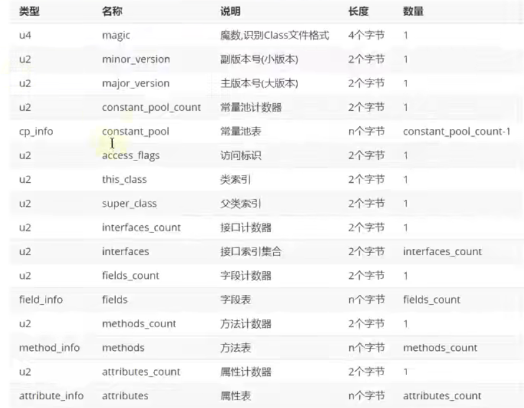
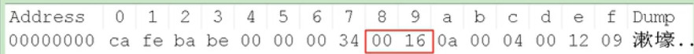
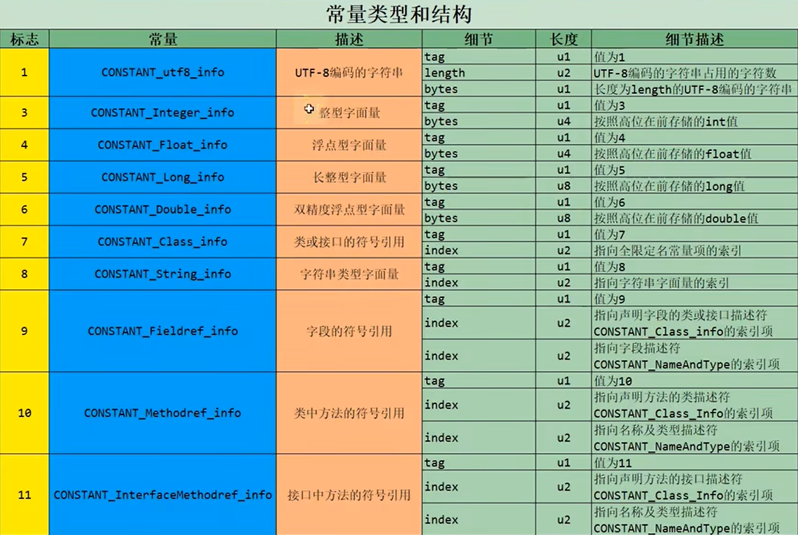
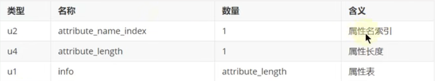
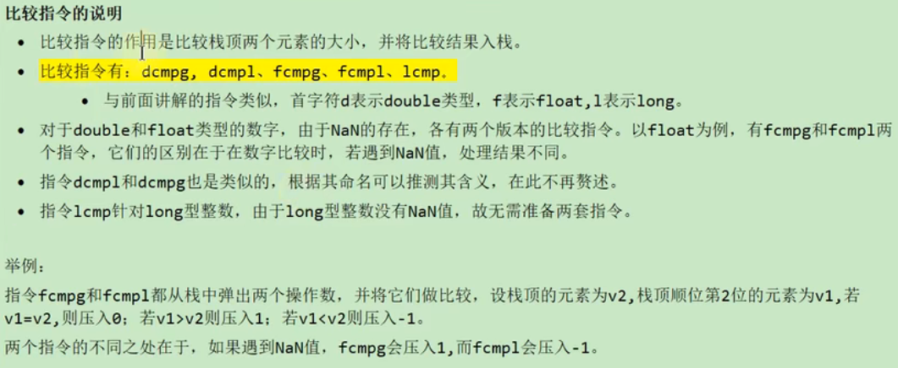
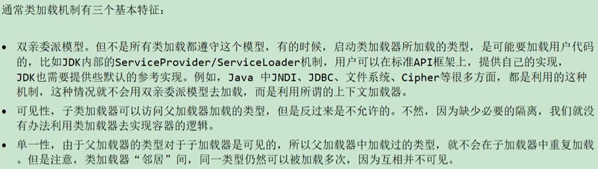

# 1、Class文件结构

## 概述

### 字节码文件的跨平台性

Javac编译器将java源码编译成字节码文件经历了4个步骤：**词法解析、语法解析、语义解析、生成字节码。**


Oracle的JDK软件包括两部分内容：

- 一部分是将Java源代码编译成Java虚拟机的指令集的编译器
- 另一部分是用于实现Java虚拟机的运行时环境


### Java的前端编译器

将java代码编译为字节码文件的编译器就是Java的**前端编译器**。**javac** 即为一种前端编译器。

JIT编译器称为**后端编译器**。

前端编译器不属于JVM的一部分，后端编译器属于JVM。

IDEA默认使用 javac 编译器，也可以自己设置为 AspectJ 编译器的 ajc，前端编译器并不会直接涉及编译优化等方面的技术，而是将这些具体优化细节移交给 HotSpot 的 JIT 编译器负责。


### 透过字节码指令看代码细节


#### 1、BAT面试题

1. 类文件结构有几个部分？
2. 知道字节码吗？字节码都有哪些？`Integer x = 5; int y = 5;` 比较 `x == y` 都经过哪些步骤？


#### 代码演示1

```java
public class IntegerTest {
    public static void main(String[] args) {

        Integer x = 5;
        int y = 5;
        System.out.println(x == y); // true 自动拆箱  1

        Integer i1 = 10;
        Integer i2 = 10;
        System.out.println(i1 == i2); // true Integer缓存   2

        Integer i3 = 128;
        Integer i4 = 128;
        System.out.println(i3 == i4); // false 没有缓存   3

    }
}
```


上述代码解释如下：

看下图字节码，

字节码的第1行调用了 `Integer.valueOf` ，在该方法中，会去Integer的缓存中获取缓存中的数据，缓存的数据范围是：`-128~127`，由于 x=5 在这个范围内，所以取缓存中的值，在字节码 11 行处，取数时调用了 intValue 方法，获取了 x 对应的int值，所以 `x==y` 的结果为true。

`i1 == i2`结果为true，是因为获取了缓存中的值，所以比较地址，地址相同，这里并没有调用 `intValue` 方法。

`i3 == i4`结果为false，是因为128没有在缓存的范围，去创建了新的 `Integer` ，比较地址并不相同。


#### 代码演示2

```java
public class StringTest {
    public static void main(String[] args) {
        String str = new String("hello") + new String("world");
        String str1 = "helloworld";
        System.out.println(str == str1); // false
    }
}
```


如下图字节码文件：

0行先创建了一个 `StringBuilder`

`new String("hello") ` 操作：4行初始化 `StringBuilder`，13行对String初始化，16行进行append添加操作

之后对 `new String("world")`也是同样的操作

在21行处，调用了`StringBuilder`的`toString()`方法，在该方法中会创建一个新的字符串也就是`new String()`

因此str是存储在堆中的，而str1是存储在字符串常量池中的，地址肯定不同


#### 代码演示3 ☆

```java
class Father {
    int x = 10;

    public Father() {
        this.print();  
        x = 20;  
    }
    public void print() {
        System.out.println("Father.x = " + x);
    }
}

class Son extends Father {
    int x = 30;
    public Son() {
        this.print();
        x = 40;
    }
    public void print() {
        System.out.println("Son.x = " + x);
    }
}

public class SonTest {
    public static void main(String[] args) {
        Father f = new Son();
        System.out.println(f.x);
        /**
         * 输出：
         * Son.x = 0
         * Son.x = 30
         * 20
         */
    }
}
```


先了解一下**成员变量（非静态）的赋值过程：**

①默认初始化（初始化类的定义，`private String name;`）  - > ②显式初始化/代码块初始化`对变量进行赋值`  ->③构造器中初始化 -> ④有了对象之后，可通过`对象.属性`或`对象.方法`的方式对成员变量进行赋值


接下来，我们通过字节码分析代码的执行顺序，

我们先将鼠标指到Son类上，查看Son类的字节码文件，如下图：


我们看到，执行Son类的初始化方法之前，在字节码文件 1 行处，先去执行了父类 Father 的初始化方法，在父类的初始化方法中调用了`this.print`方法，由于此时`this`是Son类，所以调用了子类的`print`方法，因此打印了`Son.x = 0`，之后令`x=20`，之后去执行Son类的初始化方法，在Son类初始化之前，会进行默认和显式初始化，即执行了Son类中的`x = 30`，再去执行初始化方法，调用`this.print`方法，因此打印了`Son.x = 30`，之后再去调用`f.x`，属性不存在多态性，因此Father类里的x属性值是20，因此打印了`20`。


## Class文件结构

- 字节码文件里是什么？

字节码文件是java代码经编译后的文件，是二进制的类文件，内容是JVM的指令，而不是像C、C++经由编译器直接生成机器码。

- 什么是字节码指令？

Java虚拟机的指令由一个字节长度的、代表着某种特定操作含义的操作码以及跟随其后的零至多个代表此操作所需参数的操作数所构成。虚拟机中许多指令并不包含操作数，只有一个操作码。

- 如何解读字节码文件？

1、下载idea的插件 jclasslib 来解读字节码文件。

2、javap命令反编译字节码文件


### Class文件格式

Class 文件中没有任何的分隔符号，所以说无论是字节顺序还是数量，都是被严格限定的，哪个字节代表什么含义，长度是多少，先后顺序如何，都不允许改变。


Class 文件格式采用一种类似于 C语言 结构体的方式进行数据存储，这种结构中只有两种数据类型： 无符号数和表。

- 无符号数属于基本的数据类型。u1,u2,u4,u8分别代表1、2、4、8个字节的无符号数。无符号数可以描述数字、索引引用、数量值或者按照 UTF-8 编码构成字符串值。
- 表是由多个无符号数或者其他表作为数据项构成的复合数据类型，所有表都习惯性以“_info”结尾。整个Class文件本质上就是一张表，由于表没有固定长度，所以通常会在其前面加上个数说明。


### Class文件结构概述

Class文件的结构并不是一成不变的，随着JVM的不断发展，总是不可避免地会对Class文件结构做出一些调整，但是其基本的结构和框架是非常稳定的。

Class文件的总体结构如下：

- 魔数
- Class文件版本
- 常量池
- 访问标志
- 类索引，父类索引，接口索引集合
- 字段表集合
- 方法表集合
- 属性表集合



### Class文件解读

Class文件基本格式包括以下八个部分。

#### 1、Magic Number（魔数）

- 每个 Class 文件开头的4个字节的无符号整数称为魔数
- 它的唯一作用是确定这个文件是否为一个能被虚拟机接受的有效合法的Class文件。即：魔数是Class文件的标识符
- 魔数值固定为：`0xCAFEBABE`（读音：开非baby）
- 使用魔数而不是扩展名来进行识别class文件主要是基于安全方面的考虑，因为文件扩展名可以随意的改动


#### 2、Class文件版本号

- 紧接魔数的 4 个字节存储的是 Class 文件的版本号。
- 第5、6个字节标识编译的副版本号 `minor_version`，第7、8个字节标识编译的主版本号 `major_version`
- 他们共同构成了 class 文件的格式版本号。例如某个class文件的主版本号为 M ，副版本号为 m，那么这个 Class 文件的格式版本号就确定为 M.m
- 版本号和Java编译器所对应
- Java的版本号是从45开始的，JDK1.1之后的每个JDK大版本发布，主版本号向上加1
- 不同版本的Java编译器编译的Class文件对应的版本是不一样的。目前高版本的Java虚拟机可以执行由低版本编译器生成的Class文件，反之报错。


#### 3、常量池：存放所有常量

- 常量池是Class文件中内容最为丰富的区域之一。
- 常量池是整个Class文件的基石。
- 在版本号之后，紧跟着常量池的数量以及若干个常量池表项
- 常量池的入口防止一项 u2 类型的无符号数，代表常量池的容量计数值。与Java语言习惯不同，这个容量计数是从1开始而不是0开始
- **常量池表项中，用于存放编译时期生成的各种字面量和符号引用，这部分内容将在类加载后进入方法区的运行时常量池中存放**

**常量池计数器（constant_pool_count）**

- 常量池的大小不固定，所以使用 2 字节表示常量池容量计数值

- 常量池容量计数值（u2类型）：从1开始，表示常量池中有多少项常量，即如果`constant_pool_count = 1`表示常量池中由0个常量项

- 

  如上图，值为0x0016，也就是22

  **需要注意：**实际上只有21项常量，索引范围是1-21，这是因为常量池从1开始，把第0项常量空出来了。这是为了在特定情况下表达“不引用任何一个常量池项目”的含义，这种情况可以用索引值0表示。


**常量池表（constant_pool [ ]）**

- constant_pool是一种表结构，索引为：`1 ~ constant_pool_count - 1`。表明了后面有多少个常量项。
- 常量池主要存放两大类常量：**字面量（Literal）**和**符号引用（Symbolic Reference）**
- 它包含了class文件结构及其子结构中引用的所有字符串常量、类或接口名、字段名和其他常量。常量池中的每一项都具备相同的特征。第1个字节作为类型表及，用于确定该项的格式，这个字节称为tag byte





**字面量和符号引用**

常量池主要存放两大类常量：字面量和符号引用。

字面量：文本字符串、声明为final的常量值

符号引用：类和接口的全限定名、字段的名称和描述符、方法的名称和描述符


1. 全限定名`com/atguigu/java/demo` ，仅仅是把包名中的“.”替换成了“/”。
2. 简单名称：只没有类型和参数修饰的方法或者字段名称，例如`add()和num字段的简单名称分别为 add、num`
3. 描述符：描述符的作用是用来描述字段的数据类型、方法的参数列表（包括数量、类型以及顺序）和返回值。


代码演示描述符：

下面打印数组地址时，**使用了描述符来描述数组**。

```java
public class ArrayTest {
    public static void main(String[] args) {
        Object[] arr1 = new Object[10];
        System.out.println(arr1); // [Ljava.lang.Object;@9807454 

        String[] arr2 = new String[10];
        System.out.println(arr2); // [Ljava.lang.String;@3d494fbf

        long[][] arr3 = new long[10][];
        System.out.println(arr3); // [[J@1ddc4ec2
    }
}

```


**补充说明：**

虚拟机在加载class文件时才会进行动态链接，也就是说，class文件中不会保存各个方法和字段的最终内存布局信息，因此，这些字段和方法的符号引用不经过转换时无法直接被虚拟机使用的。**当虚拟机运行时，需要从常量池中获得对应的符号引用，再在类加载过程中的解析阶段将其替换为直接引用，并翻译到具体的内存地址中。**

- 符号引用：符号引用以一组符号描述所引用的目标。**符号引用与虚拟机实现的内存布局无关**，引用的目标并不一定已经加载到了内存中。
- 直接引用：直接引用可以直接指向目标的指针、相对偏移量或时一个能简介定位到目标的句柄。**直接引用是与虚拟机实现的内存布局相关的**，同一个符号引用在不同虚拟机实例上翻译出来的直接引用一般不会相同。直接引用的目标是存在于内存的。


##### 解读class二进制文件的常量池

如何解读呢？

每一个数据开头都会存在一个tag标志，这个tag标志对应了常量池表中的标志，假如标志为`0a`的话，那么对应的标志（十进制）为10，我们去查找常量类型表，就知道该数据的类型和结构了！


##### 常量池总结

常量池可以理解为 class 文件中的资源仓库，他是 class 文件结构中与其他项目关联最多的数据类型，也是占用 class 文件空间最大的数据项目之一


#### 4、访问标识（access_flag、访问标志、访问标记）

- 在常量池后，紧跟着访问标记。该标记使用两个字节标识，用于识别一些类或者接口层次的访问信息，包括：class是类还是接口；是否是public类型；是否是abstract类型；如果是类的话，是否被声明为final等。


- 类的访问权限通常为 ACC_ 开头的常量
- 每一种类型的标识都是通过设置访问标记的32位中的特定位来实现的。比如，若是public final的类，则该标记为 ACC_PUBLIC | ACC_FINAL
- 使用 ACC_SUPER 可以让类更准确地定位到父类地方法 super.method() ，现代编译器都会设置并且使用这个标记

如下图字节码文件（十六进制显示），会发现访问表示为21，那么再看上边访问表示的图，并没有标志值为21的标志，只是因为21是由两个访问标识组合而成的，21 = 20 + 1，也就是 `ACC_PUBLIC + ACC_SUPER` 组合而成。


**补充说明：**

1. 带有 ACC_INTERFACE 标志的class文件表示的是接口而不是类，反之则表示的是类而不是接口。
   1. 如果一个class文件被设置成了 ACC_INTERFACE 标志，那么同时也得设置 ACC_ABSTRACT 标志。同时不能设置 ACC_FINAL、ACC_SUPER 或 ACC_ENUM标志
   2. 如果没有设置 ACC_INTERFACE 标志，那么这个class文件可以具有除了 ACC_ANNOTATION 外的其他所有标志。当前ACC_FINAL和ACC_ABSTRACT这类互斥的标志除外。
2. ACC_SUPER标志（默认设置）用于确定类或接口里面的invokespecial指令使用的是哪一种执行语义。**针对Java虚拟机指令集的编译器都应当设置这个标志。主要是为了向后兼容由旧Java编译器所编译的代码而设计的（了解即可）**
3. ACC_SYNTHETIC标志意味着该类或接口是由编译器生成的，而不是由源代码生成的
4. 注解类型必须设置 ACC_ANNOTATION，如果设置了 ACC_ANNOTATION，那么也必须设置 ACC_INTERFACE
5. ACC_ENUM标志表明该类或其父类为枚举类型


#### 5、类索引、父类索引、接口索引集合


#### 6、字段表集合

分为字段计数器和字段表

**fields**

- 用于描述接口或类中声明的变量。字段包括类级变量以及实例级变量，但是不包括方法内部、代码块内部声明的局部变量
- 字段的名字、类型都是用常量池中的常量来描述
- 它指向常量池索引集合，它描述了每个字段的完整信息：字段标识符、访问修饰符（public）、类变量还是实例变量（static）、常量（final）

**注意事项**

- 字段表集合不会列出从父类或实现的接口中继承的字段，但有可能列出Java代码不存在的字段。如在内部类中为了保持对外部类的访问性，会自动添加指向外部类实例的字段。
- 在Java中字段无法重载，也就是无论访问修饰符、数据类型是否相同，字段名都不能重复。但是在字节码中，如果两个字段的描述符不一致，那字段崇明就是合法的。


**字段访问标志**


**字段名索引：根据字段名索引的值，查询常量池中的指定索引项即可**


**描述符索引**

描述符的作用是描述字段的数据类型、方法的参数列表（包括数量、类型以及顺序）和返回值。


**属性表集合**

一个字段还可能拥有一些属性`（常量属性含有，public final ...）`，用于存储更多的额外信息。比如初始化值、一些注释信息。

属性个数存放在`attribute_count`，属性具体内容存放在`attributes`数组中


#### 7、方法表集合

同字段表集合一样，也是包含了方法计数器和方法表


**方法表**


**方法表访问标志**


#### 8、属性表集合

也包含属性计数器和属性表。

 


**属性的通用格式**



**属性表**


### Class文件解读整体图

下图缺少了对属性了解析，大概了解即可。


## 使用javap指令解析Class文件


### java -g

解析字节码文件得到的信息中，有些信息（如局部变量表、常量池中方法的参数名称等等）需要在使用javac编译成class文件时，指定参数才能输出。

比如，使用 `javac xx.java` ，就不会生成对应的局部变量表等信息，如果使用 `javac -g xx.java` 就可以生成所有相关信息了。


### javap用法

**javap的用法格式：`javap <options> <classes>`**

其中classes就是要反编译的class文件

在命令行直接输入javap或者javap -help就可以看到option选项

`-v`可以反编译的信息较全，使用较多，但不会显示私有的字段，可以使用`javap -v -p xx.class`显示更全的信息


# 2、字节码指令集与解析举例


## 概述

- Java虚拟机的指令由一个字节长度的、代表着某种特定操作含义的数字（称为操作码、Opcode）以及跟随其后的零至多个代表此操作所需参数（称为操作数，Operands）而构成。由于Java虚拟机采用面向操作数栈而不是寄存器的结构，所以大多数的指令都不包含操作数，只有一个操作码。


### 字节码与数据类型


局部变量表中一个slot放一个变量，一个slot也就是4个字节，所以说byte、short等都用int来存储


### 指令分类


## 1、加载与存储指令

### 作用

加载和存储指令用于将数据从栈帧的局部变量表和操作数栈之间来回传递


### 回顾操作数栈与局部变量表

- 操作数栈

每当为Java方法分配栈帧时，Java虚拟机也会开辟一块额外的空间作为操作数栈，来存放计算的操作数以及返回结果。

- 局部变量表

Java方法栈帧的另一个重要组成部分就是局部变量表，字节码程序可以将计算的结果缓存在局部变量区之中。

实际上，Java虚拟机将局部变量表当成一个数组，一次存放 this 指针（非静态方法），所传入的参数，以及字节码中的局部变量。

和操作数栈一样，long 类型以及 double 类型的值将占据两个单元，其余类型占据一个单元


举个例子

```java
public void foo(long l, float f) {
  {
    int i = 0;
  }
  {
    String s = "Hello, World";
  }
}
```

对应的局部变量表与操作数栈：

左边绿色的是局部变量表，this占1个slot（4B），l（long）占2给，f占1个，i和s共同占一个，这是因为 i 和 s 是局部变量，出了代码块就失效了，所以进行槽位的复用。


**在栈帧中，与性能调优关系最为密切的部分就是局部变量表。局部变量表中的变量也是重要的垃圾回收根节点，只要被局部变量表中直接或间接引用的对象都不会被回收。**


### 常用指令

压栈指令中 ： `a`是引用数据类型。


### 1、局部变量压栈指令

局部变量压栈指令将指定的局部变量表中的数据压入操作数栈中。

这类指令大体可以分为：

- `xload_<n>` （x为i、l、f、d、a（引用类型），n为0到3）
- `xload`（x为i、l、f、d、a）

x的取值表示数据类型

指令`xload_n`表示将第 n 个局部变量压入操作数栈。


### 2、常量入栈指令

常量入栈指令的功能是将常数压入操作数栈，根据数据类型和入栈内容的不同，又可以分为 const系列、push系列和 ldc系列。

- const系列：用于对特定的常量入栈，入栈的常量隐含在指令本身。

指令由：`iconst_<i>`（i从-1到5）、`lconst_<l>`（l从0到1）、`fconst_<f>`（f从0到2）、`dconst_<d>`（d从0到1）、`aconst_null`

比如：

```java
iconst_m1将-1压入操作数栈
iconst_x（x为0到5）将x压入栈
lconst_0、lconst_1分别将长整数0和1压入栈
fconst_0、fconst_1、fconst_2分别将浮点数0、1、2压入栈
dconst_0和dconst_1分别将double型0和1压入栈
aconst_null将null压入栈
```

- push系列：主要包括 bipush 和 sipush 。他们的区别在于接受数据类型的不同，bipush接收8位整数作为参数，sipush接收16位整数，他们都将参数压入栈中

- ldc系列：如果以上指令都不能满足需求，那么可以使用万能的**ldc指令**，它可以接受一个8位的参数，该参数指向常量池中的int、float或者String的索引，将指定的内容压入栈。

  类似的还有 **ldc_w**，她能接受两个8位参数，能支持的索引范围大于 ldc

  如果要押入的元素是long或者double类型，则使用 **ldc2_w**指令。


### 3、出栈装入局部变量表指令

出栈装入局部变量表指令用于将操作数栈中栈顶元素弹出，装入局部变量表指定位置。

这类指令主要以 store 的形式存在，比如 xstore（x位i、l、f、d、a）、xstore_n（n位0至3）

- 其中，`istore_n`将从操作数栈中弹出一个整数，并把它赋值给局部变量索引n的位置
- `xstore`由于没有隐含参数信息，因此需要提供一个byte类型的参数指定目标局部变量表的位置

**说明**
为了尽可能压缩指令大小，使用了 `istore_0, istore_1, istore_2, istore_3`分别表示从操作数栈顶弹出一个元素，放入局部变量表第0、1、2、3个位置

其余位置可以加一个参数表示放入局部变量表的位置。


## 2、算术指令

大体分为两类：

1. 对整形数据运算
2. 对浮点型数据运算

当一个操作产生溢出时，会使用有符号的无穷大表示，如果某个操作结果没有没明确的数学定义的话，会使用 NaN 值（not a number）来表示。


### 算术指令


### 比较指令




### 彻底搞懂 ++ 运算符

```java
public class IncTest {
    public static void main(String[] args) {
        int i = 10;
        i = i ++;
        System.out.println(i); // i = 10
    }
}
```


下面对字节码进行解读为何打印出i的值为10

```java
bipush 10    # 将10放入操作数栈
istore_1     # 将10从操作数栈取出，放入局部变量表索引为1的位置，因为是静态main方法，索引为0处放的是args参数
iload_1      # 取出局部变量表索引1处的值为10到操作数栈 
iinc 1 by 1  # 对局部变量表索引1处的值+1，此时局部变量表索引为1处值为11
istore_1     # 取出操作数栈中的10存入局部变量表索引1处，此时局部变量表索引1处值为10
getstatic #2 <java/lang/System.out>  
iload_1
invokevirtual #3 <java/io/PrintStream.println>
return
```


## 3、类型转换指令

- 将两种不同数值类型进行相互转换
- 这些转换操作一般用于实现用户代码中的**显式类型转换操作**，或者用来处理**字节码指令集中数据类型相关指令无法与数据类型一一对应的问题**。

### 宽化类型转换

1. 转换规则

JVM虚拟机直接支持小范围类型向大范围类型的安全转换，并不需要指令执行，包括：

- int到long、float、double，对应指令为：`i2l,i2f,i2d`
- long到float、double，对应指令为：`l2f,l2d`
- float到double，对应指令为：`f2d`

简化为：`int --> long --> floag --> double`

```java
// 代码如下
int a = 10;
long b = a;
floag c = a;
double d = a;
```


2. 精度损失问题

- 宽化类型转换是不会因为超过目标类型最大值而丢失信息的，例如，从int转换到long，或从int转换到double，都不会丢失信息。
- 从int、long转float，或者long转double，可能发生精度丢失——可能丢失掉几个最低有效位上的痣


3. 补充说明

**从byte、char、short到int的转换实际上是不存在的。**对于byte转int，虚拟机并没有做实质性的转化处理，只是简单地通过操作数栈交换了两个数据。而byte转long时，使用 `i2l`，可以看到在内部byte在这里已经等同于int类型处理，short处理与之类似，这样处理有两个特点：

- 一方面可以减少实际的数据类型，如果为short和byte都准备一套指令，那么指令数目会增多，**而虚拟机目前的设计上，只愿意是用一个字节表示指令，因此指令总数不能超过256个，为了节省指令资源，将short和byte当作int处理也在情理之中**
- 另一方面，局部变量表的slot槽位固定为32位，所以无论byte或者short都会在局部变量表中占据32位空间，因此也没有必要区分

### 窄化类型转换（或强制类型转换）

1. 转换规则

- int到byte、short、char类型，对应指令：`i2b, i2s, i2c`
- long到int，对应指令：`l2i`
- float到int、long，对应指令：`f2i, f2l`
- double到int、long、float，对应指令：`d2i, d2l, d2f`

```java
int i = 10;
byte b = (byte) i;
short s = (short) i;
char c = (char) i;
long l = 10L;
int i1 = (int) l;
byte b1 = (byte) l;
```


2. 精度损失

窄化类型转换可能会导致转换结果具备不同的正负号、不同的数量级，因此，转换过程很可能会导致数值丢失精度


3. 补充说明


## 4、对象的创建与访问指令

### 创建指令


代码实例：


**为什么创建二维的String数组，字节码显示的确实一维的，因为第二维没有初始化。**


### 字段访问指令


`getstatic #8`获取System.out字段，放入栈中


### 数组操作指令

这里的store是对 **堆中的数组** 进行赋值


### 类型检查指令


## 5、方法调用与返回指令

### 方法调用指令


**invokespecial：调用的方法都不存在方法的重写**

**invokevirtual：调用的方法可能会被重写**


### 方法返回指令


## 6、操作数栈管理指令


## 7、控制转移指令


### 条件跳转指令


**代码示例：**

```java
public class ComTest {
    public static void main(String[] args) {
        int i1 = 10;
        long l1 = 20;
        System.out.println(i1 < l1);
    }
}

// 字节码
 0 bipush 10     # 向操作数栈放入10
 2 istore_1      # 弹出栈中的10存在局部变量表索引1处
 3 ldc2_w #2 <20> # 从常量池中取出20入栈
 6 lstore_2       # 弹出栈中20存入局部变量表索引2处
 7 getstatic #4 <java/lang/System.out>  # 将System.out字段入栈
10 iload_1        # 将局部变量表的10入栈
11 i2l            # 将10转为long类型 
12 lload_2        # 将局部变量表的20入栈
13 lcmp           # 进行比较操作，将10和20弹出栈比较，比较结果入栈
14 ifge 21 (+7)   # 如果栈顶元素大于等于0，则跳转到21行
17 iconst_1       # 将1放入操作数栈
18 goto 22 (+4)   # 到22行
21 iconst_0       # 将0放入操作数栈
22 invokevirtual #5 <java/io/PrintStream.println> # 打印结果
25 return
```


###  比较条件跳转指令


### 多条件分支跳转


如下为离散的，lookupswitch


如下为连续的，tableswitch


### 无条件跳转指令


## 8、异常处理指令

### 抛出异常指令


### 异常处理与异常表


## 9、同步控制指令

java虚拟机支持两种同步结构：**方法级的同步** 和 **方法内部一段指令序列的同步**，这两种同步都是使用monitor来支持的。

### 方法级的同步

隐式的就是在方法的字节码中，并没有任何加锁的操作。


代码实例：

```java
public class SynchronizedTest {

    private int i = 0;

    public synchronized void add() {
        i ++;
    }
}
```


### 方法内指定指令序列的同步


代码实例：

**字节码有两个monitorexit是因为，第一个monitorexit是程序正常执行时释放锁的，第二个monitorexit是程序出现异常时释放锁的**

```java
public class SynchronizedTest {

    private int i = 0;

    public synchronized void add() {
        i ++;
    }

    private Object o = new Object();

    public void substract() {
        synchronized (o) {
            i --;
        }
    }
}
```


# 3、类的加载过程详解

## 概述

Java数据类型分为基本数据类型和引用数据类型。

**基本数据类型由虚拟机预先定义，引用数据类型则需要进行类的加载**

按照Java虚拟机规范，从class文件加载到内存中的类，到类卸载出内存为止，它的整个生命周期包括如下7个阶段


## 过程一：Loading

### 1、加载完成的操作


### 2、二进制流的获取方式


### 3、类模型与Class实例的位置

1. 类模型的位置

加载的类在JVM中创建相应的类结构，类结构会存储在方法区（JDK1.8之后：元空间）

2. Class实例的位置

类将.class文件加载至元空间后，会在堆中创建一个Java.lang.Class对象，用来封装类位于方法区内的数据结构，该Class对象是在加载类的过程中创建的，每个类都有对应的Class类型的对象。

3. 图示


4. 再说明

Class类的构造方法是私有的，只有JVM能够创建

java.lang.Class实例是访问类型元数据的接口。


## 4、数组类的加载


## 过程二：Linking

### 环节1：验证（Verification）

目的是保证加载的字节码合法且符合规范。

验证步骤如下：


### 环节2：准备（Preparation）


### 环节3：解析（Resolution）


## 过程三：Intialization

**clinit方法在该阶段生成**

**到了初始化阶段，才开始真正执行$Java程序代码$ **

**初始化阶段为静态变量赋值**


代码实例

```java
public class InitializationTest {
    public static int a = 1; // 在初始化阶段<clinit>()中赋值
    public static final int INT_CONSTANT = 10; //static final修饰的基本数据类型，在链接阶段的准备环节赋值

    public static final Integer INTEGER_CONSTANT1 = Integer.valueOf(100); // 在初始化阶段<clinit>()中赋值 static final 修饰的引用数据类型
    public static Integer INTEGER_CONSTANT2 = Integer.valueOf(1000); // 在初始化阶段<clinit>()中赋值 static 引用数据类型
}
```


### 总结

**在初始化环节赋值的话，可以在clinit的代码中看到，在链接阶段赋值的话，在clinit的代码中看不到**

- 在链接阶段的准备环节赋值的情况：
  1. 基本数据类型，使用static final修饰，则显式赋值是在链接阶段的准备环节赋值
  2. 对于String来说，如果使用字面量赋值，使用static final修饰的话，则显式赋值是在链接阶段的准备环节赋值，如`public static final String str = "hello"`
- 在初始化阶段赋值的情况
  1. 使用static修饰，且不是上述情况


总结：使用 static + final 修饰，且显式赋值中不涉及到方法或者构造器调用的基本数据类型或String类型的显示赋值，是在链接阶段的准备环节进行的。


### `<clinit>()`的线程安全性问题

**线程安全，但如果耗时过长，可能死锁**


### 类的初始化情况：主动使用 vs 被动使用

虚拟机参数设置（追踪类的加载信息并打印）：`-XX:+TraceClassLoading`


## 过程四：Using

类的使用，即开发人员在程序中访问和调用静态类成员信息，或者使用new关键字创建对象实例


## 过程五：Unloading


# 4、再谈类的加载器

## 概述


### 类加载器的分类


### 类加载器的必要性


### 命名空间


### 类加载机制的基本特征




# 5、类加载器分类

**启动类加载器是C、C++语言实现的**

**而扩展类加载器、应用程序类加载器、用户自定义类加载器都是Java语言实现的，也算是自定义类加载器（Java实现）**


### 引导类加载器


### 扩展类加载器


### 系统类加载器


### 用户自定义类加载器


# 6、测试不同的类加载器


# 7、ClassLoader源码解析

## ClassLoader的主要方法


## SecureClassLoader 与 URLClassLoader


## Class.forName()与ClassLoader.loadClass()


# 8、双亲委派机制

## 定义


## 优势与劣势


## 破坏双亲委派机制

### 破坏双亲委派机制1


### 破坏双亲委派机制2


### 破坏双亲委派机制3


 

# 9、沙箱安全机制


## JDK1.0


## JDK1.1


## JDK1.2


## JDK1.6


# 10、自定义类的加载器


## 实现方式


### 1、自定义类加载器的实现

```java
public class MyClassLoader extends ClassLoader{

    private String byteCodePath; // 字节码路径

    public MyClassLoader(ClassLoader parent, String byteCodePath) {
        super(parent);
        this.byteCodePath = byteCodePath;
    }

    public MyClassLoader(String byteCodePath) {
        this.byteCodePath = byteCodePath;
    }

    @Override
    protected Class<?> findClass(String className) throws ClassNotFoundException {
        BufferedInputStream bis = null;
        ByteArrayOutputStream baos = null;

        try {
            // 获取字节码文件的完整路径
            String fileName = byteCodePath + className + ".class";
            // 获取输入流
            bis = new BufferedInputStream(new FileInputStream(fileName));
            // 获取一个输出流
            baos = new ByteArrayOutputStream();
            // 具体读入数据并写出
            int len;
            byte[] data = new byte[1024];
            while ((len = bis.read(data)) != -1) {
                baos.write(data, 0, len);
            }
            // 获取内存中的完整的字节数组的数据
            byte[] byteCodes = baos.toByteArray();
            // 调用defineClass()，将字节数组的数据转换为Class的实例
            Class clzz = defineClass(null, byteCodes, 0, byteCodes.length);
            return clzz;
        } catch (IOException e) {
            e.printStackTrace();
        } finally {
            if (bis != null) {
                try {
                    bis.close();
                } catch (IOException e) {
                    e.printStackTrace();
                }
            }
            if (baos != null) {
                try {
                    baos.close();
                } catch (IOException e) {
                    e.printStackTrace();
                }
            }
        }
        return null;
    }
}
```


### 2、字节码文件的存放地址

自己编译一个java文件，将字节码文件放入D盘


### 3、调用自定义类加载器

```java
public class ClassLoaderTest {
    public static void main(String[] args) {
        MyClassLoader loader = new MyClassLoader("d:/");

        try {
            Class clzz = loader.loadClass("Demo");
            System.out.println("加载此类的类加载器为：" + clzz.getClassLoader());
            System.out.println("加载此类的类加载器的父类加载器为：" + clzz.getClassLoader().getParent());
        } catch (ClassNotFoundException e) {
            e.printStackTrace();
        }

        /**
         * 输出：
         *
         * 加载此类的类加载器为：com.example.demo.ClassLoaderTest.MyClassLoader@3d494fbf
         * 加载此类的类加载器的父类加载器为：sun.misc.Launcher$AppClassLoader@18b4aac2
         */
    }
}
```


# 11、Java9新特性


