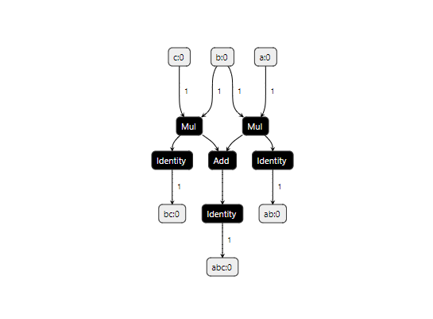

# 1.运行onnx模型

https://netron.app/

可以在该网站查看onnx模型结构，根据模型的输入和输出放置参数，即可获得输出结果。


`partial-inputs-test.onnx模型结构如下`




```java
package com.zqy.javaonnx.test;


import ai.onnxruntime.*;
import com.sun.prism.PixelFormat;
import ai.onnxruntime.OrtSession.SessionOptions;

import java.util.HashMap;
import java.util.HashSet;
import java.util.Map;
import java.util.Set;
import java.util.function.BiFunction;

/**
 * @author 千祎来了
 * @date 2023-03-20 14:46
 */
public class Test {

    private static final OrtEnvironment env = OrtEnvironment.getEnvironment();

    public static void main(String[] args) throws OrtException {
        Test test = new Test();
//        test.test2();
//        test.test1();
//        test.canRunInferenceOnAModel();
    }


    public void test1() throws OrtException {
        String modelPath = "E:\\partial-inputs-test.onnx";
        OrtSession.SessionOptions options = new SessionOptions();
        options.setOptimizationLevel(OrtSession.SessionOptions.OptLevel.BASIC_OPT);
        OrtSession session = env.createSession(modelPath, options);

        // Input and output collections.
        Map<String, OnnxTensor> inputMap = new HashMap<>();
        Set<String> requestedOutputs = new HashSet<>();

        BiFunction<OrtSession.Result, String, Float> unwrapFunc =
                (r, s) -> {
                    try {
                        return ((float[]) r.get(s).get().getValue())[0];
                    } catch (OrtException e) {
                        return Float.NaN;
                    }
                };

        // Graph has three scalar inputs, a, b, c, and a single output, ab.
        OnnxTensor a = OnnxTensor.createTensor(env, new float[] {2.0f});
        OnnxTensor b = OnnxTensor.createTensor(env, new float[] {3.0f});
        OnnxTensor c = OnnxTensor.createTensor(env, new float[] {5.0f});

        // Request all outputs, supply all inputs
        inputMap.put("a:0", a);
        inputMap.put("b:0", b);
        inputMap.put("c:0", c);
        requestedOutputs.add("abc:0");
        requestedOutputs.add("bc:0");
        requestedOutputs.add("ab:0");

        try (OrtSession.Result r = session.run(inputMap, requestedOutputs)) {
            float abVal = unwrapFunc.apply(r, "abc:0");
            float abVal2 = unwrapFunc.apply(r, "bc:0");
            float abVal3 = unwrapFunc.apply(r, "ab:0");
            System.out.println(abVal);
            System.out.println(abVal2);
            System.out.println(abVal3);
        }
    }

    public void test2() throws OrtException {

        // 1.加载模型
//        String modelPath = "G:\\PostGraduate\\projects\\k8sJavaExample\\JavaOnnx\\partial-inputs-test-2.onnx";
//        String modelPath = "partial-inputs-test-2.onnx";
//        String modelPath = Test.class.getClassLoader().getResource("partial-inputs-test-2.onnx").getPath();
        String modelPath = "E:\\partial-inputs-test-2.onnx";
        OrtSession.SessionOptions options = new SessionOptions();
        options.setOptimizationLevel(OrtSession.SessionOptions.OptLevel.BASIC_OPT);
        OrtSession session = env.createSession(modelPath, options);

        // Input and output collections.
        Map<String, OnnxTensor> inputMap = new HashMap<>();
        Set<String> requestedOutputs = new HashSet<>();

        BiFunction<OrtSession.Result, String, Float> unwrapFunc =
                (r, s) -> {
                    try {
                        return ((float[]) r.get(s).get().getValue())[0];
                    } catch (OrtException e) {
                        return Float.NaN;
                    }
                };

        // Graph has three scalar inputs, a, b, c, and a single output, ab.
        OnnxTensor a = OnnxTensor.createTensor(env, new float[] {2.0f});
        OnnxTensor b = OnnxTensor.createTensor(env, new float[] {3.0f});
        OnnxTensor c = OnnxTensor.createTensor(env, new float[] {5.0f});

        // Request all outputs, supply all inputs
        inputMap.put("a:0", a);
        inputMap.put("b:0", b);
        inputMap.put("c:0", c);
        requestedOutputs.add("ab:0");

        try (OrtSession.Result r = session.run(inputMap, requestedOutputs)) {
            float abVal = unwrapFunc.apply(r, "ab:0");
            System.out.println(abVal);
        }

        // Don't specify an output, expect all of them returned.
        try (OrtSession.Result r = session.run(inputMap)) {
            float abVal = unwrapFunc.apply(r, "ab:0");
        }

    }


    private void canRunInferenceOnAModel()
            throws OrtException {
        String modelPath = TestHelpers.getResourcePath("/squeezenet.onnx").toString();
        SessionOptions.OptLevel graphOptimizationLevel = SessionOptions.OptLevel.BASIC_OPT;
        SessionOptions.ExecutionMode exectionMode = SessionOptions.ExecutionMode.SEQUENTIAL;
        // Set the graph optimization level for this session.
        try (SessionOptions options = new SessionOptions()) {
            options.setOptimizationLevel(graphOptimizationLevel);
            options.setExecutionMode(exectionMode);

            try (OrtSession session = env.createSession(modelPath, options)) {
                Map<String, NodeInfo> inputMetaMap = session.getInputInfo();
                Map<String, OnnxTensor> container = new HashMap<>();
                NodeInfo inputMeta = inputMetaMap.values().iterator().next();

                float[] inputData =
                        TestHelpers.loadTensorFromFile(TestHelpers.getResourcePath("/bench.in"));
                // this is the data for only one input tensor for this model
                Object tensorData =
                        OrtUtil.reshape(inputData, ((TensorInfo) inputMeta.getInfo()).getShape());
                OnnxTensor inputTensor = OnnxTensor.createTensor(env, tensorData);
                container.put(inputMeta.getName(), inputTensor);

                // Run the inference
                try (OrtSession.Result results = session.run(container)) {

                    float[] expectedOutput =
                            TestHelpers.loadTensorFromFile(TestHelpers.getResourcePath("/bench.expected_out"));
                    // validate the results
                    // Only iterates once
                    for (Map.Entry<String, OnnxValue> r : results) {
                        OnnxValue resultValue = r.getValue();
                        OnnxTensor resultTensor = (OnnxTensor) resultValue;
                        int[] expectedDimensions =
                                new int[] {1, 1000, 1, 1}; // hardcoded for now for the test data
                        long[] resultDimensions = resultTensor.getInfo().getShape();

                        for (int i = 0; i < expectedDimensions.length; i++) {
                        }

                        float[] resultArray = TestHelpers.flattenFloat(resultTensor.getValue());
                    }
                } finally {
                    inputTensor.close();
                }
            }
        }
    }
}

```


> 引入依赖

```xml
        <!--onnx运行时依赖-->
        <dependency>
            <groupId>org.bytedeco</groupId>
            <artifactId>onnxruntime-platform</artifactId>
            <version>1.10.0-1.5.7</version>
        </dependency>

        <dependency>
            <groupId>org.junit.jupiter</groupId>
            <artifactId>junit-jupiter-api</artifactId>
        </dependency>

        <dependency>
            <groupId>com.google.protobuf</groupId>
            <artifactId>protobuf-java</artifactId>
            <version>3.17.3</version>
        </dependency>


        <dependency>
            <groupId>org.openpnp</groupId>
            <artifactId>opencv</artifactId>
            <version>4.6.0-0</version>
        </dependency>
```


