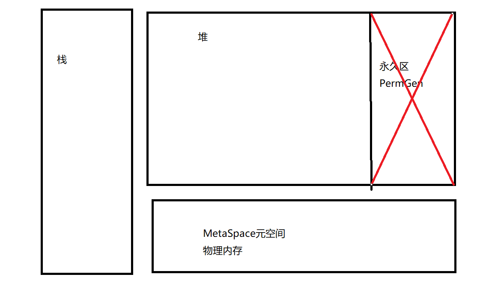
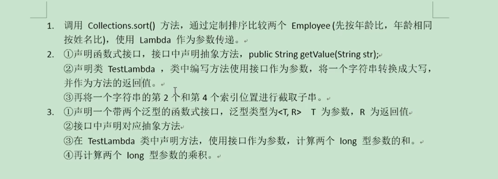
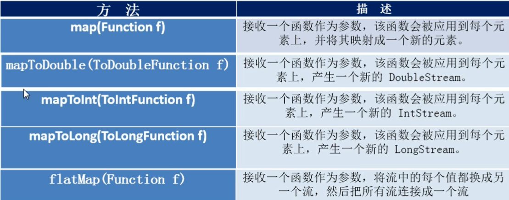
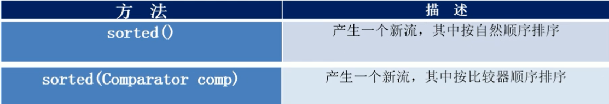
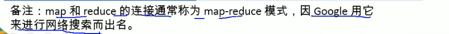
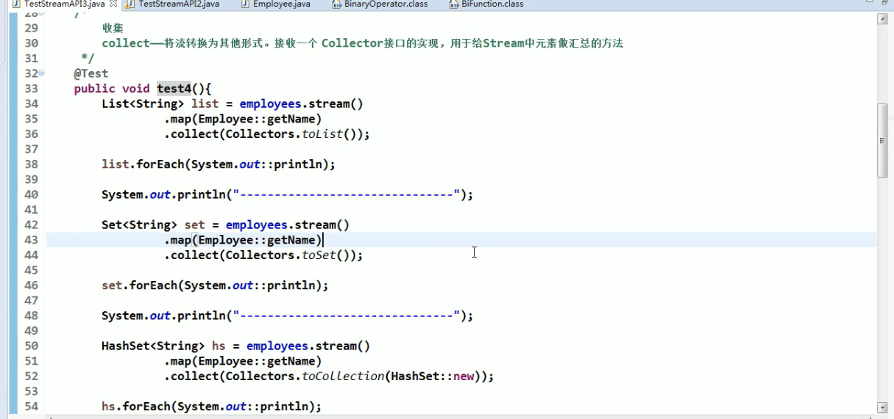
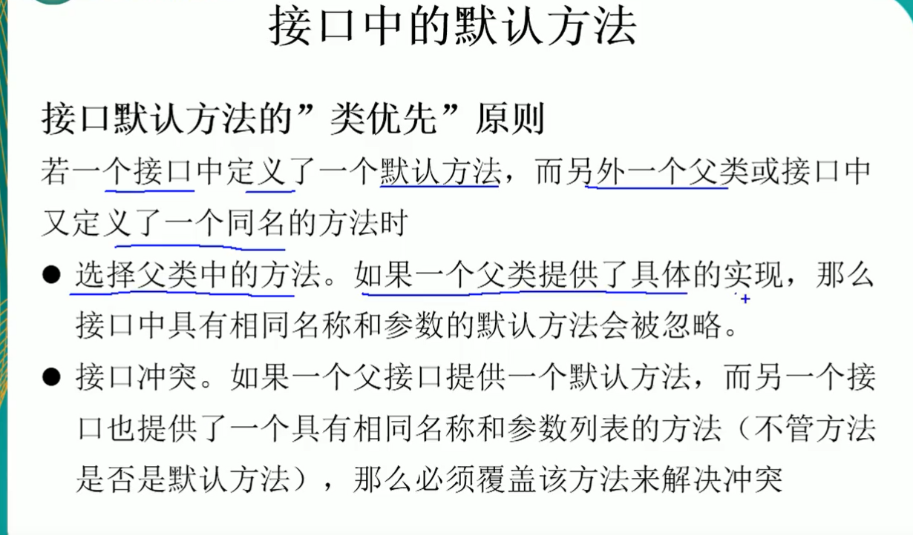

# Java 8 新特性简介

>  速度更快

### 1.改动底层数据结构（速度快）

#### 1.1 HashMap

底层数据结构由 数组+链表 --->数组+链表+红黑树

具体看下个文件` HashMap详解`

### 2.改动底层内存结构

jvm运行时内存区域主要分为：程序计数器，jvm栈，本地方法栈，堆，方法区。

jvm规把方法区描述为堆的逻辑结构（即永久区PermGen）但是他还有个别名，叫Non-Heap（非堆），目前情况除了Oracle-sun-  hotspot还采用永久区以外，Oracle-JRockit，IBM-J9以及国内阿里的jvm，都不存在永久区的概念，而Hotspot也逐渐消除永久区，jdk1.7的Hotspot中就把存放在永久区的字符串常量池移除，放到本地内存（物理内存）

方法区主要存放：类的各中加载信息，常量、静态变量等，方法区或者直接说虚拟机中的永久区会被垃圾回收，但是条件比较苛刻，几乎不会被回收。

Java8就彻底的移除了堆的永久区，取而代之的是元空间（MetaSpace），它最大的特点就是存储在物理内存（本地内存），这样的话减少了方法区进行垃圾回收的概率。一般情况下，是不会出现OOM的

响应的jvm调邮参数 PermGenSize  MaxPermGenSize都被剔除，取而代之的是MetaSpaceSize和MaxMetaSpaceSize




>  代码更少（Lambda）

> 强大的Stream API

> 便于并行

> 最大化减少空指针异常 Optional

`核心为：Lambda表达式和Stream`


# 1.Lambda表达式

Lambda是一个匿名函数，使用Lambda可以让代码更加紧凑简洁！

我们实现一个需求来生动的解释一下Lambda表达式，如何简化了我们的代码！

**需求如下：**

我们有一个员工集合，我们需要对员工按照某一条件进行过滤。

**首先，写出一个员工类：** （实现了构造方法，和get方法）

```java
package com.example.demo.test;

/**
 * @author 千祎来了
 * @date 2020/8/9 17:59
 */
public class Employee {
    public String name;
    public int age;
    public int salary;

    public Employee(String name, int age, int salary) {
        this.name = name;
        this.age = age;
        this.salary = salary;
    }

    public String getName() {
        return name;
    }

    public int getAge() {
        return age;
    }

    public int getSalary() {
        return salary;
    }

    @Override
    public String toString() {
        return "Employee{" +
                "name='" + name + '\'' +
                ", age=" + age +
                ", salary=" + salary +
                '}';
    }
}
```


**接下来，我们初始化我们的员工集合：**

```java
List<Employee> employees = Arrays.asList(
        new Employee("员工1" , 18 , 3000),
        new Employee("员工2" , 35 , 4000),
        new Employee("员工3" , 26 , 5000),
        new Employee("员工4" , 40 , 6000),
        new Employee("员工5" , 28 , 7000)
);
```


**接下来，我们实现一个最基本的过滤方法，for循环加if条件过滤：**

（假如要选出年龄大于等于25岁的员工）

```java
@Test
public void test1(){
    List<Employee> emps = new ArrayList<>();
    for(Employee emp : employees)
    {
        if(emp.age >= 25)
        {
            emps.add(emp);
        }
    }
    System.out.println(emps);
}
```

以上过滤方法看着也很简单明了，但是如果条件多了呢？

如果条件有许多，条件同时又发生了改变，那我们是不是要写很多很多for循环和if条件来判断员工是否符合条件，这就造成了代码看起来非常难看。


**接下来，我们看一下优化方式二：（对for循环加if条件进行进一步的优化）**

使用到了设计模式中的策略模式：（策略模式可用于替代大量的ifelse语句）

首先定义一个策略接口，返回值是boolean类型。

```java
// 策略接口，返回值 boolean
public interface MyPredicate<T> {
    public boolean test(T t);
}
```

然后，我们需要过滤哪种条件的话，我们只需要创建一个实现类，来继承这个接口

```java
public class FilterByAge implements MyPredicate<Employee> {
    @Override
    public boolean test(Employee employee) {
        return employee.age >= 25;
    }
}
```

最后，我们调用这个实现类，就可以过滤掉不符合条件的员工。

```java
@Test
// 优化方式一：使用策略设计模式进行优化
// 缺点：如果我们更改需求，就需要另外创建一个类去实现策略接口。
public void test2(){

    // 调用策略设计模式，只需要传入我们实现好的策略。
    List<Employee> employees = filterEmployee(this.employees, new FilterByAge());
    System.out.println(employees);
}
```

但是，这样同样还有一个缺点，我们条件如果发生改变的话，我们是不是需要再去重新写一个类，再继承这个接口，我们还是嫌这样做很麻烦，那怎么办呢？


**接下来，我们来看一下优化方式三：**

（使用匿名内部类）

首先，还是定义一个策略接口：

```java
// 策略接口，返回值 boolean
public interface MyPredicate<T> {
    public boolean test(T t);
}
```

然后，我们不用写类去继承这个接口，我们写一个策略模式设计方法来将符合条件的员工添加进去，然后返回给我们即可

```java
// 策略设计模式方法
public List<Employee> filterEmployee(List<Employee> list, MyPredicate<Employee> mp){
    List<Employee> emps = new ArrayList<>();
    for (Employee emp : list)
    {
        if (mp.test(emp))
        {
            emps.add(emp);
        }
    }
    return emps;
}
```

最后，我们想要用哪种条件，只需要写一个匿名内部类即可，在匿名内部类中写上我们过滤的条件，又省去了创建类的步骤，简便了许多

```java
@Test
//优化方式二：使用匿名内部类进行优化，可以不再创建类
public void test3(){
    List<Employee> res = filterEmployee(this.employees, new MyPredicate<Employee>() {
        @Override
        public boolean test(Employee employee) {
            return employee.salary >= 5000;
        }
    });
    // 遍历集合中的每个数
    res.forEach(System.out::println);
}
```

**好的，如果我们还是嫌写一个静态内部类很麻烦的话，那么就来看一下优化方式四：**

（也就是我们等待已久的Lambda表达式）

首先，还是策略接口

```java
// 策略接口，返回值 boolean
public interface MyPredicate<T> {
    public boolean test(T t);
}
```

然后，写策略模式设计方法

```java
// 策略设计模式方法
public List<Employee> filterEmployee(List<Employee> list, MyPredicate<Employee> mp){
    List<Employee> emps = new ArrayList<>();
    for (Employee emp : list)
    {
        if (mp.test(emp))
        {
            emps.add(emp);
        }
    }
    return emps;
}
```

最后，使用lambda来过滤：

```java
@Test
// 优化方式三
public void test4(){
    List<Employee> res = filterEmployee(employees, (e) -> e.salary >= 5000);
    res.forEach(System.out::println);
}
```

lambda表达式是不是比内部类又要简洁了许多呢？？

这就是Lambda表达式的好处了。


**不过，Lambda只有一个需要注意的地方：**

Lambda必须要有函数式接口的支持。

函数式接口：接口中只有一个抽象方法的接口，成为函数式接口。

`也可以使用 @FunctionInterface 注解来检查接口是否式函数式接口`


**下面，我们来进行几个小练习，熟悉一下Lambda的使用**

（1）调用Collections.sort() 方法，通过定制排序比较两个 员工（先按年龄比较，再按姓名比较），使用Lambda作为参数传递。

```java
@Test
public void test6() {
    // 使用Lambda表达式来实现Comporator接口，进行定制排序
    Collections.sort(employees , (e1 , e2) -> {
        if (e1.getAge() == e2.getAge()) {
            return e1.getName().compareTo(e2.getName());
        }else {
            return e1.age - e2.age;
        }
    });
    employees.forEach(System.out::println);
}
```





### **Java 8 内置的四大核心函数式接口** 

- `Consumer<T> `：消费型接口 

  void accept(T t);

- `Supplier<T>`：供给型接口

  T get();

- `Function<T , R>`：T参数 R返回值  函数型接口

  R apply(T t);

- `Predicate<T>`：断言型接口

  boolean test(T t);

`Consumer<T>演示`

```java
public class test1 {
    @Test
    public void test(){
        happy(10000, (x) -> {
            System.out.println("花费了" + x + "元钱，获取了happy");
        });
    }

    public void happy(double money , Consumer<Double> con){
        con.accept(money);
    }
}
```


`Supplier<T>演示`

需求：获取指定个数的整数

```java
@Test
public void test2(){
    List<Integer> list = getNumList(10 , () -> (int) (Math.random() * 100));
    for (Integer n : list)
    {
        System.out.print(n + " ");
    }
}

/**
 * 获取指定个数的整数
 * @param num
 * @param sp
 * @return
 */
public List<Integer> getNumList(int num , Supplier<Integer> sp){
    List<Integer> res = new ArrayList<>();
    for (int i = 0 ; i < num ; i++)
    {
        Integer item = sp.get();
        res.add(item);
    }
    return res;
}
```


`Function<T , R>`演示：

需求：处理传入的字符串

```java
/**
 * 需求： 用于处理字符串
 * @param str
 * @param handle
 * @return
 */
public String handleStr(String str , Function<String,String> handle){
    return handle.apply(str);
}

@Test
public void test3(){
    // 去掉首尾的空格
    String newStr = handleStr("\t\t这是需要截取的字符串" , (e) -> e.trim());
    System.out.println(newStr);
    // 截取字符串
    String newStr2 = handleStr("这是需要截取的字符串" , (e) -> e.substring(0 , 2));
    System.out.println(newStr2);
}
```


`Predicate<T>`演示：

返回值是boolean类型

```java
@Test
public void test4(){
    List<String> list = Arrays.asList("abc","aaa","bcdef","efghilk","ababa");
    List<String> res = filterStr(list, (e) -> e.length() >= 5);
    for (String s : res)
    {
        System.out.println(s);
    }
}

// 过滤字符串
public List<String> filterStr(List<String> list , Predicate<String> pre){
    List<String> res = new ArrayList<>();

    for (String s : list)
    {
        if (pre.test(s))
        {
            res.add(s);
        }
    }

    return res;
}
}
```


# 2.函数式接口

接口中只有一个方法的接口为函数式接口

`也可以使用 @FunctionInterface 注解来检查接口是否式函数式接口`


# 3.方法引用与构造器引用

### 方法引用：

若 Lambda体 中的内容有方法已经实现了，我们可以使用“方法引用”

（可以理解为方法引用是 Lambda 表达式的另外一种表现形式）

主要有三种语法格式：

`对象::实例方法名`

`类::静态方法名`

`类::实例方法名`


**`对象::实例方法名`演示**

注意，**Lambda体中方法的参数和返回值要与函数式接口中方法的参数和返回值一致！**

使用方法引用的时候，可以不写后边的括号和参数。

```java
@Test
// 演示 对象::实例方法名
public void test1(){
    // 不使用方法引用
    Consumer<String> con = (x) -> System.out.println(x);
    con.accept("不使用方法引用输出的字符串");

    // 使用方法引用，System.out就相当于一个实例，println是他的方法
    // 所以可以直接 ps::println 就相当于 System.out.println()
    PrintStream ps = System.out;
    // con2 相当于 con3
    Consumer<String> con2 = ps::println;
    Consumer<String> con3 = System.out::println;
    con2.accept("使用方法引用输出的字符串");
    con3.accept("使用方法引用输出的字符串");
}
```


**`类::静态方法名`演示** 

**`类::实例方法名`演示** （下例一同演示）

```
@Test
// 类::实例方法名
public void test2(){
    // 另一个断言型接口，两个参数 返回boolean类型
    BiPredicate<String,String> bp = (x,y) -> x.equals(y);

    boolean test = bp.test("a", "b");
    System.out.println(test);

    // 必须当x作为实例方法的调用者，y作为实例方法的参数，就可以写为 类名::实例方法名
    BiPredicate<String,String> bp2 = String::equals;
    boolean test2 = bp.test("a","a");
    System.out.println(test2);
}
```


### **构造器引用** 


**根据函数式接口的参数个数来决定匹配哪个构造器，这里匹配一个参数的构造器**


```java
@Test
public void test3(){
    // 不使用构造器引用
    Supplier<Employee> emp = () -> new Employee();

    // 使用构造器引用 , 因为参数自动匹配，Supplier接口的get方法无参
    // 所以这里自动匹配的是无参构造器
    Supplier<Employee> emp2 = Employee::new;
    emp2.get();
}
```


```java
@Test
public void test4(){
    // 第一个参数 第二个返回值
    Function<Integer,Employee> fun = (x) -> new Employee(x);

    // 根据Function接口的参数个数来决定匹配哪个构造器，这里匹配一个参数的构造器
    Function<Integer,Employee> fun2 = Employee::new;
    Employee emp = fun2.apply(20);
    System.out.println(emp);
}
```


### 数组引用

`Type[]::new`

```java
@Test
public void test5(){
    Function<Integer,String[]> fun = (x) -> new String[x];
    String[] apply = fun.apply(20);
    System.out.println(apply.length); // 输出20，说明数组创建成功

    Function<Integer,String[]> fun2 = String[]::new;
    String[] apply1 = fun2.apply(15);
    System.out.println(apply1.length); // 输出15，说明数组创建成功
}
```


# 4.Stream API

Java8中有两个最为重要的改变。第一个是Lambda表达式；另外一个则是**Stream API (java.util.stream.*)**

Stream 是 Java8 中处理集合的关键抽象概念，它可以指定你希望对集合进行的操作，可以执行非常复杂的查找、过滤和映射数据等操作。使用Stream API 对集合数据进行操作，就类似于使用 SQL 执行的数据库查询。

也可以使用 Stream API 来并行执行操作。

简而言之：Stream API 提供了一种高效且易于使用的处理数据的方式。


注意：

（1）Stream 自己不会存储元素

（2）Stream 不会改变源对象。相反，会返回一个持有结果的新Stream。

（3）Stream 操作是延迟执行的。也就是说他们会等到需要结果的时候才执行。（也就是到需要的时候才会执行中间操作的内容）


### 创建Stream的四种方式

```java
@Test
// 创建stream
public void test(){
    // 1.可以通过Collection 系列集合提供的stream() 或者 paralletStream()
    List<String> list = new ArrayList<>();
    Stream<String> stream = list.stream();
    System.out.println(stream);

    // 2.通过 Arrays 中的静态方法 stream() 获取
    Employee[] emps = new Employee[10];
    Stream<Employee> stream1 = Arrays.stream(emps);

    // 3.通过 Stream 类中的静态方法 of()
    Stream<String> stream2 = Stream.of("aa", "bb", "cc");

    // 4.创建无限流
    // (1)使用迭代创建
    Stream<Integer> stream3 = Stream.iterate(0, (x) -> x + 2);
    stream3.limit(10).forEach(System.out::println);

    // 生成，参数是Supplier接口
    // (2)使用generate创建
    Stream.generate(() -> Math.random()).
            limit(5).
            // forEach的参数是Consumer接口，所以可以使用 对象::实例方法名 引用
            forEach(System.out::println);
}
```


### Stream的中间操作

#### 筛选与切片

|        方法方法         |                    描述                    |
| :-----------------: | :--------------------------------------: |
| filter(Predicate p) |            接收Lambda，从流中排除某些元素            |
|     distinct()      | 筛选，通过流所生成元素的 hashCode() 和 equals() 去除重复元素 |
| limit(long maxSize) |              截断流，使元素不超过给定数量              |
|    skip(long n)     | 跳过元素，返回一个扔掉了前n个元素的流。若流中元素不足n个，则返回一个空流。与limit(n)互补 |

#### 映射




#### 排序




### 筛选与切片代码演示

distinct操作用于去除重复元素，就不演示了。

**不过需要注意的是，使用distinct操作，如果要对Employee类进行去重，必须在Employee类中实现hashcode和equals方法**

 	

```java
/**
 * @author 千祎来了
 * @date 2020/8/14 15:22
 */
public class TestStream2 {

    List<Employee> employees = Arrays.asList(
            new Employee("员工1" , 18 , 3000),
            new Employee("员工2" , 35 , 4000),
            new Employee("员工3" , 26 , 5000),
            new Employee("员工4" , 40 , 6000),
            new Employee("员工5" , 28 , 7000)
    );

    @Test
    // -----filter测试
    public void test1(){
        // 1、创建一个stream流
        Stream<Employee> stream = employees.stream()
                // 2、执行中间操作
                .filter((e) -> {
                    System.out.println("Stream API" + e.getName());
                    return e.getSalary() > 5000;
                });
        // 3、执行终止操作，如果没有终止操作，中间操作不会执行（也称延迟加载）
        stream.forEach(System.out::println);
        /**  输出结果
         Stream API员工1
         Stream API员工2
         Stream API员工3
         Stream API员工4
         Employee{name='员工4', age=40, salary=6000}
         Stream API员工5
         Employee{name='员工5', age=28, salary=7000}
         */
    }

    @Test
    // -----limit测试
    public void test2(){
        employees.stream()
                .filter((e) -> e.getSalary() > 5000)
                // 只保留一条数据
                .limit(1)
                .forEach(System.out::println);
        /** 输出结果
         Employee{name='员工4', age=40, salary=6000}
         */
    }

    @Test
    // -----skip测试
    public void test3(){
        employees.stream()
                .filter((e) -> e.getSalary() > 5000)
                // 跳过前一条数据
                .skip(1)
                .forEach(System.out::println);
    }
}
```


### 映射代码演示

```java
/**
 * @author 千祎来了
 * @date 2020/8/14 15:35
 */
public class TestStream3 {

    /**
     * 映射
     * map ： 接收Lambda，将元素转换成其他形式或提取信息。接受一个函数
     * 作为参数，该函数会被应用到每个元素上，并将其映射成一个新的元素
     * flatMap ： 接受一个函数作为参数，将流中的每个值都换成另一个流，
     * 然后把所有流连接成一个流
     */

    @Test
    // -----map测试
    public void test1(){
        List<String> list = Arrays.asList("abc","ced","ffe","ooo");
        list.stream()
                .map((e) -> e.toUpperCase())
                .forEach(System.out::println);
    }

    @Test
    // -----flatMap测试： 作用就是将很多个流连接成一个流
    public void test2(){

        List<String> list = Arrays.asList("abc","ced","ffe","ooo");

        // 先看一下不适用flatMap：如果我们使用map的话，返回的是一个流中又包含了多个流
        Stream<Stream<Character>> stream1 = list.stream()
                // 方法引用： 对象名::实例方法名
                .map(TestStream3::switchStr);

        // 如果使用flatMap：多个流会被合并为一个流
        Stream<Character> stream2 = list.stream()
                .flatMap(TestStream3::switchStr);

        // 第一个输出：取出每个流中的流，在forEach输出
        stream1.forEach((e) -> e.forEach(System.out::print));
        System.out.println();
        // 第二个输出：直接输出
        stream2.forEach(System.out::print);
    }

    // 这个方法返回的是一个流
    public static Stream<Character> switchStr(String str){
        List<Character> list = new ArrayList<>();
        for (Character ch : str.toCharArray())
        {
            list.add(ch);
        }
        return list.stream();
    }


}
```


### 排序代码演示


```java
package com.example.demo.stream;

import org.junit.Test;

import java.util.ArrayList;
import java.util.Arrays;
import java.util.List;

/**
 * @author 千祎来了
 * @date 2020/8/14 16:14
 */
public class TestStream4 {

    /**
     排序
     sorted() ---- 自然排序
     sorted(Comparator com) ---- 定制排序
     */


    @Test
    public void test1(){
        List<String> list = Arrays.asList("aaa","bbb","ccc","ddd");

        // 自然排序
        list.stream()
                .sorted()
                .forEach(System.out::println);

        // 定制排序,实现Comparator接口
        list.stream()
                .sorted((e1 , e2) -> -e1.compareTo(e2))
                .forEach(System.out::println);
    }


} 
```


### Stream的终止操作

```java
package com.example.demo.stream;

import org.junit.Test;

import java.lang.reflect.Array;
import java.util.ArrayList;
import java.util.Arrays;
import java.util.List;
import java.util.Optional;

/**
 * @author 千祎来了
 * @date 2020/8/14 16:36
 */
public class TestStream5 {

    static class Person{
        Integer salary;
        State state;

        // 枚举状态
        public static enum State{
            FREE, // 空闲
            BUSY, // 忙碌
            VOCATION // 度假
        }

        public Integer getSalary() {
            return salary;
        }

        public State getState() {
            return state;
        }

        public Person(Integer salary, State state) {
            this.salary = salary;
            this.state = state;
        }
    }

    /**
        查找与匹配
        allMatch——检查是否匹配所有元素
        anyMatch——检查是否至少匹配一个元素
        noneMatch——检查是否没有匹配所有元素
        findFirst——返回第一个元素
        findAny——返回流中的任意元素
        count——返回流中元素的总个数
        max——返回流中最大值
        min——返回流中最小值
     */

    @Test
    public void test1(){

        List<Person> list = Arrays.asList(
                new Person(2000,Person.State.BUSY),
                new Person(3000,Person.State.FREE),
                new Person(4000,Person.State.FREE),
                new Person(5000,Person.State.BUSY),
                new Person(6000,Person.State.VOCATION)
        );

        boolean flag = list.stream()
                // 是否所有人处于休闲
                .allMatch((e) -> e.getSalary().equals(Person.State.FREE));
        System.out.println(flag);

        boolean flag1 = list.stream()
                // 判断是否至少一个空闲的人
                .anyMatch((e) -> e.getState().equals(Person.State.FREE));
        System.out.println(flag1);

        // Optional是java8防止空指针的一个容器

        Optional<Person> person = list.stream()
                // 找到salary>5000 的第一个人
                .filter((e) -> e.getSalary() > 5000)
                .findFirst();
        // 如果找到为空的话，就是用这里传入的person
        person.orElse(new Person(2000, Person.State.FREE));
        System.out.println(person);
    }


}
```


### Stream的归约

`reduce(T iden , BinaryOperator b)` ：可以将流中元素反复结合起来，得到一个值，返回T

`reduce(BinaryOperator b)`：可以将流中元素反复结合起来，得到一个值。返回 Optional<T>




代码演示：

```java
package com.example.demo.stream;

import org.junit.Test;

import java.util.Arrays;
import java.util.List;
import java.util.Optional;

/**
 * @author 千祎来了
 * @date 2020/8/14 18:54
 */
public class TestStream6 {

    static class Person{
        Integer salary;
        TestStream5.Person.State state;

        // 枚举状态
        public static enum State{
            FREE, // 空闲
            BUSY, // 忙碌
            VOCATION // 度假
        }

        public Integer getSalary() {
            return salary;
        }

        public TestStream5.Person.State getState() {
            return state;
        }

        public Person(Integer salary, TestStream5.Person.State state) {
            this.salary = salary;
            this.state = state;
        }
    }

    @Test
    public void test1(){
        List<Integer> list = Arrays.asList(1 , 2 , 4 , 5 , 6 , 7 , 10);

        // 第一种（两个参数）reduce(T identity, BinaryOperator<T> accumulator)
        Integer sum1 = list.stream()
                // 两个参数(T identity, BinaryOperator<T> accumulator)
                /**
                 * reduce的计算过程：
                 * 先取出第一个参数，作为x的默认值，再取出流中的一个数作为y
                 * 进行x+y，然后将x+y的值作为x，再取出流中的一个数作为y，再进行x+y
                 * 可以用于求集合中所有数的和
                 */
                .reduce(0, (x, y) -> x + y);
        System.out.println(sum1);

        List<TestStream5.Person> list2 = Arrays.asList(
                new TestStream5.Person(2000, TestStream5.Person.State.BUSY),
                new TestStream5.Person(3000, TestStream5.Person.State.FREE),
                new TestStream5.Person(4000, TestStream5.Person.State.FREE),
                new TestStream5.Person(5000, TestStream5.Person.State.BUSY),
                new TestStream5.Person(6000, TestStream5.Person.State.VOCATION)
        );
        // 第二种（一个参数）reduce(BinaryOperator<T> accumulator)
        // 这样返回的可能是空对象，所以使用Optional来防止空指针
        Optional<Integer> sumSalary = list2.stream()
                // 使用方法引用，实例名::方法名
                .map((e) -> e.getSalary())
                .reduce(Integer::sum);
        System.out.println(sumSalary.get());
    }

}
```


### Stream的收集

`collect `： 将流转换为其他形式。接受一个Collector接口的实现，用于给Stream中元素做汇总的方法。




```java
package com.example.demo.stream;

import com.example.demo.test.Employee;
import org.junit.Test;

import java.util.Arrays;
import java.util.HashSet;
import java.util.List;
import java.util.Set;
import java.util.stream.Collectors;

/**
 * @author 千祎来了
 * @date 2020/8/14 19:37
 */
public class TestStream7 {

    List<Employee> employees = Arrays.asList(
            new Employee("员工1" , 18 , 3000),
            new Employee("员工2" , 35 , 4000),
            new Employee("员工3" , 26 , 5000),
            new Employee("员工4" , 40 , 6000),
            new Employee("员工5" , 28 , 7000)
    );

    @Test
    public void test1(){

        // 1、collec收集为list集合
        List<Integer> list = employees.stream()
                .map(Employee::getSalary)
                // toList转为list集合
                .collect(Collectors.toList());
        System.out.println(list);

        // 2、collect收集为set集合
        Set<Integer> set = employees.stream()
                .map(Employee::getSalary)
                .collect(Collectors.toSet());
        System.out.println(set);

        // 3、collect收集为自己想要的集合
        HashSet<Integer> hashSet = employees.stream()
                .map(Employee::getSalary)
                .collect(Collectors.toCollection(HashSet::new));
        System.out.println(hashSet);
    }

}
```


# 5.接口中的默认方法与静态方法




意思也就是

如果一个类实现了两个接口，这两个接口有同名的默认方法的话，就必须实现其中的一个，否则会报错

如果一个类实现了一个接口并继承了一个类，这个类和接口有同名方法的话，会优先执行父类里的方法。

`先看一下实现了两个接口：`

```java
public interface MyInter1 {
    default String getName(){
        return "MyInter1";
    }
}

public interface MyInter2 {
    default String getName(){
        return "MyInter2";
    }
}

// 如果实现了两个接口中有同名的默认方法，必须实现其中的一个
public class ImplTest implements MyInter1 , MyInter2 {
    @Override
    public String getName() {
        return MyInter1.super.getName();
    }
}
class Test1{
    public static void main(String[] args) {
        ImplTest i = new ImplTest();
        System.out.println(i.getName());
    }
}
```

执行结果

```
MyInter1
```


再看一下继承一个类，并实现一个接口

```java
// 会优先执行父类
public class ImplTest2 extends MyClass implements MyInter1{
}
class Test{
    public static void main(String[] args) {
        ImplTest2 i = new ImplTest2();
        System.out.println(i.getName());
    }
}
```

执行结果

```
MyClass
```


# 6.新时间日期API


# 7.其他新特性