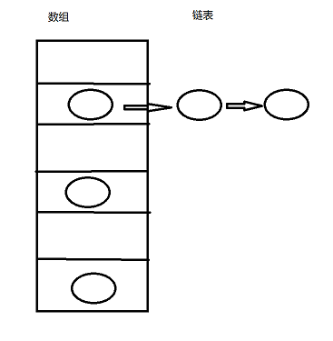
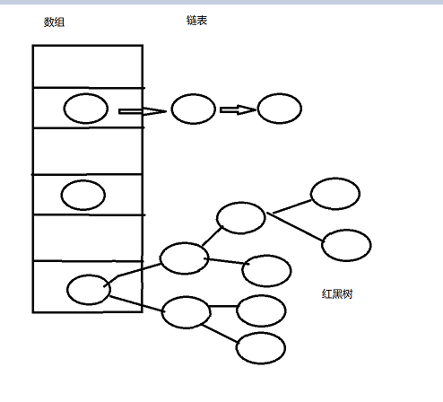

## 

# HashMap

HashMap是一种非常重要的数据结构，也是面试官最喜欢问的问题，那么想要吊打面试官的话，不可避免的要去学会并理解HashMap的底层操作及原理。

首先：我们要清楚哈希表的结构：数组+链表(jdk1.8之前)



那么数据是如何存放到哈希表中去了呢？

当有一个数据需要插入的时候，会先调用hash()这个方法，来获取一个下标，这个下标就是这个数据在数组中的位置，hash()方法可以让我们的数据尽可能的分配均匀，但是碰撞是不可避免的，如果发生碰撞(也就是两个数据的hash后的下标值相同)，那么就是用链表来存储(jdk1.8之前采用头插法,jdk1.8之后采用尾插法)。

这是jdk1.8之前，它的效率我们发现是不高的，对于链表，如果我们要查询一个数据，这个链表很长的话，就会造成查询效率非常缓慢(极端情况下，需要查到链表的最后一个位置)

***


于是，在jdk1.8之后，就对哈希表进行了改造：采用==数组+链表+红黑树==的数据结构。

**红黑树，并不是一直有的，使用红黑树有一个条件，当碰撞的个数大于8个(也就是链表长度大于8)并且数组中元素大于64个，此时将链表转为红黑树结构**

红黑树除了添加效率比链表低之外，其他操作都比链表效率高。




## 实现原理

HashMap的主干是一个Entry数组，每一个Entry包含一个key-value键值对

```java
//HashMap的主干数组，可以看到就是一个Entry数组，初始值为空数组{}，主干数组的长度一定是2的次幂，至于为什么这么做，后面会有详细分析。
transient Entry<K,V>[] table = (Entry<K,V>[]) EMPTY_TABLE;
```

**其他几个重要的字段**

loadFactor：默认是0.75，当容量大于75%时，对于数组进行扩容，扩容之后，给所有结点都重新hash(因为数组长度变大，hash值不同，所以要重新hash)

```java
//实际存储的key-value键值对的个数
transient int size;
//阈值，当table == {}时，该值为初始容量（初始容量默认为16）；当table被填充了，也就是为table分配内存空间后，threshold一般为 capacity*loadFactory。HashMap在进行扩容时需要参考threshold，后面会详细谈到
int threshold;
//负载因子，代表了table的填充度有多少，默认是0.75
final float loadFactor;
//用于快速失败，由于HashMap非线程安全，在对HashMap进行迭代时，如果期间其他线程的参与导致HashMap的结构发生变化了（比如put，remove等操作），需要抛出异常ConcurrentModificationException
transient int modCount;
```


**HashMap的构造方法**

用户不传入initialCapacity和loadFactor就是用默认值，分别为16和0.75

```java
public HashMap(int initialCapacity, float loadFactor) {
 //此处对传入的初始容量进行校验，最大不能超过MAXIMUM_CAPACITY = 1<<30(2^30)
    if (initialCapacity < 0)
        throw new IllegalArgumentException("Illegal initial capacity: " +
                                           initialCapacity);
    if (initialCapacity > MAXIMUM_CAPACITY)
        initialCapacity = MAXIMUM_CAPACITY;
    if (loadFactor <= 0 || Float.isNaN(loadFactor))
        throw new IllegalArgumentException("Illegal load factor: " +
                                           loadFactor);

    this.loadFactor = loadFactor;
    threshold = initialCapacity;

    init();//init方法在HashMap中没有实际实现，不过在其子类如 linkedHashMap中就会有对应实现
}
```


在构造方法中，**并没有为数组table分配内存空间，而是在执行put操作的时候，才真正的构建table数组**


**HashMap的put方法**

在put中给table分配了内存空间，对key值进行hash，并获得在数组中的下标值，然后判断这个Entry是否已经在链表中，如果在的话，新值替换旧值，否则，插入结点

```java
public V put(K key, V value) {
    //如果table数组为空数组{}，进行数组填充（为table分配实际内存空间），入参为threshold，此时threshold为initialCapacity 默认是1<<4(2^4=16)
    if (table == EMPTY_TABLE) {
        inflateTable(threshold);
    }
   //如果key为null，存储位置为table[0]或table[0]的冲突链上
    if (key == null)
        return putForNullKey(value);
    int hash = hash(key);//对key的hashcode进一步计算，确保散列均匀
    int i = indexFor(hash, table.length);//获取在table中的实际位置
    for (Entry<K,V> e = table[i]; e != null; e = e.next) {
    //如果该对应数据已存在，执行覆盖操作。用新value替换旧value，并返回旧value
        Object k;
        if (e.hash == hash && ((k = e.key) == key || key.equals(k))) {
            V oldValue = e.value;
            e.value = value;
            e.recordAccess(this);
            return oldValue;
        }
    }
    modCount++;//保证并发访问时，若HashMap内部结构发生变化，快速响应失败
    addEntry(hash, key, value, i);//新增一个entry
    return null;
}  
```

inflate：使充气;膨胀;鼓吹;吹捧;涨价;

看一下给table分配内存的inflateTable方法

```java
private void inflateTable(int toSize) {
    int capacity = roundUpToPowerOf2(toSize);//capacity一定是2的次幂
    threshold = (int) Math.min(capacity * loadFactor, MAXIMUM_CAPACITY + 1);//此处为threshold赋值，取capacity*loadFactor和MAXIMUM_CAPACITY+1的最小值，capaticy一定不会超过MAXIMUM_CAPACITY，除非loadFactor大于1
    table = new Entry[capacity];
    initHashSeedAsNeeded(capacity);
}
```

通过roundUpToPowerOf2可以让capacity为大于或等于toSize的最接近toSize的2的次幂

```java
private static int roundUpToPowerOf2(int number) {
     // assert number >= 0 : "number must be non-negative";
     return number >= MAXIMUM_CAPACITY
             ? MAXIMUM_CAPACITY
             : (number > 1) ? Integer.highestOneBit((number - 1) << 1) : 1;
 }
```


下面来看一下，是如何对key值进行hash的

`instanceof`是用来判断k的类型是否为String

```java
//这是一个神奇的函数，用了很多的异或，移位等运算，对key的hashcode进一步进行计算以及二进制位的调整等来保证最终获取的存储位置尽量分布均匀
final int hash(Object k) {
    int h = hashSeed;
    if (0 != h && k instanceof String) {
        return sun.misc.Hashing.stringHash32((String) k);
    }

    h ^= k.hashCode();

    h ^= (h >>> 20) ^ (h >>> 12);
    return h ^ (h >>> 7) ^ (h >>> 4);
}
```

计算出hash值之后，进一步通过indexOf()来获取在数组中的实际下标值

```java
/**
* 返回数组下标
*/
static int indexFor(int h, int length) {
   return h & (length-1);
}
```

indexOf()方法传入两个参数，(hash,table.length)其中table.length一定是2的次幂，所以table.length-1一定是一个奇数，举个栗子：

如果length为16，那么length-1就是15，假如hash是18那么`h&(lenght-1)`就是

`10010 & 01111`   最终计算出index = 2

此处其实也可以用取模运算，但是位运算对于计算机来说，性能更高一些，HashMap中存在大量的位运算

所以存储的流程为：

`key --> hashCode() -->hashcode -->hash()-->h-->indexOf(h,length)-->存储下标`

##  尾插法

在jdk1.8之后，链表的插入方式由头插法变为了尾插法

先解释下何为尾插法。大家都知道HashMap在JDK1.8版本经过优化之后，整体的数据结构变成了数组+链表+红黑树这样的形式。而尾插法说的就是在往HashMap里面put元素时，数组桶位上面还是未转化为红黑树的链表，此时新增在链表上元素的位置为链表尾部，故名尾插法。


我们平常调用的put方法

```java
public V put(K key, V value) {
    return putVal(hash(key), key, value, false, true);
}
```

putVal

```java
final V putVal(int hash, K key, V value, boolean onlyIfAbsent,
               boolean evict) {
    Node<K,V>[] tab; Node<K,V> p; int n, i;
    // 数组是否未初始化？若未初始化则进行初始化
    if ((tab = table) == null || (n = tab.length) == 0)
        n = (tab = resize()).length;
    // key的hash值经过位运算之后再和数组长度-1得到的值运算得到key在数组的下标
    // 若数组的这个位置还没有元素则直接将key-value放进去
    if ((p = tab[i = (n - 1) & hash]) == null)
        tab[i] = newNode(hash, key, value, null);
    else {
        // 若该下标位置已有元素
        Node<K,V> e; K k;
        // 是否已有元素的key值与新增元素的key判断是同一个
        if (p.hash == hash &&
            ((k = p.key) == key || (key != null && key.equals(k))))
            // 直接覆盖value
            e = p;
        // 如果已有元素是树节点
        else if (p instanceof TreeNode)
            // 将插入的元素新增为树节点
            e = ((TreeNode<K,V>)p).putTreeVal(this, tab, hash, key, value);
        else {
            // 不是树节点则只能是链表节点了，还未转化为树
            for (int binCount = 0; ; ++binCount) {
                if ((e = p.next) == null) {
                    // 遍历元素新增链表节点，此时可看该方法具体实现
                    p.next = newNode(hash, key, value, null);
                    if (binCount >= TREEIFY_THRESHOLD - 1) // -1 for 1st
                        treeifyBin(tab, hash);
                    break;
                }
                if (e.hash == hash &&
                    ((k = e.key) == key || (key != null && key.equals(k))))
                    break;
                p = e;
            }
        }
        /**
        * 删除部分代码 
        */
    }
    ++modCount;
    if (++size > threshold)
        resize();
    afterNodeInsertion(evict);
    return null;
}
```

在这里使用new Node向链表中插入元素

而在p.next = newNode(hash, key, value, null)这一句，是将新构造的Node节点指向原来遍历链表查找到的最后一个元素的后继节点。最终的效果其实就是将新元素追加到链表的尾部了，这也就是HashMap在JDK1.8的尾插法。

```java
Node<K,V> newNode(int hash, K key, V value, Node<K,V> next) {
    return new Node<>(hash, key, value, next);
}

Node(int hash, K key, V value, Node<K,V> next) {
    this.hash = hash;
    this.key = key;
    this.value = value;
    this.next = next;
}

```


稍微提几点：
1、在HashMap中put元素发现数组桶位上已有元素，接着遍历桶位上的链表查找是否有相同key的过程称为hash碰撞，这是比较耗性能的。
而为了避免链表过长遍历时间过大的问题，在JDK1.8采用了数据+链表+红黑树的结构。在往链表上新增元素时发现链表长度超过8时，会进入链表转红黑树的方法，然后再判断数组长度是否不小于64，若满足条件则将链表转化为红黑树。

2、至于JDK1.8的链表插入元素为什么改为了尾插法，则是为了避免出现逆序且链表死循环的问题（JDK1.7的HashMap扩容导致死循环了解哈）。


# 