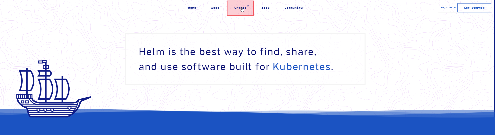

# 1、添加应用仓库

进入 helm 官网： https://helm.sh/

由 helm 官网进入 Artifact HUB：https://artifacthub.io/

在 Artifact HUB 中搜索 zookeeper

点击 install 之后提示需要添加一个仓库地址，使用最多的就是 bitnami

复制仓库地址，在 kubesphere 中新建仓库

# 2、创建应用

添加完应用仓库之后，就可以在 kubesphere 中添加应用了

点击从 **应用模板** 创建，

选择 zookeeper 安装即可

安装完之后，应用和服务中都会出现 zookeeper

在服务中有两个服务，第二个有 ip 的我们可以设置为外部访问，如下：

设置访问模式为 NodePort 即可

之后就出现了端口映射，使用 kubesphere的ip+端口 即可访问 zookeeper

