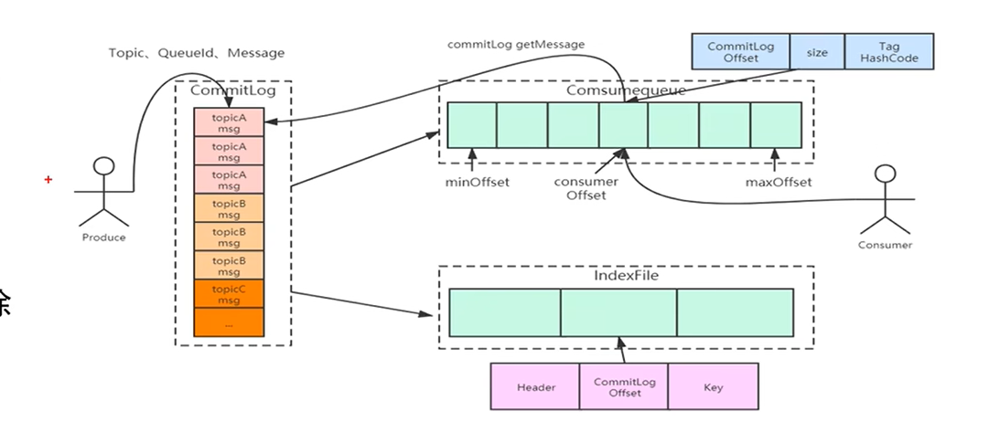

RocketMQ官网：https://rocketmq.apache.org/docs/quick-start/


# 1、RcoketMQ安装

## 安装环境

- 阿里云 CentOS
- JDK1.8（保证服务器上含有JDK1.8版本）
- 这里以RocketMQ4.9.4为例


## 下载安装包

https://rocketmq.apache.org/ 下载Binary文件，Binary是编译好可使用的代码，Source是源代码，需要自行编译。


## 配置RocketMQ

### 解压安装包

`unzip rocketmq-all-4.9.4-bin-release.zip `

没有unzip的话使用`yum install unzip`安装一下

### 修改RocketMQ的JVM配置

原本配置的JVM堆内存太大，如果启动时分配的内存不够会报错。

**修改bin目录下的：runbroker.sh 和 runserver.sh 两个文件**

`runbroker.sh`修改后的内容如下图


`runserver.sh`修改后的内容如下图：


### 配置`conf/broker.conf`文件

需添加下图内容


### 打开阿里云端口


### 启动

```bash
> nohup sh bin/mqnamesrv &  # 启动nameserver
> tail -f ~/logs/rocketmqlogs/namesrv.log # 查看日志，判断是否启动成功
The Name Server boot success...

# nohub 和 & 一起使用，让程序在后台运行

> nohup sh bin/mqbroker -n localhost:9876 & # 启动broker 这个是官网的broker启动命令 -n是nameserver地址
> nohup sh mqbroker -c ../conf/broker.conf & # 当时启动的时候，报错信息是说我的阿里云服务器的内网地址连接不上，百度说修改了broker.conf文件，上边已经修改，之后使用这条命令启动即可

> tail -f ~/logs/rocketmqlogs/broker.log # 查看日志，判断是否启动成功
The broker[%s, 172.30.30.233:10911] boot success...
```

### 关闭命令

```bash
> sh bin/mqshutdown broker
The mqbroker(36695) is running...
Send shutdown request to mqbroker(36695) OK

> sh bin/mqshutdown namesrv
The mqnamesrv(36664) is running...
Send shutdown request to mqnamesrv(36664) OK
```

# 2、SpringBoot测试RocketMQ

## 引入Pom依赖

这里引入的客户端版本要和服务器中下载的RocketMQ版本一致

```xml
<!--rocketmq-->
<dependency>
    <groupId>org.apache.rocketmq</groupId>
    <artifactId>rocketmq-client</artifactId>
    <version>4.9.4</version>
</dependency>
```


## 代码

```java
public class Producer {
    /**
     * Producer，发送顺序消息
     */

    public static void main(String[] args) throws Exception {
        DefaultMQProducer producer = new DefaultMQProducer("please_rename_unique_group_name");

        producer.setNamesrvAddr("8.136.80.172:9876");

        producer.start();

        String[] tags = new String[]{"TagA", "TagC", "TagD"};

        // 订单列表
        List<OrderStep> orderList = new Producer().buildOrders();

        Date date = new Date();
        SimpleDateFormat sdf = new SimpleDateFormat("yyyy-MM-dd HH:mm:ss");
        String dateStr = sdf.format(date);
        for (int i = 0; i < 10; i++) {
            // 加个时间前缀
            String body = dateStr + " Hello RocketMQ " + orderList.get(i);
            Message msg = new Message("TopicTest", tags[i % tags.length], "KEY" + i, body.getBytes());

            SendResult sendResult = producer.send(msg, new MessageQueueSelector() {
                @Override
                public MessageQueue select(List<MessageQueue> mqs, Message msg, Object arg) {
                    Long id = (Long) arg;  //根据订单id选择发送queue
                    long index = id % mqs.size();
                    return mqs.get((int) index);
                }
            }, orderList.get(i).getOrderId());//订单id

            System.out.println(String.format("SendResult status:%s, queueId:%d, body:%s",
                    sendResult.getSendStatus(),
                    sendResult.getMessageQueue().getQueueId(),
                    body));
        }

        producer.shutdown();
    }

    /**
     * 订单的步骤
     */
    private static class OrderStep {
        private long orderId;
        private String desc;

        public long getOrderId() {
            return orderId;
        }

        public void setOrderId(long orderId) {
            this.orderId = orderId;
        }

        public String getDesc() {
            return desc;
        }

        public void setDesc(String desc) {
            this.desc = desc;
        }

        @Override
        public String toString() {
            return "OrderStep{" +
                    "orderId=" + orderId +
                    ", desc='" + desc + '\'' +
                    '}';
        }
    }

    /**
     * 生成模拟订单数据
     */
    private List<OrderStep> buildOrders() {
        List<OrderStep> orderList = new ArrayList<OrderStep>();

        OrderStep orderDemo = new OrderStep();
        orderDemo.setOrderId(15103111039L);
        orderDemo.setDesc("创建");
        orderList.add(orderDemo);

        orderDemo = new OrderStep();
        orderDemo.setOrderId(15103111065L);
        orderDemo.setDesc("创建");
        orderList.add(orderDemo);

        orderDemo = new OrderStep();
        orderDemo.setOrderId(15103111039L);
        orderDemo.setDesc("付款");
        orderList.add(orderDemo);

        orderDemo = new OrderStep();
        orderDemo.setOrderId(15103117235L);
        orderDemo.setDesc("创建");
        orderList.add(orderDemo);

        orderDemo = new OrderStep();
        orderDemo.setOrderId(15103111065L);
        orderDemo.setDesc("付款");
        orderList.add(orderDemo);

        orderDemo = new OrderStep();
        orderDemo.setOrderId(15103117235L);
        orderDemo.setDesc("付款");
        orderList.add(orderDemo);

        orderDemo = new OrderStep();
        orderDemo.setOrderId(15103111065L);
        orderDemo.setDesc("完成");
        orderList.add(orderDemo);

        orderDemo = new OrderStep();
        orderDemo.setOrderId(15103111039L);
        orderDemo.setDesc("推送");
        orderList.add(orderDemo);

        orderDemo = new OrderStep();
        orderDemo.setOrderId(15103117235L);
        orderDemo.setDesc("完成");
        orderList.add(orderDemo);

        orderDemo = new OrderStep();
        orderDemo.setOrderId(15103111039L);
        orderDemo.setDesc("完成");
        orderList.add(orderDemo);

        return orderList;
    }
}
```


# 3、RocketMQ架构


## RocketMQ中的角色

- producer：生产消息，发送到MQ队列

- producer group：多个发送统一消息的producer称为生产者组，也就是集群

- consumer：去消费MQ队列上的消息

- consumer grouop：类似于producer group

- Topic：消息的逻辑分类。如：订单Topic、库存Topic

- Message Queue：Topic是一个逻辑的概念，一个Topic下可以设置多个消息队列，发送消息的时候，会执行该消息的Topic，RocketMQ会轮询该Topic下的所有队列将消息发送出去。

  

- Message：Message是消息的载体。一个Message要指定Topic，相当于消息发送的地址。Message还有一个可选的Tag设置，以便消费端可以根据Tag过滤信息。

  Message使用实例：

  

- Tag：对Topic的进一步细化。用来标记相同业务模块中不同用途的消息。

- Broker：Broker是Rocket MQ的主要角色，主要管理消息的存储、发送、查询等等。

  

  - 几个重要的子模块：
    1. Remotiong Module：Broker的实体，处理客户端的请求
    2. Client Manager：管理客户端（Producer/Consumer）、维持Consumer的Topic订阅
    3. HA Service：提供Master Broker和Slave Broker的数据同步功能

- Name Server：提供轻量级的服务发现，用于存储Topic和Broker关系信息

  - 两个特性：
    1. 接受Broker的注册，并且提供心跳机制去检查Broker是否存活
    2. 路由管理，每个nameserver都有整个Broker集群的路由信息和客户端的查询队列
  - 当客户端要从NameServer中查询队列路由信息的话，需要在客户端指定NameServer的IP地址
  - NameServer之间并不共享数据，Broker会定期更新数据
  - Broker向NameServer发送心跳时，会带上当前自己所负责的所有Topic信息，如果Topic个数太多（万级别），会导致一次心跳的数据就几十M，网络情况差时，会心跳失败，让NameServer误认为Broker心跳失败


### Broker

#### 高并发读写服务

Broker的高并发读写主要是依靠：

- 消息顺序写：所有Topic数据同时只会写一个文件（即commitlog文件），一个文件满1G，再写新文件，真正的顺序写盘，使得发消息TPS（Transaction Per Second：每秒事务处理量）大幅提高，高并发写性能突出。
- 消息随机读：尽可能让读命中系统的pageCache，即使只访问1K的数据，系统也会预读出更多的数据，希望在下次读的时候命中pageCache，减少IO次数

## 主从结构的复制与刷盘


### 集群部署模式分类

- 单master模式

- 多master模式

- 多master多slave模式（同步复制）

- 多master多slave模式（异步复制）

  ​

### 集群部署在源码中的配置

以下示例源码为：`rocketmq-all-4.9.4-bin-release`

集群模式的配置都在源码的conf目录下，如下图所示，不同的文件目录名代表不同的集群部署模式：

2m-noslave就是多master模式，里边有配置文件


在配置文件`broker-a.properties`中：Broker集群的集群名称要相同，其中brokerId是0的话，表示是master节点，brokerId是1代表slave节点


### 多Master的好处

比如TopicA有8个队列，在Master1和Master2中各有4个，如果Master1挂了，TopicA这个主题还有4个队列可以使用，保证了高可用，虽然性能下降了。

但是还存在一个问题：如果一个master宕机了，那么上边的数据就会丢失，这也就是Slave节点的意义，master节点将数据复制到slave节点，对于已经宕机的mater节点，Consumer集群可以去slave节点上消费刚才没有来得及去master消费的数据。

### 同/异步复制、同/异步刷盘

同步复制即，当生产者给master发送数据时，在数据落地到slave节点之后，master节点才会返回确认消息给生产者

异步复制即，只要数据发送给master节点，就返回确认消息给生产者

同步刷盘：当生产者发送消息，必须等消息完全落地到磁盘上，才会返回生产者消息确认。

异步刷盘：当生产者发送消息，不需要等消息完全落地到磁盘上就返回生产者消息确认。


**一般采用同步复制+异步刷盘，兼顾了高可用的效率。**

### RocketMQ的存储设计


解释一下Offset：Offset记录Topic中每个Queue的消费进度

#### 消费的并发度

通过上面的存储设计图发现，要解决消费的并发度，就要利用Queue，一个Topic可以分出来很多个Queue，每个Queue放在不同硬件上执行，提高并发度。

#### 热点问题（顺序消费、消费重复）

要保证消息的顺序，Priducer、Consumer、Queue最好都是一对一关系，但是这样又限制性了并发度。

RocketMQ不解决这个问题的矛盾，理由：

1、乱序的应用大量存在

2、队列无需不代表消息无序

还有消息重复，RocketMQ不保证消息不重复，如果严格要求不重复，需要自己在业务中去重（确保每一条消息都有唯一的编号且消息处理成功与去重表日志同时出现）。

消息重复的根本原因是：网络波动（网络不可达）


### commitlog文件与consumerqueue文件

#### 存储文件如下


- commitlog：消息存储目录（消息存储在下图的全是0的文件中）

  

- config：运行期间一些配置信息

- consumerqueue：消息消费队列存储目录（里边存储的就是topic下的message queue）

  

- index：消息索引文件存储目录

- abort：如果存在该文件则Broker非正常关闭

- checkpoint：文件检查点，存储commitlog文件最后一次刷盘时间戳、consumerqueue、index索引文件最后一次刷盘时间戳

#### 消息存储结构

RocketMQ消息的存储是由consumerqueue和commitlog配合完成的，消息的真正物理存储文件是commitlog，consumerqueue是消息的逻辑队列，类似数据库的索引文件，存储的是指向消息物理存储的地址，每个Topic下的每个Message Queue都有一个对应的consumerqueue文件。




#### cosumerqueue存储结构

### 

#### 文件删除机制

删除过程执行清理commitlog和consumerqueue两个文件

RocketMQ清理过期文件的方法：如果非当前写文件在一段时间内没有更新，则认为可以删除。


#### 零拷贝

**零拷贝（Zero-copy）技术，因为我们没有在内存层面去拷贝数据，也就是说全程没有通过 CPU 来搬运数据，所有的数据都是通过 DMA 来进行传输的。**

[零拷贝学习文章](https://blog.csdn.net/qq_34827674/article/details/108756999?ops_request_misc=%257B%2522request%255Fid%2522%253A%2522166020299416781667838654%2522%252C%2522scm%2522%253A%252220140713.130102334..%2522%257D&request_id=166020299416781667838654&biz_id=0&utm_medium=distribute.pc_search_result.none-task-blog-2~all~top_positive~default-1-108756999-null-null.142^v40^pc_search_integral,185^v2^control&utm_term=%E9%9B%B6%E6%8B%B7%E8%B4%9D&spm=1018.2226.3001.4187)

这里大致写一下零拷贝原理：

场景：读取文件，再用Socket发送出去，实际经历了4次拷贝。

代码如下：

```c++
read(file, tmp_buf, len);
write(socket, tmp_buf, len);
```

经历了两次系统调用（read、write），每次系统调用时都会从用户态切换到内核态，完成任务后，再从内核态切回用户态。


##### 零拷贝的实现

方式有两种：

1. mmap+write

mmap方式

`mmap()` 系统调用函数会直接把内核缓冲区里的数据「**映射**」到用户空间，即应用进程和操作系统内核共享`内核态缓冲区里的数据`，这样，操作系统内核与用户空间就不需要再进行任何的数据拷贝操作。

但是这种方式仍然不是很理想，因为系统调用仍然是2次，共需要4次用户态/内核态切换，也就是4次上下文切换。


2. sendfile

在 Linux 内核版本 2.1 中，提供了一个专门发送文件的系统调用函数 `sendfile()`，函数形式如下：

```c
#include <sys/socket.h>
ssize_t sendfile(int out_fd, int in_fd, off_t *offset, size_t count);
```

通过sendfile，可以直接把内核缓冲区里的数据拷贝到 socket 缓冲区里，不再拷贝到用户态，这样就只有 2 次上下文切换，和 3 次数据拷贝。


##### 零拷贝Java代码


**这里只列出这么多内容，具体参考[零拷贝学习文章](https://blog.csdn.net/qq_34827674/article/details/108756999?ops_request_misc=%257B%2522request%255Fid%2522%253A%2522166020299416781667838654%2522%252C%2522scm%2522%253A%252220140713.130102334..%2522%257D&request_id=166020299416781667838654&biz_id=0&utm_medium=distribute.pc_search_result.none-task-blog-2~all~top_positive~default-1-108756999-null-null.142^v40^pc_search_integral,185^v2^control&utm_term=%E9%9B%B6%E6%8B%B7%E8%B4%9D&spm=1018.2226.3001.4187)**

## RocketMQ的运转流程

参考：https://blog.csdn.net/qq_21040559/article/details/122703715

1. NameServer先启动
2. Broker启动时向NameServer注册
3. 生产者在发送某个主题的消息之前先从 NamerServer 获取 Broker 服务器地址列表（有可能是集群），然后根据负载均衡算法从列表中选择一台Broker 进行消息发送
4. NameServer 与每台 Broker 服务器保持长连接，并间隔 30S 检测 Broker 是否存活，如果检测到Broker 宕机（使用心跳机制， 如果检测超120S），则从路由注册表中将其移除
5. 消费者在订阅某个主题的消息之前从 NamerServer 获取 Broker 服务器地址列表（有可能是集群），但是消费者选择从 Broker 中 订阅消息，订阅规则由 Broker 配置决定


## 分布式事务


半事务消息：将消息只存储在commitlog中，不记录consumerqueue信息

幂等性：执行多次和执行一次的效果相同

执行流程：

- A系统向RocketMQ发送半事务，之后A去执行自己的事务
- RocketMQ需要进行事务回查，当发现A的事务执行成功后，RocketMQ的半事务变成全事务
- RocketMQ将消息发送给B，也就是消费者，B要尽自己最大可能来消费这个消息。


## 代码演示


还可能出现一种情况：在事务回查的时候，生产者宕机了，怎么解决呢？

可以多启动几台生产者，只要让producerGroup相同即可，如果一个生产者宕机了，事务回查会去其他的生产者进行。


# 4、源码分析（未整理）

## Broker启动流程分析


参考文章

https://blog.csdn.net/yuanshangshenghuo/article/details/109036959?ops_request_misc=&request_id=&biz_id=102&utm_term=rocketmq%E6%BA%90%E7%A0%81&utm_medium=distribute.pc_search_result.none-task-blog-2~all~sobaiduweb~default-1-109036959.142^v40^pc_search_integral,185^v2^control&spm=1018.2226.3001.4187


## 消息发送者启动流程

