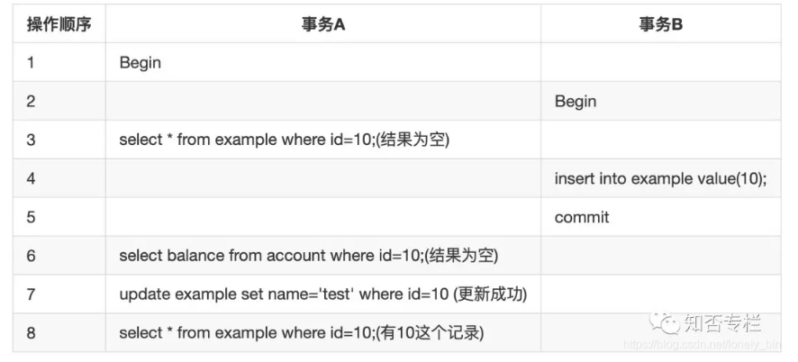

# 1、概述

## 事务

MySQL服务器层部管理事务，事务是由下层的存储引擎实现的。


### 事务的四个特性

- 原子性

  ​	整个事务的操作要么全做，要么全不做

- 一致性

  ​	一致性是指事务将数据库从一种一致性状态转换到另外一种一致性状态，在事务开始之前和事务结束后数据库中数据的完整性没有被破坏

- 隔离性

  ​	隔离性要求一个事务对数据库中数据的修改，在未提交完成前对于其他事务是不可见的

  ​	SQL标准中定义的四种隔离级别：

  ​		- 未提交读（脏读）：在事务

- 持久性

  ​	一旦事务提交，则其所做的修改就会永久保存到数据库中。此时即使系统崩溃，已经提交的修改数据也不会丢失

### SQL标准中定义的四种隔离级别

在数据库操作中，为了有效保证并发读取数据的正确性，提出的事务隔离级别。我们的数据库锁，也是为了构建这些隔离级别存在的。

| 隔离级别                   | 脏读（Dirty Read） | 不可重复读（NonRepeatable Read） | 幻读（Phantom Read） |
| ---------------------- | -------------- | ------------------------- | ---------------- |
| 未提交读（Read uncommitted） | 可能             | 可能                        | 可能               |
| 已提交读（Read committed）   | 不可能            | 可能                        | 可能               |
| 可重复读（Repeatable read）  | 不可能            | 不可能                       | 可能               |
| 可串行化（Serializable ）    | 不可能            | 不可能                       | 不可能              |
|                        |                |                           |                  |


- 未提交读：事务中的修改，即使没有提交，对其他事务也是可见的，**事务可以读取未提交的数据**。如果一个事务正在进行写操作，则不允许其他事务同时进行写操作，但允许其他事务进行读操作。该隔离级别通过“排他写锁”，但是不排斥读线程来实现，这样避免了更新丢失，但是可能会造成  **脏读：**也就是事务B读取到了事务A未提交的数据
- 已提交读：如果是一个读事务，则允许其他事务读写，但如果是一个写事务则会禁止其他事务访问该行数据。该隔离级别避免了脏读，但是可能会造成  **不可重复读：**即事务A先读取数据，事务B再进行修改或删除，事务A再次读取数据，但是和第一次读取的数据不同。
- 可重复读：在一个事务内，多次读同一个数据，在这个事务没有结束之前，不允许其他事务访问该数据（包括了读写），但是可能出现  **幻读**。可重复读是 MySQL 的默认事务隔离级别。
- 可串行化：提供严格的事务隔离，他要求事务序列化执行，事务只能一个接着一个地执行，但是不能并发执行。 **序列化是最高的事务隔离级别，同时代价也是最高的，一般很少使用**


**幻读：**读取到了其他事务已经提交的数据，即事务A进行了多次查询，但是事务B在事务A查询过程中新增了数据，事务A虽然查询不到事务B中的数据，但是可以对事务B中的数据进行更新，可通过共享锁或排他锁来避免幻读。




MySQL中的默认的事务隔离级别是可重复读，可使用`show variables like '%iso%'`进行查询


### 大事务

定义：运行时间比较长，操作的数据比较多的事务

风险：

1. 锁定太多的数据，造成大量的阻塞和锁超市
2. 回滚时所需时间比较长
3. 执行时间长，容易造成主从延迟（MySQL的主从复制存在延迟）


#### 如何处理大事务

1. 避免一次处理太多的数据
2. 移除不必要在事务中的Select操作


## 多版本并发控制 MVCC

MySQL的大多数事务型存储引擎实现的都不是简单的行级锁。为了提升并发性能，一般都同时使用了MVCC多版本并发控制。

MVCC可以在很多情况下避免了枷锁操作，因此开销更低，MVCC没有统一的实现标准，但是大都实现了非阻塞的读操作，写操作也只锁定必要的行。

MVCC实现：

MVCC对于每一行记录多保存了两个隐藏的列：行的创建时间、行的过期时间（或删除时间），这个时间其实是系统版本号（每开始一个新的事务，系统版本号都会递增），在REPEATABLE READ隔离级别，MVCC具体操作：

- Select：InnoDB会根据以下两个条件检查每行记录，只有符合记录的查询结果，才会被返回
  1. InnoDB之查找版本号小于或等于当前事务的系统版本号，这样可以保证事务读取的行是在事务开始前已经存在或者事务自身插入或修改过的
  2. 行的删除版本要么未定义，要么大于当前事务的版本号。可以确保事务读取的行，在事务开始之前未被删除
- Insert：InnoDB为新插入的行保存当前系统版本号为行版本号
- Update：InnoDB为插入的新行，保存当前系统版本号为行版本号，同时保存当前系统版本号到原来的行作为删除版本号。
- Delete：InnoDB保存当前系统版本号为删除的行的删除版本号。


MVCC只能在可重复读和读已提交两个隔离级别下工作，其他两个和MVCC不兼容。

因为读未提交总是读取最新的数据行，而可串行化会对所有读取的行都加锁


# 2、什么影响了MySQL性能


1. 服务器硬件

   CPU、内存、磁盘I/O

2. 服务器操作系统

3. 数据库存储引擎的选择：MySQL的特色是插件式存储引擎，可以根据不同需求选择不同存储引擎

   MyISAM：不支持事务，表级锁

   InnoDB：事务级存储引擎，完美支持行级锁，事务ACID特性

4. 数据库参数配置

5. 数据库结构设计和SQL语句


### 服务器硬件对MySQL产生的影响


### 如何选择CPU


1. CPU密集型的应用需要更好的CPU而不是更多的CPU数量
2. MySQL不支持多CPU对同一SQL并发处理，所以CPU数量比频率更加重要一些
3. MySQL5.6之后对多核CPU的支持较好


### 如何选择内存

内存大小直接影响数据库性能

常用的MySQL的存储引擎：

- MyISAM会将索引缓存在内存中
- InnoDB会将索引和数据同时缓存在内存中

内存对性能的影响也是有限的，当所有文件都被缓存在内存中了，此时内存增大对性能就没有影响了

选择内存应选择主板支持的最大内存频率（频率越高，读写越快）


### 磁盘的配置和选择 

#### 使用传统机器硬盘

最常见、使用最多、价格低、存储空间大、读写较慢

传统机器硬盘读取数据的过程

1. 移动磁头到磁盘表面上的正确位置
2. 等待磁盘旋转，使得所需的数据在磁头之下
3. 等待磁盘旋转过去，所有所需数据都被磁头读出

如何选择传统机器硬盘

1. 存储容量（一般不会成为瓶颈，可以通过RAID技术将小磁盘组成大的磁盘阵列）
2. 传输速度（即上边读取数据的第三步的速度，取决于磁头转动速度以及存储密度，顺序读写一般来说速度已经很快了）
3. 访问时间（即上边读取数据的第二步的速度）
4. 主轴转速
5. 物理尺寸（越小，移动磁头时间就越短）

#### 使用RAID增强传统机器硬盘的性能

##### 什么是RAID

RAID（磁盘冗余队列：Redundant Arrays of Independent Disks）：把多个容量较小的磁盘组成一组容量更大的磁盘，并提供数据冗余来保证数据完整性的技术


RAID0：最简单的一种形式，没有提供冗余或错误修复能力，但是实现成本最低，只需要2块以上的硬盘即可提高整个磁盘的性能和吞吐量。

RAID1：又称磁盘镜像，原理是把一个磁盘的数据镜像到另一个磁盘上，在不影响性能的情况下最大程度保证系统的可靠性和可修复性。

常用的RAID组别—RAID5（随机写比较慢，因为需要计算奇偶校验位的数值，随机读和顺序读很快，RAID5比较适合读业务，最好使用在从（Slave）数据库服务器上）

RAID5：又称分布式奇偶校验磁盘阵列，通过分布式奇偶校验块把数据分散到多个磁盘上，这样如果任何一个盘数据失效，都可以从奇偶校验块中重建。但是如果两块磁盘失效，则整个卷的数据都无法恢复。

RAID10：又称分片的镜像，它是对磁盘先做RAID1之后，对两组RAID1的磁盘再做RAID0，所以对读写都有良好的性能，相对于RAID5重建起来更简单，也更快。


#### 使用固态存储SSD和PCIe卡

固态存储也成为闪存。

固态存储特点：

1. 相比机械磁盘，固态磁盘有更好的随机读写性能 
2. 相比机械磁盘，固态磁盘能更好的支持并发
3. 相比机械磁盘，固态磁盘更容易损坏（写入前需要进行擦除）


##### SSD（固态硬盘）

1. 使用SATA接口，可以替换传统磁盘而不需任何改变，但是性能会收到SATA接口的限制
2. SATA接口的SSD同样支持RAID技术

##### PCIe卡

1. 无法使用SATA接口，需要独特的驱动和配置
2. 价格相对于SSD更贵，但性能更好


固态存储的适用场景

1. 适用于存在大量随机I/O的场景
2. 适用于解决单线程负载的I/O瓶颈


如果只有一个固态存储磁盘，应该放在MySQL的从服务器上，因为主服务器是多线程，而从服务器是单线程的，想要提升单线程执行效率，主要需提升I/O速度，且固态存储磁盘容易损坏，放在主服务器不安全。


#### 使用网络存储NAS和SAN

SAN（Storage Area Network）和NAS（Network-Attached Storage）是两种外部文件存储设备加载到服务器上的方法

这里具体细节了解不够，先略


# 3、MySQL体系结构


MySQL的存储引擎是插件式的。

**存储引擎是针对表的而不是针对库的（一个库中的不同表可以使用不同的存储引擎）**


## InnoDB存储引擎

**存储引擎是形容数据库的表的，而不是形容数据库的。**

InnoDB是MySQL的默认事务型引擎，也是最重要、使用最广泛的存储引擎。它被设计用来处理大量的短期事务，短期事务大部分情况是正常提交的，很少会被回滚。

索引结构采用B+树


### B+树数据结构在线模拟网站

https://www.cs.usfca.edu/~galles/visualization/BPlusTree.html


### InnoDB部分优化以及面试题

1. **为什么InnoDB表需要主键，并且推荐使用整型的自增主键？**

   **自己创建主键就不需要mysql来帮助寻找或生成主键，提升性能。**B+树是通过主键来组织起来的，如果没有创建主键的话，mysql会自动合适且唯一的索引作为主键，如果找不到，会生成一个虚拟列ROW_ID来充当主键。

   **整型比较节省存储空间且比较效率高**（因为索引都存储在了SSD固态硬盘，SSD使用的是较昂贵的固态硬盘，尽可能节约存储空间），在查询的时候需要进行索引的比较，整型的比较效率是高于其他数据结构的，如字符串。

   **使用自增可以最大程度避免向两个已经存在节点中间插入节点导致节点分裂所带来的性能消耗**，因为InnoDB使用B+树结构，假如说一个节点存储的是 **10 20**，那么此时去插入一个节点索引值是15的话需要的性能是很大的，因为B+树的叶子节点是链表有序连接的，链表为：10 ------》 20，向链表中间插入元素时间复杂度是O(n)的，所以使用自增主键的话，可以避免向链表中间插入元素的性能消耗。

   **不容易出现碎片。**如果使用UUID的话，由于出现了频繁的页分裂问题，每个页会变得稀疏，并且数据分布也不均匀，存在页面碎片。

   ​


**InnoDB存储引擎的索引和数据不分离，即叶子节点存放的是：索引 +  除索引外的数据**

> 如下图所示也就是，索引值为15，其他两列值为 34， Bob


### InnoDB概览

- InnoDB的数据存储在表空间中，表空间是由InnoDB管理的一个黑盒子，由一系列的数据文件组成。
- InnoDB采用MVCC来支持高并发，并且实现了四个标准的隔离级别。默认隔离级别是可重复读。
- InnoDB表是基于**聚簇索引（索引和数据是放在一起的）**建立的。聚簇索引对主键查询有很高的性能。
- InnoDB内部做了很多的优化，包括从磁盘读取数据时采用的可预测性预读，能够自动在内存中创建hash索引以加速度操作的自适应哈希索引，以及能够加速插入操作的插入缓冲区等。


#### 修改表的存储引擎

```mysql
alter table test_myisam engine=myisam#innodb
```


#### 查看表的存储引擎


## MyISAM存储引擎

MyISAM存储引擎将表存储在两个文件中：数据文件和索引文件，后缀分别为 .MYD（MyISAM Data） 和 .MYI（MyISAM Index）。

**MyISAM存储引擎的索引和数据分离，即叶子节点存放的是：索引 +  数据存放的磁盘地址**


文件存储在MySQL安装目录的data文件下：如下图


# 4、MySQL索引


## 为什么MySQL索引不使用红黑树

因为红黑树是二叉树，如果数据量太大会造成树的高度不可控。


MySQL支持两种索引数据结构 BTREE 和 HASH。

BTREE 索引结构使用的B+树以及聚集索引。


## 聚集索引和非聚集索引

聚集索引并不属于索引类型，而是一种数据存储的方式。

聚集索引：索引和数据放在一起的索引。

非聚集索引：索引和数据分开放的索引。

InnoDB采用聚集索引，索引结构为B+树。

**聚集索引的优点：**

- 数据访问更快。索引和数据保存在一起，访问数据的速度比非聚集索引更快

**聚集索引的缺点：**

- 极大提高了IO密集型应用的性能，但是如果数据全部放在内存中的话，聚集索引就没有什么优势了。

- 插入速度严重依赖于插入顺序。因为不按顺序插入的话，会导致节点的分裂，严重影响插入性能。

- 更新聚集索引的代价很高。因为会强制InnoDB将每个被更新的行移动到新的位置

- 聚簇索引可能会导致全表扫描变慢，尤其是行比较稀疏或者由于页分裂导致数据存储不连续的时候

- 二级索引（非聚簇索引）可能比想象的要更大，因为在二级索引的叶子节点包含了引 

  用行的主键列。 

- 二级索引访问需要两次索引查找，而不是一次。


## 联合索引

联合索引：对一张表上的多个列进行索引。


### 最左前缀原则

最左前缀原则：规定了联合索引在何种查询中才能生效。

规则如下：

- 如果想使用联合索引，联合索引的最左边的列必须作为过滤条件，否则联合索引不生效

联合索引如下图


```mysql
select * from employee where name = 'Bill' and age = 31;
select * from employee where age = 30 and position = 'dev';
select * from employee where position = 'manager';
```

对于上边三条sql语句，只有第一条sql语句走了联合索引。


> **为什么联合索引需要遵循最左前缀原则呢？**
>
> 因为索引的排序是根据第一个索引、第二个索引依次排序的，假如我们单独使用第二个索引age而不使用第一个索引name的话，我们去查询age为30的数据，会发现age为30的数据散落在链表中，并不是有序的，所以使用联合索引需要遵循最左前缀原则。


## 二级索引介绍

二级索引是非主键索引，也是非聚集索引（索引和数据分开存放），也就是在非主键的字段上创建的索引就是二级索引。

比如我们给一张表里的name字段加了一个索引，在插入数据的时候，就会重新搞一颗B+树，在这颗B+树中，就来存放name的二级索引。

即在二级索引中，索引是name值，数据（data）存放的是主键的值，第一次索引查找获取了主键值，之后根据主键值再去聚集索引中进行第二次查找，才可以找到对应的数据。

常见的二级索引：

- 唯一索引
- 普通索引
- 前缀索引：只适用于字符串类型的字段，取字符串的前几位字符作为前缀索引。


### InnoDB有了聚集索引，为什么还需要二级索引？

聚集索引的叶子节点存储了完整的数据，而二级索引只存储了主键值，因此二级索引更节省空间。

如果需要为表建立多个索引的话，都是用聚集索引的话，将占用大量的存储空间。


## 覆盖索引

覆盖索引：一个索引包含（或说覆盖）所有需要查询的字段的值，我们就称之为“覆盖索引”。

覆盖索引是非常有用的工具，能够极大的提高性能，只需要查询索引而不需要回表，好处有很多：

> Mysql回表指的是在InnoDB存储引擎下，二级索引查询到的索引列，如果需要查找所有列的数据，则需要到[主键](https://so.csdn.net/so/search?q=%E4%B8%BB%E9%94%AE&spm=1001.2101.3001.7020)索引里面去取出数据。这个过程就称为回表

- **索引条目通常远小于数据行的大小，如果只需要读取索引，mysql可以大幅减少数据访问量。**对缓存的负载很重要，可以减少数据拷贝花费的时间。覆盖索引对IO密集型应用也很有帮助，索引比数据更小，放到内存中更节省空间。
- 因为索引是按照顺序存放的（至少在单个页内是如此），所以对于IO密集型的范围查询，会比随机从磁盘读取每一行数据的IO要少得多。
- 由于InnoDB的聚集索引，覆盖索引对InnoDB表特别有用。InnoDB的二级索引在叶子节点中保存了行的主键值，所以如果二级主键额能够覆盖查询，则可以避免对主键索引的二次查询。


#### 覆盖索引的使用

由于覆盖索引需要存储索引列的值，而哈希索引等索引都不存储索引列的值，所以MySQL只能使用B-TREE索引做覆盖索引。


## 使用索引扫描来排序（Order by）

MySQL有两种方法生成有序结果：

- 通过排序操作
- 按照索引顺序扫描

如果 explain 出来的 type 列值为 "index" 的话，说明是按照索引扫描了。

**索引扫描本身的速度是很快的。但是如果索引不能覆盖查询所需的全部列的话，那在每次查询索引时都需要回表再查询其他字段，这样的话，按索引顺序读取的速度通常比顺序地全表扫描要慢。如下图，`select *`时没有使用索引，`select age`时使用了索引。**

```mysql
explain select age from user order by age; # 结果1
explain select * from user order by age; # 结果2
```


**设计：**设计的时候，尽可能让同一个索引既满足排序，又用于查找行，这样是最好的。

只有当索引的列顺序和`order by`子句的顺序完全一致时，MySQL才能使用索引来对结果进行排序，如果查询需要关联多张表时，只有`order by`子句引用的字段全部为第一个表时，才能使用索引做排序。

`order by`查询时，需要满足索引的最左前缀要求，否则MySQL需要执行排序操作，无发利用索引进行排序。

`order by`有一种情况可以不满足索引的最左前缀的要求：前导列为常量。（即如果age,name为索引列，那么`select * from user where age = 30 order by name`，使用where将age指定为常量，这时也是可以使用索引排序的）


## 冗余、重复、未使用索引

MySQL允许在相同列上创建多个索引，但是如果出现过多的重复索引和未使用索引，会影响插入、删除、更新的性能。

例如，如果创建了一个主键id，再去向id上添加索引，那么就添加了重复的索引，因为MySQL的主键限制也是通过索引实现的。

冗余索引是：如果创建了索引（A, B），再创建索引（A）就是冗余索引，因为（A）是（A, B）的前缀索引。

还有一种情况是，（A, ID）其中ID是主键，也是冗余索引，因为在 InnoDB 中，**主键列已经存在二级索引中了**。


## 索引和锁

InnoDB只有在访问行的时候才会对其加锁，而索引可以减少InnoDB访问的次数，从而减少锁的数量，但是这基于InnoDB的存储引擎可以过滤掉不需要的行的情况。

如果索引无法过滤掉无效的行，那么在InnoDB检索到数据返回给服务器层后，MySQL服务器才能应用Where子句，这时候InnoDB已经锁住了这些行，在MySQL5.1和更新的版本中，InnoDB可以在服务器短过滤掉行之后就释放锁，但是早期MySQL中，只有事务提交后才能释放锁。


证明：MySQL会锁住不需要的行

在下边操作中，存储引擎的操作是：获取满足条件 age < 20 的记录，但是服务器并没有告诉InnoDB可以过滤age为12的记录。

首先，表中数据如下图：


```mysql
序号为执行顺序
# 窗口1
select * from user where age < 20 and age <> 12 for update;  1
commit; 3

# 窗口2
select * from usere where age = 12 for update; 2
commit; 4

会发现，执行1、2之后，窗口1的数据查到了，窗口2的查询被阻塞了，这是因为查询时，将需要的行查出来，再根据where进行过滤，将不需要的行（也就是age=12）也给锁了，所以窗口2才会阻塞，此时再执行3，会发现，窗口2的查询放行了。
```


InnotDB根据where条件查询，如果是根据索引查询，则会进行锁行，如果是根据非索引查询，则会锁表。


## B树

- B树的所有叶子节点都在同一层

- 在数据库查询中，以树来存储数据，树有多少层，就意味着要读取多少次磁盘IO

- B树的每一个节点都包含 key 和 value

  ​


## B+树

- B+树的叶子节点存放数据，非叶子节点存放索引
- B+树的叶子节点会进行链表连接，从小到大排序。


**InnoDB中使用B+树索引存储结构**


### 为什么有B+树

B树的优点：B树每个节点存储 key（索引）和 value（数据） ，因此距离根节点越近，查询速度越快

B树的缺点：不利于范围查找（区间查找），如果要找0~100的索引值，B树需要从根节点多次逐层查找，而B+树只需要从叶子节点的链表查询即可（只需要遍历链表）

B+树相较于B树的优点：B+树的非叶子节点只存储索引，因此同样的大小B+树比B树可以存储更多的索引


B+树的结构如下图：


### MySQL的索引节点大小

```sql
show global status like 'Innodb_page_size'
```

通过上边sql语句可以查出MySQL底层对于每个页（也就是B+树的每个节点）分配了**16384B**也就是**16KB**

#### MySQL为什么推荐16KB呢？

我们来计算一下如果一个节点是16KB的话，三层的B+树可以存储多少数据。

可以看下图，（索引+下一级磁盘文件地址） = 14B，那么B+树的一个节点大小是16KB，一个节点可以放（16KB/14B） = 1170个索引

B+树的叶子节点存储的是（索引+数据），数据也就是索引所在行的磁盘文件地址，我们假设索引+数据占用**1KB**，也就是下图叶子节点的 （20+data）占用 1KB ，那一个叶子节点可以放16个索引+数据。

那么三层的B+树可以存放的（索引+数据）的个数为=1170 * 1170 * 16 = 2000多万


建立在B+Tree上的索引


# 5、索引优化


## 正确使用索引

- 全值匹配我最爱，最左前缀要遵守；
- 带头大哥不能死，中间兄弟不能断；
- 索引列上不计算，范围之后全失效；
- Like百分写最右，覆盖索引不写星；
- 不等空值还有OR，索引失效要少用。


## 什么情况走索引

### 1、联合索引第一个字段用范围查询不会走索引

因为第一个字段用范围查询的话，mysql会认为结果集很大，走索引还需要回表查询，速度不如直接全表扫描快。


### 2、使用覆盖索引优化

让需要查询的列可以被索引覆盖。


### 3、in、or在表数据量大的时候会走索引，数据量小时走全表扫描


### 4、like KK% 一般情况会走索引

因为5.6版本之后出现了索引下推（概念见索引实战1.pdf），也就是对于

`select * from t where name like 'kk%' and age = 22`

索引下推会根据name和age两个索引进行过滤，得到符合条件的主键id，再去进行回表，可以减少回表次数。


### 5、MySQL到底走不走索引

`select * from t where name > 'a'`

`select * from t where name > 'zzz'`

第一条sql走索引，第二条sql没有走索引，这是由MySQL底层来计算 走索引 和 不走索引 所花费的成本，再来选择是否走索引。

可以使用 trace 工具来查看。

| **where语句**                              | **索引是否被使用**              |
| :--------------------------------------- | ------------------------ |
| **where a = 3**                          | **Y，使用到a**               |
| **where a = 3 and b = 5**                | **Y，使用到a,b**             |
| **where a = 3 and b = 5 and c = 4**      | **Y，使用到a,b,c**           |
| **where b= 3 或者 where b = 3 and c = 4 或者 where c= 4** | **N**                    |
| **where a = 3 and c = 5**                | **使用到a，但是c不可以，b中间断了**    |
| **where a = 3 and b > 4 and c = 5**      | **使用到a和b，c不能用在范围之后，b断了** |
| **where a = 3 and b like 'kk%' and c = 4** | **Y，使用到a,b,c**           |
| **where a = 3 and b like '%kk' and c = 4** | **Y，只用到a**               |
| **where a = 3 and b like '%kk%' and c = 4** | **Y，只用到a**               |
| **where a = 3 and b like 'k%kk%' and c = 4** | **Y，使用到a,b,c**           |


## 索引下推

索引下推是MySQL5.6新添加的特性，用于优化数据的查询。

索引下推即：当存在索引的列作为判断条件时，MySQL的server层会将这一部分判断条件传递给存储引擎，之后将不符合该索引判断条件的索引项删除，之后拿到符合条件的数据项，再进行回表查询。**即将上层（服务层）做的事情，交给了下层（引擎曾）**


举个例子：

```mysql
索引项为：(name, level)
执行sql语句：select * from user where name like "大%" and level=1
```

- 如果没有索引下推，那么根据索引的最左前缀原则，存储引擎会找到条件为 `name like "大%"` 的两条记录主键 id (id=1, id=4)，之后再逐一进行回表扫描，在聚集索引中查找到完整的行记录，**服务层再对数据进行 `level=1` 的条件筛选**，可以看到不使用索引下推的情况下，需要回表 2 次。

  

- 如果使用索引下推，那么在索引遍历的过程中，会对索引的字段进行判断，将不符合条件的索引项过滤掉，也就是判断`level`是否等于`1`，之后找到一条记录(id=1)，**只需要回表1次。**


可以使用explain查看是否使用索引下推，当`Extra`列的值为`Using index condition`，则表示使用了索引下推。

索引下推的目的是为了减少回表次数，也就是要减少IO操作。对于的**聚簇索引**来说，数据和索引是在一起的，不存在回表这一说。


# 6、MySQL架构

MySQL主要分为Server层和存储引擎层。

- **Server 层**：主要包括连接器、查询缓存、分析器、优化器、执行器等，所有跨存储引擎的功能都在这一层实现，比如存储过程、触发器、视图，函数等，还有一个通用的日志模块 binglog 日志模块。
- **存储引擎**： 主要负责数据的存储和读取。server 层通过api与存储引擎进行通信。

**Server 层基本组件**

- **连接器：** 当客户端连接 MySQL 时，server层会对其进行身份认证和权限校验。
- **查询缓存:** 执行查询语句的时候，会先查询缓存，先校验这个 sql 是否执行过，如果有缓存这个 sql，就会直接返回给客户端，如果没有命中，就会执行后续的操作。
- **分析器:** 没有命中缓存的话，SQL 语句就会经过分析器，主要分为两步，词法分析和语法分析，先看 SQL 语句要做什么，再检查 SQL 语句语法是否正确。
- **优化器：** 优化器对查询进行优化，包括重写查询、决定表的读写顺序以及选择合适的索引等，生成执行计划。
- **执行器：** 首先执行前会校验该用户有没有权限，如果没有权限，就会返回错误信息，如果有权限，就会根据执行计划去调用引擎的接口，返回结果。

# MySQL经典面试题

https://gitee.com/tysondai/Java-learning/blob/master/docs/database/mysql.md


mysql 的核心就在于存储引擎的实现。

mysql 中几乎所有的配置查看都是通过命令 ： `show variables like 'log_%'` 


配置错误日志的开启和级别：

- `vim /etc/my.cnf`（手动安装版的myslq配置路径，容器的话不在这个位置）在该文件添加两行即可


对于二进制日志 bin log ，没有必要查看


第六周：一条sql的完整执行流程

server 层中主要是函数、连接器等等

存储引擎层主要是索引、锁等等

在 mysql 客户端，使用 `show processlist;`，可以查看长连接数

mysql查询缓存功能比较鸡肋，在8.0就删除了


mysql性能真正的瓶颈在于**存储引擎**


buffer pool 中的数据是以单链表进行存储的，普通的 lru 算法是将新读取的数据页放入单链表首部，当单链表空间满了之后，再读取新的数据，会将链表尾不经常使用的数据剔除掉

mysql基于普通的 lru 算法进行了改进，在单链表的中间添加了一个 `midpoint`，新读取的数据会插入到 `midpoint` 的位置，old sublist 可以理解为不经常使用的数据，new sublist 可以理解为比较热的数据，这里不将新读取的数据放在链表首部的原因是，这样做可能会将大量频繁使用的数据页给换出 lru 队列，因为对于再频繁使用的数据来说，总有比他更频繁的数据。

新数据页插在 midpoint 位置，由参数innodb_old_blocks_time来控制，表示数据页读取到 midpoint 位置后需要等待多久才会被加入到 lru 队列的热端


innodb 使用 log buffer 缓冲日志文件的写入，通过 内存写入 加上 日志文件顺序写 使得 innodb 日志写入性能极高，需要思考下边这个问题：

innodb 对于写入操作还是操作的内存，并没有将数据落盘，那是不是存在丢失的风险，可以引出一个更通用的问题，对与内存中操作的数据，如何更安全的落入磁盘中？


学习 innodb 主要学习的就是 内存结构、磁盘结构以及内存的数据如何进入到磁盘当中去

