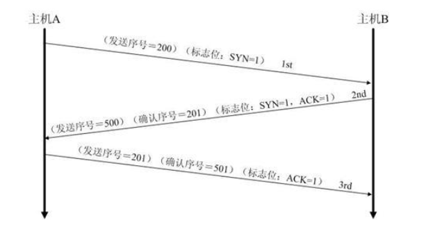
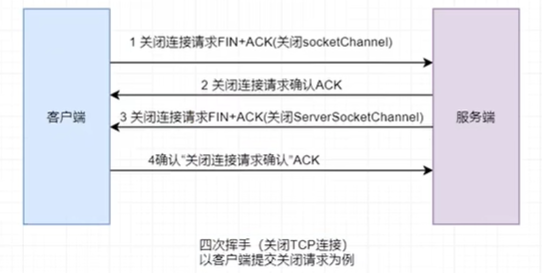
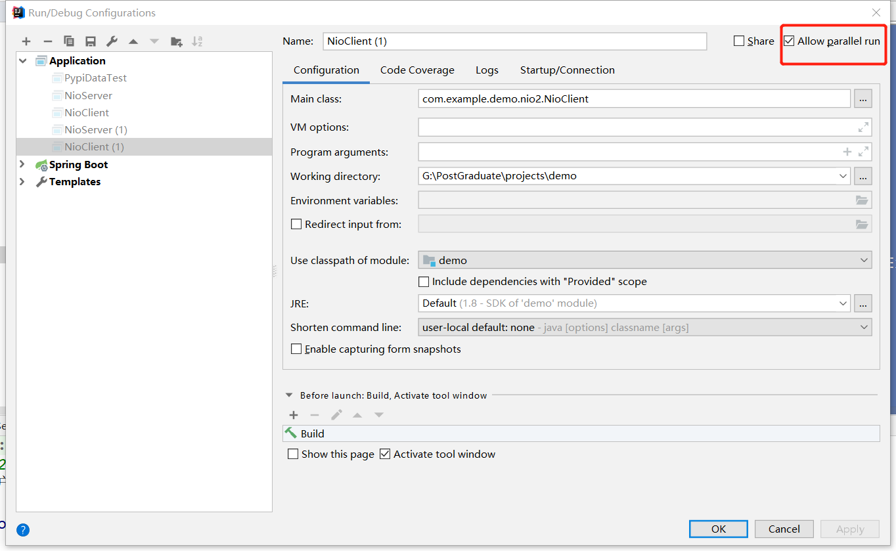
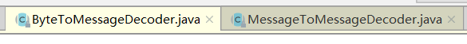
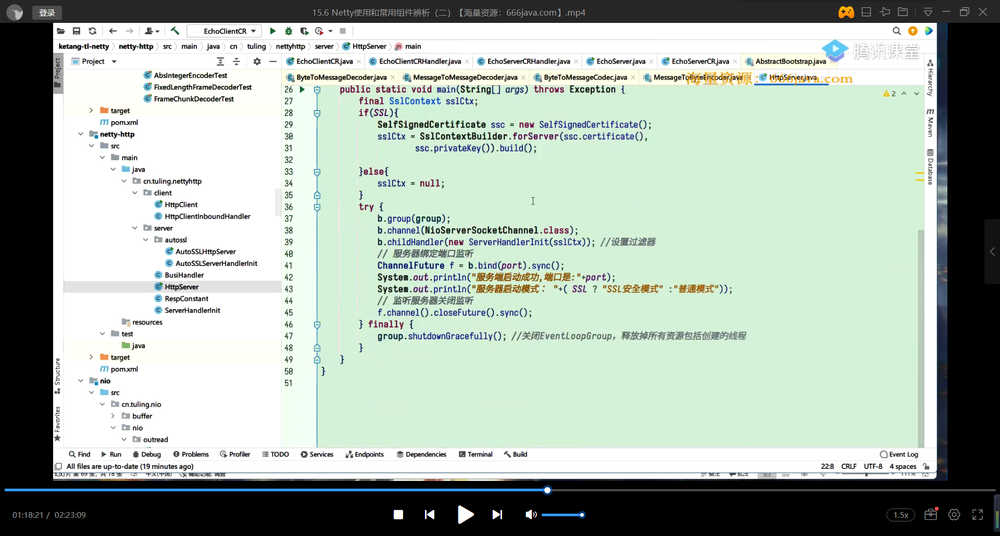

# 1、深入理解TCP、IP

协议查看地址：https://www.rfc-editor.org/


## 端口号

端口号只有65535个，这是受限于表示端口号的字节数，那么一台主机上只能保持最多65535个TCP连接对不对呢？

不对，因为一个TCP由4个元素确定：源IP、目的IP、源端口、目的端口，只要有一个值变了，就不再是同一个TCP连接了


## TCP三次握手/四次挥手

| 参数      | 用途                                    |
| ------- | ------------------------------------- |
| SYN     | 用于启动和建立连接时，同步设备之间的序列号。0到2^32 - 1的随机数。 |
| ACK     | 向另一端确认已经收到 SYN，数值为收到 SYN 增一。          |
| SYN-ACK | 确认之前收到了 SYN，数值为自定义值。                  |
| FIN     | 终止连接。                                 |
| RST     | 重置连接。                                 |

### 三次握手




第一次握手：主机A请求建立连接，发送SYN包（SYN=1）到主机B，并进入SYN_SEND状态，等待B回应

第二次握手：主机B向主机A发送SYN+ACK包，并进入SYN_RECV状态

第三次握手：主机A收到主机B发送的SYN+ACK包，向主机B发送ACK包

**为什么需要三次握手？因为经过了三次握手，主机A和主机B才可以保证自己的发送能力和接收能力都是正常的，可以进行通信。**


### 四次挥手




1. 第一次挥手：客户端想要终止连接时，向服务端发送 FIN。该 segment 有两个功能：
   - FIN 用于告诉服务端不会再向其发送数据。
   - FIN 中的 ACK 标记要终止的连接。
2. 第二次挥手：服务端收到客户端终止请求后，回复 ACK 确认 FIN。
3. 第三次挥手：TCP 的连接是相互独立的。因此，服务端也需要向客户端发送 FIN。
4. 第四次挥手：客户端收到服务端的 FIN 后，回复 ACK 确认，序列号增一。

**TCP是全双工通信，所以需要双方都确认关闭连接，四次挥手是需要主机A向主机B表明要断开连接，同时也要B向A断开连接，因此四次挥手的报文发送顺序为：**

**A->B, B->A, B->A, A->B**


## TCP三次握手漏洞—SYN洪泛攻击

定义：通过网络服务所在的端口发送大量伪造源地址的攻击报文，发送到服务端，造成服务端上的半开连接队列被占满，从而阻止其他用户的访问

原理：攻击者伪造IP地址向服务端发送第一次握手，但是服务器发送的第二次握手由于发送不到真正的客户端而导致第二次握手无法被回应，服务器一直等待，直至资源耗尽


**解决方案**

- 无效连接监控释放
- 延缓TCP分配方法
- 防火墙


### TIME_WAIT状态

MySQL数据库可能会产生大量TIME_WAIT，原因如下：


上图为四次挥手的过程图，假如说甲方主动发起关闭连接的请求，那么甲方会出现TIME_WAITING的状态，那么MySQL数据库产生大量TIME_WAIT的原因可能是因为我们在代码中没有主动close连接，导致服务器端长时间没有收到客户端的报文，服务器端判定该客户下线，于是主动发起请求关闭，因此MySQL服务器会产生大量的TIME_WAIT。


## 实战观察TCP报文


### 下载安装

www.wireshark.org

使用wireshark工具查看TCP的三次握手，推荐书籍


这里没抓到包，先跳过吧···


## UDP协议

- 面向无连接、速度快、容易丢失数据，不需要接收方确认，属于不可靠传输


> - UDP单播
> - UDP多播


## UDT、QUIC

之后又发展出来了UDT和QUIC


UDT：基于UDP的数据传输协议

由于设计年代较早，TCP在传输少量数据时效率高，但是如今网络规模变大，传输海量数据效率太低，因此引出了UDT协议

**特性：**UDT兼顾了TCP的安全可靠和UDP高效，UDT是面向连接的双向的应用层协议。


QUIC：“快速UDP Internet连接”，基于UDP的传输协议。

Google希望QUIC可以逐渐取代TCP和UDP，QUIC目的也是整合TCP的可靠性、UDP的速度和效率


# 2、BIO、NIO编程、直接内存零拷贝


## 网络通信基本常识

### 什么是Socket？

Socket是应用层与TCP/IP协议族通信的中间软件抽象层，它是一组接口，其实就是一个门面模式，将底层复杂的通信操作给封装起来对外提供接口。


- 短连接：建立连接后，之发送一次数据就关闭连接
- 长连接：建立连接后，持续发送数据


**通信编程关心的三件事情：连接、读网络数据、写网络数据**

**BIO/NIO是用来处理这三件事情的**

## BIO

BIO：即Blocking I/O，即阻塞的IO


上图说明：客户端通过三次握手去连接服务器，之后ServerSocket产生一个socket去和客户端的socket进行网络通信

**BIO会在两个时间点发生阻塞：**

- ServerSocket去接受连接时，如果没有连接，会一直阻塞等待
- 在输入输出时，如果没有数据，会阻塞等待数据


由于会发生阻塞，那么为了提高BIO的性能，引入了**多线程：**


每当有连接请求时，就会创建一个线程来进行处理，但是这样也会存在一种弊端，当请求数量太多的时候，会去创建大量的线程，这样肯定不行，于是需要使用到**线程池：**


通过线程池来管理线程，但是这样也会存在一个缺点，当存在处理很慢的请求时，线程池还是不够实用的，还有就是BIO可以同时处理的连接数量也受限于线程池的大小


## NIO


NIO：弥补了BIO的不足，同步非阻塞，服务器实现模式为**一个线程处理多个请求**（通过轮询方式），即客户端发送的连接请求都会注册到多路复用器上，多路复用器轮询到连接有I/O请求就进行处理。

**NIO相对于BIO的优势为：可以用更少的线程服务更多的用户**

NIO弥补了BIO的不足，NIO特性：

- 面向缓冲区
- 非阻塞IO


NIO可以用**一个线程同时处理很多个连接**，关键之处在于NIO的**Reactor模式：**

注册感兴趣的事件 ——>扫描是否有感兴趣的事情发生——>事件发生后做出相应的回应


NIO核心组件联系


**总结：BIO无法应对高并发，NIO通过多路复用来实现，解决了线程阻塞的问题，但是应用程序不断进行 I/O 系统调用轮询数据是否已经准备好的过程是十分消耗 CPU 资源的。，因此出现了Netty框架**


### NIO案例演示


#### 目录结构


```java
package com.example.demo.nio2;

import java.util.Scanner;

/**
 * @author 千祎来了
 * @date 2022-11-13 14:39
 */
public class NioClient {
    private static NioClientHandle nioClientHandle;

    public static void start() {
        nioClientHandle = new NioClientHandle("127.0.0.1", 1111);
        new Thread(nioClientHandle, "client").start();
    }
    // 向服务器发送消息
    public static boolean sendMsg(String msg) throws Exception {
        nioClientHandle.sendMsg(msg);
        return true;
    }

    public static void main(String[] args) throws Exception {
        start();
        Scanner scanner = new Scanner(System.in);
        while (NioClient.sendMsg(scanner.next()));
    }
}
```

```java
package com.example.demo.nio2;

import sun.misc.Request;

import java.io.IOException;
import java.net.InetSocketAddress;
import java.net.Socket;
import java.nio.ByteBuffer;
import java.nio.channels.SelectionKey;
import java.nio.channels.Selector;
import java.nio.channels.SocketChannel;
import java.util.Iterator;
import java.util.Set;

/**
 * @author 千祎来了
 * @date 2022-11-13 14:39
 */
public class NioClientHandle implements Runnable {

    private String host;
    private int port;
    private volatile boolean started;
    private Selector selector;
    private SocketChannel socketChannel;

    public NioClientHandle(String ip, int port) {
        this.host = ip;
        this.port = port;

        try {
            // 创建选择器的实例
            selector = Selector.open();
            // 创建ServerSocketChannel
            socketChannel = SocketChannel.open();
            // 设置通道为非阻塞模式
            socketChannel.configureBlocking(false);

            started = true;
        } catch (IOException e) {
            e.printStackTrace();
        }
    }

    public void stop() {started = false;}

    @Override
    public void run() {
        try {
            doConnect();
        } catch (IOException e) {
            e.printStackTrace();
            System.exit(1);
        }

        // 循环遍历selector
        while (started) {
            try {
                // 无论是否有读写事件发生，selector每隔1s被唤醒一次
                selector.select(1000);

                // 获取当前有哪些事件可以使用
                Set<SelectionKey> keys = selector.selectedKeys();

                Iterator<SelectionKey> it = keys.iterator();
                SelectionKey key = null;
                while (it.hasNext()) {
                    key = it.next();
                    it.remove();
                    try {
                        handleInput(key);
                    } catch (Exception e) {
                        if (key != null) {
                            key.cancel();
                            if (key.channel() != null) {
                                key.channel().close();
                            }
                        }
                    }
                }
            } catch (IOException e) {
                e.printStackTrace();
            }
        }
    }

    // 具体的事件处理方法
    private void handleInput(SelectionKey key) throws IOException{
        if (key.isValid()) {
            // 获得关心当前事件的channel
            SocketChannel sc = (SocketChannel) key.channel();
            // 连接事件
            if (key.isConnectable()) {
                if (sc.finishConnect()) {
                    socketChannel.register(selector, SelectionKey.OP_READ);
                } else {
                    System.exit(1);
                }
            }
            // 有数据可读事件
            if (key.isReadable()) {
                // 创建ByteBuffer，并开辟一个1M的缓冲区
                ByteBuffer buffer = ByteBuffer.allocate(1024);
                // 读取请求码流，返回读取到的字节数
                int readBytes = sc.read(buffer);
                // 读取到字节，对字节进行编解码
                if (readBytes > 0) {
                    buffer.flip();
                    byte[] bytes = new byte[buffer.remaining()];
                    buffer.get(bytes);
                    String result = new String(bytes, "UTF-8");
                    System.out.println("客户端收到消息" + result);
                } else if (readBytes < 0) {
                    // 链路已经关闭，释放资源
                    key.cancel();
                    sc.close();
                }
            }
        }
    }

    private void doConnect() throws IOException {
        // 非阻塞的连接
        if (socketChannel.connect(new InetSocketAddress(host, port))) {
            socketChannel.register(selector, SelectionKey.OP_READ);
        } else {
            socketChannel.register(selector, SelectionKey.OP_CONNECT);
        }
    }

    // 写数据对外暴露的API
    public void sendMsg(String msg) throws Exception {
        doWrite(socketChannel, msg);
    }

    private void doWrite(SocketChannel channel, String msg) throws IOException {

        byte[] bytes = msg.getBytes();
        ByteBuffer writeBuffer = ByteBuffer.allocate(bytes.length);
        writeBuffer.put(bytes);
        writeBuffer.flip();
        // 发送缓冲区的字节数组
        channel.write(writeBuffer);
    }
}

```

```java
package com.example.demo.nio2;

/**
 * @author 千祎来了
 * @date 2022-11-13 14:39
 *
 * Nio通信服务端
 */
public class NioServer {
    private static NioServerHandle nioServerHandle;

    public static void main(String[] args) {
        nioServerHandle = new NioServerHandle(1111);
        new Thread(nioServerHandle, "Server").start();
    }
}

```

```java
package com.example.demo.nio2;

import com.sun.xml.internal.bind.v2.runtime.reflect.opt.Const;
import org.apache.tomcat.util.buf.ByteBufferUtils;

import java.io.IOException;
import java.net.InetSocketAddress;
import java.nio.ByteBuffer;
import java.nio.channels.SelectionKey;
import java.nio.channels.Selector;
import java.nio.channels.ServerSocketChannel;
import java.nio.channels.SocketChannel;
import java.util.Iterator;
import java.util.Set;

/**
 * @author 千祎来了
 * @date 2022-11-13 14:39
 */
public class NioServerHandle implements Runnable{

    private volatile boolean started;
    private ServerSocketChannel serverSocketChannel;
    private Selector selector;

    /**
     * 构造方法
     */
    public NioServerHandle(int port) {
        try {
            // 1、创建选择器的实例
            selector = Selector.open();

            // 2、创建ServerSocketChannel的实例
            serverSocketChannel = ServerSocketChannel.open();

            // 3、设置通道为非阻塞模式
            serverSocketChannel.configureBlocking(false);

            // 4、绑定端口
            serverSocketChannel.socket().bind(new InetSocketAddress(port));

            // 5、注册事件，accept表示关心客户端的连接
            serverSocketChannel.register(selector, SelectionKey.OP_ACCEPT);

            started = true;

            System.out.println("服务器已启动，端口号：" + port);
        } catch (IOException e) {
            e.printStackTrace();
        }
    }

    @Override
    public void run() {
        while (started) {
            try {
                // 1、获取当前有哪些事件
                selector.select(1000);

                // 2、获取事件的集合
                Set<SelectionKey> selectionKeys = selector.selectedKeys();
                Iterator<SelectionKey> iterator = selectionKeys.iterator();
                while (iterator.hasNext()) {
                    SelectionKey key = iterator.next();
                    // 2.1将处理过的SelectionKey删除，防止重复处理
                    iterator.remove();
                    handleInput(key);
                }
            } catch (IOException e) {
                e.printStackTrace();
            }
        }
    }

    /**
     * 处理事件的发生
     * @param key
     */
    private void handleInput(SelectionKey key) throws IOException {
        if (key.isValid()) {
            // 处理新接入的客户端的请求
            if (key.isAcceptable()) {
                // 获取关心当前事件的Channel
                ServerSocketChannel scc = (ServerSocketChannel) key.channel();
                // 接受连接
                SocketChannel sc = scc.accept();
                System.out.println("====建立连接====");
                sc.configureBlocking(false);
                // 关注读事件
                sc.register(selector, SelectionKey.OP_READ);
            }

            // 处理对端的发送的数据
            if (key.isReadable()) {
                SocketChannel sc = (SocketChannel) key.channel();
                // 创建ByteBuffer，开辟一个缓冲区
                ByteBuffer buffer = ByteBuffer.allocate(1024);
                // 从通道里读取数据，写入buffer
                int readBytes = sc.read(buffer);
                if (readBytes > 0) {
                    // 将缓冲区当前的limit=position, position=0, 需要把position置为0的位置进行读取
                    buffer.flip();
                    byte[] bytes = new byte[buffer.remaining()];
                    // 将缓冲区的字节数组复制到创建的数组中
                    buffer.get(bytes);
                    String message = new String(bytes, "UTF-8");
                    System.out.println("服务器端接收数据：" + message);
                    doWrite(sc, message);
                } else if(readBytes < 0) {
                    // 取消特定的注册关系
                    key.cancel();
                    // 关闭通道
                    sc.close();
                }
            }
        }
    }

    // 发送应答消息
    private void doWrite(SocketChannel sc, String message) throws IOException {
        byte[] bytes = message.getBytes();
        ByteBuffer buffer = ByteBuffer.allocate(bytes.length);
        buffer.put(bytes);
        buffer.flip();
        sc.write(buffer);
    }

    public void stop() {started = false;}
}
```


#### 启动

先启动服务端，再启动客户端，可以启动多个客户端，把客户端配置设置为可以并行运行，如下图。




### NIO:SelectioinKey类型


### Reactor模式类型

#### 单线程Reactor模式


通过一个线程负责客户端连接（蓝色）、网络数据的读写（绿色）、业务处理（黄色），上边的NIO案例就是单线程Reactor模式的。


#### 多线程Reactor模式

单线程Reactor、工作者线程池模式


一个专门的线程负责客户端的连接（蓝色）、网络数据的读写（绿色）、数据的读（黄色read、黄色send），将业务处理剥离出去，通过线程池来进行处理


#### 进一步提升多线程Reactor模式速度

因为客户端的连接相对来说数量比较少，而数据的读和写会比较多一点，因此，引出了**多线程主从Reactor模式**


一个线程（mainReactor）只接收客户端连接，由其他线程（subReactor）负责读和写，业务处理剥离出，让线程池来做


# 3、直接内存深入辨析

## TCP缓冲区

当TCP三次握手之后，会产生一个socket（socket屏蔽tcp内部的操作细节）

每个TCP的Socket的内核中都有一个发送缓冲区（SO_SNDBUF）和一个接收缓冲区（SO_RECVBUF）。


上图说明：

假如说服务器连接了10个客户端，那么服务器就有10个socket，每个socket都有自己的输入/输出缓冲区，这两个缓冲区都是由操作系统来进行控制的，**超时重传：当向输出缓冲区输入数据之后，输出缓冲区的数据传输到对端的输入缓冲区，知道收到对端发送回来的接收成功的消息之后，才会将输出缓冲区的数据给清除，否则就将输出缓冲区的数据重新发送一遍。**


**输入/输出缓冲区的作用：**

TCP的连接特性：序列号、流量控制、全双工，那么这两个缓冲区就起到了流量控制以及序列号的作用，以及超时重传（上段说明）···


## 直接内存比堆内存快在哪里？

**在做网络通信的时候，直接内存比堆内存要快，但是听视频说直接内存可以避免二次拷贝。**

> 这里的二次拷贝指的是，如果使用堆内存将数据写入到socket的发送缓冲区的话，需要将堆内存的数据先拷贝到应用进程缓冲区，再从应用进程缓冲区拷贝到socket的发送缓存，原因就是JVM有gc机制，在清除垃圾之后整理空间，会导致对象的地址发生变化，在写入数据时，会指定写入的地址在堆内存的位置（例如1000~1200）那么如果在写入数据的时候发生了gc，可能会导致写入的数据找不到或者写入错误的数据。而在直接内存中存放的对象的引用，即使堆中数据位置变化，但是引用不变，还是可以找到对象。传输图如下：


正常写数据的流程如下图，将数据写入socket的发送缓冲区，在由网络发送


在直接内存，我们将JVM堆中的数据先存放在直接内存中，再把直接内存中的数据给写入到Socket的发送缓冲区。


## 零拷贝

零拷贝：指计算机执行操作时，CPU不需要先将数据从某处内存复制到另一个特定区域。这种技术通常用于通过网络传输文件时节省CPU周期和内存带宽。


理解零拷贝前，先了解一下

- **Linux的I/O机制**
- **DMA（Direct Memory Access，直接内存存取）**


### 传统数据传送

### 

如上图，传统数据传送代码为：

**read、send都是系统调用，需要转到内核态进行调用**

```java
buffer = File.read // 去磁盘读取文件    read:用户态->内核态  read完成:内核态->用户态
Socket.send(buffer)// 通过socket把数据从网络上发送出去
```


因此，传统数据传送发生了**4次拷贝、4次上下文切换**


### Linux之MMAP内存映射

在传冲数据传送中，发生了2次CPU拷贝，为了节省CPU，如下图：

发生了3次拷贝、4次上下文切换


### Linux之sendfile


括号里两次拷贝的意思是，可以避免这一次的cpu拷贝，即在将数据从socket的发送缓冲区发送到网络设备缓冲区时，可以直接从文件读取缓冲区直接读取数据发送到网络设备缓冲区中。


### Linux之slice


# 4、深入Linux内核理解epoll

## Linux网络IO模型

**Linux下的五种I/O模型：**

- 同步
  1. 阻塞I/O
  2. 非阻塞I/O
  3. I/O复用（select、poll和epoll）
  4. 信号驱动I/O
- 异步
  5. 异步I/O


一般来说同步大多都关注阻塞，而异步都是关注非阻塞，但是同样也存在着同步非阻塞和异步阻塞，但是出现情况较少，这里简单说一下。

- 同步非阻塞的情况：通过轮询机制，类似于NIO通过单个线程去轮询不同的channel读/写数据
- 异步阻塞的情况：发送请求后，等待请求的回应


## select、poll、epoll比较

- 支持一个线程能打开的最大连接数

  

  

- FD剧增后带来的I/O效率问题

  

- 消息传递方式

  

**操作系统在处理io的时候，主要有两个阶段：**

- 等待数据传到io设备
- io设备将数据复制到user space

**我们一般将上述过程简化理解为：**

- 等到数据传到kernel内核space
- kernel内核区域将数据复制到user space（理解为进程或者线程的缓冲区）

　　select，poll，epoll都是IO多路复用的机制。I/O多路复用就通过一种机制，可以监视多个描述符，一旦某个描述符就绪（一般是读就绪或者写就绪），能够通知程序进行相应的读写操作。**但select，poll，epoll本质上都是同步I/O，因为他们都需要在读写事件就绪后自己负责进行读写，也就是说这个读写过程是阻塞的**，而异步I/O则无需自己负责进行读写，异步I/O的实现会负责把数据从内核拷贝到用户空间。


前置知识：Linux文件描述符，简单来说就是非负整数，用来表示Linux中的文件。

### select

原理：linux的kernal内核轮询检查所有select负责的socket的文件描述符fd，当找到其中那个的数据准备好了文件描述符，会返回给select，select通知系统调用，将数据从kernel内核复制到进程缓冲区(用户空间)。


### poll

poll的原理与select非常相似，差别如下：

- 描述fd集合的方式不同，poll使用 pollfd 结构而不是select结构fd_set结构，所以poll是链式的，没有最大连接数的限制
- poll有一个特点是水平触发，也就是通知程序fd就绪后，这次没有被处理，那么下次poll的时候会再次通知同个fd已经就绪

**select的几大缺点：**

**（1）每次调用select，都需要把fd集合从用户态拷贝到内核态，这个开销在fd很多时会很大**

**（2）同时每次调用select都需要在内核遍历传递进来的所有fd，这个开销在fd很多时也很大**

**（3）select支持的文件描述符数量太小了，默认是1024**


## 细谈事件驱动-->epoll


epoll 提供了三个函数：

- int epoll_create(int size);
  建立一個 epoll 对象，并传回它的id
- int epoll_ctl(int epfd, int op, int fd, struct epoll_event *event);
  事件注册函数，将需要监听的事件和需要监听的fd交给epoll对象
- int epoll_wait(int epfd, struct epoll_event *events, int maxevents, int timeout);
  等待注册的事件被触发或者timeout发生

epoll解决的问题：

- epoll没有fd数量限制
  epoll没有这个限制，我们知道每个epoll监听一个fd，所以最大数量与能打开的fd数量有关，一个g的内存的机器上，能打开10万个左右
- **epoll不需要每次都从用户空间将fd_set复制到内核kernel**
  epoll在用epoll_ctl函数进行事件注册的时候，已经将fd复制到内核中，所以不需要每次都重新复制一次


- select 和 poll 都是主动轮询机制，需要遍历每一个人fd；
  epoll是被动触发方式，给fd注册了相应事件的时候，我们为每一个fd指定了一个回调函数，当数据准备好之后，就会把就绪的fd加入一个就绪的队列中，epoll_wait的工作方式实际上就是在这个就绪队列中查看有没有就绪的fd，如果有，就唤醒就绪队列上的等待者，然后调用回调函数。


- 虽然epoll。poll。epoll都需要查看是否有fd就绪，但是epoll之所以是被动触发，就在于它只要去查找就绪队列中有没有fd，就绪的fd是主动加到队列中，epoll不需要一个个轮询确认。
  换一句话讲，就是select和poll只能通知有fd已经就绪了，但不能知道究竟是哪个fd就绪，所以select和poll就要去主动轮询一遍找到就绪的fd。而epoll则是不但可以知道有fd可以就绪，而且还具体可以知道就绪fd的编号，所以直接找到就可以，不用轮询。

**epoll工作图：**

eventpoll有一个rdlist，来存放有数据的Socket


- 网卡接收数据


- CPU通过总线来控制各部件


# 5、Netty

## 优势


不使用Neety5的原因是，Netty5兼容了AIO异步编程，但是异步编程很麻烦，回调地狱。


## 核心组件

- Bootstrap、EventLoop(Group)、Channel

  Bootstrap是Netty的主启动类，程序的入口，分为两个：客户端和服务端的Bootstrap

  Channel类似于socketchannel

  EventLoop通过线程来循环处理channel产生的数据

- 事件和ChannelHandler、ChannelPipeline

  Netty把网络上发生的事情和要做的事情（数据的读写）都包装成一个事件

  事件由ChannelHandler来处理

- ChannelFuture

  Netty的操作都是异步的，使用ChannelFuture来接收执行的结果


## 第一个Netty程序

serverSocketChannel用来接收连接，产生服务端的socket和客户端的socket进行通信

业务处理器需要自己来进行定义

这里是EchoServerHandler也就是回响处理器，把从客户端接收到的数据再返回给客户端


### 案例代码


## 使用4.1.42版本Netty

```java
        <dependency>
            <groupId>io.netty</groupId>
            <artifactId>netty-all</artifactId>
            <version>4.1.42.Final</version>
        </dependency>
```


#### EchoClient

```java
package com.example.demo.netty;


import io.netty.bootstrap.Bootstrap;
import io.netty.bootstrap.ServerBootstrap;
import io.netty.channel.ChannelFuture;
import io.netty.channel.ChannelInitializer;
import io.netty.channel.EventLoopGroup;
import io.netty.channel.nio.NioEventLoopGroup;
import io.netty.channel.socket.SocketChannel;
import io.netty.channel.socket.nio.NioServerSocketChannel;
import io.netty.channel.socket.nio.NioSocketChannel;

import java.net.InetSocketAddress;

/**
 * @author 千祎来了
 * @date 2022-11-16 21:38
 */
public class EchoClient {

    private final int port;
    private final String host;

    public EchoClient(int port, String host) {this.port = port; this.host = host;}

    public static void main(String[] args) throws InterruptedException {
        new EchoClient(9999, "127.0.0.1").start();
    }

    public void start() throws InterruptedException {
        EventLoopGroup group = new NioEventLoopGroup();
        try {
            // 客户端启动必备
            Bootstrap b = new Bootstrap();
            b.group(group)
            .channel(NioSocketChannel.class)
            .remoteAddress(new InetSocketAddress(host, port))
            .handler(new ChannelInitializer<SocketChannel>() {
                @Override
                protected void initChannel(SocketChannel ch) {
                    ch.pipeline().addLast(new EchoClientHandler());
                }
            });

            // 异步绑定到服务器，sync()会阻塞到完成
            ChannelFuture f = b.connect().sync();
            // 阻塞当前线程，直到服务器的ServerChannel被关闭
            f.channel().closeFuture().sync();
        } catch (InterruptedException e) {
            e.printStackTrace();
        } finally {
            group.shutdownGracefully().sync();
        }
    }
}

```

#### EchoClientHandler

```java
package com.example.demo.netty;

import io.netty.buffer.ByteBuf;
import io.netty.buffer.Unpooled;
import io.netty.channel.ChannelHandlerContext;
import io.netty.channel.ChannelInboundHandlerAdapter;
import io.netty.channel.SimpleChannelInboundHandler;
import io.netty.util.CharsetUtil;

/**
 * @author 千祎来了
 * @date 2022-11-16 22:07
 */
public class EchoClientHandler extends SimpleChannelInboundHandler<ByteBuf> {

    // 读取到网络数据之后进行业务处理，并且关闭连接
    @Override
    protected void channelRead0(ChannelHandlerContext ctx, ByteBuf msg) throws Exception {
        System.out.println("clinet Accept" + msg.toString(CharsetUtil.UTF_8));
        // 关闭连接
        ctx.close();
    }


    @Override
    public void channelActive(ChannelHandlerContext ctx) throws Exception {
        ctx.writeAndFlush(Unpooled.copiedBuffer("Hello, Netty", CharsetUtil.UTF_8));
    }
}

```


#### EchoServer

```java
package com.example.demo.netty;


import io.netty.bootstrap.ServerBootstrap;
import io.netty.channel.ChannelFuture;
import io.netty.channel.ChannelInitializer;
import io.netty.channel.EventLoopGroup;
import io.netty.channel.nio.NioEventLoopGroup;
import io.netty.channel.socket.SocketChannel;
import io.netty.channel.socket.nio.NioServerSocketChannel;

import java.net.InetSocketAddress;
import java.util.EventListener;
import java.util.logging.Logger;

/**
 * @author 千祎来了
 * @date 2022-11-16 21:38
 */
public class EchoServer {

    private final int port;

    public EchoServer(int port) {this.port = port;}

    public static void main(String[] args) throws InterruptedException {
        int port = 9999;
        EchoServer echoServer = new EchoServer(port);
        System.out.println("服务端即将启动");
        echoServer.start();
        System.out.println("服务端关闭");
    }

    public void start() throws InterruptedException {
        EventLoopGroup group = new NioEventLoopGroup();
        try {
            // 服务端启动必备
            ServerBootstrap b = new ServerBootstrap();
            b.group(group)
            .channel(NioServerSocketChannel.class)
            .localAddress(new InetSocketAddress(port))
            .childHandler(new ChannelInitializer<SocketChannel>() {
                @Override
                protected void initChannel(SocketChannel ch) {
                    ch.pipeline().addLast(new EchoServerHandler());
                }
            });

            // 异步绑定到服务器，sync()会阻塞到完成
            ChannelFuture f = b.bind().sync();
            // 阻塞当前线程，直到服务器的ServerChannel被关闭
            f.channel().closeFuture().sync();
        } catch (InterruptedException e) {
            e.printStackTrace();
        } finally {
            group.shutdownGracefully().sync();
        }
    }
}

```

#### EchoServerHandler

```java
package com.example.demo.netty;

import io.netty.buffer.ByteBuf;
import io.netty.channel.ChannelHandlerContext;
import io.netty.channel.ChannelInboundHandlerAdapter;
import io.netty.util.CharsetUtil;

/**
 * @author 千祎来了
 * @date 2022-11-16 22:07
 */
public class EchoServerHandler extends ChannelInboundHandlerAdapter {

    @Override
    public void channelRead(ChannelHandlerContext ctx, Object msg) throws Exception {
        ByteBuf in = (ByteBuf) msg;
        System.out.println("客户端收到数据：" + in.toString(CharsetUtil.UTF_8));
        ctx.writeAndFlush(in);
        ctx.close();
    }

    @Override
    public void exceptionCaught(ChannelHandlerContext ctx, Throwable cause) throws Exception {
        cause.printStackTrace();
        ctx.close();
    }
}

```


## Netty组件

### EventLoop和EventLoopGroup

- 一个EventLoopGroup包含一个或多个EventLoop
- 一个EventLoop在它的生命周期内只与一个Thread绑定
- 所有由EventLoop处理的IO事件都在它专有的Thread上被处理


### Channel接口

channel是对socketchannel、serversocketchannel的抽象


- Channel和EventLoop的关系


### ChannelPipeLine和ChannelHandlerContext

- ChannelPipeLine提供了ChannelHandlerContext链的容器，并定义了用在该链上传播入站和出站事件流的API


- ChannelHandlerContext：负责提供Pipeline与Handler之间的连接，因为Handler是使用双向链表连接的，因此Context的功能就是Handler提供pre和next指针来指向前边和后边的Handler，当然Context还有其他很多复杂的功能，如控制事件在Handler之间的流动


Netty会把出站Handler和入站Handler放到一个Pipeline中，数据结构上是一个双向链表

如下图，假如说需要对数据进行解密、加密以及解压、压缩、授权操作，那么就需要5个Handler，下图绿色的Handler是处理入站数据的，蓝色的Handler是处理出站数据的，这里把入站Handler和出站Handler拼接在一个Pipeline中

**分属出站和入站不同的Handler，在业务没要求时，可以不考虑顺序，而同一个方向的Handler则是有顺序的，因为上一个Handler处理的结果是下一个Handler处理的输入。**


#### 写数据的几种方式


如上图，我们在客户端向对端写数据时，使用了ctx.write，但是还有其他方式进行写数据，

```java
ctx.channel.write() // 通过channel
ctx.channelpipeline.write() // 通过pipeline
```

**通常情况下推荐使用ctx.write()，大概原因就是ctx.write()经过的handler少，效率高（具体原因这里没太听懂，后续深入研究的时候再来补充把············）**


### ChannelHandler

- Netty以适配器类的形式提供了大量默认的ChannelHandler的实现，帮助简化业务处理。


#### ChannelOutboundHandlerAdapter的read方法解释


我们创建一个handler，覆盖ChannelOutboundHandlerAdapter的read方法，这里可能产生的疑问就是为什么read方法会是出站的操作呢？

其实这里的read方法并不是去读取数据交给业务处理，如果是去读取数据的话，当然是入站操作，这里的read方法的含义是发送读的请求，也就是读的请求是出站操作，这里并没有真正的读取数据，仅仅发送读请求。


### Handler的共享与并发安全性

使用`@Sharable`注解来标注共享的Handler，使用方式如下图。


### 资源管理和SimpleChannelInboundHandler

如果自定义handler的话，handler产生的数据要么向下传递，要么就要将消息资源给释放掉，否则会产生内存泄漏原因。

如果嫌麻烦，可以使用SimpleChannelInboundHandler，他在内部已经实现好了。


### 内置通信传输模式

- NIO
- Epoll
- OIO->BIO
- Local
- Embeded


如上图，ChannelInitializer本质上也是一个handler，作用是将handler添加到pipeline中去，ChannelInitializer使用方式如下图


## TCP的粘包/半包

TCP本身的机制决定了一定会有粘包 半包

### 产生原因

- 粘包：客户端发送的包的大小比socket的缓存小或者接收方读取socket缓存不及时，因此多个包一起发送了
- 半包：客户端发送的包的大小比socket的缓存大或者发送的数据大于协议的MTU（最大传输单元）必须拆包，那么这个包就被拆分成了多个包进行发送

如下图，本来D1和D2是两个分开的报文，粘包是D1和D2粘在一起了，半包是把D1分成了两部分或者把D2分成了两部分。


### 代码如下


### 解决粘包/半包问题

有三种方式：

- 通过指定分隔符来进行分割
- 通过指定固定长度来进行分割
- 上边两种方式灵活性不好，因此常用的是通过指定接收数据的长度来解决，也就是`LengthFieldBasedFrameDecoder()`这个类，具体使用会在后边序列化的时候讲解

#### 核心代码如下

只需要在服务端加入一个Handler即可


客户端发送消息时，包之间加上分隔符即可


#### 全部代码如下

##### EchoClient

```java
package com.example.demo.netty;


import io.netty.bootstrap.Bootstrap;
import io.netty.bootstrap.ServerBootstrap;
import io.netty.channel.ChannelFuture;
import io.netty.channel.ChannelInitializer;
import io.netty.channel.EventLoopGroup;
import io.netty.channel.nio.NioEventLoopGroup;
import io.netty.channel.socket.SocketChannel;
import io.netty.channel.socket.nio.NioServerSocketChannel;
import io.netty.channel.socket.nio.NioSocketChannel;

import java.net.InetSocketAddress;

/**
 * @author 千祎来了
 * @date 2022-11-16 21:38
 */
public class EchoClient {

    private final int port;
    private final String host;

    public EchoClient(int port, String host) {this.port = port; this.host = host;}

    public static void main(String[] args) throws InterruptedException {
        new EchoClient(9999, "127.0.0.1").start();
    }

    public void start() throws InterruptedException {
        EventLoopGroup group = new NioEventLoopGroup();
        try {
            // 客户端启动必备
            Bootstrap b = new Bootstrap();
            b.group(group)
            .channel(NioSocketChannel.class)
            .remoteAddress(new InetSocketAddress(host, port))
            .handler(new ChannelInitializer<SocketChannel>() {
                @Override
                protected void initChannel(SocketChannel ch) {
                    ch.pipeline().addLast(new EchoClientHandler());
                }
            });

            // 异步绑定到服务器，sync()会阻塞到完成
            ChannelFuture f = b.connect().sync();
            // 阻塞当前线程，直到服务器的ServerChannel被关闭
            f.channel().closeFuture().sync();
        } catch (InterruptedException e) {
            e.printStackTrace();
        } finally {
            group.shutdownGracefully().sync();
        }
    }
}

```

##### EchoClientHandler

```java
package com.example.demo.netty;

import io.netty.buffer.ByteBuf;
import io.netty.buffer.ByteBufAllocator;
import io.netty.buffer.Unpooled;
import io.netty.channel.ChannelHandlerContext;
import io.netty.channel.ChannelInboundHandlerAdapter;
import io.netty.channel.SimpleChannelInboundHandler;
import io.netty.util.CharsetUtil;

import java.util.concurrent.atomic.AtomicInteger;

/**
 * @author 千祎来了
 * @date 2022-11-16 22:07
 */
public class EchoClientHandler extends SimpleChannelInboundHandler<ByteBuf> {

    // 读取到网络数据之后进行业务处理，并且关闭连接
    @Override
    protected void channelRead0(ChannelHandlerContext ctx, ByteBuf msg) throws Exception {
        System.out.println("客户端接收:" + msg.toString(CharsetUtil.UTF_8));
        // 关闭连接
        ctx.close();
    }


    @Override
    public void channelActive(ChannelHandlerContext ctx) throws Exception {
        String request = "Hello" + ",";
        ByteBuf msg = null;
        for (int i = 0; i < 100; i ++) {
            msg = Unpooled.buffer(request.length());
            msg.writeBytes(request.getBytes());
            ctx.writeAndFlush(msg);
        }
    }
}

```

##### EchoServer

```java
package com.example.demo.netty;


import io.netty.bootstrap.ServerBootstrap;
import io.netty.buffer.ByteBuf;
import io.netty.buffer.Unpooled;
import io.netty.channel.ChannelFuture;
import io.netty.channel.ChannelInitializer;
import io.netty.channel.EventLoopGroup;
import io.netty.channel.nio.NioEventLoopGroup;
import io.netty.channel.socket.SocketChannel;
import io.netty.channel.socket.nio.NioServerSocketChannel;
import io.netty.handler.codec.DelimiterBasedFrameDecoder;
import io.netty.handler.codec.FixedLengthFrameDecoder;
import io.netty.handler.codec.LengthFieldBasedFrameDecoder;

import java.net.InetSocketAddress;
import java.util.EventListener;
import java.util.logging.Logger;

/**
 * @author 千祎来了
 * @date 2022-11-16 21:38
 */
public class EchoServer {

    private final int port;

    public EchoServer(int port) {this.port = port;}

    public static void main(String[] args) throws InterruptedException {
        int port = 9999;
        EchoServer echoServer = new EchoServer(port);
        System.out.println("服务端即将启动");
        echoServer.start();
        System.out.println("服务端关闭");
    }

    public void start() throws InterruptedException {
        EventLoopGroup group = new NioEventLoopGroup();
        try {
            // 服务端启动必备
            ServerBootstrap b = new ServerBootstrap();
            b.group(group)
            .channel(NioServerSocketChannel.class)
            .localAddress(new InetSocketAddress(port))
            .childHandler(new ChannelInitializer<SocketChannel>() {
                @Override
                protected void initChannel(SocketChannel ch) {
                    ByteBuf delimter = Unpooled.copiedBuffer(",".getBytes());
                    // 如果是字符串，通过这一行指定分隔符
//                    ch.pipeline().addLast(new DelimiterBasedFrameDecoder(1024, delimter));
                    // 如果是二进制，通过指定固定长度分割来避免粘包半包，但是其实固定长度也可能会更改，也不合适
                    // 因此最常用的是 通过一个字节来指定接下来需要接收多少的数据

                    ch.pipeline().addLast(new FixedLengthFrameDecoder(1024));
                    ch.pipeline().addLast(new EchoServerHandler());
                }
            });

            // 异步绑定到服务器，sync()会阻塞到完成
            ChannelFuture f = b.bind().sync();
            // 阻塞当前线程，直到服务器的ServerChannel被关闭
            f.channel().closeFuture().sync();
        } catch (InterruptedException e) {
            e.printStackTrace();
        } finally {
            group.shutdownGracefully().sync();
        }
    }
}

```

##### EchoServerHandler

```java
package com.example.demo.netty;

import com.sun.org.slf4j.internal.Logger;
import com.sun.org.slf4j.internal.LoggerFactory;
import io.netty.buffer.ByteBuf;
import io.netty.channel.ChannelHandlerContext;
import io.netty.channel.ChannelInboundHandlerAdapter;
import io.netty.util.CharsetUtil;

/**
 * @author 千祎来了
 * @date 2022-11-16 22:07
 */
public class EchoServerHandler extends ChannelInboundHandlerAdapter {

    private int readCount1 = 0;
    private int readCount2 = 0;

    @Override
    public void channelRead(ChannelHandlerContext ctx, Object msg) throws Exception {
        ByteBuf in = (ByteBuf) msg;
        System.out.println("服务端收到数据：" + in.toString(CharsetUtil.UTF_8));
        System.out.println("channelRead执行了" + ++readCount1);
        ctx.fireChannelRead(msg);
    }

    @Override
    public void channelReadComplete(ChannelHandlerContext ctx) throws Exception {
        System.out.println("channelReadComplete执行了" + ++readCount2);
        super.channelReadComplete(ctx);
    }

    @Override
    public void exceptionCaught(ChannelHandlerContext ctx, Throwable cause) throws Exception {
        cause.printStackTrace();
        ctx.close();
    }
}

```


## 辨析ChannelRead和ChannelReadComplete

**在处理粘包/半包问题之后，我们会发现服务端的`ChannelRead`执行次数与包的数量一致，而与ChannelReadComplete不一致**


### ChannelRead

在读取到一个完整的应用层报文就会触发一次

Neety在读取到完整的业务请求报文就会调用一个ChannelHandler的channelRead方法，无论这条报文底层经过了几次SocketChannel的read调用

### ChannelReadComplete

在每次从SocketChannel成功读取到消息之后，会调用一次ChannelReadComplete

也会出现ChannelReadComplete执行次数大于ChannelRead的情况，即发送的一个报文太大，接收缓冲区一次装不下，需要两次，也就是去读取了两次接收缓冲区才获得了一个报文，ChannelRead执行1次，ChannelReadComplete执行2次。


### 总结

如果处理报文，或者统计报文数量，尽量写在ChannelRead方法中去


## 编/解码器

- 解码器
  - 将字节解码为消息
  - 将一种消息类型解码为另一种
  - TooLongFrameException
- 编码器
  - 将消息编码为字节
  - 将消息编码为消息


两个解码器：




## 实战-实现SSL/TLS和Web服务


这里20行的SSL应设置为false，而客户端没有设置SSL

如果这里SSL设置为true的话，从浏览器访问，需要使用https访问`https://127.0.0.1:9999/test`





46行限制了路径需要是test，因此可以尝试使用浏览器进行访问：`http://127.0.0.1:9999/test`


​	


如果服务端需要判断用户端使用http还是https访问，来决定是否启用SSL，这样太麻烦了，于是提供了一个类来自动判断是否启动SSL

首先需要把OptionalSslHandler加入到pipeline中去


**这里边自动判断的小技巧很重要**

- 如果判断发送消息的字节格式满足ssl，就是需要启动ssl，于是就SSL的Handler替换掉这个OptionalSslHandler
- 如果不需要启动ssl，于是把OptionalSslHandler从pipeline中移除掉

这个思想在Dubbo中也使用到了


## 序列化


序列化的目的

- 将数据转换成01在网络上进行传输
- 在磁盘上进行保存


### Java序列化的缺点

java通过实现Serializable接口来实现序列化，速度很慢！


比较Java序列化和自己实现序列化的效率：

- Java序列化：实现Serializable接口

- 自己实现序列化：

  ```java
      // 自动序列化方法1
      public byte[] codeC() {
          ByteBuffer buffer = ByteBuffer.allocate(1024);
          byte[] value = this.userName.getBytes();
          buffer.putInt(value.length); // 写入字节数组value的长度
          buffer.put(value); // 写入字节数组value
          buffer.putInt(this.userId);
          buffer.flip();
          value = null;
          byte[] result = new byte[buffer.remaining()];
          buffer.get(result);
          return result;
      }
  ```


      // 自动序列化方法2
      public byte[] codeC(ByteBuffer buffer) {
          buffer.clear();
          byte[] value = this.userName.getBytes();
          buffer.putInt(value.length); // 写入字节数组value的长度
          buffer.put(value); // 写入字节数组value
          buffer.putInt(this.userId);
          buffer.flip();
          value = null;
          byte[] result = new byte[buffer.remaining()];
          buffer.get(result);
          return result;
      }
进行对比


### Netty序列化


- 内置了protobuf序列化框架

#### protobuf的使用

还需要protobuf工具生成java的类，有点麻烦，先略把~~~


#### 集成MessagePack

##### 加配置文件


##### 实体类

把需要序列化的类加上@Message注解


##### 编码器

客户端传送数据时， 要在MsgpackClientHandler业务handler之前，将自定义的MsgPackEncode加入pipeline进行编码

在这里解决粘包半包是基于指定包的长度来解决的


解码器


在服务端收到报文，进行粘包半包处理


## 基于Netty的知名项目


# 6、实战-实现自己的通信框架

## 介绍


这里是实现同步的消息传送，如果要实现异步的消息传送的话，需要有两个id，一个是当前发送的消息的ID，另一个ID是当前发送的消息是针对哪个消息的ID

> 下图Type中的2，业务one way的消息指的是该消息适用于上报的，并不需要应答


## 代码


# 7、面试题


- Netty是如何解决JDK中的Selector BUG的？

  Selector会接收四种事件：Write、Read、Accept、Connect，当网络上发生了变化，也就是发生了触发Selector唤醒的事件，但是这个事件并不是Selector接收的事件，因此Selector反复去取事件，但是一直取不到，发生了空轮询Bug

  Netty解决机制：判断如果发生了N次空轮询，就新建一个Selector，把原来Selector事件都迁移过来


- 如何让单机下基于Netty的应用程序支持几十万乃至百万长连接？（这里说从哪些方面修改，具体修改操作，可以看另一个pdf笔记）

  1. **OS层面**：Linux中，一切皆文件，socket也是文件，操作系统对一个进程下边能打开的文件数有限制

     ①在linux，通过命令`ulimit -n`查看可以打开的最大句柄数（句柄是用来映射唯一的对象）只有**65535**个，因此要解除Linux对句柄数的限制

     ②通过命令`cat /proc/sys/fs/file-max`查看整个Linux可以打开的总文件数，OS对打开的总文件数也有限制，也需要进行解除限制

     ③OS还对单进程打开的文件数、单用户打开的文件数也有限制，也要进行解除限制

  2. **Netty层面**：①首先，修改EventLoopGroop的线程数量

     

     ②进行心跳的优化，百万长连接的心跳周期要合理，也要剔除无效的连接，socket的发送缓存和接收缓存不要设置太大了，否则内存可能不太够

     ③CPU和内存一定要大，一个socket的发送缓存和接收缓存操作系统限制最小为4k，百万长连接的话，光缓存就需要（4k+4k）*100万=8G的内存

     ④**尽可能使用内存池**，通信的时候需要使用Buffer去传递数据，如果每次使用都去new一个新的Buffer，JVM的新生代很快就会被占满，导致不断gc，不过Netty中不需要担心这个问题，每次在调用`ctx.write()`的时候，Netty就会去内存池取出Buffer使用，用完之后再放回内存池，并且使用的堆外内存来实现的Buffer，不需要担心在传输过程中需要将数据从堆拷贝到堆外内存进行传输（这一点的原因就是直接内存与堆内存的比较，可见3：直接内存深入辨析）。

     ⑤IO线程和业务线程分离，因为百万连接太多了

     ⑥流量控制，防止突然大量流量冲垮服务器

  3. JVM层面：做好GC的调优，因为Full GC会出现STW，尽可能减少Full GC次数，尽可能减少full gc时间

- 什么是水平触发（LT）和边缘触发（ET）？

  水平触发是只要缓冲区里有数据，就一直通知取数据

  边缘触发是只发送一次数据，直到下次有数据过来才会再次发送数据

- DNS域名解析全过程

  


# 8、Netty核心线程模型源码剖信息


## Netty核心线程模型解释


- Boss Group：老板线程池，负责接收客户端发送过来的连接请求，NioEventLoop真正的线程，用来负责响应客户端的`accept`事件，再通过`processSelectedKeys`将建立起连接的channel注册到Worker Group工作线程池中的某个NioEventLoop线程的Selector中，再由processSelectedKeys处理Read/Write事件，再去放到Pipeline中由Handler进行处理


## Netty服务端启动源码剖析


## Netty主从Reactor线程模型源码剖析


## Netty服务端channel注册源码剖析


## Netty底层基于NIO多路复用封装源码剖析


# 观看视频零碎笔记


- Server端的eventLoop建议分工明确，分为BossGroup 和 workergroup，创建BossGroup不需要去指定线程数为1，因为bossgroup管理serversocketchannel上的accept事件，服务端只有一个serversocketchannel，因此serversocketchannel只会在bossgroup中选择一个线程进行处理


- 加入handler中有比较耗时的操作，可以使用独立的eventloopgroup来处理

  


# 8、《Nety原理解析与开发实战》


## ChannelHandler

### 处理OP_READ事件

ChannelInboundHandler用于处理OP_READ事件。

流程为：OP_READ作为入站事件，因此只会流经 ChannelPipeline 上的 ChannelInboundHandler ，因此，先来看处理类 NioEventLoop 类的 processSelectedKey 方法的实现，在该方法中，监听到 OP_READ 事件之后，会调用 unsafe（这里的 unsafe 的实现类就是 NioByteUnsafe） 的 read() 方法，将读取到的数据通过 fireChannelRead() 方法发送到 pipeline 中的第一个 ChannelHandler 中去。

fireChannelRead() 方法里调用了 AbstractChannelHandlerContext 的 invokeChannelRead 方法，并且将 DefaultPipeline 的第一个 handler 节点传进去，即将数据传给 pipeline 的第一个节点。


### 处理OP_WRITE事件

直接看 NioEventLoop 类的 processSelectedKey 方法，如果是 OP_WRITE 事件，会调用 ch.unsafe 的 forceFlush() 方法，进入到 AbstractNioChannel 的 forceFlush() 方法，这里调用父类的 flush0() 方法，在 AbstractChannel 的 flush0() 方法中，会先获取到 **ChannelOutboundBuffer**，再调用 doWrite() 方法，把获取到的 ChannelOutboundBuffer 写入 **channel**，doWrite() 方法就是先获取 SocketChannel，再将数据写入 Channel。


### 如何将消息写入并通过channel发送呢？

```java
public class EchoServerHandler extends ChannelInboundHandlerAdapter {
  @Override
  public void channelRead(ChannelHandlerContext ctx, Object msg) {
    ctx.write(msg);
    ctx.flush();
  }
}
```

在上边代码中，`ctx.write()` 就是将需要写的 ByteBuff 存储到 ChannelOutboundBuffer 中，`ctx.flush()` 就是将 ChannelOutboundBuffer 中需要发送的数据读取出来，通过 Channel 发送出去。


### ChannelOutboundBuffer 类 

上面说了，调用 `ctx.write()` 方法是将数据先写入到 ChannelOutboundBuffer 中


