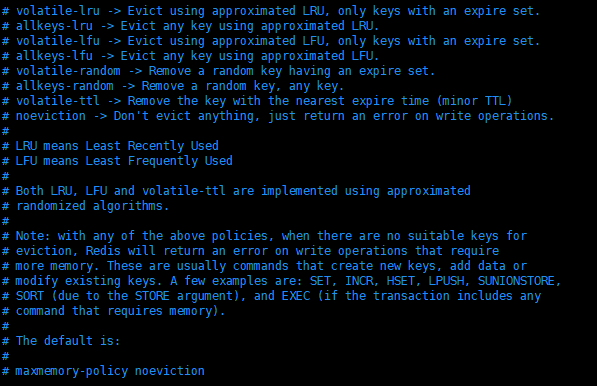
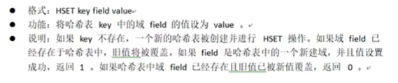
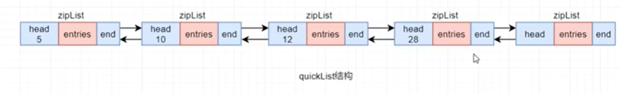

# 1、Redis概述

## 1.1 Redis简介


### NoSQL


## 1.2 Redis特性

- 性能极高：读速度可达到11w次/s，写的速度可达到8w次/s

  性能高的原因：①Redis的操作在内存中进行，所有数据都在内存②Redis用C语言开发③Redis源码非常精细

- 简单稳定：Redis源码很少，早期版本只有2w行左右，从3.0开始，增加了集群功能，代码变为了5w行左右

- 持久化：RDB与AOF两种方式

- 高可用集群

- 丰富的数据类型

- 强大的功能：数据过期功能、发布/订阅功能、简单事务功能，还支持Lua脚本扩展功能

- 客户端语言广泛：Redis提供了简单的TCP通信，编程语言很方便接入Redis

- 支持ACL权限控制：Redis6引入，可以为不同用户定制不同的权限。之前的权限控制非常笨重。

  ACL：Access Control List，访问控制列表，是细粒度的权限管理策略，可以针对任意用户与组进行权限控制。大多数Unix系统与Linux 2.6版本已经支持ACL。

- 支持多线程IO模型：Redis之前采用单线程模型，从6.0开始支持了多线程模型


## 1.3 Redis的IO模型

### 单线程模型

3.0之前，Redis的IO模型采用**纯粹的单线程模型**，即所有客户端（这里客户端指的是服务器应用向Redis发送的请求）的请求全部由一个线程进行处理。


Redis的单线程模型采用了 **多路复用技术**

多路复用技术包括三种：select、poll、epoll。（详细讲解在Netty的文档中有）

每个客户端若要向 Redis 提交请求，都需要与Redis建立一个socket连接，并向事件分发器注册一个事件，一旦该事件发生就表明该连接已经就绪，当连接就绪后，事件分发器就会感知到，然后获取客户端通过连接发送的请求，交给该事件分发器所绑定的唯一的线程来处理。  

事件分发器会根据不同的就绪时间，将任务交由不同的事件处理器去进行处理。


### 混合线程模型

请求只有连接请求以及读写请求，因此使用子线程来单独的处理连接请求。


### 多线程模型

内存响应时间为100ns，那么理论上Redis一秒能处理的请求数量为：1s/100ns=10^7=1000万，但是实际上每秒处理读11w次，处理写8w次，这是由于单线程模型的限制。

多线程模型指的是接收Socket连接的线程有多个，即IO线程有多个，用于解析客户端的请求，读写还是由单个线程进行处理

**多线程模型结合了多线程和单线程的优点：**

- 多线程可以更快的去接收客户端连接的请求，解析客户端的请求，然后将解析出的请求写入到任务队列，而且可以更好的去利用处理器的多核。（单线程只能使用一个核）
- 对于具体任务的处理仍然用单个主线程进行解决，这样无需考虑线程安全、事务控制。


## 1.4 Redis的IO模型优缺点总结

- 单线程模型
  - 优点：可维护性高，不存在并发读写情况，因此不存在执行顺序的不确定性，不存在线程切换的开销，不存在加锁、解锁、死锁问题
  - 缺点：性能受到影响，且单线程只能使用一个处理器，无法充分利用多核处理器
- 多线程模型
  - 优点：结合了多线程与单线程的优点，避开了他们的缺点
  - 缺点：没有明显不足


# 2、Redis安装与配置

## 2.1 Redis安装

### 2.1.1 安装gcc

GCC，GNU Complier Collection，GUN编译器集合，使用gcc来编译redis的安装包

```java
yum -y install gcc gcc-c++
```


### 2.1.2 下载redis


下载之后，上传到服务器中。


### 2.1.3 安装Redis

```bash
tar -zxvf redis-7.0.5.tar.gz -C /opt/apps  # 解压到 opt/apps目录
cd /opt/apps
mv redis-7.0.5/ redis # 把redis文件进行重命名
cd redis # 进入redis目录
make # 编译
make install # 安装
```


可以查看`/usr/local/bin`目录，已经有了redis的使用命令


path环境变量也有`usr/local/bin`目录，说明是全局命令。


### 2.1.4 启动


#### 前台启动

这样启动会占用命令行

```bash
redis-server # 启动
```


#### 命令式后台启动

后台启动方式，这样启动也有一个缺点，会生成一个nohup的日志文件

```bash
nohup redis-server & # 后台启动
ps aux | grep redis # 查看是否启动成功 ef和aux功能差不多，展示格式不同
```


#### 配置式后台启动（后续使用）


修改配置文件

```bash
cd /opt/apps/redis # 进入redis目录
vim redis.conf # 修改配置文件
redis-cli shutdown # 停止之前启动的redis
redis-server /opt/apps/redis/redis.conf # 指定配置文件进行启动
```

找到daemonize配置项

如何查找：按Esc，输入 `/daemonize` 回车进行搜索


## 2.2、Redis连接前的配置

### 2.2.1 绑定客户端IP

把87行给注释掉，不注释的话，表明只能自己当前主机访问redis

```bash
# 相关命令
vim /opt/apps/redis/redis.conf
:set nu # 显示行号
noh # 取消高亮
```


### 2.2.2 关闭保护模式

将111行改为no，关闭保护模式，否则只能自己访问自己


### 2.2.3 设置访问密码

取消1036行注释，设置自己的密码


需要输入密码，才可以有使用权限，有两种方式进行密码认证：

- 先连接客户端，再认证

  ```bash
  [root@iZbp18v0qr5lwwe90x94pyZ redis]# redis-server redis.conf
  [root@iZbp18v0qr5lwwe90x94pyZ redis]# redis-cli
  127.0.0.1:6379> set name hello
  (error) NOAUTH Authentication required.
  127.0.0.1:6379> auth 111
  OK
  127.0.0.1:6379> set name hello
  OK
  127.0.0.1:6379> get name
  "hello"
  127.0.0.1:6379> 
  [root@iZbp18v0qr5lwwe90x94pyZ redis]# redis-cli shutdown
  (error) NOAUTH Authentication required.
  [root@iZbp18v0qr5lwwe90x94pyZ redis]# redis-cli -a 111 shutdown
  Warning: Using a password with '-a' or '-u' option on the command line interface may not be safe.
  [root@iZbp18v0qr5lwwe90x94pyZ redis]# 
  ```

  通过`auth 111`进行认证


- 连接的同时认证

  ```bash
  redis-server redis.conf # 启动redis
  redis-cli -a 111 # 连接客户端
  redis-cli -a 111 shutdown # -a [密码] 关闭客户端
  ```

  ​

  ​

### 2.2.4 禁止/重命名命令

如果某些命令，我们不希望使用，比如flushall，这个命令会清空redis数据，后果很严重，那么就可以如1077行这样写，双引号表示禁用这个命令


### 2.2.5 启动Redis

```bash
redis-server redis.conf # 启动redis服务 
redis-cli -a 111 # 连接
redis-cli -a 111 shutdown # 关闭连接
```


## 2.3 Redis客户端分类


### 2.3.1 命令行客户端


```bash
redis-cli -h 8.136.80.172 -p 6379 -a 111 # 指定主机、端口、密码
```


### 2.3.2 图形界面客户端

（1）Redis Desktop Manager

这里使用本工具

官网：resp.app

下载地址：https://github.com/RedisInsight/RedisDesktopManager/tree/2022.5


（2）RedisPlus


### 2.3.3 Java代码客户端

Java代码客户端提供了一套操作redis的api


## 2.4 Redis配置文件详解

### tcp-backlog


#### 查看Linux内核版本

```bash
uname -a
```


TCP中的 backlog 队列的长度在 Linux 中由内核参数 somaxconn 来决定。所以，在 Redis 中该队列的长度由 Redis 配置文件设置与 somaxconn 来共同决定：取它们中的最小值。

> backlog是redis中设置backlog队列长度的参数

```bash
cat /proc/sys/net/core/somaxconn # 查看Linux的somaxconn
```

生产环境下（特别是高并发场景下），backlog的值最好要变大一些。


#### 修改somaxconn值

```bash
vim /etc/sysctl.conf # 修改配置文件
net.cor.somaxconn=2048 # 添加下边这一行
sysctl -p # 重新加载sysctl.conf配置文件
```


### pidfile


该配置用于指定Redis运行时 pid 写入的文件，无论 Redis 是否采用守护进程方式启动， pid 都会写入到该配置的文件。


参数说明：当启动redis后，redis的pid会被写入到`/var/run/redis_6379.pid`


### loglevel


### logfile


这里的 standard ouput 即标准输出指的就是将日志输出到显示器，但是有一个前提，就是通过使用前台启动才可以


### databases


### maxclients


maxclients用于设置redis可并发处理的客户端连接数量，如果达到最大值，会拒绝新的连接

上边的注释说，maxclients不可以超过linux最大可操作的文件描述符的数量，linux最大可操作的文件描述符的数量可以通过以下命令查看


### maxmemory


指定内存使用限制，当达到上限，Redis将根据选择的逐出策略 maxmemory-policy 尝试删除符合条件的key

如果不能按照逐出策略删除key，则会给写操作命令返回error（来自注释）


### maxmemory-policy



### maxmemory-samples


从5个样本中选择一个最近最久未使用的key进行删除


### maxmemory-eviction-tenacity 

eviction：移除

tenacity：容忍度


数值越小，容忍度越低，需要移除的数据移除延迟越小


### Threaded I/O


该模块用于配置Redis多线程模型


### io-threads


指定要启用多线程IO模型时，要使用的线程数量

上边注释的core指的是cpu的核数


# 3、Redis命令

## 3.1 基础命令


- 切换数据库

```bash
127.0.0.1:6379> select 5 # 切换5号数据库，redis默认16个数据库
```


- 查看key数量

```bash
127.0.0.1:6379> dbsize
(integer) 5
```


- 退出客户端

```bash
127.0.0.1:6379> quit
[root@iZbp18v0qr5lwwe90x94pyZ redis]# 
```


## 3.2 Key操作命令

Redis中存储的数据整体是一个Map，key为string类型，value为string、hash、list、set等类型


### 3.2.1 keys

说明：在一个大的数据库中使用可能会阻塞当前服务器的服务，因此在生产环境中一般不使用该命令，而是用scan命令代替

```bash
127.0.0.1:6379> set heart v1 # 设置数据
OK
127.0.0.1:6379> set hill v2
OK
127.0.0.1:6379> set hello v3
OK
127.0.0.1:6379> set zhaiqianyi v4
OK
127.0.0.1:6379> keys * # 查询所有key
 1) "heart"
 2) "depart"
 3) "hill"
 4) "name"
 5) "hello"
 6) "age"
 7) "head"
 8) "zhaiqianyi"
 9) "company"
10) "num"
127.0.0.1:6379> keys h* # 查询h开头
1) "heart"
2) "hill"
3) "hello"
4) "head"
127.0.0.1:6379> keys hil?
1) "hill"
127.0.0.1:6379> keys *e*
1) "heart"
2) "depart"
3) "name"
4) "hello"
5) "age"
6) "head"
127.0.0.1:6379> 
```


### 3.2.2 exists

```bash
exists hello # 查询hello这个key是否存在，存在返回1，否则返回0
```

### 3.2.3 del

```bash
del hello hill # 删除制定法key 可以指定多个key
```

### 3.2.4 rename

```bash
rename head name # 重命名
```

### 3.2.5 move

```bash
move hill 5 # 移动key到其他数据库
```

### 3.2.6 type

```bash
type hill # 返回key的类型
```

### 3.2.7 expire、pexpire

```bash
expire hill 5 # 为key指定生存时间
```

### 3.2.8 ttl

```bash
ttl hill # 返回指定key的剩余生存时间
```

### 3.2.9 persist

```bash
persist key # 去除给定key的生存时间
```

### 3.2.10 randomkey

常用来判断数据库是否是空的

```bash
randomkey # 从数据库随机返回一个key
```

### 3.2.11 scan

即使scan指定要查询的数据的数量非常大，redis会自己返回少量的数据，因此scan可以

```bash
用法：scan cursor [MATCH pattern] [COUNT count] [TYPE type]
127.0.0.1:6379> scan 0 count 5 # scan 0 表示从头开始 count 是查询的数量
1) "2"                         # 这是下次查询时开始的位置， cursor：游标 
2) 1) "ddd"                    # 这是查询出来的数据 
   2) "heart"
   3) "aaa"
   4) "bbb"
   5) "head"
127.0.0.1:6379> scan 2 count 5
1) "1"
2) 1) "depart"
   2) "hill"
   3) "ccc"
   4) "zhaiqianyi"
   5) "company"
127.0.0.1:6379> scan 1 count 10 
1) "0"							# 返回0表明接下来没有数据了
2) 1) "hello"
   2) "age"
   3) "name"
   4) "num"
127.0.0.1:6379> scan 0 count 5
1) "2"
2) 1) "ddd"
   2) "heart"
   3) "aaa"
   4) "bbb"
   5) "head"
127.0.0.1:6379> scan 0 match *eart* count 3 # 从前3条数据中查找出符合*eart*的数据
1) "4"
2) 1) "heart"
```


## 3.3 String型value操作命令

### 3.3.1 set

`set key value [ex seconds | px milliseconds] [nx | xx]`


### 3.3.2 setnx


### 3.3.3 getset


### 3.3.4 mset与msetnx


### 3.3.5 mget


### 3.3.6 append

```bash
默认追加的话，不会加空格，如果想有空格，使用双引号括起来value即可，可以如下添加：
append [key] " value"
```


### 3.3.7 incr与decr


### 3.3.8 incrby与decrby


### 3.3.9 incrbyfloat


### 3.3.10 strlen

显示字符长度


### 3.3.11 getrange


### 3.3.12 setrange


### 3.3.13 典型应用场景

#### 限速器

防止DoS攻击，对ip进行访问次数的限制

无法防止DDoS攻击

DDoS是分布式拒绝服务，使用了不同的ip不断访问服务器，没办法限制ip

```java
// 等价于 set 192.168.55.1 ex 60 nx
// 如果该ip不存在，指定key为ip，value为1，过期时间为60秒
Boolean exists = redis.set(ip, 1, "ex 60", "nx");
if(exists != null || redis.incr(ip) <= 5) {
  // 通过访问
} else {
  // 限流
}
```


## 3.4 Hash型value操作命令

存储的value是hash类型，存储格式为 ：key-{field-value}

### 3.4.1 hset



### 3.4.2 hget


### 3.4.3 hmset


### 3.4.4 hgetall

获取所有的field-value


其他命令还有 hmget、hdel、hexits、hlen（查看field-value个数）、`hstrlen key field`（查看value的长度）


### 3.4.5 应用场景


## 3.5 List型value操作命令

### 3.5.1 lpush/rpush


```bash
127.0.0.1:6379> lpush names zs ls www zl
(integer) 4
127.0.0.1:6379> lrange names 0 -1  # 注意看打印出来的顺序，lpush一直往表头添加数据，因此最后可以看到存储顺序与放入顺序是相反的
1) "zl"
2) "www"
3) "ls"
4) "zs"
127.0.0.1:6379> rpush cities bj sh gz sz
(integer) 4
127.0.0.1:6379> lrange cities 0 -1
1) "bj"
2) "sh"
3) "gz"
4) "sz"
```


### 3.5.2 llen


### 3.5.3 lindex


### 3.5.4 lset


### 3.5.5 lrange

按范围查看，-1代表结尾

```bash
127.0.0.1:6379> lrange cities 0 -1
1) "bj"
2) "sh"
3) "gz"
4) "sz"
```


### 3.5.6 lpushx/rpushx

如果存在该list，才可以往里边放入数据（用于追加）

```bash
127.0.0.1:6379> lpushx cars xp tsl # 之前不存在cars，因此放入失败
(integer) 0
127.0.0.1:6379> lrange cars 0 -1
(empty array)
```


### 3.5.7 linsert

插入值，需要指定在哪个值的前边或后边插入

```bash
127.0.0.1:6379> lrange cities 0 -1
1) "bj"
2) "sh"
3) "gz"
4) "sz"
127.0.0.1:6379> linsert cities before gz insertValue
(integer) 5
127.0.0.1:6379> lrange cities 0 -1
1) "bj"
2) "sh"
3) "insertValue"
4) "gz"
5) "sz"
```


### 3.5.8 lpop/rpop

弹出值，也可以指定弹出的值的数量

### 3.5.9 blpop/brpop

如果没有元素的话，会被阻塞等待，直到有元素弹出或timeout


### 3.5.10 rpoplpush

`rpoplpush [源key] [目的key]`

从源key弹出元素，rpop弹出，lpush放入目的key中

### 3.5.11 brpoplpush

同上，不过加入了阻塞等待

### 3.5.12 lrem

remove，移除元素

`lrem [key] [count] [要删除的元素值]`

count为正表示从左边开始，删除count个

count为负表示从右边开始，删除count个

### 3.5.13 ltrim

`ltrim [key] [start] [stop]`

截取子集合


### 3.5.14 应用场景

#### 栈

lpush+lpop实现

#### 队列

rpush+lpop/ lpush+rpop实现

#### 阻塞式消息队列

lpush+brpop实现

## 3.6 set型value操作命令（暂留）


## 3.7 benchmark性能测试

通过`redis-benchmark --help`可以查看其用法


## 3.8 简单动态字符串SDS

### 3.8.1 SDS简介

Redis没有直接使用C语言传统的字符串而是自己创建了一种名为简单动态字符串SDS（simple dynamic string）的抽象类型，并将SDS用作Redis的默认字符串表示。

在Redis里面，C字符串只会作为字符串字面量（string literal）用在一些无须对字符串值进行修改的地方，比如打印日志。

当Redis需要的不仅仅是一个字符串字面量，而是一个字符串值时，Redis就会使用SDS来表示字符串值，比如在Redis的数据库里面，包含字符串的键值对在底层都是由SDS实现的

### 3.8.2 SDS结构

SDS定义在  redis 安装目录下的 src/sds.h 中，简单表示如下：

```c++
struct sdshdr {
  // 字节数组，用于保存字符串
  char buf[];
  // buf[]中已使用字节数量，称为SDS的长度
  int len;
  //  buf[]中尚未使用的字节数量
  int free;
}
```


例如，执行`set country China`，那么key值country与value值China都是SDS类型，只不过一个是SDS的变量，一个是SDS的字面常量，China在内存中结构如下：


**可以通过`object encoding [key]`查看数据在内存中的存储形式，可以判断是否以SDS的结构存储，embstr表示的就是SDS**

```bash
127.0.0.1:6379> set country China
OK
127.0.0.1:6379> get country 
"China"
127.0.0.1:6379> type country
string
127.0.0.1:6379> object encoding country
"embstr"  
127.0.0.1:6379> set age 23
OK
127.0.0.1:6379> type age
string
127.0.0.1:6379> object encoding age
"int"

```


### 3.8.3 SDS的优势

C字符串以长度为len+1的字符数组表示实际长度为len的字符串，因为字符数组最后要以`'\0'`结尾。这种结构简单，但是不能满足Redis对字符串功能、安全、性能方面的要求。


#### （1）防止“字符串长度获取”性能瓶颈

- C字符串，需要遍历整个字符串，才可以获取其长度
- SDS结构体直接存放字符串的长度


#### （2）保障二进制安全

C字符串只能包含符合某种编码格式的字符，如ASCII、UTF-8，并且除了字符串末尾外，不能含有`'\0'`，否则会误以为字符串提前结束，而图片、视频、音频文件等二进制数据中以`'\0'`作为分隔符很常见，因此在C字符串无法保存这些文件的二进制数据。

SDS直接有字符串长度，不需要分隔符。


#### （3）减少内存再分配指数

空间预分配策略：每次SDS进行空间扩展时，程序会同时分配所需空间以及额外的未使用空间，以减少内存再分配次数。额外分配的未使用空间大小取决于空间扩展后SDS的len属性值。

- 如果len<1M，那么分配的未使用空间大小与len相同
- 如果len>=1M，那么分配的未使用空间大小为1M

SDS采用惰性空间释放策略，即如果SDS字符串长度变短，不会立即释放空间，而是将多出的未使用的空间添加到free中，以使后期扩展SDS减少内存再分配次数。


#### （4）兼容C函数

Redis提供很多SDS的API，并且为了兼容C函数，SDS的底层数组buf[]中的字符串以`'\0'`结尾


## 3.9 集合的底层实现


### 3.9.1 两种实现的选择

对于Hash与ZSet集合，底层有两种实现：压缩列表zipList、跳跃列表skipList。

只有同时满足以配置文件redis.conf中相关集合元素数量阈值与元素大小阈值两个条件，就会使用zipList，否则会使用skipList，例如对于ZSet集合，这两个条件如下：

- 集合元素个数小于redis.conf中zset-max-ziplist-entries属性值，默认128
- 每个集合元素大小都小于redis.conf中zset-max-ziplist-value属性值，默认64


### 3.9.2 zipList

zipList，压缩列表，是一个经过特殊编码的用于存储字符串或整数的双向链表。

底层数据结构组成：head、entries、end，这三部分在内存上连续存放


#### head

head由三部分组成

- `zlbytes`：占4B，表示zipList整体所占字节数，包括zlbytes本身长度
- `zltail`：占4B，用于存放zipList最后一个entry在整个数据结构中的偏移量，可用于定位链表末尾的entry
- `zllen`：占2B，存放列表包含的entry个数


#### entries

entries是真正的列表，由很多entry构成，由于元素类型、数值不同，每个entry的长度也不同

entry由三部分组成

- `prevlength`：记录上一个entry的长度，用于逆序遍历，默认长度为1字节，如果上一个entry的长度>=254B，prevlength就会扩展为3B
- `encoding`：标志后面的data的具体类型。如果data为整数，encoding固定长度为1B，如果data为字符串，encoding可能为1B、2B、5B，data字符串不同的长度，对应着不同的encoding长度
- `data`：真正存储的数据，数据类型只能是整数或字符串


#### end

end只包含一部分，称为zlend，占1B，值为255，也就是8个1，表示zipList列表的结束


### 3.9.3 listPack

zipList缺点：实现复杂，为了实现逆序遍历，每个entry都有前一个entry的长度，这样会导致在中间插入entry的时候需要进行级联更新，因此为了更好的性能，Redis7.0中，将zipList全部替换为了listPack，但为了兼容性，在配置中保留了zipList相关属性


可以看到zset和hash在内存中都是以listPack存储

```bash
127.0.0.1:6379[1]> zadd cities 10 bj 20 sh
(integer) 2
127.0.0.1:6379[1]> object encoding cities
"listpack"
127.0.0.1:6379[1]> hset emp name zs age 23
(integer) 2
127.0.0.1:6379[1]> object encoding emp
"listpack"
127.0.0.1:6379[1]> 
```


listPack也是经过特殊编码，用于存储字符串或整数的双向链表，数据结构由三部分组成：head、entries、end，这三部分在内存上连续

listPack与zipList的重大区别在head与每个entry的结构。


#### head

head包括两部分：

- `totalBytes`：占4B，存放listPack整体所占字节数，包含totalBytes本身
- `elemNum`：占2B，存放entry个数


#### entries

entries是真正的列表，由很多entry组成，每个entry长度不同

entry包括三部分`（删除了prevlength，增加了element-total-len）`：

- `encoding`：标志后面的data的具体类型。如果data为整数，encoding固定长度为1B，如果data为字符串，encoding可能为1B、2B或5B，data字符串不同的长度，对应着不同的encoding长度
- `data`：存储真正数据
- `element-total-len`：记录当前entry长度，用于实现逆序遍历，占1、2、3、4或5字节


### 3.9.4 skipList

skipList，跳跃列表，是一种`随机化`的数据结构，基于并联的链表，实现简单，查找效率较高，在链表的基础上增加了跳跃功能


下边的图虽然为单向直线，但是其实应该是表示双链表

如下图，skipList假如我们依次插入元素，我们可以增加二级节点，也就是每个二级节点相隔两个节点之间进行连接，也可以增加三级节点，每隔三个节点之间进行连接，但是这样做有一个问题，如果从列表中间删除一个entry的话，后边的元素需要全部向前移动一个位置，需要更新其他的节点的层级。


由于上边的缺点，使用了随机化层级，每个节点的层级都是随机化的，这样删除元素就不会影响了


### 3.9.5 quickList

quickList，快速列表，双向无循环链表，每隔节点都是zipList，从Redis3.2开始，使用了quickList替代了zipList和linkedList

quickList实现：将linkedList按段切分，每一段使用zipList来紧凑存储若干真正的元素，多个zipList之间使用双向指针连接。




### 3.9.6 key与value中元素的数量

上边讲述的Redis的特殊数据结构的设计，不仅提升了Redis性能，而且可以让Redis支持key和集合中value的数量更加庞大

- Redis最多可以处理2^32个key（约42亿），每隔Redis实例至少可以处理2.5亿个key
- 每个Hash、List、Set、ZSet集合都可以包含2^32个元素


### 3.10 BitMap、HyperLogLog、Geospatial、发布订阅、事务暂时空起来


# 4、Redis持久化

持久化分两种：RDB和AOF


## 4.1 RDB持久化

RDB，Redis DataBase，是将内存某一时刻的数据快照`全量`写入指定的rdb文件。

默认开启。

当Redis启动时，会自动读取RDB快照文件，将数据从硬盘读入内存。


### 4.1.1 持久化的执行

RDB持久化的执行有三种方式：手动save、手动bgsave、自动条件触发

#### （1）手动save

```bash
127.0.0.1:6379> save
OK
```


rdb文件保存在`/opt/apps/redis/dump.rdb`


save命令在执行期间会阻塞 `redis-server` 进程，直到持久化完成，阻塞期间，redis不能处理任何读写请求。


#### （2）手动bgsave命令

```bash
127.0.0.1:6379> bgsave
Background saving started
```


后台运行save，通过子进程完成，不会阻塞redis-server进程。


#### （3）自动条件触发

自动条件触发本质仍然是bgsave。

具体配置后边有讲解。


#### （4）查看持久化时间

```bash
127.0.0.1:6379> lastsave
(integer) 1669607310
```

显示最近一次持久化事件，返回的是Unix时间戳


### 4.1.2 RDB优化配置

RDB相关配置在redis.conf中的`###SNAPSHOTTING###`部分


#### （1）save

这里配置save其实是通过后台进行持久化的

`save 3600 1 300 100 60 10000`

这句命令的意思：从右向左条件主键变弱，如果60s发生了10000次写操作，就进行持久化，如果没有达到，在300s时，如果有100次写操作就会持久化，如果没有达到在3600s，如果有一次写操作就会持久化

stop-writes-on-bgsave-error

当持久化失败，redis进行的处理，可以看注释，很清晰


还有其他的设置参数，可以查看注释。

### 4.1.3 RDB文件结构

RDB文件由五部分构成

#### （1）SOF

SOF是一个常量，一个字符串REDIS，表示RDB文件的开始。


#### （2）rdb_version

4B，表示RDB文件的版本号

#### （3）EOF

1B，表示RDB数据的结束

#### （4）check_sum

校验和，判断RDB文件内容是否出现异常，采用CRC校验

#### （5）databases

数据部分，其可以包含任意多个非空数据库，每隔database又由三部分构成：

- SODB：1B，表示一个database的开始
- db_number：数据库编号
- key_value_pairs：当前数据库中的键值对数据

每隔key_value_pairs又由很多个描述键值对的数据构成：

- value_type：1B，表示value的类型
- expiretime_unit：1B，表示时间单位
- time：当前key-value的过期时间


#### 持久化流程

bgsave子进程工作原理：

由子进程继承父进程所有资源，且父进程不能拒绝子进程继承，bgsave子进程先将内存中的全量数据copy到磁盘的一个`RDB临时文件`，持久化完成后将该临时文件替换原来的`dump.rdb`文件。

如果持久化过程中出现了新的写请求，则系统会将内存中发生数据修改的物理块copy出一个副本，等持久化完成后，再将副本中的数据写到RDB临时文件，这个过程使用了 `写时复制技术（Copy-On-Write）`。


##### 写时复制

> **写时复制：**
>
> 原本在Unix中，当一个主进程通过fork()系统调用创建子进程后，内核进程会复制主进程的整个内存空间中的数据，然后分配给子进程，这种方式存在下边几种问题：
>
> - 耗时
> - 降低系统性能
> - 如果主进程修改了内存数据，子进程副本中的数据没有修改，导致数据不一致
>
> 现代的Linux采用了更有效的方式：写时复制。子进程会继承父进程的所有资源，包括主进程的内存空间，即子进程与主进程共享内存空间。只要内存是共享的，那么该内存就是只读的，写时复制指任何一方需要写入数据到共享内存时都会出现异常，此时内核进程会将需要写入的数据copy出一个副本写入到另外一块非共享内存区域。
>
> 
>
> **写时复制补充：**
>
> 目的是避免不必要的内存拷贝。
>
> 在Linux系统中，调用 `fork` 系统调用创建子进程时，并不会把父进程所有占用的内存页复制一份，而是与父进程共用相同的**内存页**，而当子进程或者父进程对**内存页**进行修改时才会进行复制 —— 这就是著名的 `写时复制` 机制。
>
> 那么bgsave中的写时复制技术即如果在持久化过程中，写入了新的数据，此时再去将元数据重新拷贝一份进行修改。


##### 持久化流程图


## 4.2 AOF持久化

AOF，Append Only File，将Redis的每次写操作都已日志的形式记录到一个AOF文件中。

使用RDB方式，如果Redis服务器断电，可能会导致丢失几分钟的数据，那么就可以选择AOP方式，仅仅会丢失一秒的写数据（来自redis.conf的AOF注释）

如果RDB和AOF都开启，会启用AOF，因为AOF有更好的持久化保证。

### 4.2.1 AOF基础配置

#### （1）AOF开启


默认AOF没有开启，可在redis.conf中开启

通过配置文件修改，还需要重启redis服务，可以通过命令行进行修改：

```bash
[root@iZbp18v0qr5lwwe90x94pyZ redis]# redis-cli
127.0.0.1:6379> config get appendonly
1) "appendonly"
2) "no"
127.0.0.1:6379> config set appendonly yes # 这里的改动仅仅在缓存中进行更改
OK
127.0.0.1:6379> config get appendonly 
1) "appendonly"
2) "yes"
127.0.0.1:6379> config rewrite # 还需要通过rewrite将修改写到配置文件
OK
127.0.0.1:6379> 
```

#### （2）文件名配置


Redis7发生了重大变化，原来只有一个appendonly.aof文件，现在具有了三类多个文件：

- 基本文件：RDB格式或AOF格式。存放RDB转为AOF当时内存的快照数据。该文件可以有多个。
- 增量文件：以操作日志形式记录转为AOF后的写入操作。该文件可以有多个。
- 清单文件：维护AOF文件的创建顺序，保证激活时的应用顺序。该文件只可以有1个。


#### （3）混合式持久化开启


默认开启，即AOF持久化的基本文件时的基本文件是RDB格式的。


### 4.2.2 AOF文件格式

AOF包含三类文件：基本文件、增量文件、清单文件。基本文件与RDB方式的文件一样。

#### （1）Redis协议


增量文件扩展名为.aof，采用AOF格式。AOF格式其实就是Redis通讯协议格式，AOF持久化文件的本质就是`基于Redis通讯协议的文本`，将命令以纯文本的方式写入到文件中。

Redis 协议规定，Redis文本是以行来划分，每行以`\r\n`行结束。每一行都有一个消息头，以表示消息类型。消息头由六种不同的符号表示，其意义如下: 。

- (+)表示一个正确的状态信息
- (-)表示一个错误信息
- (*)表示消息体总共有多少行，不包括当前行。
- ($)表示下一行消息数据的长度，不包括换行符长度\r\n
- (空)表示一个消息数据
- (:）表示返回一个数值


##### 查看AOF增量文件

```bash
[root@iZbp18v0qr5lwwe90x94pyZ appendonlydir]# vim appendonly.aof.1.incr.aof 
# aof增量文件
*2
$6
SELECT
$1
0
*3
$3
set
$1
a
$7
aaaaaaa
*3
$3
set
$1
b
$9
bbbbbbbbb
*3
$3
set
$1
c
$8
cccccccc
*3
$3
set
$1
d
$9
ddddddddd

```


##### 查看AOF清单文件

```bash
[root@iZbp18v0qr5lwwe90x94pyZ appendonlydir]# vim appendonly.aof.manifest 
file appendonly.aof.1.base.rdb seq 1 type b  # b 基础文件  seq序列：1
file appendonly.aof.1.incr.aof seq 1 type i  # i 增量文件

```


### 4.2.3 Rewrite机制

为了防止AOF文件太大占用大量磁盘空间，降低性能，Redis引入了Rewrite机制对AOF文件进行压缩


Rewrite就是对AOF文件进行重写整理。当开启Rewrite，主进程redis-server创建出一个子进程bgrewriteaof，由该子进程完成rewrite过程。

首先会对现有aof文件进行重写，将计算结果写到一个临时文件，写入完毕后，再重命名为原aof文件，进行覆盖。


#### Rewrite计算

Rewrite遵循以下策略：

- 读操作不写入文件

- 无效命令不写入文件

  ```bash
  set name zs # 无效命令，会被下一条命令覆盖
  set name ls
  ```


- 过期数据不写入文件
- 多条命令合并写入文件


### 4.2.4 AOF同步策略

每次写命令，其实是提交到了缓存中，还未写入磁盘，可以在redis.conf设置同步到磁盘的时机。


#### aof-rewrite-incremental-fsync

当bgrewriteaof在执行过程也是先将rewrite 计算的结果写入到了aof_rewrite_buf缓存中，然后当缓存中数据达到一定量后就会调用fsync()进行刷盘操作，即数据同步，将数据写入到临时文件。该属性用于控制fsync()每次刷盘的数据量最大不超过4MB。这样可以避免由于单次刷盘量过大而引发长时间阻塞。.


#### aof-timestamp-enabled

该属性设置为 yes 则会开启在 AOF 文件中增加时间戳的显示功能,可方便按照时间对数据进行恢复。但该方式可能会与 AOF 解析器不兼容，所以默认值为 no，不开启。


#### aof-load-truncated


当aof数据读入内存时，aof文件可能被破坏，会自动对aof文件进行截断。


### 4.2.5 AOF持久化流程


# 5、Redis主从集群


# 图灵Redis课程笔记


# Redis集群

`Redis的哨兵集群`，即通过搭建哨兵集群去监控Redis集群是否正常工作，如果某个Redis实例出故障，会进行通知，并且如果Redis主节点宕机，会选举新的从节点作为主节点。

`Redis集群`，即由多个小的master-slave集群组成一个大的集群，Redis集群的数据进行了分片，存放在不同的master中，各个master数据不重复，例如假如有10G数据，会在下边3个master中存放，可能mater1有3G，master2有3G，master3有4G。而且Redis集群里边的小集群可以进行`水平扩展`，官方说可以扩展上万个节点（官方推荐不超过1000个）。

在Redis集群中读写都在master中，slave只做master的数据备份。


## 集群搭建步骤

本次搭建Redis集群的结构为：总共6个Redis节点，每个master有一个slave，步骤如下：

```bash
# 第一步：在第一台机器的/usr/local下创建文件夹redis‐cluster，然后在其下面分别创建2个文件夾如下
mkdir ‐p /usr/local/redis‐cluster
mkdir 8001 8004

# 第二步：把之前的redis.conf配置文件copy到8001下，修改如下内容：
（1）daemonize yes
（2）port 8001（分别对每个机器的端口号进行设置）
（3）pidfile /var/run/redis_8001.pid # 把pid进程号写入pidfile配置的文件
（4）dir /usr/local/redis‐cluster/8001/ #（指定数据文件存放位置，必须要指定不同的目录位置，不然会丢失数据）
（5）cluster‐enabled yes #（启动集群模式）
（6）cluster‐config‐file nodes‐8001.conf #（集群节点信息文件，这里800x最好和port对应上，redis在这个文件中保存集群信息，再次重启redis集群只需要启动各个节点，redis就能在这里读取集群信息，连接上集群）
（7）cluster‐node‐timeout 10000
(8)# bind 127.0.0.1（bind绑定的是自己机器网卡的ip，如果有多块网卡可以配多个ip，代表允许客户端通过机器的哪些网卡ip去访问，内网一般可以不配置bind，注释掉即可）
(9)protected‐mode no #（关闭保护模式）
(10)appendonly yes
如果要设置密码需要增加如下配置：
(11)requirepass zhuge #(设置redis访问密码)
(12)masterauth zhuge #(设置集群节点间访问密码，跟上面一致)

第三步：把修改后的配置文件，copy到8004，修改第2、3、4、6项里的端口号，可以用批量替换：
:%s/源字符串/目的字符串/g

第四步：另外两台机器也需要做上面几步操作，第二台机器用8002和8005，第三台机器用8003和8006

第五步：分别启动6个redis实例，然后检查是否启动成功
（1）/usr/local/redis‐5.0.3/src/redis‐server /usr/local/redis‐cluster/800*/redis.conf # 此时仅仅是启动了6个redis节点，这几个节点之间是独立的
（2）ps ‐ef | grep redis 查看是否启动成功
第六步：用redis‐cli创建整个redis集群(redis5以前的版本集群是依靠ruby脚本redis‐trib.rb实现)
# 下面命令里的1代表为每个创建的主服务器节点创建一个从服务器节点
# 执行这条命令需要确认三台机器之间的redis实例要能相互访问，可以先简单把所有机器防火墙关掉，如果不关闭防火墙则需要打开redis服务端口和集群节点gossip通信端口16379(默认是在redis端口号上加1W)

# 关闭防火墙：为什么呢？因为Redis集群之间通讯使用gossip，gossip之间通信的端口号是在redis端口号上加了10000，如果不关闭防火墙的话，还需要我们去打开gossip通信的端口，如果不了解gossip而且不关闭防火墙，那么redis之间通信就会失败！


# systemctl stop firewalld # 临时关闭防火墙
# systemctl disable firewalld # 禁止开机启动

# 创建集群，-a指定密码
# 通过--cluster命令创建集群，可以查看帮助文档--cluster -h
# 下面命令中 ip1:8001 ip2:8002 ip3:8003 ip1:8004 ip2:8005 ip3:8006
# redis会默认将前三个节点设置为master节点
（1）/usr/local/redis‐5.0.3/src/redis‐cli ‐a zhuge ‐‐cluster create ‐‐cluster‐replicas 1 1
92.168.0.61:8001 192.168.0.62:8002 192.168.0.63:8003 192.168.0.61:8004 192.168.0.62:8005 192.
168.0.63:8006

第七步：验证集群：
（1）连接任意一个客户端即可：./redis‐cli ‐c ‐h ‐p #(‐a访问服务端密码，‐c表示集群模式，指定ip地址和端口号）
如：/usr/local/redis‐5.0.3/src/redis‐cli ‐a zhuge ‐c ‐h 192.168.0.61 ‐p 800*
（2）进行验证： cluster info（查看集群信息）、cluster nodes（查看节点列表）
（3）进行数据操作验证
（4）关闭集群则需要逐个进行关闭，使用命令：
/usr/local/redis‐5.0.3/src/redis‐cli ‐a zhuge ‐c ‐h 192.168.0.60 ‐p 800* shutdown
```


## Redis分布式锁


配置一台nginx，将访问`http://redislock`的请求负载均衡到两台web服务器上`8080/8090`


两台web服务，端口为`8080/8090`


请求下边接口：`nginx服务器ip/deduct_stock`，可以看到执行了


使用JMeter测试


### 方式一：使用setnx作为锁（入门级别）


最好将释放锁的操作，也就是删除lockKey放到finally中去，保证执行

目前的缺陷：如果机器执行到一半的话，机器宕机了，没办法删除key

可以通过对key设置过期时间，来释放锁。


这样写仍然存在问题：当第一个线程执行业务操作时，如果执行的时间超过了设置的锁的过期时间，那么第二个线程就会进来，这时如果第一个线程还没有去扣库存，第二个线程就会和第一个线程读取到同样的数据，于是产生问题，之后线程1完成了之后，把线程2加的锁释放掉，线程3又进来....

这个问题的根本原因就是自己的锁呗其他人给释放掉了，那么我们可以设置一个唯一ID，通过判断，来让线程释放自己的锁。


但是这样还会存在问题，如果线程1在执行47行if判断的时候，还没有超过key的过期时间，此时假设准备执行`delete(lockKey)`的时候已经过了超时时间，线程2就会进来加锁，这时候线程1执行delete会把线程2加的锁给释放掉

出现这个问题的就是：if判断和delete删除两个操作没有原子性

这个问题的本质：过期时间太短！

这种情况需要使用`锁续命`来解决：

> 大概思路：主线程执行业务逻辑，创建一个子线程，子线程执行定时任务，这个定时任务的间隔时间需要小于key的过期时间，子线程隔一段时间判断主线程是否在执行，如果主线程在执行的话，子线程就将锁的过期时间重新设置一下，以保证主线程在执行的时候，锁不会过期

Redis的客户端工具`Redisson`实现了锁续命。


#### Redisson分布式锁


编写客户端配置


使用时，注入客户端


使用

```java
public String deductStock() {
  String lockKey = "...";
  RLock redissonLock = redisson.getLock(lockKey);
  redissonLock.lock();
  
  // ...业务
  
  redissonLock.unlock();
}
```


#### Redisson分布式锁原理


**Redisson核心加锁逻辑**

`lock加锁流程：`


> 最后调用了tryLockInnerAsync方法，这个方法是核心，如下

```java
<T> RFuture<T> tryLockInnerAsync(long waitTime, long leaseTime, TimeUnit unit, long threadId, RedisStrictCommand<T> command) {
        return this.evalWriteAsync(this.getRawName(), LongCodec.INSTANCE, command, 
                                   "if (redis.call('exists', KEYS[1]) == 0) then redis.call('hincrby', KEYS[1], ARGV[2], 1); redis.call('pexpire', KEYS[1], ARGV[1]); return nil; end; if (redis.call('hexists', KEYS[1], ARGV[2]) == 1) then redis.call('hincrby', KEYS[1], ARGV[2], 1); redis.call('pexpire', KEYS[1], ARGV[1]); return nil; end; return redis.call('pttl', KEYS[1]);", Collections.singletonList(this.getRawName()), new Object[]{unit.toMillis(leaseTime), this.getLockName(threadId)});
    }
```


上边的代码块与下图是一个方法，版本不同，所以会有些不太一样的地方。


上边是加锁的流程，之前我们说过Redisson使用了`锁续命`来防止出现并发下的一些错误，锁续命操作就在下图的`scheduleExpirationRenewal(threadId)`


`该方法里边每隔1/3的锁持有时间去判断一下主线程加的锁是否还存在，如果存在，回去刷新一下锁过期时间，进行锁续命操作`

```java
private void scheduleExpirationRenewal(final long threadId) {
    if (!expirationRenewalMap.containsKey(this.getEntryName())) {
        Timeout task = this.commandExecutor.getConnectionManager().newTimeout(new TimerTask() {
            public void run(Timeout timeout) throws Exception {
                // 续命逻辑
                RFuture<Boolean> future = RedissonLock.this.commandExecutor.evalWriteAsync(RedissonLock.this.getName(), LongCodec.INSTANCE, RedisCommands.EVAL_BOOLEAN, 
                "if (redis.call('hexists', KEYS[1], ARGV[2]) == 1) then redis.call('pexpire', KEYS[1], ARGV[1]); return 1; end; return 0;", // hexists判断主线程加的锁是否存在 如果存在 重新设置过期时间 设置成功返回1 放入future中
                Collections.singletonList(RedissonLock.this.getName()), new Object[]{RedissonLock.this.internalLockLeaseTime, RedissonLock.this.getLockName(threadId)});
              
              
                future.addListener(new FutureListener<Boolean>() {
                    // 续命成功后逻辑
                    public void operationComplete(Future<Boolean> future) throws Exception {
                        RedissonLock.expirationRenewalMap.remove(RedissonLock.this.getEntryName());
                        if (!future.isSuccess()) {
                            RedissonLock.log.error("Can't update lock " + RedissonLock.this.getName() + " expiration", future.cause());
                        } else {
                            // 上边的lua脚本进行锁续命成功会返回1，也就是future.getNow()==1为true，会走下边的锁续命逻辑  
                            if ((Boolean)future.getNow()) {
                                // 锁续命成功后，会再次调用自己这个方法，再延迟1/3的锁持有时间进行执行锁续命
                                RedissonLock.this.scheduleExpirationRenewal(threadId);
                            }

                        }
                    }
                });
            }
        // this.internalLockLeaseTime / 3L 延迟时间，即主线程持有锁时间的1/3
        }, this.internalLockLeaseTime / 3L, TimeUnit.MILLISECONDS);
        if (expirationRenewalMap.putIfAbsent(this.getEntryName(), task) != null) {
            task.cancel();
        }

    }
}
```


#### 中间件如何实现定时任务？

中间件一般都使用方法嵌套调用的方式来实现定时任务


如果线程去获取锁失败的话，tryAcquire会返回持有锁的线程的剩余持锁时间`ttl`，通过while循环不断去获取锁，这里while循环是有间断的，在134行控制，即阻塞在这里。

如果持有锁线程执行完任务，这时去获取锁的线程不会一直阻塞在134行（如果一直阻塞在这里，代码太烂了！），会在其他操作中被唤醒！


unlock操作


在lua脚本中，解锁之后，发布自己的解锁消息，这个消息在lock()中进行订阅，如下图


lua脚本：减少网络开销：将几次网络请求操作放在一起请求。

- 原子操作：Redis将整个脚本作为整体执行，中间不会被其他命令插入
- 替代redis的事务功能：redis的lua脚本几乎实现了常规的事务功能

```java
return commandExecutor.evalWriteAsync(getName()，LongCodec.INSTANCE，command,
        script: "if (redis.call( 'exists ',KEYS[1]) == 0) then " + // 先判断如果key不存在，则继续下边操作
        "redis.call(' hset ', KEYS[1],ARGV[2]，1); " +  // 设置(key, value)值
        "redis.call( ' pexpire ', KEYS[1]，ARGv[1]);" +"return nil; "+ // 设置key的超时时间
        "end; " +
        "if (redis.call( ' hexists '，KEYs[1]，ARGV[2]) ==1) then " +
        "redis.call( ' hincrby ' , KEYS[1]，ARGV[2],1); " +
        "redis.call( ' pexpire ' , KEYS[1]，ARGV[1]); " +"return nil; " +
        "end; " +
        "return redis.call( ' pttl ',KEYS[1]); ",
  		Collections.<Object>singletonList(getName())，internalLockLeaseTime，getLockName(threadId));
// 上边keys[1]取得就是Collections.<Object>singletonList(getName())的第一个值
// ARGV[1] 取得就是internalLockLeaseTime
// ARGV[2] 取得就是getLockName(threadId)
// lua脚本很好理解
```


## 如何提升分布式锁性能？

分布式锁本质上是将`并发`的操作给改为`串行`的操作。


> 分布式锁加锁执行过程

将数据库中的库存读入redis缓存中，例如某个物品有1000个库存，那么读入redis缓存中，设置 product_stock=1000，那么给这个key上一把锁，多个线程来竞争这一把锁。


> 提升分布式锁性能（使用分段锁）

将数据库中的库存读入redis缓存中，假如说有1000个库存的话，读入到缓存中将他分为十份进行存储，也就是 product_stock_1=100, product_stock_2=100, ..., product_stock_10=100 ，给这10个key都上锁，那么多个线程来竞争这10把锁，性能相比于原来可以提高十倍。


# 大厂Redis架构

## Redis常见问题

### 缓存穿透

访问数据库中不存在的数据，即数据库和缓存都不命中

缓存穿透就是访问大量数据库中不存在的设备，每次都需要去数据库中查询，失去了缓存保护后端存储的意义。

`造成原因：`

- 自身代码问题
- 恶意攻击

`解决：`

如果访问空数据，放入redis一个空缓存，格式为：`empty_cache_key: {}`

具体实现可看下边的架构实现


### 缓存击穿

同一时间批量添加数据，并且数据的过期时间相同，大量数据同一时间缓存失效可能导致大量请求直达数据库，如果请求过多，数据库会挂掉。

`解决：`

批量添加数据的话，在设置的过期时间上再加上一个随机时间即可。

```java
// 过期时间 = cache_timeout + new Random().nextInt(5) * 60 * 60;
```


### 缓存数据库双写不一致


线程3先去查询缓存为空，去查询数据库socket=10，如果在更新缓存之前线程2发生了写数据库和更新缓存，之后线程3更新了缓存，出现了数据库为10，缓存为6的情况。

**说白了，出现缓存数据库双写不一致的原因是查询数据库和更新缓存之间**

`解决：`

分布式锁解决：避免线程3的查数据库与更新缓存之间插入其他修改数据库的操作，在线程3查询数据库之前加一把分布式锁，在更新缓存之后解锁，在线程2写数据库时也加一把锁，更新缓存之后解锁，这样在线程3查询数据库之后，线程2是无法对数据库进行写操作的

`优化：`

对于读多写少的场景，可以使用读写锁来优化，读读是不互斥的，可以加大读的并发


### JVM缓存

当遇到访问量特别大的数据，即热点中的热点数据，达到每秒几十万次，会将这些数据放在JVM缓存中，JVM缓存抗并发量比Redis缓存高出一个级别

JVM缓存可以使用ehcache框架


### 大厂Redis查询架构图


> 核心代码

完整代码在当前目录下`redis-multi-cache`项目

```java
package com.duoduo.service;

import com.alibaba.fastjson.JSON;
import com.duoduo.common.RedisKeyPrefixConst;
import com.duoduo.common.RedisUtil;
import com.duoduo.dao.ProductDao;
import com.duoduo.model.Product;
import org.redisson.Redisson;
import org.redisson.api.RLock;
import org.redisson.api.RReadWriteLock;
import org.springframework.beans.factory.annotation.Autowired;
import org.springframework.stereotype.Service;
import org.springframework.transaction.annotation.Transactional;
import org.springframework.util.StringUtils;

import java.util.HashMap;
import java.util.Map;
import java.util.Random;
import java.util.concurrent.TimeUnit;

@Service
public class ProductService {

    @Autowired
    private ProductDao productDao;

    @Autowired
    private RedisUtil redisUtil;

    @Autowired
    private Redisson redisson;

    public static final Integer PRODUCT_CACHE_TIMEOUT = 60 * 60 * 24;
    // 空缓存，防止缓存穿透，当访问到了数据库中不存在的数据，就使用空缓存来表示
    // 防止黑客攻击，黑客可能会大量访问数据库不存在的数据来进行攻击
    public static final String EMPTY_CACHE = "{}";
    public static final String LOCK_PRODUCT_HOT_CACHE_CREATE_PREFIX = "lock:product:hot_cache_create:";
    public static final String LOCK_PRODUCT_UPDATE_PREFIX = "lock:product:update:";

    /**
     * 多级缓存：redis单机可以每秒接收10w次的请求，JVM缓存比redis缓存可以抗更高数量级的并发，JVM缓存可以每秒接收百万的请求，多加几台web应用也可以进一步提高并发，因此可以再加一级JVM缓存
     * 缺点：
     * （1）JVM缓存有容量限制，很容易达到内存上限，而且如果某些热点数据之后不怎么用了，但是一直在JVM缓存中存储，可能会导致内存泄漏
     * （2）如果web应用是集群的，如果一台服务器中的jvm缓存数据更新了，会造成集群web中数据不一致
     * 尝试解决：（1）使用ehcache、guava等jvm进程级别缓存框架，一般都会处理缓存的过期
     *      （2）使用rocketMQ将修改的数据发送到queue中，其他web进程订阅，有修改的话，进行修改，这样做太麻烦了，一般不使用，因为太麻烦了
     *
     * 大厂方案：一般会有一个专门的缓存系统，这个缓存系统与web集群相连接，计算哪些是热点数据，在缓存系统中处理这些数据的缓存
     * 注意，只有访问量非常大的数据（每秒几十万）才会放入jvm缓存中
     *
     */
    public static Map<String, Product> productMap = new HashMap<>();

    @Transactional
    public Product create(Product product) {
        Product productResult = productDao.create(product);
        redisUtil.set(RedisKeyPrefixConst.PRODUCT_CACHE + productResult.getId(), JSON.toJSONString(productResult));
        return productResult;
    }

    @Transactional
    public Product update(Product product) {
        Product productResult = null;
        //RLock productUpdateLock = redisson.getLock(LOCK_PRODUCT_UPDATE_PREFIX + product.getId());
        RReadWriteLock productUpdateLock = redisson.getReadWriteLock(LOCK_PRODUCT_UPDATE_PREFIX + product.getId());
        RLock writeLock = productUpdateLock.writeLock();
        //加分布式写锁解决缓存双写不一致问题
        writeLock.lock();
        try {
            productResult = productDao.update(product);
            redisUtil.set(RedisKeyPrefixConst.PRODUCT_CACHE + productResult.getId(), JSON.toJSONString(productResult),
                    genProductCacheTimeout(), TimeUnit.SECONDS);
        } finally {
            writeLock.unlock();
        }
        return productResult;
    }

    public Product get(Long productId) {
        Product product = null;
        String productCacheKey = RedisKeyPrefixConst.PRODUCT_CACHE + productId;

        //从缓存里查数据
        product = getProductFromCache(productCacheKey);
        if (product != null) {
            return product;
        }
        // RBloomFilter<Object> bloomFilter = redisson.getBloomFilter("");
        //初始化布隆过滤器：预计元素为100000000L,误差率为3%,根据这两个参数会计算出底层的bit数组大小
        // bloomFilter.tryInit(10000L,0.03);
        // bloomFilter.add("aaa");
        //加分布式锁解决热点缓存并发重建问题，只需要一个线程去重建缓存即可
        RLock hotCreateCacheLock = redisson.getLock(LOCK_PRODUCT_HOT_CACHE_CREATE_PREFIX + productId);
        hotCreateCacheLock.lock();

        // 这个优化谨慎使用，防止超时导致的大规模并发重建问题
        // hotCreateCacheLock.tryLock(1, TimeUnit.SECONDS);

        try {
            //双重检测
            /**
             * 这里进行双重检测的目的：在主播带货时，可能主播会介绍一些比较冷门但是好用的东西，如果此时有大量用户去访问这些数据的话，那么这些冷门数据就会变为热点数据
             * 出现的问题：大量请求访问冷门数据，而冷门数据没有进行缓存，大量请求访问数据库，数据库可能就崩了
             * 如何解决：双重检测，先去缓存中取，如果没有的话，加上分布式锁，再次尝试去缓存中取（因为可能其他线程在这个时候已经在数据库中查询数据放入缓存中去了），如果没有，去数据库中查询，查询之后将数据放到缓存中，分布式锁解锁
             */
            product = getProductFromCache(productCacheKey);


            if (product != null) {
                return product;
            }

            /**
             * 可以使用分布式锁来解决数据库缓存双写不一致问题
             * 但是如果对于读多写少的应用程序来说，可以采用读写锁来进一步优化：读写互斥、读读不互斥
             */
            //RLock productUpdateLock = redisson.getLock(LOCK_PRODUCT_UPDATE_PREFIX + productId);
            RReadWriteLock productUpdateLock = redisson.getReadWriteLock(LOCK_PRODUCT_UPDATE_PREFIX + productId);
            RLock rLock = productUpdateLock.readLock();
            //加分布式读锁解决数据库缓存双写不一致问题
            rLock.lock();
            try {
                product = productDao.get(productId);
                if (product != null) {
                    // 放入redis缓存
                    redisUtil.set(productCacheKey, JSON.toJSONString(product),
                            genProductCacheTimeout(), TimeUnit.SECONDS);
                } else {
                    //设置空缓存解决缓存穿透问题
                    redisUtil.set(productCacheKey, EMPTY_CACHE, genEmptyCacheTimeout(), TimeUnit.SECONDS);
                }
            } finally {
                rLock.unlock();
            }
        } finally {
            hotCreateCacheLock.unlock();
        }

        return product;
    }


    private Integer genProductCacheTimeout() {
        //加随机超时机制解决缓存批量失效(击穿)问题
        //缓存击穿：大量缓存同时失效，导致大量请求直达数据库
        //这里将超时时间设置为24h+随机时间就是为了防止批量添加商品时，过期时间相同，导致某个时间点大量缓存失效
        return PRODUCT_CACHE_TIMEOUT + new Random().nextInt(5) * 60 * 60;
    }

    // 空缓存时间设置短一点，防止大量空缓存占用redis空间
    private Integer genEmptyCacheTimeout() {
        return 60 + new Random().nextInt(30);
    }

    private Product getProductFromCache(String productCacheKey) {
        Product product = null;
        //多级缓存查询，jvm级别缓存可以交给单独的热点缓存系统统一维护，有变动推送到各个web应用系统自行更新
        product = productMap.get(productCacheKey);
        if (product != null) {
            return product;
        }
        String productStr = redisUtil.get(productCacheKey);
        if (!StringUtils.isEmpty(productStr)) {
            // 取到的是空缓存
            if (EMPTY_CACHE.equals(productStr)) {
                redisUtil.expire(productCacheKey, genEmptyCacheTimeout(), TimeUnit.SECONDS);
                // 如果是空缓存的话，返回一个空的Product
                return new Product();
            }
            product = JSON.parseObject(productStr, Product.class);
            // 缓存读延期，实现简单的冷热分离，对需要读的数据延长过期时间
            redisUtil.expire(productCacheKey, genProductCacheTimeout(), TimeUnit.SECONDS);
        }
        return product;
    }

}
```


# 电商网站微服务架构


# Redis使用

## 1、禁止使用keys *

`keys *`返回数据库中所有匹配的key，会意思扫描所有的记录，当数据量大的时候，会导致redis阻塞，cpu使用率飙升。

可以使用`scan`代理`keys *`