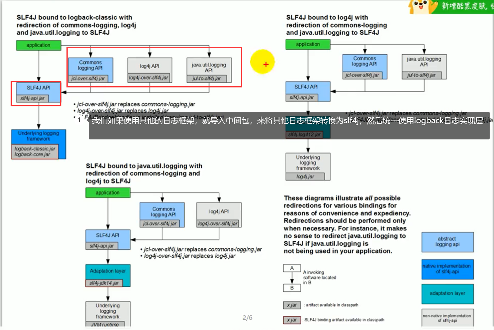

市面上的日志框架：

logback ，log4j log4j2 ， slf4j


### 1.日志是什么？

日志：说明系统实时运行状态的信息。

比如：System.out.println()语句就是一种最低级的日志。

### 2.什么是日志门面和日志实现？

日志门面：是日志实现的抽象层。

日志实现：具体的日志功能的实现。

为什么不直接使用日志实现，而是又弄了一个叫日志门面的东西？

因为日志实现，可能会有一些代码的优化和改动，避免影响用户在项目中的使用，使用日志门面这些统一的接口，假设在实现层代码做了更改，用户在项目中使用日志而调用的接口等等都是不会受影响的。

### 3.常见的日志框架有哪些？

| 日志门面（抽象层） | 日志实现                                     |
| --------- | ---------------------------------------- |
| JCL	SLF4j | JUL(java.util.logging)		log4    logback	log4j2			logback |

 

在实际使用中，是选择一个抽象层的日志门面搭配一个底层日志实现来使用的。

SpringBoot中默认选择的搭配是：slf4j+logback

日志门面：slf4j

日志实现：logback

springboot：底层是spring框架，spring框架默认是用到JCL

==SpringBoot选用 slf4j 和 logback==


### 4. slf4j使用

以后开发的时候，日志记录方法的调用，不应该来直接调用日志的实现类，而是调用日志抽象层里面的方法


每一个日志的实现框架都有自己的配置文件。使用slf4j以后，**配置文件还是做成日志实现框架的配置文件（也就是说用哪个实现框架，就写谁的配置文件）。** 


### 5.遗留问题

(slf4j + logback) ： Spring（commons-loggin）、Hibernate（jboss-loggin）、Mybatis

如果我们使用slf4j和logback，但是整合了别的项目之后，别的项目用到了各种各样的日志框架，那么我们就需要统一日志记录，所有的日志我们统一使用slf4j进行输出。




**如何让系统中所有的日志都统一到slf4j：**

1、将系统中其他日志框架先排除出去

2、用中间包来替换原有的日志框架

3、我们导入slf4j其他的实现

### 6.SpringBoot日志关系


pom依赖分析小技巧：


选择这个就会出现图形状的依赖分析。

（1）SpringBoot底层使用slf4j+logback的方式进行日志记录

（2）SpringBoot也把其他的日志都替换成了slf4j

（3）替换的时候使用了中间转换包

（4）如果我们要引入其他框架？一定要把这个框架的默认日志依赖移除掉。


比如说：我们引入了Spring框架，那么就要排除Spring框架的默认日志依赖commons-logging


SpringBoot能自动适配所有的日志，而且底层使用slf4j+logback的方式记录日志，引入其他框架的时候，排除该框架依赖的底层日志框架，那么SpringBoot就能和该框架适配起来。


### 7.SpringBoot中日志的使用


日志的使用：

```java
@SpringBootTest
class DemoApplicationTests {

    // 获取日志记录器
    Logger logger = LoggerFactory.getLogger(getClass());

    @Test
    void contextLoads() {
        // 日志级别 trace < debug < info < warn < error
        // 可以调整日志的输出级别，日志就只会在这个级别及以后的高级别生效
        logger.trace("这是trace日志...");
        logger.debug("这是debug日志...");
        // SpringBoot默认是 info 级别的
        logger.info("这是info日志...");
        logger.warn("这是warn日志...");
        logger.error("这是error日志...");
    }

}
```


日志级别 trace < debug < info < warn < error

在`application.yml`文件中可以指定日志输出级别，springboot默认的级别是`info级别`。

```yaml
logging:
  level:
    # 需要指定哪个包下的日志级别
    com.example: trace
  file:
    # 在当前磁盘的根目录下创建spring和log文件夹，里边创建springboot.log日志文件
    path: /spring/log
  # 可以使用绝对路径
  # path: E:\mylog
  # 指定日志文件名，若不指定日志路径，默认在根目录下
  # name: springboot.log
```


### 8.在SpringBoot指定日志输出格式

如果使用logback的话，直接将logback.xml 或者 logback-spring.xml 文件放在resources 目录下，就可以生效。


`logback.xml  和  logback-spring.xml  的区别：`

logback-spring.xml文件可以使用 `<springProfile name="">` 标签来指定在哪种开发环境使用哪种格式。

完整的logback-spring.xml文件，放在resources目录即可使用：

```xml
<?xml version="1.0" encoding="UTF-8"?>
<configuration>
    <!-- 尽量别用绝对路径，如果带参数不同容器路径解释可能不同,以下配置参数在pom.xml里 -->
    <property name="log.root.level" value="INFO"/> <!-- 日志级别 -->
    <property name="log.other.level" value="INFO"/> <!-- 其他日志级别 -->
    <property name="log.base"
              value="logs"/> <!-- 日志路径，这里是相对路径，web项目eclipse下会输出到eclipse的安装目录下，如果部署到linux上的tomcat下，会输出到tomcat/bin目录 下 -->
    <property name="log.moduleName" value="blog"/>  <!-- 模块名称， 影响日志配置名，日志文件名 -->
    <property name="log.max.size" value="20MB"/> <!-- 日志文件大小 -->

    <!--控制台输出 -->
    <appender name="stdout" class="ch.qos.logback.core.ConsoleAppender">
        <encoder class="ch.qos.logback.classic.encoder.PatternLayoutEncoder">
            <pattern>%red(%d{yyyy-MM-dd HH:mm:ss}) %green([%thread]) %highlight(%-5level) %boldMagenta(%logger.%method:%L) - %cyan(%msg%n)
            </pattern>
        </encoder>
        <filter class="ch.qos.logback.classic.filter.ThresholdFilter">
            <level>debug</level>
        </filter>
    </appender>

    <!-- info文件输出 -->
    <appender name="info" class="ch.qos.logback.core.rolling.RollingFileAppender">
        <File>${log.base}/${log.moduleName}-info.log
        </File><!-- 设置日志不超过${log.max.size}时的保存路径，注意如果 是web项目会保存到Tomcat的bin目录 下 -->
        <!-- 滚动记录文件，先将日志记录到指定文件，当符合某个条件时，将日志记录到其他文件。-->
        <rollingPolicy class="ch.qos.logback.core.rolling.TimeBasedRollingPolicy">
            <FileNamePattern>${log.base}/archive/${log.moduleName}-info-%d{yyyy-MM-dd}.%i.log
            </FileNamePattern>
            <!-- 当天的日志大小 超过${log.max.size}时,压缩日志并保存 -->
            <timeBasedFileNamingAndTriggeringPolicy class="ch.qos.logback.core.rolling.SizeAndTimeBasedFNATP">
                <maxFileSize>${log.max.size}</maxFileSize>
            </timeBasedFileNamingAndTriggeringPolicy>
        </rollingPolicy>
        <filter class="ch.qos.logback.classic.filter.LevelFilter">
            <level>INFO</level>
            <onMatch>ACCEPT</onMatch>
            <onMismatch>DENY</onMismatch>
        </filter>
        <!-- 日志输出的文件的格式  -->
        <layout class="ch.qos.logback.classic.PatternLayout">
            <pattern>%date{yyyy-MM-dd HH:mm:ss.SSS} %-5level [%thread]%logger{56}.%method:%L -%msg%n</pattern>
        </layout>
    </appender>

    <!-- debug文件输出 -->
    <appender name="debug" class="ch.qos.logback.core.rolling.RollingFileAppender">
        <File>${log.base}/${log.moduleName}-debug.log
        </File><!-- 设置日志不超过${log.max.size}时的保存路径，注意如果 是web项目会保存到Tomcat的bin目录 下 -->
        <!-- 滚动记录文件，先将日志记录到指定文件，当符合某个条件时，将日志记录到其他文件。-->
        <rollingPolicy class="ch.qos.logback.core.rolling.TimeBasedRollingPolicy">
            <FileNamePattern>${log.base}/archive/${log.moduleName}-debug-%d{yyyy-MM-dd}.%i.log
            </FileNamePattern>
            <!-- 当天的日志大小 超过${log.max.size}时,压缩日志并保存 -->
            <timeBasedFileNamingAndTriggeringPolicy class="ch.qos.logback.core.rolling.SizeAndTimeBasedFNATP">
                <maxFileSize>${log.max.size}</maxFileSize>
            </timeBasedFileNamingAndTriggeringPolicy>
        </rollingPolicy>
        <filter class="ch.qos.logback.classic.filter.LevelFilter">
            <level>DEBUG</level>
            <onMatch>ACCEPT</onMatch>
            <onMismatch>DENY</onMismatch>
        </filter>
        <!-- 日志输出的文件的格式  -->
        <layout class="ch.qos.logback.classic.PatternLayout">
            <pattern>%date{yyyy-MM-dd HH:mm:ss.SSS} %-5level [%thread]%logger{56}.%method:%L -%msg%n</pattern>
        </layout>
    </appender>

    <!-- warning文件输出 -->
    <appender name="warn" class="ch.qos.logback.core.rolling.RollingFileAppender">
        <File>${log.base}/${log.moduleName}-warn.log
        </File><!-- 设置日志不超过${log.max.size}时的保存路径，注意如果 是web项目会保存到Tomcat的bin目录 下 -->
        <!-- 滚动记录文件，先将日志记录到指定文件，当符合某个条件时，将日志记录到其他文件。-->
        <rollingPolicy class="ch.qos.logback.core.rolling.TimeBasedRollingPolicy">
            <FileNamePattern>${log.base}/archive/${log.moduleName}-warn-%d{yyyy-MM-dd}.%i.log
            </FileNamePattern>
            <!-- 当天的日志大小 超过${log.max.size}时,压缩日志并保存 -->
            <timeBasedFileNamingAndTriggeringPolicy class="ch.qos.logback.core.rolling.SizeAndTimeBasedFNATP">
                <maxFileSize>${log.max.size}</maxFileSize>
            </timeBasedFileNamingAndTriggeringPolicy>
        </rollingPolicy>
        <filter class="ch.qos.logback.classic.filter.LevelFilter">
            <level>WARN</level>
            <onMatch>ACCEPT</onMatch>
            <onMismatch>DENY</onMismatch>
        </filter>
        <!-- 日志输出的文件的格式  -->
        <layout class="ch.qos.logback.classic.PatternLayout">
            <pattern>%date{yyyy-MM-dd HH:mm:ss.SSS} %-5level [%thread]%logger{56}.%method:%L -%msg%n</pattern>
        </layout>
    </appender>

    <!-- error文件输出 -->
    <appender name="error" class="ch.qos.logback.core.rolling.RollingFileAppender">
        <File>${log.base}/${log.moduleName}-error.log
        </File><!-- 设置日志不超过${log.max.size}时的保存路径，注意如果 是web项目会保存到Tomcat的bin目录 下 -->
        <!-- 滚动记录文件，先将日志记录到指定文件，当符合某个条件时，将日志记录到其他文件。-->
        <rollingPolicy class="ch.qos.logback.core.rolling.TimeBasedRollingPolicy">
            <FileNamePattern>${log.base}/archive/${log.moduleName}-error-%d{yyyy-MM-dd}.%i.log
            </FileNamePattern>
            <!-- 当天的日志大小 超过${log.max.size}时,压缩日志并保存 -->
            <timeBasedFileNamingAndTriggeringPolicy class="ch.qos.logback.core.rolling.SizeAndTimeBasedFNATP">
                <maxFileSize>${log.max.size}</maxFileSize>
            </timeBasedFileNamingAndTriggeringPolicy>
        </rollingPolicy>
        <filter class="ch.qos.logback.classic.filter.LevelFilter">
            <level>ERROR</level>
            <onMatch>ACCEPT</onMatch>
            <onMismatch>DENY</onMismatch>
        </filter>
        <!-- 日志输出的文件的格式  -->
        <layout class="ch.qos.logback.classic.PatternLayout">
            <pattern>%date{yyyy-MM-dd HH:mm:ss.SSS} %-5level [%thread]%logger{56}.%method:%L -%msg%n</pattern>
        </layout>
    </appender>

    <!-- error文件输出 -->
    <appender name="all" class="ch.qos.logback.core.rolling.RollingFileAppender">
        <File>${log.base}/${log.moduleName}-all.log
        </File><!-- 设置日志不超过${log.max.size}时的保存路径，注意如果 是web项目会保存到Tomcat的bin目录 下 -->
        <!-- 滚动记录文件，先将日志记录到指定文件，当符合某个条件时，将日志记录到其他文件。-->
        <rollingPolicy class="ch.qos.logback.core.rolling.TimeBasedRollingPolicy">
            <FileNamePattern>${log.base}/archive/${log.moduleName}-all-%d{yyyy-MM-dd}.%i.log
            </FileNamePattern>
            <!-- 当天的日志大小 超过${log.max.size}时,压缩日志并保存 -->
            <timeBasedFileNamingAndTriggeringPolicy class="ch.qos.logback.core.rolling.SizeAndTimeBasedFNATP">
                <maxFileSize>${log.max.size}</maxFileSize>
            </timeBasedFileNamingAndTriggeringPolicy>
        </rollingPolicy>
        <!-- 日志输出的文件的格式  -->
        <layout class="ch.qos.logback.classic.PatternLayout">
            <pattern>%date{yyyy-MM-dd HH:mm:ss.SSS} %-5level [%thread]%logger{56}.%method:%L -%msg%n</pattern>
        </layout>
    </appender>

    <!-- 为某个包下的所有类的指定Appender 这里也可以指定类名称例如：com.aa.bb.ClassName -->
    <logger name="com.jg.blog" additivity="false">
        <level value="debug"/>
        <appender-ref ref="stdout"/>
        <appender-ref ref="info"/>
        <appender-ref ref="debug"/>
        <appender-ref ref="warn"/>
        <appender-ref ref="error"/>
        <appender-ref ref="all"/>
    </logger>
    <!-- root将级别为“DEBUG”及大于“DEBUG”的日志信息交给已经配置好的名为“Console”的appender处理，“Console”appender将信息打印到Console -->
    <root level="info">
        <appender-ref ref="stdout"/> <!-- 标识这个appender将会添加到这个logger -->
        <appender-ref ref="info"/>
        <appender-ref ref="debug"/>
        <appender-ref ref="warn"/>
        <appender-ref ref="error"/>
        <appender-ref ref="all"/>
    </root>
</configuration>

```

