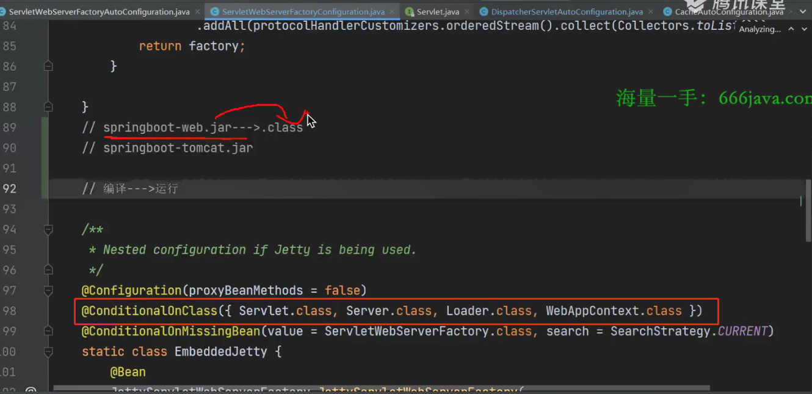

> 问题：在SpringBoot中，注解 `@ConditionalOnClass()` 用于标记当存在哪些类的时候再来加载当前注解标注的 Bean，但是当使用的时候，该注解里边的值可能是一些当前项目中并没有引入的包，那么这样运行不会报错吗？

如上图所示，假如我们当前有两种web环境选择：Tomcat或者Jetty，那么在springboot中，我们如果想要使用tomcat的话，就引入tomcat的依赖，如果使用jetty的话，就引入jetty的依赖即可

那如果我们要用tomcat的话，此时没有去引入jetty的依赖，因此在当前项目中并不存在jetty的依赖，那如果 `@ConditionalOnClass` 注解里边的条件是jetty中的类，其实这种情况是不会报错的。

> 原因：（上图中的类属于是 `springboot-web.jar`）
>
> 那么我们在项目中使用该jar包的话，也就是引入该jar包，而该jar包的存在形式为 `class` 文件，已经编译完成了，因此在我们的项目中去引用 `springboot-web.jar` 的话，并不会解析该jar包中已经编译好的class文件，因此不会报错
>
> 那么我们在项目运行的话，因为引入了该jar包，一定会运行解析上图中的 `@ConditionalOnClass` 注解，而该注解中的 `Servlet.class、Server.class等等` 其实是并不存在的，但是也不会报错，这是因为在 Spring 中去解析该注解时使用的是 `ASM` 技术，`ASM` 会去字节码文件中拿到 `@ConditionalOnClass` 注解里边的内容的字节流，再将字节流给转换为字符串（这里的字符串也就是.java文件中存储 `Servlet.class, Server.class等` 的字符串信息，即该类的全名等等），该字符串即类的全名，再通过类加载器去加载，如果可以加载成功的话 `@ConditionalOnClass` 注解返回的为true，如果加载失败的话将异常catch到，`@ConditionalOnClass` 注解返回的为false就不满足条件，因此使用了 `ASM` 技术去加载 `@ConditionalOnClass` 注解中写的类并不会因为找不到该类而报错。

我们平常运行的话，其实是运行java文件，再将.java文件编译成 `class` 文件，如果运行的文件中某个包不存在的话就会报错

**因此，要区分上边两种不同的情况，一种是已经编译好的class文件，一种是未编译的java文件**