# 1、技术罗列

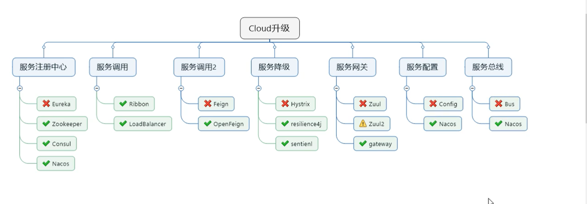

# 2、创建工程

## 2.1创建 Maven 父工程

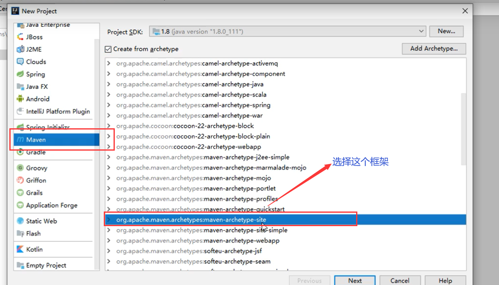

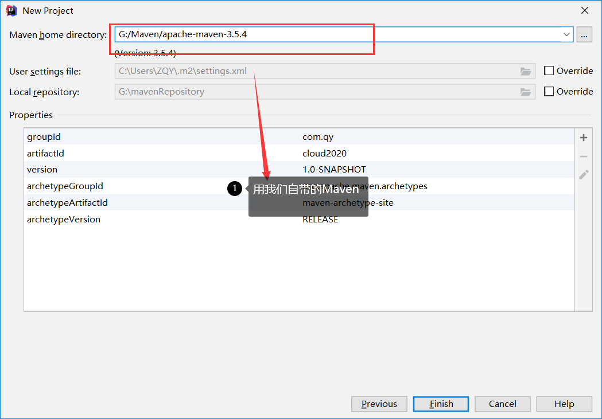

### 字符编码和JDK版本

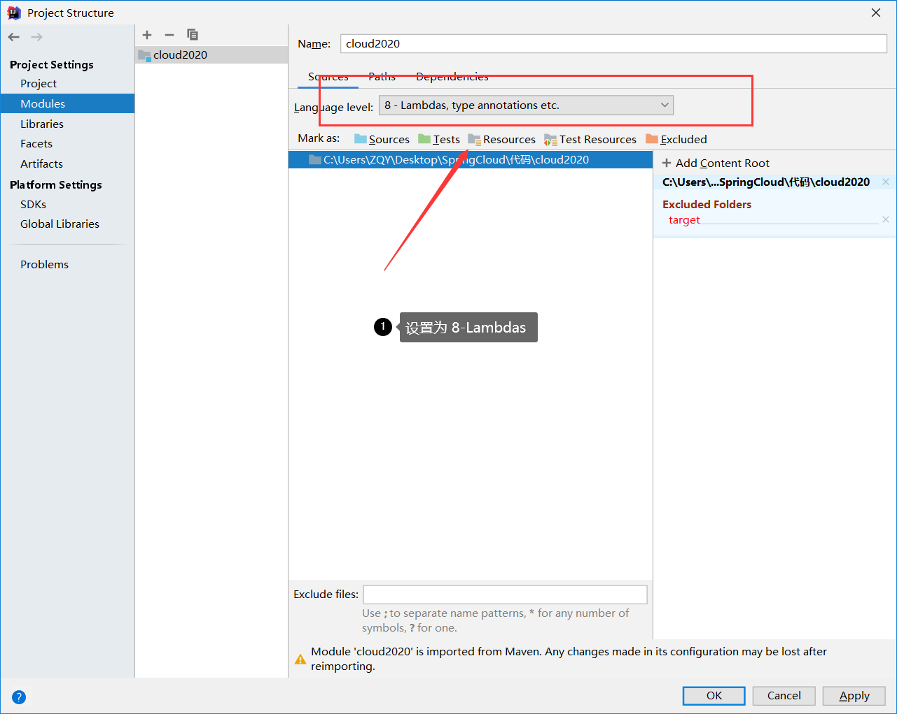

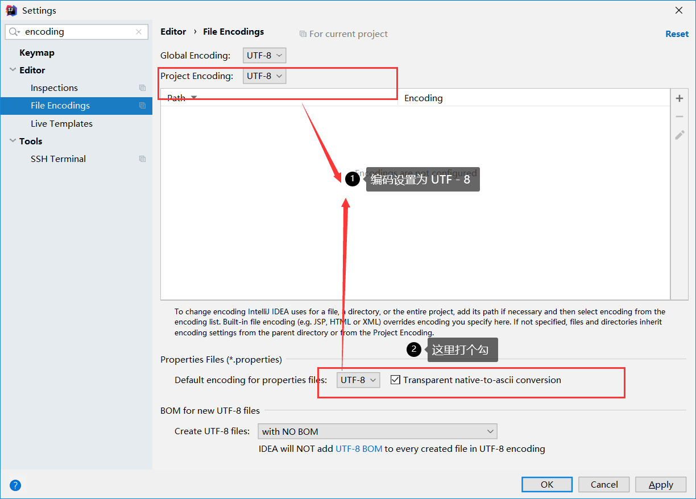

### 开启注解

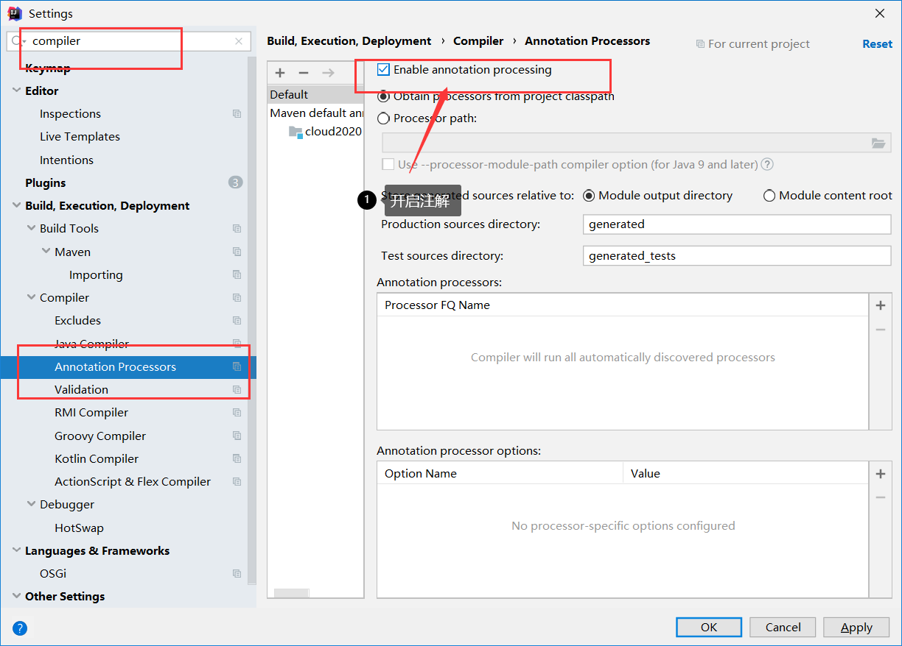

### Java编译版本

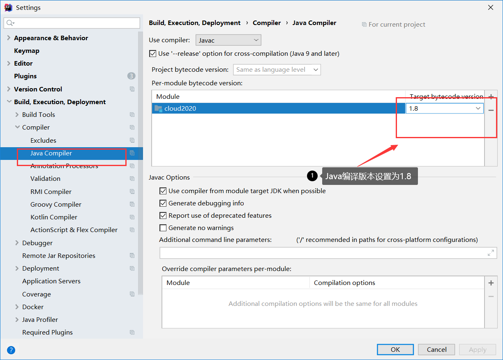


# 3、分析父工程

## 3.1 父工程的 pom.xml 文件

==<dependencyManagerment>== 一般都是用在父工程

```xml
<?xml version="1.0" encoding="UTF-8"?>
<project xmlns="http://maven.apache.org/POM/4.0.0"
         xmlns:xsi="http://www.w3.org/2001/XMLSchema-instance"
         xsi:schemaLocation="http://maven.apache.org/POM/4.0.0 http://maven.apache.org/xsd/maven-4.0.0.xsd">
    <modelVersion>4.0.0</modelVersion>

    <groupId>com.qy</groupId>
    <artifactId>cloud2020</artifactId>
    <version>1.0-SNAPSHOT</version>
    <!--这里记得写上pom，表示是个pom工程-->
    <packaging>pom</packaging>


    <!--统一管理jar包版本-->
    <properties>
        <project.build.sourceEncoding>UTF-8</project.build.sourceEncoding>
        <maven.compiler.source>1.8</maven.compiler.source>
        <maven.compiler.target>1.8</maven.compiler.target>
        <junit.version>4.12</junit.version>
        <lombok.version>1.18.10</lombok.version>
        <log4j.version>1.2.17</log4j.version>
        <mysql.version>8.0.18</mysql.version>
        <druid.version>1.1.16</druid.version>
        <mybatis.spring.boot.version>2.1.1</mybatis.spring.boot.version>
    </properties>

    <!--子模块继承之后，提供作用：锁定版本+子module不用谢groupId和version-->
    <dependencyManagement>
        <dependencies>
            <!--spring boot 2.2.2-->
            <dependency>
                <groupId>org.springframework.boot</groupId>
                <artifactId>spring-boot-dependencies</artifactId>
                <version>2.2.2.RELEASE</version>
                <type>pom</type>
                <scope>import</scope>
            </dependency>
            <!--spring cloud Hoxton.SR1-->
            <dependency>
                <groupId>org.springframework.cloud</groupId>
                <artifactId>spring-cloud-dependencies</artifactId>
                <version>Hoxton.SR1</version>
                <type>pom</type>
                <scope>import</scope>
            </dependency>
            <!--spring cloud 阿里巴巴-->
            <dependency>
                <groupId>com.alibaba.cloud</groupId>
                <artifactId>spring-cloud-alibaba-dependencies</artifactId>
                <version>2.1.0.RELEASE</version>
                <type>pom</type>
                <scope>import</scope>
            </dependency>
            <dependency>
                <groupId>org.mybatis.spring.boot</groupId>
                <artifactId>mybatis-spring-boot-starter</artifactId>
                <version>${mybatis.spring.boot.version}</version>
            </dependency>
            <!--junit-->
            <dependency>
                <groupId>junit</groupId>
                <artifactId>junit</artifactId>
                <version>${junit.version}</version>
            </dependency>
            <!--log4j-->
            <dependency>
                <groupId>log4j</groupId>
                <artifactId>log4j</artifactId>
                <version>${log4j.version}</version>
            </dependency>
            <!--mysql-->
            <dependency>
                <groupId>mysql</groupId>
                <artifactId>mysql-connector-java</artifactId>
                <version>${mysql.version}</version>
                <scope>runtime</scope>
            </dependency>
            <!-- druid-->
            <dependency>
                <groupId>com.alibaba</groupId>
                <artifactId>druid</artifactId>
                <version>${druid.version}</version>
            </dependency>
        </dependencies>
    </dependencyManagement>
</project>
```

## 3.2 Maven中的DependencyManagement和Dependencies的区别

Maven 使用 ==<dependencyManagement>== 元素来提供了一种管理依赖版本号的方式

（通常会在一个组织或者项目的最顶层的父 ==POM== 中看到 dependencyManagement 元素）

使用 pom.xml 中的 dependencyManagement 元素能让所有在子项目中引用一个依赖而不用显式的列出版本号。

Maven 会沿着父子层次向上走，知道找到一个拥有 dependencyManagement 元素的项目，然后他就会使用这个==dependencyManagement==元素中指定的版本号。

**这里注意了！**

- ==dependencyManagement== 里只是声明依赖，并不实现引入，因此子项目需要显示的声明需要用的依赖
- 如果不在子项目中声明依赖，是不会从父项目继承下来的；只有在子项目中写了该依赖，并且没有制定具体的版本，才会从父项目中继承该项，并且version和scope都读取自父pom
- 如果子项目中指定了版本号，那么就会使用子项目中使用的jar版本

## 3.3 Maven中跳过单元测试

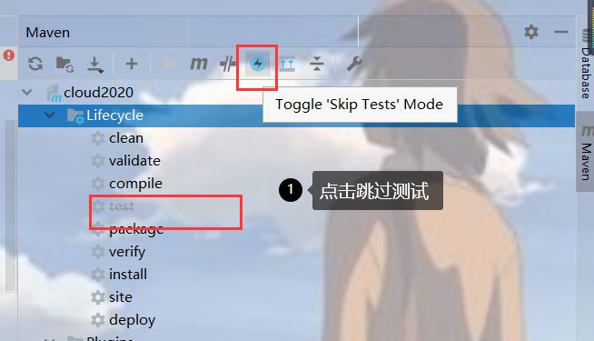

# 4、Rest微服务工程构建

> 构建步骤

- cloud-provider-payment8001  微服务提供者支付Module模块
- 热部署 Devtools
- cloud-consumer-order80    微服务消费者订单Module模块
- 工程重构

微服务模块：

1、建module

2、改POM

3、写YML

4、主启动

5、业务类

## 4.1 、 cloud-provider-payment8001模块

### 4.1.1 pom.xml

```xml
<?xml version="1.0" encoding="UTF-8"?>
<project xmlns="http://maven.apache.org/POM/4.0.0"
         xmlns:xsi="http://www.w3.org/2001/XMLSchema-instance"
         xsi:schemaLocation="http://maven.apache.org/POM/4.0.0 http://maven.apache.org/xsd/maven-4.0.0.xsd">
    <parent>
        <artifactId>cloud2020</artifactId>
        <groupId>com.qy</groupId>
        <version>1.0-SNAPSHOT</version>
    </parent>
    <modelVersion>4.0.0</modelVersion>

    <artifactId>cloud-provider-payment8001</artifactId>

    <dependencies>
        <dependency>
            <groupId>org.springframework.boot</groupId>
            <artifactId>spring-boot-starter-web</artifactId>
        </dependency>
        <dependency>
            <groupId>org.springframework.boot</groupId>
            <artifactId>spring-boot-starter-actuator</artifactId>
        </dependency>
        <dependency>
            <groupId>org.mybatis.spring.boot</groupId>
            <artifactId>mybatis-spring-boot-starter</artifactId>
        </dependency>
        <dependency>
            <groupId>com.alibaba</groupId>
            <artifactId>druid-spring-boot-starter</artifactId>
        </dependency>
        <!--mysql-->
        <dependency>
            <groupId>mysql</groupId>
            <artifactId>mysql-connector-java</artifactId>
        </dependency>
        <!--jdbc-->
        <dependency>
            <groupId>org.springframework.boot</groupId>
            <artifactId>spring-boot-starter-jdbc</artifactId>
        </dependency>
        <dependency>
            <groupId>org.springframework.boot</groupId>
            <artifactId>spring-boot-devtools</artifactId>
            <scope>runtime</scope>
            <optional>true</optional>
        </dependency>
        <dependency>
            <groupId>org.projectlombok</groupId>
            <artifactId>lombok</artifactId>
            <optional>true</optional>
        </dependency>
        <dependency>
            <groupId>org.springframework.boot</groupId>
            <artifactId>spring-boot-starter-test</artifactId>
            <scope>test</scope>
        </dependency>
    </dependencies>

</project>
```

### 4.1.2 yml

```yml
server:
  port: 8001


spring:
  application:
    name: cloud-service-payment  # 微服务 ID
  datasource:
    username: root
    password: 123456
    url: jdbc:mysql://localhost:3306/springboot?serverTimezone=UTC&useUnicode=true&characterEncoding=utf8&useSSL=false
    driver-class-name: com.mysql.cj.jdbc.Driver
    type: com.alibaba.druid.pool.DruidDataSource

#使用mybatis记得加上mapper文件地址
mybatis:
  type-aliases-package: com.qy.springcloud.entities  # 所有Entity别名类所在包
  mapper-locations: classpath:mapper/*.xml


```

### 4.1.3 entities层（实体类）

==记得实现序列化接口！==

==Payment类:==

```java
package com.qy.springcloud.entities;

import lombok.AllArgsConstructor;
import lombok.Data;
import lombok.NoArgsConstructor;

import java.io.Serializable;

@Data
@NoArgsConstructor
@AllArgsConstructor
public class Payment implements Serializable {
  // 记得实现序列化接口！！

    private Long id;

    private String serial;

}

```

==CommonResule类:==

```java
package com.qy.springcloud.entities;

import lombok.AllArgsConstructor;
import lombok.Data;
import lombok.NoArgsConstructor;

@Data
@AllArgsConstructor
@NoArgsConstructor
public class CommonResult<T> {
/*
	用于返回查询的结果
*/
    private Integer code;
    private String message;
    private T data;
    public CommonResult(Integer code , String message)
    {
        this.code = code;
        this.message = message;
    }

}

```

### 4.1.4 Dao层

```java
package com.qy.springcloud.dao;

import com.qy.springcloud.entities.Payment;
import org.apache.ibatis.annotations.Mapper;
import org.apache.ibatis.annotations.Param;

@Mapper
public interface PaymentDao {

    public int create(Payment payment);

    public Payment getPaymentById(@Param("id") Long id);

}

```

### 4.1.5 Dao的实现 （PaymentMapper.xml）

```xml
<?xml version="1.0" encoding="UTF-8" ?>
<!DOCTYPE mapper
        PUBLIC "-//mybatis.org//DTD Mapper 3.0//EN"
        "http://mybatis.org/dtd/mybatis-3-mapper.dtd">

<mapper namespace="com.qy.springcloud.dao.PaymentDao">
    <!--使用useGeneratedKeys让他返回值，返回的值是 id-->
    <insert id="create" parameterType="Payment" useGeneratedKeys="true" keyProperty="id">
        insert into payment(serial)
        values(#{serial})
    </insert>

    <resultMap id="BaseMap" type="com.qy.springcloud.entities.Payment">
        <id column="id" property="id"/>
        <result column="serial" property="serial"/>
    </resultMap>

    <select id="getPaymentById" parameterType="long" resultMap="BaseMap">
        select * from payment
        where id = #{id}
    </select>
</mapper>
```

### 4.1.6 Controller层

```java
package com.qy.springcloud.controller;


import com.qy.springcloud.entities.CommonResult;
import com.qy.springcloud.entities.Payment;
import com.qy.springcloud.service.PaymentService;
import lombok.extern.slf4j.Slf4j;
import org.springframework.beans.factory.annotation.Autowired;
import org.springframework.web.bind.annotation.GetMapping;
import org.springframework.web.bind.annotation.PathVariable;
import org.springframework.web.bind.annotation.PostMapping;
import org.springframework.web.bind.annotation.RestController;

@RestController
@Slf4j // 用于打印日志
public class PaymentController {

    @Autowired
    private PaymentService paymentService;

    @PostMapping("/payment/create")
  /*
  		这里记得加上RequestBody 注解
  	通过@requestBody可以将请求体中的JSON字符串绑定到相应的bean上，当然，也可以将其分别绑定到对应的字符串上。
  */
    public CommonResult create(@RequestBody Payment payment){
        int result = paymentService.create(payment);
        log.info("******插入的数据："+result+"***********");
        if (result > 0){
            return new CommonResult(200,"插入数据成功",result);
        }else {
            return new CommonResult(444,"插入数据失败",null);
        }
    }

    @GetMapping("/payment/get/{id}")
    public CommonResult getPaymentById(@PathVariable Long id){
        Payment payment = paymentService.getPaymentById(id);
        log.info("******插入的数据："+payment+"***********");
        if (payment != null){
            return new CommonResult(200,"查询数据成功",payment);
        }else {
            return new CommonResult(444,"没有对应记录，查询ID:"+id,null);
        }
    }

}
```

# 5、热部署工具Devtools

**在服务上线的时候，热部署一定要关闭！**

## 5.1 Devtools 依赖

```xml
 <dependency>
            <groupId>org.springframework.boot</groupId>
            <artifactId>spring-boot-devtools</artifactId>
            <scope>runtime</scope>
            <optional>true</optional>
        </dependency>
```

## 5.2 添加一个插件

==下段配置我们粘贴到父类总工程的pom文件中==

```xml
<build>
        <finalName>cloud2020</finalName>
        <plugins>
            <plugin>
                <groupId>org.springframework.boot</groupId>
                <artifactId>spring-boot-maven-plugin</artifactId>
                <configuration>
                    <fork>true</fork>
                    <addResources>true</addResources>
                </configuration>
            </plugin>
        </plugins>
</build>
```

## 5.3 开启自动编译

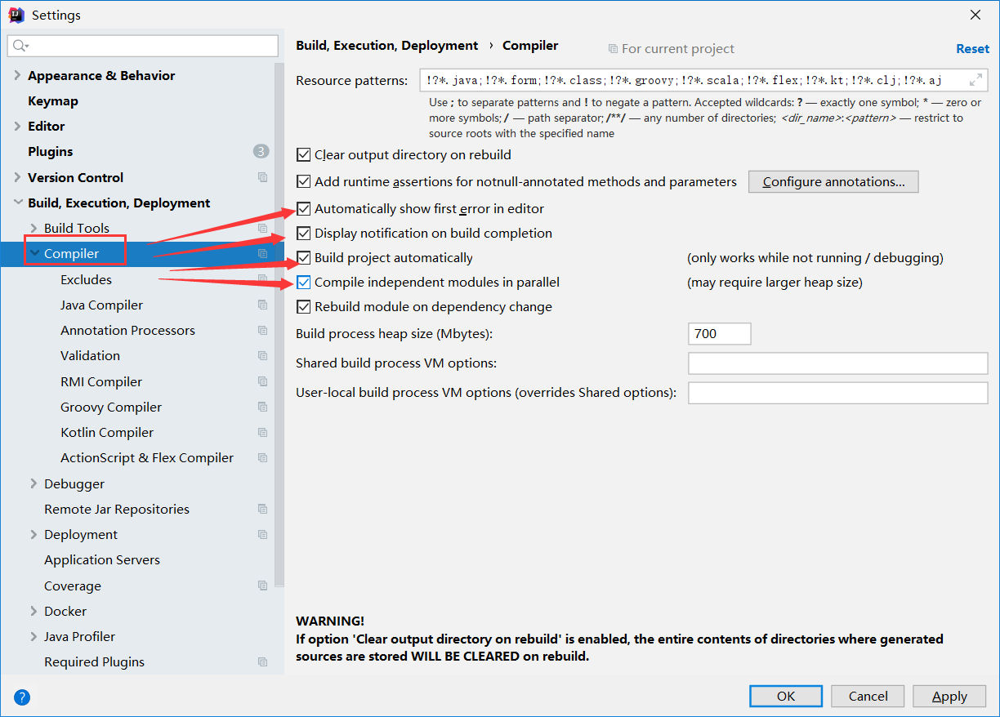

## 5.4 update the value of


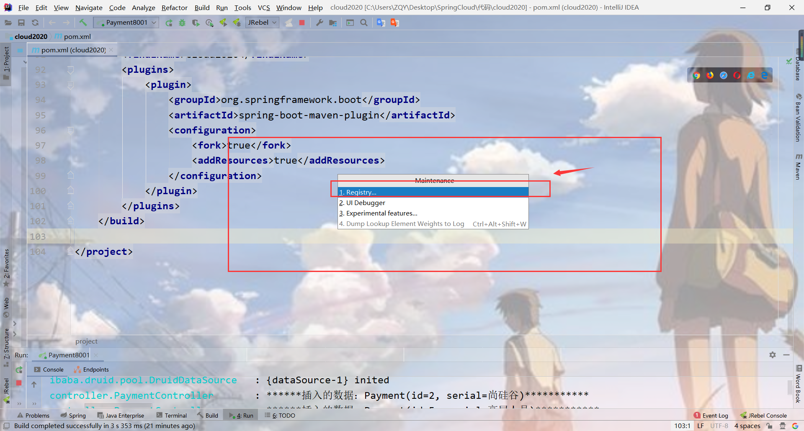

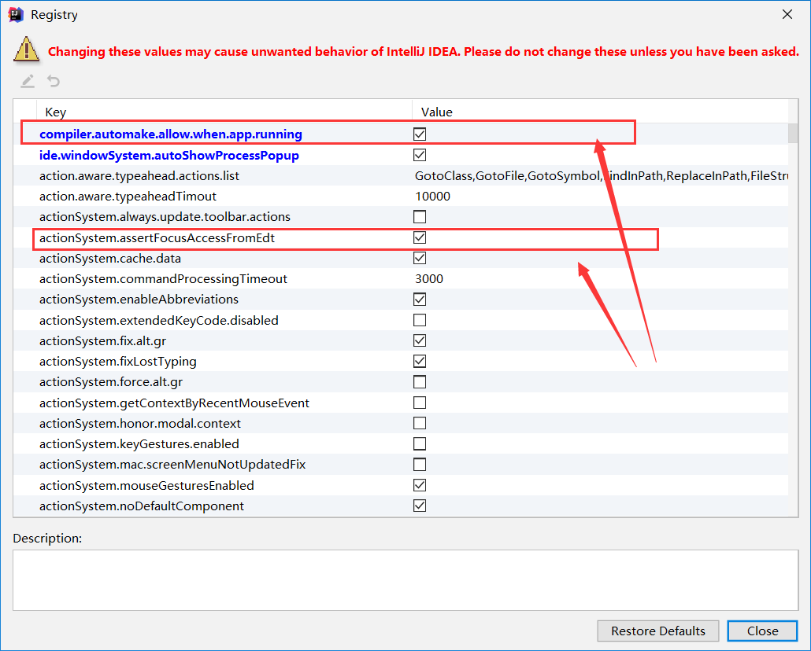

# 6、cloud-consumer-order80模块

==**这里注意奥！ 我们的消费者是没有服务层的，要去调用服务提供者的服务层！**==

## 6.1 pom依赖

```xml
<?xml version="1.0" encoding="UTF-8"?>
<project xmlns="http://maven.apache.org/POM/4.0.0"
         xmlns:xsi="http://www.w3.org/2001/XMLSchema-instance"
         xsi:schemaLocation="http://maven.apache.org/POM/4.0.0 http://maven.apache.org/xsd/maven-4.0.0.xsd">
    <parent>
        <artifactId>cloud2020</artifactId>
        <groupId>com.qy</groupId>
        <version>1.0-SNAPSHOT</version>
    </parent>
    <modelVersion>4.0.0</modelVersion>

    <artifactId>clode-consumer-order80</artifactId>

    <dependencies>
        <dependency>
            <groupId>org.springframework.boot</groupId>
            <artifactId>spring-boot-starter-web</artifactId>
        </dependency>
        <dependency>
            <groupId>org.springframework.boot</groupId>
            <artifactId>spring-boot-starter-actuator</artifactId>
        </dependency>
        <dependency>
            <groupId>org.springframework.boot</groupId>
            <artifactId>spring-boot-devtools</artifactId>
            <scope>runtime</scope>
            <optional>true</optional>
        </dependency>
        <dependency>
            <groupId>org.projectlombok</groupId>
            <artifactId>lombok</artifactId>
            <optional>true</optional>
        </dependency>
        <dependency>
            <groupId>org.springframework.boot</groupId>
            <artifactId>spring-boot-starter-test</artifactId>
            <scope>test</scope>
        </dependency>
    </dependencies>

</project>
```

## 6.2 yml

```yml
server:
  port: 80
```

## 6.3 首谈 RestTemplate

- 首先 RestTemplate是什么呢?


## 6.4 Entities类 

还是上边的支付模块的 ==Payment==和==CommonResult== 


## 6.5 config类

==要是用 RestTemplate 类，需要将他加入到Spring 中管理==


```java
package com.qy.springcloud.config;

        import org.springframework.context.annotation.Bean;
        import org.springframework.context.annotation.Configuration;
        import org.springframework.web.client.RestTemplate;

@Configuration
public class MyConfig {

    @Bean
    public RestTemplate getRestTemplate(){
        return new RestTemplate();
    }

}
```

## 6.6 Controller层

```java
package com.qy.springcloud.controller;

import com.qy.springcloud.entities.CommonResult;
import com.qy.springcloud.entities.Payment;
import lombok.extern.slf4j.Slf4j;
import org.springframework.beans.factory.annotation.Autowired;
import org.springframework.web.bind.annotation.GetMapping;
import org.springframework.web.bind.annotation.RestController;
import org.springframework.web.client.RestTemplate;


@RestController
@Slf4j
public class OrderController {

    @Autowired
    private RestTemplate restTemplate;

    public static final String PAYMENT_URL = "http://localhost:8001";

    /**
     * restTemplate.postForObject(PAYMENT_URL + "/payment/create" , payment , CommonResult.class);
     *  这里边的三个参数：第一个 url  第二个 传入的参数  第三个  返回值的字节码文件 (.class)
     */

    @GetMapping("/consumer/payment/create")
    public CommonResult<Payment> create(Payment payment){
        return restTemplate.postForObject(PAYMENT_URL + "/payment/create" , payment , CommonResult.class);
    }

}
```

## 6.7 主启动类

```java
package com.qy.springcloud;

import org.springframework.boot.SpringApplication;
import org.springframework.boot.autoconfigure.SpringBootApplication;

@SpringBootApplication
public class OrderMain80 {
    public static void main(String[] args) {
        SpringApplication.run(OrderMain80.class,args);
    }
}
```

# 7、工程重构

## 7.1 抽取共同部分

==Payment模块 和 Order模块 的共同部分就就是 Entities实体类==

## 7.2 POM依赖

==这里多导入了一个 hutool-all==

```xml
<?xml version="1.0" encoding="UTF-8"?>
<project xmlns="http://maven.apache.org/POM/4.0.0"
         xmlns:xsi="http://www.w3.org/2001/XMLSchema-instance"
         xsi:schemaLocation="http://maven.apache.org/POM/4.0.0 http://maven.apache.org/xsd/maven-4.0.0.xsd">
    <parent>
        <artifactId>cloud2020</artifactId>
        <groupId>com.qy</groupId>
        <version>1.0-SNAPSHOT</version>
    </parent>
    <modelVersion>4.0.0</modelVersion>

    <artifactId>cloud-api-commons</artifactId>

    <dependencies>
        <dependency>
            <groupId>org.projectlombok</groupId>
            <artifactId>lombok</artifactId>
            <optional>true</optional>
        </dependency>
        <dependency>
            <groupId>org.springframework.boot</groupId>
            <artifactId>spring-boot-devtools</artifactId>
            <scope>runtime</scope>
            <optional>true</optional>
        </dependency>
        <!--hutool-all-->
        <dependency>
            <groupId>cn.hutool</groupId>
            <artifactId>hutool-all</artifactId>
            <version>5.1.0</version>
        </dependency>
    </dependencies>

</project>
```

## 7.3 拷贝实体类

将两个实体拷贝过来


##  7.4 对api这个模块 clean 和 install 发布到本地仓库

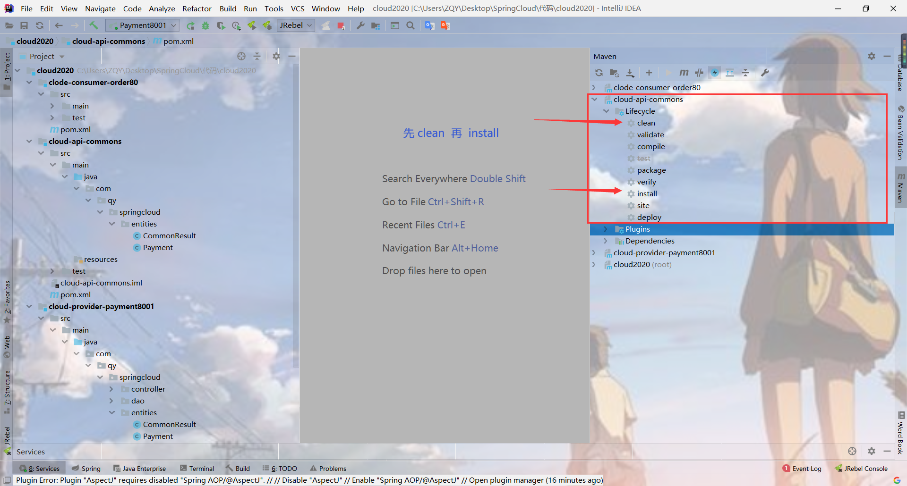

## 7.5 别的模板需要用的啥时候

在 pom 文件中加上

```xml
<!--引入自己定义的 api 通用包-->
<dependency>
    <groupId>com.qy</groupId>
    <artifactId>cloud-api-commons</artifactId>
    <version>1.0-SNAPSHOT</version>
</dependency>
```


