# 1、Gateway新一代网关

# Gateway整合nacospom依赖

```xml
<?xml version="1.0" encoding="UTF-8"?>
<project xmlns="http://maven.apache.org/POM/4.0.0" xmlns:xsi="http://www.w3.org/2001/XMLSchema-instance"
         xsi:schemaLocation="http://maven.apache.org/POM/4.0.0 http://maven.apache.org/xsd/maven-4.0.0.xsd">
    <modelVersion>4.0.0</modelVersion>

    <groupId>com.smartgis</groupId>
    <artifactId>smartgis-gateway</artifactId>
    <version>0.0.1-SNAPSHOT</version>
    <name>smartgis-gateway</name>
    <description>Demo project for Spring Boot</description>

    <parent>
        <groupId>org.springframework.boot</groupId>
        <artifactId>spring-boot-starter-parent</artifactId>
        <version>2.0.5.RELEASE</version>

        <relativePath/> <!-- lookup parent from repository -->
    </parent>

    <properties>
        <project.build.sourceEncoding>UTF-8</project.build.sourceEncoding>
        <project.reporting.outputEncoding>UTF-8</project.reporting.outputEncoding>
        <java.version>1.8</java.version>
        <nacos.version>0.2.1.RELEASE</nacos.version>
        <spring-cloud.version>Finchley.SR1</spring-cloud.version>
    </properties>

    <dependencies>
        <dependency>
            <groupId>io.springfox</groupId>
            <artifactId>springfox-swagger2</artifactId>
            <version>2.8.0</version>
        </dependency>
        <dependency>
            <groupId>io.springfox</groupId>
            <artifactId>springfox-swagger-ui</artifactId>
            <version>2.8.0</version>
        </dependency>
        <dependency>
            <groupId>org.springframework.boot</groupId>
            <artifactId>spring-boot-starter-logging</artifactId>
        </dependency>
        <dependency>
            <groupId>org.springframework.boot</groupId>
            <artifactId>spring-boot-starter-actuator</artifactId>
        </dependency>
        <dependency>
            <groupId>org.springframework.cloud</groupId>
            <artifactId>spring-cloud-starter-gateway</artifactId>
        </dependency>
        <dependency>
            <groupId>org.springframework.cloud</groupId>
            <artifactId>spring-cloud-starter-alibaba-nacos-discovery</artifactId>
            <version>${nacos.version}</version>
        </dependency>
        <dependency>
            <groupId>org.springframework.cloud</groupId>
            <artifactId>spring-cloud-alibaba-nacos-config</artifactId>
            <version>${nacos.version}</version>
        </dependency>
        <dependency>
            <groupId>org.projectlombok</groupId>
            <artifactId>lombok</artifactId>
            <version>1.16.18</version>
        </dependency>
    </dependencies>

    <dependencyManagement>
        <dependencies>
            <dependency>
                <groupId>org.springframework.cloud</groupId>
                <artifactId>spring-cloud-dependencies</artifactId>
                <version>${spring-cloud.version}</version>
                <type>pom</type>
                <scope>import</scope>
            </dependency>
        </dependencies>
    </dependencyManagement>

    <build>
        <finalName>smartgis-gateway</finalName>
        <plugins>
            <plugin>
                <groupId>org.springframework.boot</groupId>
                <artifactId>spring-boot-maven-plugin</artifactId>
                <configuration>
                    <mainClass>com.smartgis.GatewayStarterApplication</mainClass>
                    <layout>ZIP</layout>
                </configuration>
                <executions>
                    <execution>
                        <goals>
                            <goal>repackage</goal><!--可以把依赖的包都打包到生成的Jar包中-->
                        </goals>
                    </execution>
                </executions>
            </plugin>
        </plugins>
    </build>

</project>

```


## 1.1 是什么


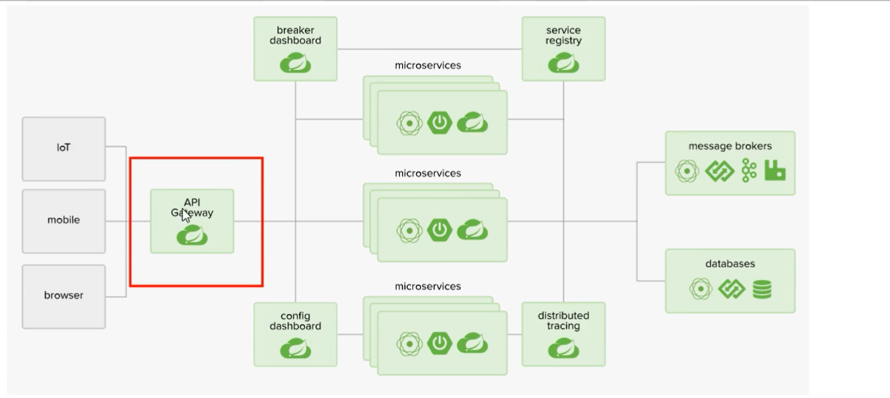

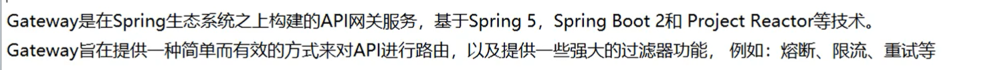

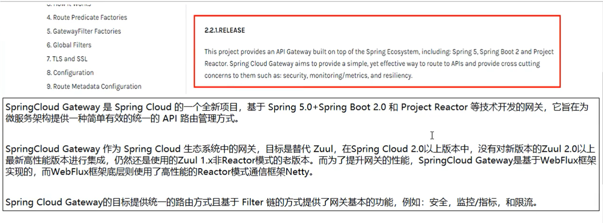

## 1.2 能干啥

- 反向代理
- 鉴权
- 流量控制
- 熔断
- 日志监控
- ......

## 1.3 微服务架构中网关在哪里

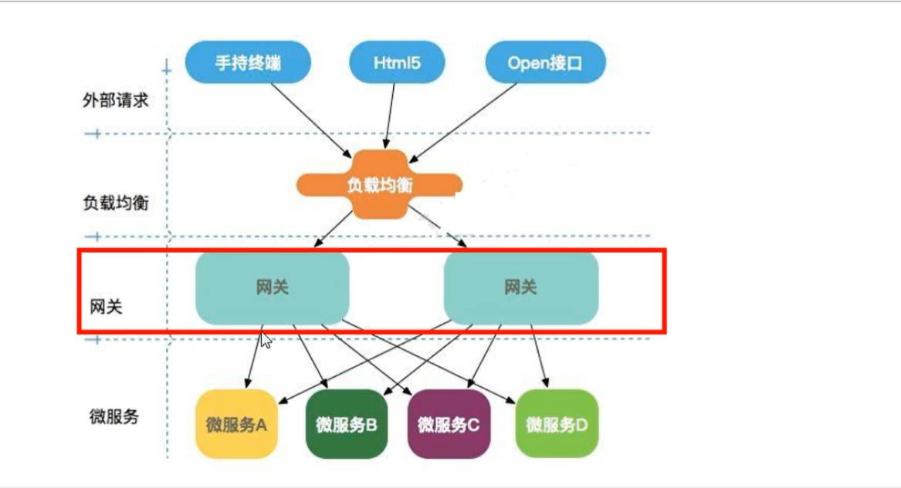

# 2、Spring Cloud Gateway特性

 


# 3、WebFlux

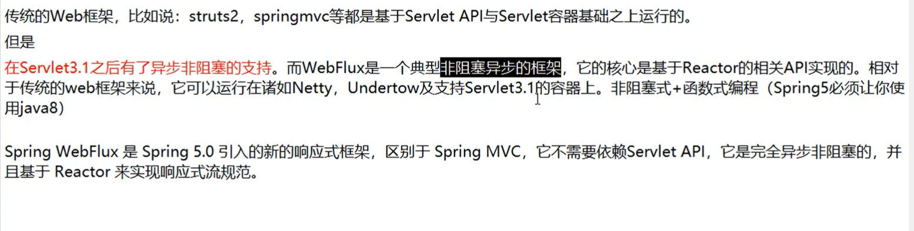

# 4、三大核心概念

## 4.1  Route（路由）

`路由`是构建网关的基本模块，它由ID，目标URL，一系列的断言和过滤器组成，如果断言为true则匹配该路由

## 4.2  Predicate（断言）

开发人员可以匹配HTTP请求中的所有内容（例如请求头或请求参数），`如果请求与断言相匹配则进行路由`

## 4.3  Filter（过滤）

指的是Spring框架中GatewayFilter的实例，使用过滤器，可以在请求路由前或之后对请求进行修改

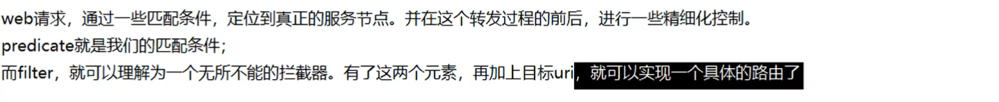

**`核心逻辑：`**

路由转发 + 执行过滤器链

# 5、入门配置

## 5.1 新建 Module(cloud-gateway-gateway9527)

## 5.2 POM

```xml
<?xml version="1.0" encoding="UTF-8"?>
<project xmlns="http://maven.apache.org/POM/4.0.0"
         xmlns:xsi="http://www.w3.org/2001/XMLSchema-instance"
         xsi:schemaLocation="http://maven.apache.org/POM/4.0.0 http://maven.apache.org/xsd/maven-4.0.0.xsd">
    <parent>
        <artifactId>cloud2020</artifactId>
        <groupId>com.qy</groupId>
        <version>1.0-SNAPSHOT</version>
    </parent>
    <modelVersion>4.0.0</modelVersion>

    <artifactId>cloud-gateway-gateway9527</artifactId>

    <dependencies>
        <!--Gateway-->
        <dependency>
            <groupId>org.springframework.cloud</groupId>
            <artifactId>spring-cloud-starter-gateway</artifactId>
        </dependency>
        <!--Eureka-->
        <dependency>
            <groupId>org.springframework.cloud</groupId>
            <artifactId>spring-cloud-starter-netflix-eureka-client</artifactId>
        </dependency>
        <!--引入自己定义的 api 通用包-->
        <dependency>
            <groupId>com.qy</groupId>
            <artifactId>cloud-api-commons</artifactId>
            <version>1.0-SNAPSHOT</version>
        </dependency>
        <dependency>
            <groupId>org.projectlombok</groupId>
            <artifactId>lombok</artifactId>
            <optional>true</optional>
        </dependency>
        <dependency>
            <groupId>org.springframework.boot</groupId>
            <artifactId>spring-boot-starter-test</artifactId>
            <scope>test</scope>
        </dependency>
    </dependencies>

</project>
```

## 5.3 YML

```yaml
server:
  port: 9527

spring:
  application:
    name: cloud-gateway

eureka:
  instance:
    hostname: cloud-gateway-service
  client: #服务体重这provider注册进eureka服务列表内
  service-url: 
       register-with-eureka: true
       fetch-registry: true
       defaultZone: http://eureka7001.com:7001/eureka
```


## 5.4 service  无

## 5.5 controller  无

## 5.6 主启动

```java
@SpringBootApplication
@EnableEurekaClient
public class GatewayMain9527 {
    public static void main(String[] args) {
        SpringApplication.run(GatewayMain9527.class,args);
    }
}
```

## 5.7   9527网关如何做路由映射？

cloud-provider-payment8001看看controller的访问地址

我们目前不想暴露8001端口，希望在8001外面套一层9527

## 5.8 ==YML新增网关配置==

`更改9572的yml`：

```yaml
server:
  port: 9527

spring:
  application:
    name: cloud-gateway
  cloud:
    gateway:
      routes:
        - id: payment_routh            # 路由的ID，没有固定规则但要求唯一，建议配合服务名
          uri: http://localhost:8001   # 匹配后提供服务的路由地址
          predicates:
            - Path=/payment/get/**     # 断言，路径相匹配的进行路由

        - id: payment_routh2
          uri: http://localhost:8001
          predicates:
            - Path=/payment/lb/**

eureka:
  instance:
    hostname: cloud-gateway-service
  client: #服务体重这provider注册进eureka服务列表内
  service-url:
       register-with-eureka: true
       fetch-registry: true
       defaultZone: http://eureka7001.com:7001/eureka

```

## 5.9 测试

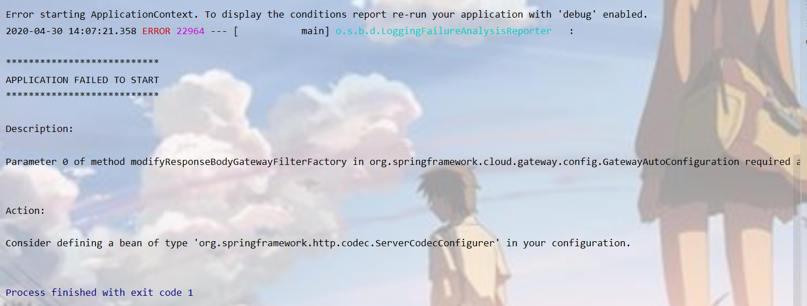

若出现上图错误，是因为gateway的依赖和web依赖产生了冲突！

```xml
<dependency>
    <groupId>org.springframework.boot</groupId>
    <artifactId>spring-boot-starter-web</artifactId>
</dependency>
<dependency>
    <groupId>org.springframework.boot</groupId>
    <artifactId>spring-boot-starter-actuator</artifactId>
</dependency>
```

==访问测试 :==

- 添加网关前  :  <http://localhost:8001/payment/get/3>
- 添加网关后  ： <http://localhost:9527/payment/get/3>

淡化了真实地址和端口号

## 5.10 `YML配置说明`

Gateway网关路由配置有两种方式：

- 在配置文件yml中配置（见上面）
- 代码中注入RouteLocator的Bean（用配置类）

`代码中注入RouteLocator的Bean`：

```java
@Configuration
public class MyConfig {
    @Bean
    public RouteLocator getRouteLocator(RouteLocatorBuilder builder){
        RouteLocatorBuilder.Builder routes = builder.routes();
        routes.route(
                "path_route_01",   // 这个是id
                r -> r.path("/guonei").  // 访问 http://localhost:9527/guonei 地址后边的guonei
                        uri("http://news.baidu.com/guonei")).  //访问http://localhost:9527/guonei 跳转到该地址
                build();
        return routes.build();
    }
}
```

访问 http://localhost:9527/guone

# 6、配置动态路由

## 6.1 默认情况

默认情况下Gateway会根据注册中心注册的服务列表，以注册中心上微服务名为路径创建`动态路由进行转发，从而实现动态路由的功能`

## 6.2 启动：

一个eureka7001 + 两个服务提供者 8001/8002

## 6.3 POM

```xml
     <!--Eureka-->
        <dependency>
            <groupId>org.springframework.cloud</groupId>
            <artifactId>spring-cloud-starter-netflix-eureka-client</artifactId>
        </dependency>
```

## 6.4 YML

在9527的yml中添加下列配置：

```yaml
      discovery:
         locator:
            enabled: true # 开启从注册中心动态创建路由的功能，利用微服务名进行路由
```

总的yml：`还要把写死的uri换掉`

```yaml
server:
  port: 9527

spring:
  application:
    name: cloud-gateway
  cloud:
    gateway:
      discovery:
        locator:
          enabled: true # 开启从注册中心动态创建路由的功能，利用微服务名进行路由
      routes:
        - id: payment_routh            # 路由的ID，没有固定规则但要求唯一，建议配合服务名
          #uri: http://localhost:8001   # 匹配后提供服务的路由地址
          uri: lb://cloud-payment-service # 匹配后提供服务的路由地址
          predicates:                  # uri + Path : http://localhost:8001/payment/get/**
            - Path=/payment/get/**     # 断言，路径相匹配的进行路由

        - id: payment_routh2
          #uri: http://localhost:8001
          uri: lb://cloud-payment-service # 匹配后提供服务的路由地址
          predicates:
            - Path=/payment/lb/**

eureka:
  instance:
    hostname: cloud-gateway-service
  client: #服务体重这provider注册进eureka服务列表内
    service-url:
       register-with-eureka: true
       fetch-registry: true
       defaultZone: http://eureka7001.com:7001/eureka

```

访问 : <http://localhost:9527/payment/lb>

# 7、Predicate的使用

## 7.1 是什么

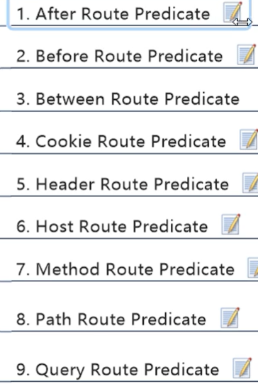

## 7.2 After

yml：

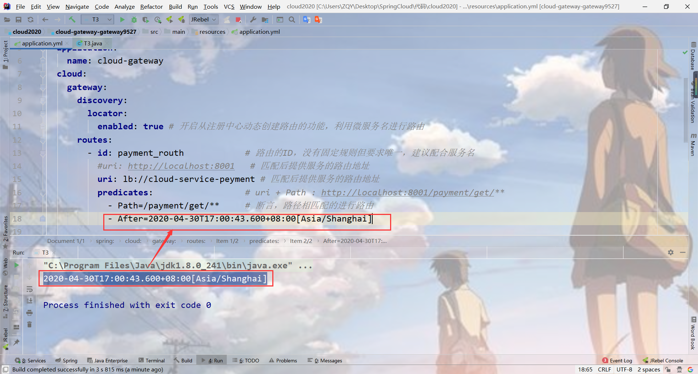

那么里边的时间我们怎么来得到呢?

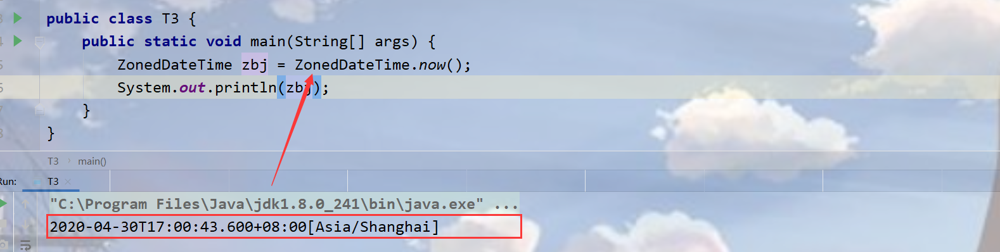

直接输出就可以得到了。

## 7.3 Cookie

yml：

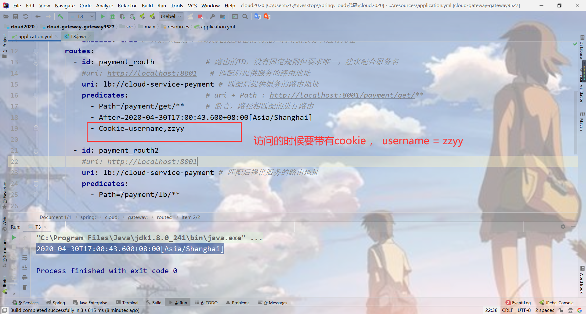

不带cookie的访问:

访问失败！

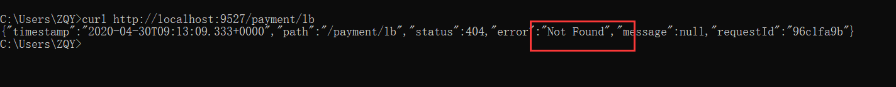

带有cookie的访问：

访问成功！

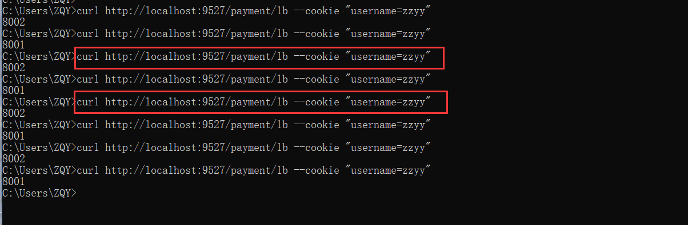


# 8、Filter

##  自定义过滤器

自定义全局GlobalFilter

`两个主要接口：`

```java
implements GlobalFilter,Ordered
```

`能干吗：`

全局日志记录，统一网关鉴权 ......

`代码：`

一：实现接口

二：@Component 加入spring

三：写代码

```java
@Component
public class MyGatewayFilter implements GlobalFilter, Ordered {

    @Override
    public Mono<Void> filter(ServerWebExchange exchange, GatewayFilterChain chain) {
        System.out.println("******come in MyGatewayFilter : "+new Date());
        String uname = exchange.getRequest().getQueryParams().getFirst("uname");
        if (uname == null){
            System.out.println("********用户名为null,非法用户，/(ㄒoㄒ)/~~");
            exchange.getResponse().setStatusCode(HttpStatus.NOT_ACCEPTABLE); //如果失败了设置一下不能接收的状态码
            return exchange.getResponse().setComplete();
        }
        return chain.filter(exchange);
    }

    @Override
    public int getOrder() {
        return 0;  // 数字越小，优先级越高
    }
}
```

测试：

访问 <http://localhost:9527/payment/lb?uname=z2>


```
server:
  port: 88
spring:
  application:
    name: gulimall-gateway2
  cloud:
    nacos:
      discovery:
        server-addr: 127.0.0.1:8848
    gateway:
      discovery:      #是否与服务发现组件进行结合，通过 serviceId(必须设置成大写) 转发到具体的服务实例。默认为false，设为true便开启通过服务中心的自动根据 serviceId 创建路由的功能。
        locator:      #路由访问方式：http://Gateway_HOST:Gateway_PORT/大写的serviceId/**，其中微服务应用名默认大写访问。
          enabled: true
      routes:
        - id: host_route
          uri: http://www.baidu.com
          predicates:
            - Path=/a/**

        - id: admin_route
          uri: lb://renren-fast
          predicates:
            - Path=/api/**
          filters:
            - RewritePath=/api/(?<segment>.*),/renren-fast/$\{segment}
```

