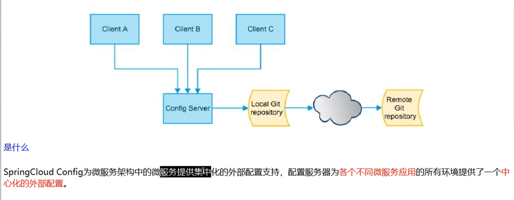
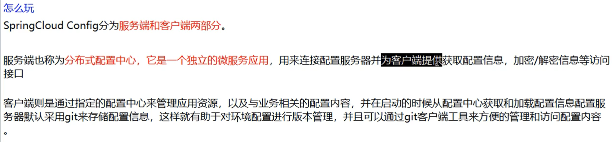
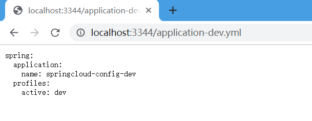

# 1、分布式系统面临的配置问题


# 2、是什么





能干嘛？


# 3、操作

- 在码云上新建一个远程仓库，springcloud-config，克隆到本地，在本地添加一个文件application.yml

  ```yaml
  spring:
     profiles:
        active: dev
  ---
  spring:
     profiles: dev
     application:
        name: springcloud-config-dev
  ---
  spring:
     profiles: test
     application:
        name: springcloud-config-test
  ```

- 将文件提交到码云上

  ```bash
  git  add  .
  git  status   #查看状态
  git  commit  -m  "first commit" # -m : 提交的信息
  git  push  # 提交到远程仓库
  ```

## 建Module 

cloud-config-center3344

## POM

```xml
<?xml version="1.0" encoding="UTF-8"?>
<project xmlns="http://maven.apache.org/POM/4.0.0"
         xmlns:xsi="http://www.w3.org/2001/XMLSchema-instance"
         xsi:schemaLocation="http://maven.apache.org/POM/4.0.0 http://maven.apache.org/xsd/maven-4.0.0.xsd">
    <parent>
        <artifactId>cloud2020</artifactId>
        <groupId>com.qy</groupId>
        <version>1.0-SNAPSHOT</version>
    </parent>
    <modelVersion>4.0.0</modelVersion>

    <artifactId>cloud-config-center3344</artifactId>

    <dependencies>
        <!--config server-->
        <dependency>
            <groupId>org.springframework.cloud</groupId>
            <artifactId>spring-cloud-config-server</artifactId>
        </dependency>
        <!--Eureka-->
        <dependency>
            <groupId>org.springframework.cloud</groupId>
            <artifactId>spring-cloud-starter-netflix-eureka-client</artifactId>
        </dependency>
        <!--web-->
        <dependency>
            <groupId>org.springframework.boot</groupId>
            <artifactId>spring-boot-starter-web</artifactId>
        </dependency>
        <dependency>
            <groupId>org.springframework.boot</groupId>
            <artifactId>spring-boot-starter-actuator</artifactId>
        </dependency>
        <dependency>
            <groupId>org.springframework.boot</groupId>
            <artifactId>spring-boot-devtools</artifactId>
            <scope>runtime</scope>
            <optional>true</optional>
        </dependency>
    </dependencies>

</project>
```

## YML

```yaml
server:
  port: 3344

spring:
  application:
    name: cloud-config-center #注册进Eureka服务器的微服务名
  cloud:
    config:
      server:
        git:   # 这里用 https 不是ssh
          uri: https://gitee.com/qylaile/springcloud-config.git
```

## 主启动

```java
@SpringBootApplication
@EnableConfigServer
public class ConfigMain3344 {
    public static void main(String[] args) {
        SpringApplication.run(ConfigMain3344.class,args);
    }
}
```

## 测试

访问 ： <http://localhost:3344/application-dev.yml>  会看到配置信息




## 在本地克隆的仓库中在新建一个 config-client.yml

```yaml
spring:
  profiles:
    active: dev
---
spring:
  profiles: dev
  application:
    name: cloud-service-payment  # 微服务 ID
  
#Eureka
server:
  port: 8201
eureka:
  client:
    service-url:
      defaultZone: http://eureka7001.com:7001/eureka

---
server:
  port: 8202
spring:
  profiles: test
  application:
    name: cloud-service-payment  # 微服务 ID
  
#Eureka
eureka:
  client:
    service-url:
      defaultZone: http://eureka7001.com:7001/eureka

```

```bash
git  add  .
git  commit  -m  "second commit"
git  push
```

## 建Module

cloud-config-client3355

## POM

```XML
<?xml version="1.0" encoding="UTF-8"?>
<project xmlns="http://maven.apache.org/POM/4.0.0"
         xmlns:xsi="http://www.w3.org/2001/XMLSchema-instance"
         xsi:schemaLocation="http://maven.apache.org/POM/4.0.0 http://maven.apache.org/xsd/maven-4.0.0.xsd">
    <parent>
        <artifactId>cloud2020</artifactId>
        <groupId>com.qy</groupId>
        <version>1.0-SNAPSHOT</version>
    </parent>
    <modelVersion>4.0.0</modelVersion>

    <artifactId>cloud-config-client3355</artifactId>

    <dependencies>
        <!--config-->
        <dependency>
            <groupId>org.springframework.cloud</groupId>
            <artifactId>spring-cloud-starter-config</artifactId>
        </dependency>
        <!--Eureka-->
        <dependency>
            <groupId>org.springframework.cloud</groupId>
            <artifactId>spring-cloud-starter-netflix-eureka-client</artifactId>
        </dependency>
        <!--web-->
        <dependency>
            <groupId>org.springframework.boot</groupId>
            <artifactId>spring-boot-starter-web</artifactId>
        </dependency>
        <dependency>
            <groupId>org.springframework.boot</groupId>
            <artifactId>spring-boot-starter-actuator</artifactId>
        </dependency>
        <dependency>
            <groupId>org.springframework.boot</groupId>
            <artifactId>spring-boot-devtools</artifactId>
            <scope>runtime</scope>
            <optional>true</optional>
        </dependency>
    </dependencies>

</project>
```


## YML

`两个yml bootstrap.yml 和 application.yml`

区别：

bootstrap.yml系统级别的配置 

application.yml是用户级别的配置

`bootstrap.yml`

```yaml
# bootstrap.yml系统级别的配置
# application.yml是用户级别的配置
spring:
  cloud:
    config:
      # http://localhost:3344/config-client-dev.yml 拆分成下边
      name: config-client # 需要从 git 上读取的资源名称
      uri: http://localhost:3344 # 连接服务 而不是 git
      profile: dev # 拿到哪个生产环境
      label: master
```

application.yml

```yaml
spring:
  application:
    name: cloud-config-client3355
```

访问：<http://localhost:8201/config>

为什么是8201端口？

激活的是dev环境，在远程配置的dev的端口号是8201

