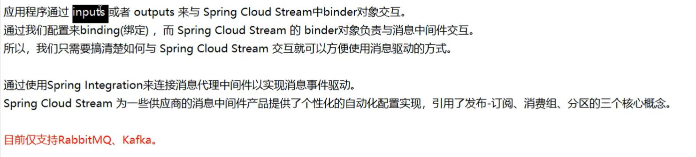
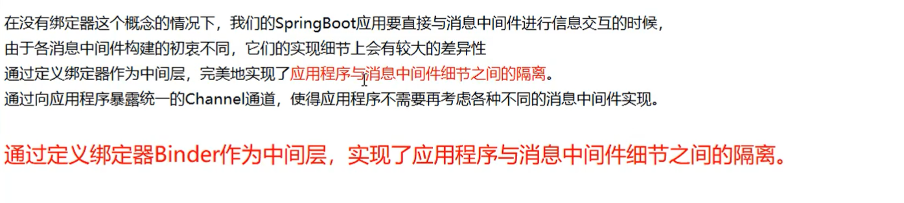
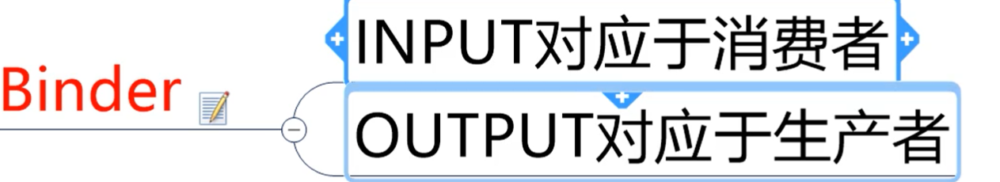
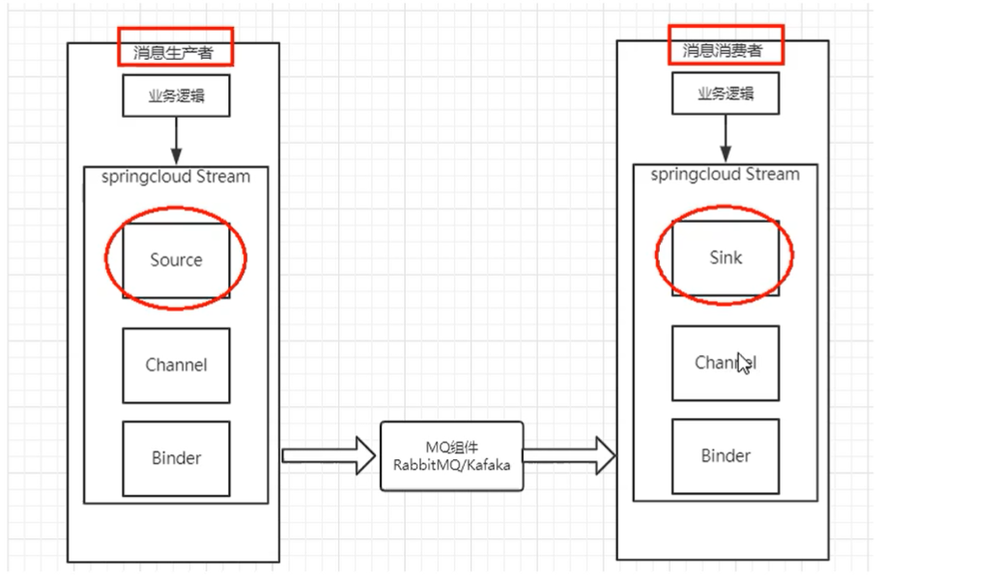
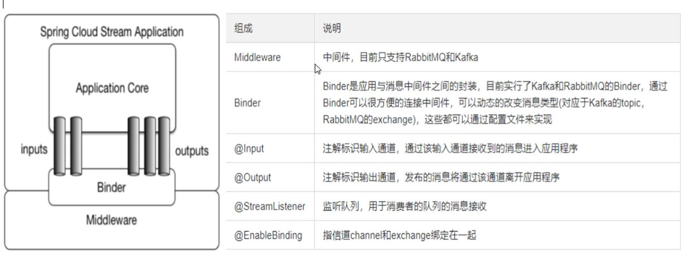

# 1、解决的问题

是什么 ? 

屏蔽底层消息中间件的差异，降低切换成本，统一消息的编程模型

`什么是SpringCloudStream`

官方定义 Spring Cloud Stream 是一个构建消息驱动微服务的框架

为什么用Cloud Stream？

比方说我们用到了RabbitMQ和Kafka，由于这两个消息中间件的架构上的不同，像RabbitMQ有exchange，kafka有Topic和Partitions分区

这些中间件的差异性导致我们实际项目开发给我们造成了一定的困扰，我们如果用了两个消息队列的其中一种，后面的业务需求，我们想往另外一种消息队列进行迁移，这时候无疑就是一个灾难性的，`一大堆东西都要重新推倒重新做 `，因为他跟我们的系统耦合了，这时候SpringCloud Stream给我们提供了一种解耦合的方式。

==steam凭什么可以统一底层差异？==

# 2、Stream标准流程套路

- Binder

  很方便的连接中间件，屏蔽差异

- Channel

  通道，是队列的一种抽象，在消息通讯系统中就是实现存储和转发的媒介，通过Channel对队列进行配置

- Source和Sink

  简单的可理解为参照对象就是stream自身，从Stream发布消息就是输出，接收消息就是输入

> 编码API和常用注解

