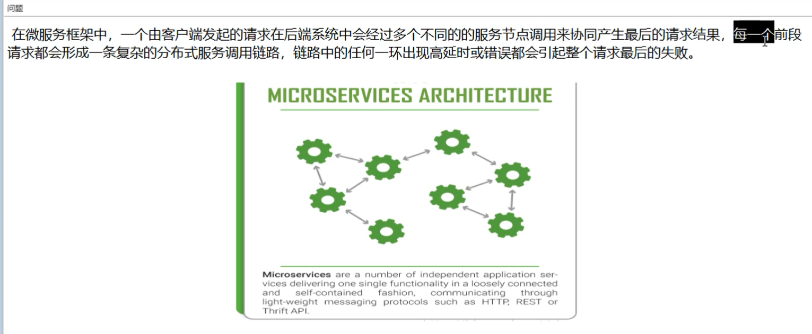
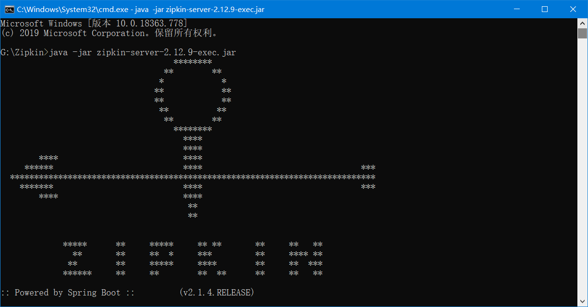
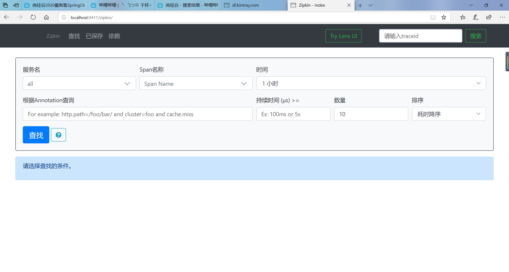

# 1、问题




# 2、是什么


# 3、搭建链路监控步骤

## 3.1 zipkin

- 下载

  SpringCloud从F版起已不需要自己构建Zipkin Server了，只需要调用jar包即可

  https://dl.bintray.com/openzipkin/maven/io/zipkin/java/zipkin-server

  

- 运行jar

  

- 运行控制台

  访问 localhost:9411/zipkin/

  

## 3.2 服务提供者（8001）

pom:

添加上

```xml
<!--包含了sleuth+zipkin-->
        <dependency>
            <groupId>org.springframework.cloud</groupId>
            <artifactId>spring-cloud-starter-zipkin</artifactId>
        </dependency>
```

总的pom：

```xml
<?xml version="1.0" encoding="UTF-8"?>
<project xmlns="http://maven.apache.org/POM/4.0.0"
         xmlns:xsi="http://www.w3.org/2001/XMLSchema-instance"
         xsi:schemaLocation="http://maven.apache.org/POM/4.0.0 http://maven.apache.org/xsd/maven-4.0.0.xsd">
    <parent>
        <artifactId>cloud2020</artifactId>
        <groupId>com.qy</groupId>
        <version>1.0-SNAPSHOT</version>
    </parent>
    <modelVersion>4.0.0</modelVersion>

    <artifactId>cloud-provider-payment8001</artifactId>

    <dependencies>
        <!--包含了sleuth+zipkin-->
        <dependency>
            <groupId>org.springframework.cloud</groupId>
            <artifactId>spring-cloud-starter-zipkin</artifactId>
        </dependency>
        <!--Eureka-->
        <dependency>
            <groupId>org.springframework.cloud</groupId>
            <artifactId>spring-cloud-starter-netflix-eureka-client</artifactId>
            <version>2.2.2.RELEASE</version>
        </dependency>

        <!--引入自己定义的 api 通用包-->
        <dependency>
            <groupId>com.qy</groupId>
            <artifactId>cloud-api-commons</artifactId>
            <version>1.0-SNAPSHOT</version>
        </dependency>
        <dependency>
            <groupId>com.alibaba</groupId>
            <artifactId>druid</artifactId>
        </dependency>
        <dependency>
            <groupId>org.springframework.boot</groupId>
            <artifactId>spring-boot-starter-web</artifactId>
        </dependency>
        <dependency>
            <groupId>org.springframework.boot</groupId>
            <artifactId>spring-boot-starter-actuator</artifactId>
        </dependency>
        <dependency>
            <groupId>org.mybatis.spring.boot</groupId>
            <artifactId>mybatis-spring-boot-starter</artifactId>
        </dependency>
        <dependency>
            <groupId>com.alibaba</groupId>
            <artifactId>druid-spring-boot-starter</artifactId>
            <version>1.1.22</version>
        </dependency>
        <!--mysql-->
        <dependency>
            <groupId>mysql</groupId>
            <artifactId>mysql-connector-java</artifactId>
        </dependency>
        <!--jdbc-->
        <dependency>
            <groupId>org.springframework.boot</groupId>
            <artifactId>spring-boot-starter-jdbc</artifactId>
        </dependency>
        <dependency>
            <groupId>org.springframework.boot</groupId>
            <artifactId>spring-boot-devtools</artifactId>
            <scope>runtime</scope>
            <optional>true</optional>
        </dependency>
        <dependency>
            <groupId>org.projectlombok</groupId>
            <artifactId>lombok</artifactId>
            <optional>true</optional>
        </dependency>
        <dependency>
            <groupId>org.springframework.boot</groupId>
            <artifactId>spring-boot-starter-test</artifactId>
            <scope>test</scope>
        </dependency>


    </dependencies>

</project>
```


yml:

添加上：

```yaml
  zipkin:
      base-url: http://localhost:9411
  sleuth:
      sampler:
        #采样率值介于  0  到  1 之间，1则代表全部采集
        probability: 1
```

总的yml：

```yaml
server:
  port: 8001


spring:
  application:
    name: cloud-service-payment
  zipkin:
      base-url: http://localhost:9411
  sleuth:
      sampler:
       probability: 1
  datasource:
    username: root
    password: 123456
    url: jdbc:mysql://localhost:3306/db02?serverTimezone=UTC&useUnicode=true&characterEncoding=utf8&useSSL=false
    driver-class-name: com.mysql.cj.jdbc.Driver
    type: com.alibaba.druid.pool.DruidDataSource
mybatis:
  type-aliases-package: com.qy.springcloud.entities
  mapper-locations: classpath:mapper/*.xml


eureka:
  client:
    register-with-eureka: true
    fetchRegistry: true
    service-url:
      defaultZone: http://eureka7001.com:7001/eureka
  instance:
    instance-id: payment8001
    prefer-ip-address: true
```


## 3.3 服务消费者

pom：

```xml
<?xml version="1.0" encoding="UTF-8"?>
<project xmlns="http://maven.apache.org/POM/4.0.0"
         xmlns:xsi="http://www.w3.org/2001/XMLSchema-instance"
         xsi:schemaLocation="http://maven.apache.org/POM/4.0.0 http://maven.apache.org/xsd/maven-4.0.0.xsd">
    <parent>
        <artifactId>cloud2020</artifactId>
        <groupId>com.qy</groupId>
        <version>1.0-SNAPSHOT</version>
    </parent>
    <modelVersion>4.0.0</modelVersion>

    <artifactId>clode-consumer-order80</artifactId>

    <dependencies>
        <!--包含了sleuth+zipkin-->
        <dependency>
            <groupId>org.springframework.cloud</groupId>
            <artifactId>spring-cloud-starter-zipkin</artifactId>
        </dependency>
        <!--Eureka-->
        <dependency>
            <groupId>org.springframework.cloud</groupId>
            <artifactId>spring-cloud-starter-netflix-eureka-client</artifactId>
            <version>2.2.2.RELEASE</version>
        </dependency>
        <!--引入自己定义的 api 通用包-->
        <dependency>
            <groupId>com.qy</groupId>
            <artifactId>cloud-api-commons</artifactId>
            <version>1.0-SNAPSHOT</version>
        </dependency>
        <dependency>
            <groupId>org.springframework.boot</groupId>
            <artifactId>spring-boot-starter-web</artifactId>
        </dependency>
        <dependency>
            <groupId>org.springframework.boot</groupId>
            <artifactId>spring-boot-starter-actuator</artifactId>
        </dependency>
        <dependency>
            <groupId>org.springframework.boot</groupId>
            <artifactId>spring-boot-devtools</artifactId>
            <scope>runtime</scope>
            <optional>true</optional>
        </dependency>
        <dependency>
            <groupId>org.projectlombok</groupId>
            <artifactId>lombok</artifactId>
            <optional>true</optional>
        </dependency>
        <dependency>
            <groupId>org.springframework.boot</groupId>
            <artifactId>spring-boot-starter-test</artifactId>
            <scope>test</scope>
        </dependency>
    </dependencies>

</project>
```

yml:

```yaml
server:
  port: 80

spring:
  application:
    name: Order
  zipkin:
    base-url: http://localhost:9411
  sleuth:
    sampler:
      probability: 1

#Eureka
eureka:
  client:
    # 表示是否将自己注册进 EurekaServer 默认为 true
    register-with-eureka: true
    # 是否从EurekaServer 抓取已有的注册信息，默认为true 。单节点无所谓，集群必须设置为true才能配合ribbon使用负载均衡
    fetchRegistry: true
    service-url:
      defaultZone: http://eureka7001.com:7001/eureka,http://eureka7002.com:7002/eureka,http://eureka7003.com:7003/eureka

```

controller:

```java
 /*zipkin*/
    @GetMapping("/consumer/payment/zipkin")
    public String paymentZipkin(){
        String result = restTemplate.getForObject("http://localhost:8001" + "/payment/zipkin/", String.class);
        return result;
    }
```

访问 localhost/consumer/payment/zipkin  几次 

在访问   localhost:9411/zipkin/  就可以查看关系了

==踩坑！！==

在这里的要使用restTemplate的时候，如果restTemplate上添加了@LoadBalanced的话，不能使用端口号的方式来访问，必须使用应用名的方式来访问。

## 3.4 依次启动 eureka7001/8001/80

## 3.5 打开浏览器访问：http://localhost:9411

