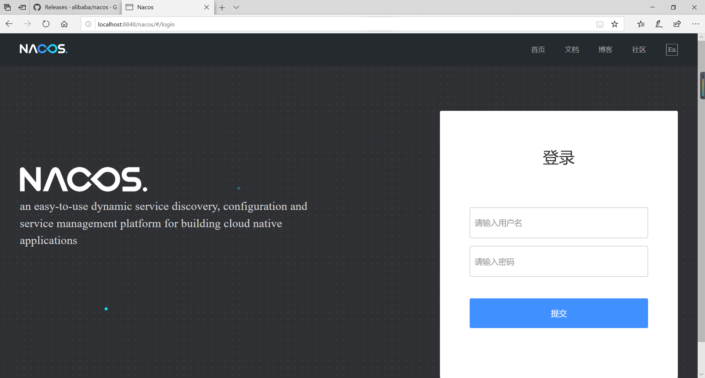
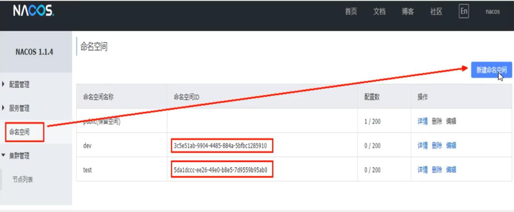

# 1、简介

> 为什么叫Nacos？

前四个字母分别为Naming  Configuration   最后一个s为Service

> 是什么？

一个更易于构建云原生应用的动态服务发现、配置管理和服务 管理平台

Nacos就是 注册中心 + 配置中心的组合

> 能干嘛？

替代Eureka做服务注册中心 

替代Config做服务配置中心

> 去哪下？

https://github.com/alibaba/Nacos

# 2、下载和安装

> 下载

到https://github.com/alibaba/Nacos去下载 1.2.1版本

解压即可

> 运行

到bin目录下运行`startup.cmd`即可！

> 怎么查看是否运行成功呢？

访问  localhost:8848/nacos



默认账号密码都是： nacos

# 3、服务提供者

## 3.1 新建Module

cloudalibaba-provicer-payment9001	

## 3.2 POM

```xml
<?xml version="1.0" encoding="UTF-8"?>
<project xmlns="http://maven.apache.org/POM/4.0.0"
         xmlns:xsi="http://www.w3.org/2001/XMLSchema-instance"
         xsi:schemaLocation="http://maven.apache.org/POM/4.0.0 http://maven.apache.org/xsd/maven-4.0.0.xsd">
    <parent>
        <artifactId>cloud2020</artifactId>
        <groupId>com.qy</groupId>
        <version>1.0-SNAPSHOT</version>
    </parent>
    <modelVersion>4.0.0</modelVersion>

    <artifactId>cloudalibaba-provider-payment9002</artifactId>

    <dependencies>
        <!--nacos-->
        <dependency>
            <groupId>com.alibaba.cloud</groupId>
            <artifactId>spring-cloud-starter-alibaba-nacos-discovery</artifactId>
        </dependency>
        <!--引入自己定义的 api 通用包-->
        <dependency>
            <groupId>org.springframework.boot</groupId>
            <artifactId>spring-boot-starter-web</artifactId>
        </dependency>
        <dependency>
            <groupId>org.springframework.boot</groupId>
            <artifactId>spring-boot-starter-actuator</artifactId>
        </dependency>
    </dependencies>

</project>
```


## 3.3 YML

```yaml
server:
  port: 9001

spring:
  application:
    name: nacos-provider
  cloud:
    nacos:
      discovery:
        server-addr: localhost:8848

management:
  endpoints:
    web:
      exposure:
        include: *
```


## 3.4 主启动

```java
@SpringBootApplication
@EnableDiscoveryClient
public class NacosMain9002 {
    public static void main(String[] args) {
        SpringApplication.run(NacosMain9002.class,args);
    }
}
```


## 3.5 业务类


# 4、服务消费者

## 4.1 建Module

cloudalibaba-consumer-order83

## 4.2 POM

```xml
<?xml version="1.0" encoding="UTF-8"?>
<project xmlns="http://maven.apache.org/POM/4.0.0"
         xmlns:xsi="http://www.w3.org/2001/XMLSchema-instance"
         xsi:schemaLocation="http://maven.apache.org/POM/4.0.0 http://maven.apache.org/xsd/maven-4.0.0.xsd">
    <parent>
        <artifactId>cloud2020</artifactId>
        <groupId>com.qy</groupId>
        <version>1.0-SNAPSHOT</version>
    </parent>
    <modelVersion>4.0.0</modelVersion>

    <artifactId>cloudalibaba-consumer-order83</artifactId>

    <dependencies>
        <!--nacos-->
        <dependency>
            <groupId>com.alibaba.cloud</groupId>
            <artifactId>spring-cloud-starter-alibaba-nacos-discovery</artifactId>
        </dependency>
        <!--引入自己定义的 api 通用包-->
        <dependency>
            <groupId>org.springframework.boot</groupId>
            <artifactId>spring-boot-starter-web</artifactId>
        </dependency>
        <dependency>
            <groupId>org.springframework.boot</groupId>
            <artifactId>spring-boot-starter-actuator</artifactId>
        </dependency>
    </dependencies>

</project>
```


## 4.3 YML

```yaml
server:
  port: 83

spring:
  application:
    name: nacos-order
  cloud:
    nacos:
      discovery:
        server-addr: localhost:8848

# 消费者将要去访问的微服务名称
service-url:
  nacos-user-service: http://nacos-provider # 微服务名称写在这里，可以在业务层直接提取出来

```


## 4.4 主启动

```java
@SpringBootApplication
@EnableDiscoveryClient
public class OrderMain83 {
    public static void main(String[] args) {
        SpringApplication.run(OrderMain83.class,args);
    }
}

```


## 4.5 业务类

```java
@RestController
public class OrderController {

    @Autowired
    private RestTemplate restTemplate;

    @Value("${service-url.nacos-user-service}")
    private String serverURL;

    @GetMapping("/consumer/alibaba/nacos/{id}")
    public String order(@PathVariable("id")Long id){
        return restTemplate.getForObject(serverURL+"/alibaba/nacos/"+id,String.class);
    }
}
```

## 4.6 config

```java
@Configuration
public class MyConfig {
    @Bean
    @LoadBalanced
    public RestTemplate restTemplate(){
        return new RestTemplate();
    }
}
```

# 5、Nacos和其他注册中心区别


> # `Nacos支持 AP 和 CP 的切换  `


# 6、Nacos作为服务配置中心

==在controller添加@RefreshScope // 支持Nacos的动态刷新功能==，可以修改配置后，项目中可以动态修改，不需要重新启动项目。

## 6.1 基础配置

> cloudalibaba-config-nacos-client3377

> POM

```xml
<?xml version="1.0" encoding="UTF-8"?>
<project xmlns="http://maven.apache.org/POM/4.0.0"
         xmlns:xsi="http://www.w3.org/2001/XMLSchema-instance"
         xsi:schemaLocation="http://maven.apache.org/POM/4.0.0 http://maven.apache.org/xsd/maven-4.0.0.xsd">
    <parent>
        <artifactId>cloud2020</artifactId>
        <groupId>com.qy</groupId>
        <version>1.0-SNAPSHOT</version>
    </parent>
    <modelVersion>4.0.0</modelVersion>

    <artifactId>cloudalibaba-config-nacos-client3377</artifactId>

    <dependencies>
        <!--config-->
        <dependency>
            <groupId>com.alibaba.cloud</groupId>
            <artifactId>spring-cloud-starter-alibaba-nacos-config</artifactId>
        </dependency>
        <!--nacos-->
        <dependency>
            <groupId>com.alibaba.cloud</groupId>
            <artifactId>spring-cloud-starter-alibaba-nacos-discovery</artifactId>
        </dependency>
        <!--引入自己定义的 api 通用包-->
        <dependency>
            <groupId>org.springframework.boot</groupId>
            <artifactId>spring-boot-starter-web</artifactId>
        </dependency>
        <dependency>
            <groupId>org.springframework.boot</groupId>
            <artifactId>spring-boot-starter-actuator</artifactId>
        </dependency>
    </dependencies>

</project>
```


> YML

==为什么配置两个？==`（application.yml  bootstrap.yml）`


**`bootstrap.yml`**

```yaml
server:
  port: 3377

spring:
  application:
    name: nacos-config
  cloud:
    nacos:
      discovery:
        server-addr: localhost:8848 # Nacos 服务注册中心地址
      config:
        server-addr: localhost:8848 # Nacos 服务配置中心地址
        file-extension: yaml # 指定yaml格式的配置


  # ${spring.application.name}-${profile}. ${file-extension:properties}
  # nacos-config-dev.yaml


```

**`application.yml`**

```yaml
spring:
  profiles:
    active: dev # 表示开发环境
```

> 主启动

```java
@SpringBootApplication
public class ConfigMain3377 {
    public static void main(String[] args) {
        SpringApplication.run(ConfigMain3377.class,args);
    }
}
```


> 业务类


```java
@RestController
@RefreshScope // 支持Nacos的动态刷新功能
public class ConfigClientController {

    @Value("${config.info}")
    public String config;

    @GetMapping("/config/info")
    public String getInfo(){
        return config;
    }
}

```


> 在Nacos中添加配置信息

启动Nacos：


==`注意，添加的配置的 Data ID : 一定为  ${spring.application.name}-${profile}. ${file-extension:properties}`==

> 测试

在Nacos中添加配置之后，启动 ，访问 ： <http://localhost:3377/config/info>


> 自带动态刷新


## 6.2 分类配置

> 多环境多项目管理 问题


> Nacos 图形化管理界面的配置管理


> 命名空间


> # Namespace+Group+Data ID三者关系


> # Group配置

`新建两个Group：`


`在bootstrap.yml文件中添加Group即可`


`测试！`


> # Namespace配置




# 7、Nacos集群和持久化配置（重要）


> # 持久化配置解释

Nacos默认自带的是嵌入式数据库derby

`derby到mysql切换配置步骤：`

- nacos-server-1.2.1\nacos\conf 目录下找到sql脚本

- nacos-server-1.2.1\nacos\conf 目录下找到application.properties

  - 在application.properties 加入下边配置

    ```java
    spring.datasource.platform=mysql
    db.num=1
    db.url.0=jdbc:mysql://127.0.0.1:3306/nacos_config?characterEncoding=utf8&connectTimeout=1000&socketTimeout=3000&autoReconnect=true
    db.user=root
    db.password=123456
    ```

    ​


启动Nacos，可以看到是个全新的空记录界面，以前是记录进derby

配置完就可以了，不过我的windows下的mysql是8.0 ， nacos并不支持需要修改。

> # Linux中集群配置（重要）

## 预计需要

1个 Nginx  + 3个nacos注册中心  + 1个mysql

## 环境准备

nacos 下载 linux 版本

https://github.com/alibaba/nacos/releases

放在linux上 ， 解压

如果centos传输文件失败的话：chmod -R 777  目录    

（可能是因为当前目录没有写权限 加一下就好了）

```bash
cd Downloads/
tar -zxvf nacos-server-1.2.1.tar.gz 
mkdir /mynacos
cp -r nacos /mynacos/
cd /mynacos/conf
```

## 集群的配置

- 数据库的准备

  在数据库中运行  G:\Nacos\nacos\conf  目录下的 nacos-mysql.sql  文件

- 修改 application.properties 文件

  G:\Nacos\nacos\conf 目录下的 application.properties

  在文件最下方添加：

  ```
  spring.datasource.platform=mysql
  db.num=1
  db.url.0=jdbc:mysql://127.0.0.1:3306/nacos_config?characterEncoding=utf8&connectTimeout=1000&socketTimeout=3000&autoReconnect=true
  db.user=root
  db.password=123456
  ```

```bash
[root@iz8vb4nxo286g9mk6p8fnhz conf]# pwd        # 路径
/mynacos/nacos/conf
[root@iz8vb4nxo286g9mk6p8fnhz conf]# cp cluster.conf.example cluster.conf
[root@iz8vb4nxo286g9mk6p8fnhz conf]# ls
application.properties          cluster.conf          nacos-logback.xml  schema.sql
application.properties.example  cluster.conf.example  nacos-mysql.sql


```


1.Linux服务器上mysql配置

先执行 nacos/conf/nacos-mysql.sql 文件（创建表）

编写 application.properties  ，命令如下：

```bash
cp  application.properties application.properties.init  # 备份

```


2.application.properties配置

3.Linux服务器上nacos的集群配置cluster.conf

梳理出3台 nacos 机器的不同服务端口号

复制出cluster.conf

```bash
cp  cluster.conf.example cluster.conf
vim  cluster.conf
```

内容，这个IP不能写127.0.0.1，必须是Linux命令hostname  -i能狗识别的IP，执行命令，写ens33后边的IP


内容就是：


```
IP : 3333
IP : 4444
IP : 5555  # IP为上图红框里的IP
```


4.编辑Nacos的启动脚本 startup.sh ，使它能够接收不同的启动端口

在/mynacos/nacos/bin  目录下有 startup.sh


命令：

```bash

```

`startup.sh修改的内容(两处修改)`


5.Nginx的配置，由他做负载均衡  (先记笔记，还没有做) 

```bash
# 到/usr/nginx/conf 文件下
vim  nginx.conf
cd  /usr/nginx/sbin
./nginx -c  /usr/local/nginx/conf/nginx.conf    #启动nginx
ps -ef|grep nginx
# 到nacos的目录下启动nacos
./startup.sh  -p  3333
./startup.sh  -p  4444
./startup.sh  -p  5555
# 查看是否启动成功
ps  -ef|grep  nacos|grep  -v  grep|wc  -l  # 成功的话结果为3
```

访问测试： 192.168.79.132:1111/nacos

`nginx.conf的修改`

```
upstream  cluster{
  	server  127.0.0.1:3333;
  	server  127.0.0.1:4444;
  	server  127.0.0.1:5555;;
}
server {
      listen     		1111;
  	server_name        localhost;
      location / {
            proxy_pass  http://cluster;   
      }
}
```


6.1个nginx + 3个nacos  + 1个mysql


# 8、nacos加载多配置集


