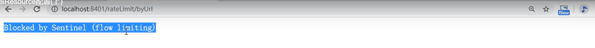
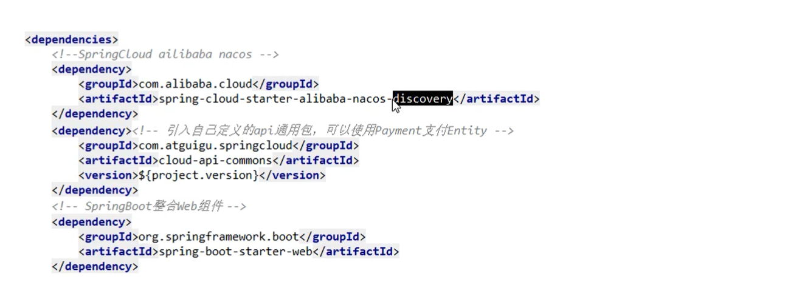

# 1、什么是Sentinel 

> # 问题总结

如果刚开始启动项目没有问题，但是停止之后再次启动出问题了，在yaml文件中改一下**服务名即可**


***


**`Hystrix的阿里版`**

Sentinel是阿里开源的项目，提供了流量控制、熔断降级、系统负载保护等多个维度来保障服务之间的稳定性。

官网：https://github.com/alibaba/Sentinel/wiki
Sentinel主要特性：

Sentinel与Hystrix的区别
关于Sentinel与Hystrix的区别见：https://yq.aliyun.com/articles/633786/
总体来说：
Hystrix常用的线程池隔离会造成线程上下切换的overhead比较大；Hystrix使用的信号量隔离对某个资源调用的并发数进行控制，效果不错，但是无法对慢调用进行自动降级；Sentinel通过并发线程数的流量控制提供信号量隔离的功能；
此外，Sentinel支持的熔断降级维度更多，可对多种指标进行流控、熔断，且提供了实时监控和控制面板，功能更为强大。

# 2、下载和安装


下载地址：

https://github.com/alibaba/Sentinel/releases

下载 1.7.0 的jar包


运行:

前提：java8环境OK，8080端口不能被占用

java -jar

访问:

localhost:8080

账号密码为：sentinel

# 3、 Sentinel初始化演示工程

### 1.启动Nacos8848成功


### 2.Module

- cloudalibaba-sentinel-service8401

- POM

  ```xml
  <?xml version="1.0" encoding="UTF-8"?>
  <project xmlns="http://maven.apache.org/POM/4.0.0"
           xmlns:xsi="http://www.w3.org/2001/XMLSchema-instance"
           xsi:schemaLocation="http://maven.apache.org/POM/4.0.0 http://maven.apache.org/xsd/maven-4.0.0.xsd">
      <parent>
          <artifactId>cloud2020</artifactId>
          <groupId>com.qy</groupId>
          <version>1.0-SNAPSHOT</version>
      </parent>
      <modelVersion>4.0.0</modelVersion>

      <artifactId>cloudalibaba-sentinel-service8401</artifactId>

      <dependencies>
          <!--nacos-->
          <dependency>
              <groupId>com.alibaba.cloud</groupId>
              <artifactId>spring-cloud-starter-alibaba-nacos-discovery</artifactId>
          </dependency>
          <!--sentinel-datasource-nacos 后续做持久化用得到-->
          <dependency>
              <groupId>com.alibaba.csp</groupId>
              <artifactId>sentinel-datasource-nacos</artifactId>
          </dependency>
          <!--sentinel-->
          <dependency>
              <groupId>com.alibaba.cloud</groupId>
              <artifactId>spring-cloud-starter-alibaba-sentinel</artifactId>
          </dependency>
          <!--SpringBoot整合web组件+actuaor-->
          <dependency>
              <groupId>org.springframework.boot</groupId>
              <artifactId>spring-boot-starter-web</artifactId>
          </dependency>
          <dependency>
              <groupId>org.springframework.boot</groupId>
              <artifactId>spring-boot-starter-actuator</artifactId>
          </dependency>
      </dependencies>

  </project>
  ```

  ​

  


- YML


```yaml
server:
  port: 8401

spring:
  application:
    name: cloudalibaba-sentinel-service
  cloud:
    nacos:
      discovery:
        # nacos 注册中心地址
        server-addr: localhost:8848
    sentinel:
      transport:
        # 配置 sentinel dashboard 地址
        dashboard: localhost:8080
        # 默认8719端口，假如被占用，会自动从8719开始依次+1扫描，直至找到未被占用的端口
        port: 8719

management:
  endpoints:
    web:
      exposure:
        include: '*'

```


- 主启动


```java

```


- 业务类FlowLimitController


### 3.启动sentinel 8080

### 4.启动8401微服务

### 5.访问localhost:8080

会发现什么都没有，因为sentinel使用的是懒加载机制，执行一次访问即可

localhost:8401/testA

# 4、Sentinel流控规则介绍

流控（流量控制）


### 4.1 Sentinel流控-QPS直接失败

`添加流控规则`


效果：快速点击testA的话，就会失败


### 4.2 Sentinel流控-线程数直接失败

`添加流控规则：`


`效果：快速点击testA，但是并不会出现`


可以加个线程调用来测试：


**`QBS和线程数的区别：`**

QPS：一秒如果有多个请求过来，直接失败

线程数：一秒有多个请求过来，但是只有一个服务人员，干不了了，不干了。


### 4.3 Sentinel流控-关联

`是什么？`


`创建流控规则：`


`postman模拟并发密集访问taxtB`


再访问 textA  就会被限流

### 4.4 Sentinel流控效果-预热(warm up)

说明：

Sentinel的Warm Up（RuleConstant.CONTROL_BEHAVIOR_WARM_UP）方式，即预热/冷启动方式。当系统长期处于低水位的情况下，当流量突然增加时，直接把系统拉升到高水位可能瞬间把系统压垮。通过"冷启动"，让通过的流量缓慢增加，在一定时间内逐渐增加到阈值上限，给冷系统一个预热的时间，避免冷系统被压垮。warm up冷启动主要用于启动需要额外开销的场景，例如建立数据库连接等。


`创建流控规则：`


`效果`

都次运行 textB ，刚开始不行，后来可以。

`应用场景`


### 4.5 Sentinel流控效果-排队等待


效果:

可以通过打印日志来测试


使用postman来发送请求


# 5、Sentinel降级


`基本介绍`


### 5.1 Sentinel降级-RT


`代码`


`配置`


200ms以内完成，搞不定就要断电保护系统。

效果:


### 5.2 Sentinel降级-异常比例


`代码`


​	效果：

如果只访问一次的话，会报错

如果访问次数>5次 且  异常比例 > 阈值，才会降级保护


### 5.3 Sentinel降级-异常数


`代码`


`配置`


# 6、 Sentinel热点key（热点规则）

精准打击，对某些热点数据进行限流。

### 6.1 兜底方法（复习）


**@SentinelResource** 注解相当于 HystrixCommand

`代码`


`创建限流规则（热点规则）`


`测试`


**敲重点！**

如果使用了热点规则，则必须使用blockHandler来指定兜底方法，否则会进入报错页面。


### 6.2  参数例外项

上述案例演示了第一个参数p1，当QPS超过1秒1次点击后马上被限流

==特例情况==

普通：超过1秒1个后，达到阈值1被限流

我们期望p1参数当它是某个特殊值时，它的限流值和平常不一样

特例：假如当p1的值等于5时，它的阈值可以达到200


`配置`


`测试`

localhost:8401/testHotKey?p1=5

`手贱添加个异常试一试：`


然后我们再来访问会怎么样呢？localhost:8401/testHotKey?p1=5


@SentinelResource 只管请求超过阈值的错误，但是并不会管java中的运行出的异常，所以不会使用@SentinelResource里边的兜底方法

`总结`


# 7、Sentinel系统规则

==使用着比较危险！==

官网：https://github.com/alibaba/Sentinel/wiki/系统自适应限流

是什么？


`也就是说从整体上来限流`

`参数：`


# 8、SentinelResource配置

### 8.1 按资源名称限流+后续处理

> 启动Nacos


> 启动Sentinel成功


> Module

- cloudalibaba-sentinel-service8401
- POM


- YML

  不变

- 业务类（RateLimitController）

  


> 配置流控规则


> 测试


> 额外问题

关闭服务 8401 

==Sentinel控制台，流控规则消失了==

所以是临时的！

### 8.2 按照url地址限流+后续处理

> 通过访问的URL来限流，会返回Sentinel自带默认的限流处理信息


> 业务类RateLimitController


> 访问一次

正常:


访问多了之后：



> Sentinel控制台配置


***

> # 上边兜底方案面临的问题


### 8.3 客户自定义的限流处理逻辑

解耦！ 将兜底方法和业务方法分开来!

> 创建CustomerBlockHandler类用于自定义限流处理逻辑


> 自定义限流处理类


> RateLimitController


> 启动微服务后先调用一次


> Sentinel 控制台配置


> 测试后我们自定义的出来了


> 进一步说明

### 8.4 更多注解属性说明


# 9、Sentinel服务熔断

### 9.1 sentinel整合ribbon+openFeign+fallback


### 9.2 Ribbon系列

#### 9.2.1 启动nacos和sentinel

#### 9.2.2 提供者 9003/9004

以9003为例

- POM



- YAML


- 主启动


- 业务类

没有链接数据库，自己写的数据模拟数据库


#### 9.2.3 消费者84

- 新建 cloudalibaba-consumer-nacos-order84


- POM


- YML


- 主启动


- 业务类


（输入 4之后就会报异常，报错error页面，不友好）

**`@SentinelResource配置说明：`**


***

**只配置fallback**

==程序运行异常，就会找 fallback ， 演示：==


***

**只配置 blockHandler**


***

**fallback和blockHandler都配置**


结果：（既限流又运行异常的话，哪个会起作用呢？）


***

**异常忽略 exceptionsToIgnore**


传入 id = 4 的时候，不会进入兜底方法，直接报错。


### 9.3 Feign系列

#### 9.3.1 修改84模块

84消费者调用提供者9003 

Feign组件一般是消费侧

#### 9.3.2 POM


#### 9.3.3 YML


#### 9.3.4 主启动


#### 9.3.5 业务类

`带@FeignClient注解的业务接口PaymentService`


`兜底类（要实现上边的service，在）`


`Controller`


### 9.3.6 测试

测试84调用9003，此时`故意关闭9003微服务提供者`，看84消费侧自动降级，不会被耗死。


### 9.4 熔断框架比较


# 10、Sentinel持久化规则

### 10.1 为什么要持久化？

一旦我们重启应用，sentinel规则将消失，生产环境需要将配置规则进行持久化

### 10.2 怎么玩？

将限流配置规则持久化进Nacos保存，只要刷新8401某个rest地址，sentinel控制台的流控规则就能看到，只要Nacos里的配置不删除，针对8401上sentinel上的流控规则持续有效

### 10.3 步骤

- 修改cloudalibaba-sentinel-service8401


- POM


- YML（添加nacos数据源配置）


- 添加Nacos业务规则配置


- 启动8401后`刷新sentinel`发现业务规则有了


- 快速访问测试接口


- 停止8401再看sentinel

停机后发现流控规则没有了

- 重新启动8401再看sentinel

重启后流控规则又有了