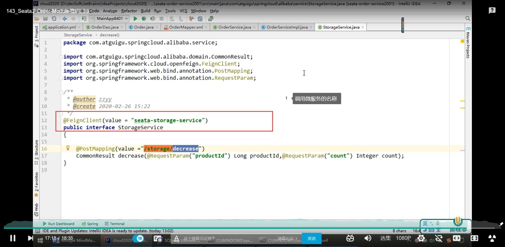

# 1、分布式事务问题

分布式前：单机单库没有问题

分布式后：

# 2、Seata简介

官网：http://seata.io/zh-cn/

***

# 3、怎么玩?

# 4、下载安装

**`mysql8的话：`**

- 下载和安装:

https://github.com/seata/seata/releases

0.9版本 1.0均可

- seata-server-0.9.0.zip解压到指定目录并修改conf目录下的file.conf配置文件

  

`修改file.conf里的`service模块`和`store模块(sotre:存储模块)

==service模块:==

==store模块：==

- mysql5.7数据库新建库 seata

- 在seata库里建表

`建表文件在`

- 修改 seata-server-0.9.0\seata\conf目录下的registry.conf配置文件

- 先启动Nacos端口号8848

- 再启动 seata-server

# 5、订单/库存/账户业务数据库准备

### 5.1 以下演示都需要`先启动Nacos后启动Seata`，保证两个都OK

### 5.2 分布式事务业务说明

### 5.3 创建业务数据库

### 5.4 按照上述3库 分别建对应业务表

### 5.5 按照上述3库分别建对应的回滚日志表

### 5.6 最后效果

# 6、订单/库存/账户业务微服务准备

业务需求：

### 6.1 新建订单 Order-Module

#### 6.1.1 seata-order-service2001

#### 6.1.2 POM

#### 6.1.3 YML

#### 6.1.4 file.conf

#### 6.1.5 registry.conf

#### 6.1.6 domain

- CommonResult

- Order

#### 6.1.7 Dao接口及实现

#### 6.1.8 Service接口及实现

`OrderService`

`OrderServiceImpl`(记得加上service注解)

`StorageService`(库存)

`AccountService`

#### 6.1.9 Controller

`OrderController`

#### 6.1.10 Config配置

#### 6.1.11 主启动

### 6.2 新建库存 Storage-Module

### 6.3 新建账户 Account-Module